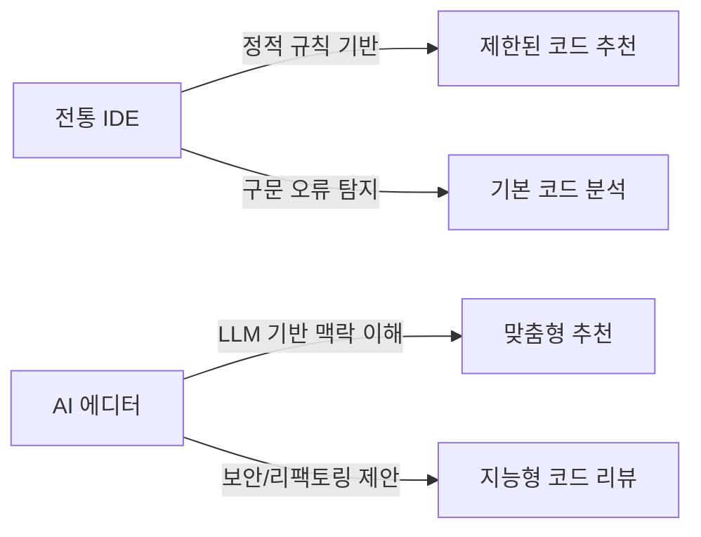
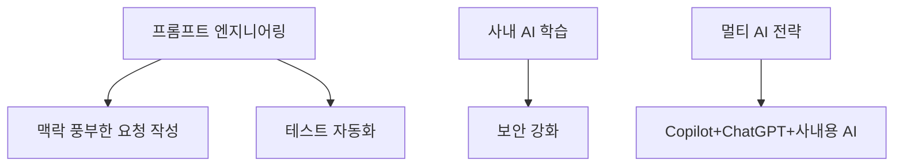

# 🚀 요즘 개발자들에게 잘나가는 AI 에디터 & 툴 총정리

개발 환경은 빠르게 변하고 있으며, 최근 몇 년간 **AI 기반 개발 도구**가 급격히 성장했습니다.  
단순 코드 자동완성에서부터 아키텍처 설계, 코드 리뷰, 배포 자동화, 심지어 문서화까지 AI가 지원하는 시대입니다.  
이 글에서는 **기본 개념 → 실무 적용 → 전문가 활용**까지 단계별로 정리해보겠습니다.  

---

## 1. AI 개발 툴의 기본 개념

### 1.1 AI 코드 보조 도구란?
- **자동완성(Auto-completion)** : 개발자가 입력 중인 코드의 맥락을 이해하고 다음 코드를 예측.
- **코드 생성(Code Generation)** : 프롬프트나 주석을 입력하면 코드 블록을 자동으로 생성.
- **버그 탐지 및 수정** : 코드 내 잠재적 버그나 보안 취약점을 분석하고 수정 제안.
- **문서화** : 함수/클래스 단위의 설명을 자동 생성.

### 1.2 기존 에디터와의 차이 (도식)

---

## 2. 현재 많이 사용되는 AI 기반 개발 툴

| 툴 이름 | 특징 | 장점 | 단점 |
|--------|------|------|------|
| **GitHub Copilot** | 가장 대중적인 AI 페어 프로그래머 | 다양한 IDE 지원, 빠른 자동완성 | 저작권 이슈 |
| **ChatGPT** | 대화형 AI | 코드 리뷰, 문서화, 설계 가능 | IDE 통합성 부족 |
| **Tabnine** | 온프레미스 지원 | 보안 강화, 사내 코드 학습 | 응답 정확도 제한 |
| **Codeium** | 무료 AI 어시스턴트 | 다중 언어 지원, 빠른 속도 | 기업 지원 부족 |
| **AWS CodeWhisperer** | AWS 최적화 | 보안 점검 내장, 엔터프라이즈 적합 | AWS 중심 |
| **Cursor** | AI 에디터 자체 | 맥락 기반 리팩토링 강점 | 신흥 툴, 러닝커브 |

---

## 3. AI 툴의 활용 사례 (실무 중심)

- **생산성 향상** : 반복적 CRUD 자동화, 테스트 케이스 생성.  
- **코드 품질 향상** : 보안 취약점 탐지, 자동 리팩토링.  
- **협업 지원** : 자동 문서화, 코드 변경 요약.  

---

## 4. AI 에디터 도입 시 고려사항

### 장점
- 개발 속도 극대화.
- 초급 개발자도 고급 코드 작성 가능.

### 단점
- AI 의존성 증가.  
- 보안/저작권 문제.  

---

## 5. 전문가 활용 전략

---

## 📌 결론

AI 에디터와 툴은 이제 선택이 아니라 **개발자의 기본 도구**가 되었습니다.  
👉 지금 바로 Copilot, Cursor, Codeium 같은 툴을 실무에 적용해보고,  
자신의 **개발 환경에 맞는 AI 활용 전략**을 세우는 것이 중요합니다.
