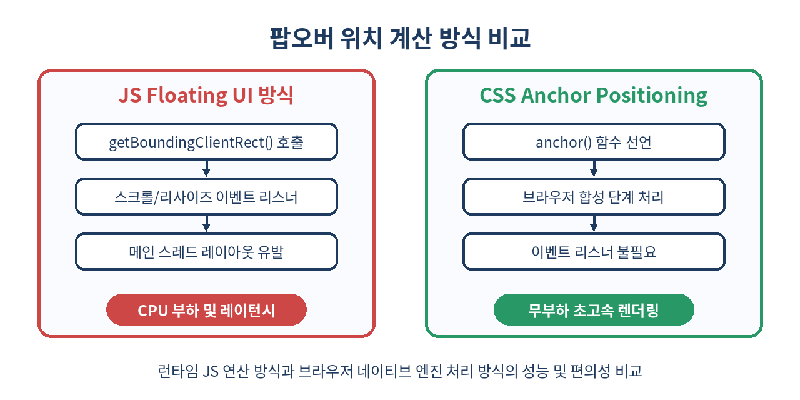
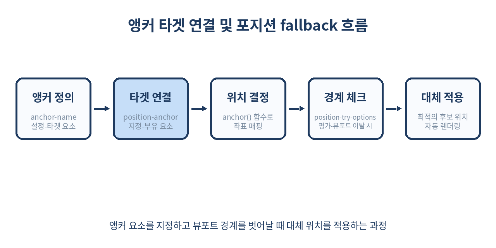

# ⚓ CSS 앵커 포지셔닝(Anchor Positioning) 완벽 가이드

> 웹 화면 위를 부유하는 툴팁, 팝오버, 드롭다운 메뉴를 구현하기 위해 더 이상 무거운 자바스크립트 라이브러리에 의존할 필요가 없습니다. 이제 브라우저 네이티브 기능만으로 완벽한 위치 계산과 반응형 배치가 가능합니다.

---

## 📌 목차
1. 🧭 탄생 배경: 자바스크립트 툴팁의 피로감
2. 🛠️ CSS 앵커 포지셔닝이란 무엇인가?
3. 🧩 핵심 아키텍처: Anchor와 Anchored Element
4. 🔗 기본 연동법: anchor-name과 position-anchor
5. 📐 정밀 좌표계: anchor() 함수 마스터하기
6. 🔄 뷰포트 충돌 해결: position-try-options와 Fallback
7. 🔀 고급 기법: 다중 앵커링과 상대 좌표 조합
8. 💻 실무 시나리오: 팝오버와 메뉴 컴포넌트 구현
9. ⚠️ 실무 함정: Containing Block과 렌더링 컨텍스트의 충돌
10. 🚫 이 기술을 도입하면 안 되는 경우
11. 🌐 브라우저 지원 현황과 폴리필(Polyfill) 생태계
12. 🧾 정리

---

## 🧭 1. 탄생 배경: 자바스크립트 툴팁의 피로감

웹 프론트엔드 개발에서 툴팁, 컨텍스트 메뉴, 가이드 팝오버를 구현하는 작업은 보기보다 매우 까다롭습니다. 화면의 특정 '기준 요소(Anchor)'를 따라다니는 '부유 요소(Anchored Element)'를 배치할 때, 기존에는 무조건 자바스크립트의 힘을 빌려야 했습니다.

이러한 방식은 다음과 같은 치명적인 한계를 가집니다.
- **성능 저하**: 스크롤이나 브라우저 창 크기 조절 시마다 `getBoundingClientRect()`를 호출하고 스타일을 갱신해야 하므로 메인 스레드에 부하를 줍니다.
- **레이아웃 스래싱(Layout Thrashing)**: 무작위적인 DOM 쿼리와 인라인 스타일 주입으로 인해 불필요한 브라우저 리플로우(Reflow)가 발생합니다.
- **패키지 다이어트 방해**: `Popper.js` 나 `Floating UI` 같은 라이브러리를 추가하면서 번들 크기가 증가합니다.

기존 자바스크립트 기반 라이브러리와 네이티브 CSS 방식의 구체적인 명세 비교는 아래 표와 같습니다.

| 비교 항목 | 자바스크립트 라이브러리 (Floating UI 등) | 네이티브 CSS 앵커 포지셔닝 |
| :--- | :--- | :--- |
| **번들 크기** | 최소 5KB ~ 20KB 이상 추가 | **0KB (브라우저 내장)** |
| **연산 스레드** | 메인 스레드 (JS Execution) | **렌더링 엔진 (C++ 내부 레이아웃 단계)** |
| **이벤트 리스너** | `scroll`, `resize` 이벤트 구독 필수 | **불필요 (브라우저가 레이아웃 시점에 자동 연산)** |
| **DOM 왜곡** | absolute 컨텍스트 탈출을 위한 Portal 처리 필요 | **DOM 구조에 무관하게 논리적 연결 가능** |
| **스크롤 반응성** | 미세한 프레임 밀림(Stuttering) 발생 가능 | **초당 120프레임 환경에서도 완벽한 동기화 보장** |



이러한 문제를 완전히 가라앉히기 위해 W3C와 브라우저 벤더들은 선언적인 CSS만으로 부유 요소의 실시간 위치를 추적하고 고정하는 표준 명세인 **CSS Anchor Positioning**을 도입하였습니다.

---

## 🛠️ 2. CSS 앵커 포지셔닝이란 무엇인가?

CSS 앵커 포지셔닝은 기준이 되는 특정 DOM 요소의 크기와 위치 정보를 CSS 엔진이 내부적으로 직접 추적하여, 다른 부유 요소의 좌표(top, bottom, left, right 등) 계산에 바인딩할 수 있도록 지원하는 웹 표준 스펙입니다.

가장 강력한 점은 이 연산이 브라우저 내부 레이아웃 및 합성(Compositing) 단계에서 수행된다는 것입니다. 따라서 사용자가 웹 페이지를 초당 120프레임으로 스크롤하더라도, 자바스크립트 지연 없이 화면상에서 자석처럼 딱 붙어 움직이는 극강의 부드러움을 선사합니다.

브라우저가 앵커 포지셔닝을 처리하는 내부 파이프라인 단계는 다음과 같습니다.

1. **스타일 분석 및 트리 구축**: DOM 트리와 CSSOM 트리를 결합하여 렌더 트리를 생성합니다.
2. **앵커 레지스트리 등록**: `anchor-name`이 정의된 요소를 브라우저 내부의 글로벌 앵커 레지스트리에 고유 식별자와 함께 등록합니다.
3. **1차 레이아웃 패스**: 기준 요소(Anchor)의 정확한 물리적 위치와 크기(기하학적 경계 영역)를 먼저 계산합니다.
4. **2차 레이아웃 패스 (앵커 분석)**: 부유 요소(Anchored Element)가 참조하는 `position-anchor` 정보를 기반으로 해당 앵커의 경계 값을 가져와 부유 요소의 `top`, `left` 등의 최종 좌표를 확정합니다.
5. **합성 및 페인트**: 메인 스레드의 개입 없이 GPU 가속을 활용하여 화면을 매끄럽게 렌더링합니다.

---

## 🧩 3. 핵심 아키텍처: Anchor와 Anchored Element

이 명세는 크게 두 가지 주체로 구성됩니다.

| 역할 | 설명 | 주요 CSS 속성 |
| :--- | :--- | :--- |
| **Anchor (기준 요소)** | 화면상의 좌표 기준점이 되는 고정 요소입니다. | `anchor-name` |
| **Anchored Element (부유 요소)** | 기준 요소를 따라다니며 화면에 떠다니는 레이어입니다. | `position-anchor`, `position-area`, `position-try` |

부유 요소는 무조건 화면 전체 또는 특정 컨테이너를 기준으로 자유롭게 움직여야 하므로 `position: absolute` 또는 `position: fixed` 상태여야 합니다. 브라우저는 기준 요소의 위치를 파악하고, 부유 요소가 해당 기준의 상대 좌표 공간에 정확히 안착할 수 있도록 연산 구조를 조율합니다.

과거에는 부유 요소를 올바르게 띄우기 위해 부모 요소에 `position: relative`를 강제하고, 스크롤 영역을 탈출시키기 위해 React의 `Portal`을 사용해 `<body>` 바로 아래로 요소를 강제 이동시키는 복잡한 DOM 조작이 상식이었으나, CSS 앵커 포지셔닝 아키텍처 하에서는 DOM 계층 구조에 완전히 얽매이지 않고 오직 CSS 식별자만으로 이종 간의 연결이 가능해집니다.

---

## 🔗 4. 기본 연동법: anchor-name과 position-anchor

가장 기초적인 연동은 기준 요소에 고유한 '이름'을 부여하고, 부유 요소가 그 이름을 바라보게 만드는 것부터 시작합니다.

```css
/* 1. 기준이 되는 버튼 요소 */
.anchor-button {
  anchor-name: --my-anchor-button;
}

/* 2. 따라다닐 툴팁 요소 */
.floating-tooltip {
  position: fixed; /* absolute도 가능 */
  position-anchor: --my-anchor-button;
}
```

여기서 `anchor-name`은 CSS 대시 기호 두 개(`--`)로 시작하는 대시 대시 식별자(Dashed Ident)를 사용해야 합니다. 이는 CSS 커스텀 속성(CSS 변수)과 유사한 네이밍 규칙을 따름으로써 기존 표준 속성명과의 충돌을 방지하기 위함입니다. 

이제 두 요소는 논리적으로 연결되었습니다. 만약 동일한 이름을 가진 앵커가 문서 내에 여러 개 정의되어 있다면, 브라우저는 트리 순서(Tree Order) 상에서 가장 가까운 전향(Ancestor) 혹은 형제(Sibling) 요소를 우선적으로 타겟팅하여 매핑합니다.

---

## 📐 5. 정밀 좌표계: anchor() 함수 마스터하기

단순히 연결만 해서는 위치가 바뀌지 않습니다. 부유 요소의 상하좌우 경계를 기준 요소의 특정 지점에 바인딩해야 합니다. 이때 사용하는 핵심 도구가 바로 `anchor()` 함수입니다.

`anchor()` 함수의 기본 형태는 다음과 같습니다.
`anchor(<anchor-name>? <anchor-side>, <length-percentage>?)`

- `anchor-name`: 바라볼 대상 앵커입니다. `position-anchor`로 기본 대상을 등록했다면 생략할 수 있습니다.
- `anchor-side`: 앵커의 어느 면을 기준으로 할지 결정합니다 (`top`, `bottom`, `left`, `right`, `center`, `start`, `end` 등).
- `fallback`: 앵커를 찾을 수 없을 때 사용할 대체 크기값입니다.

```css
.floating-tooltip {
  position: fixed;
  position-anchor: --my-anchor-button;

  /* 툴팁의 상단을 버튼의 하단에 맞춤 */
  top: anchor(bottom);
  
  /* 툴팁의 좌측을 버튼의 좌측에 맞춤 */
  left: anchor(left);
}
```

이 설정을 거치면 버튼 바로 아래에 정확히 밀착하는 툴팁이 자바스크립트 한 줄 없이 레이아웃됩니다.

여기서 한 걸음 더 나아가, 논리적 방향성(Logical Properties)에 대응하기 위해 `start`와 `end` 키워드도 완벽히 지원합니다. 다국어 지원(RTL 등) 환경에서도 레이아웃이 무너지지 않도록 유연하게 대응할 수 있습니다.

| `anchor-side` 값 | 물리적 위치 매핑 (LTR 기준) | 논리적 위치 매핑 |
| :--- | :--- | :--- |
| `top` | 상단 경계선 (Top Edge) | `block-start` |
| `bottom` | 하단 경계선 (Bottom Edge) | `block-end` |
| `left` | 좌측 경계선 (Left Edge) | `inline-start` |
| `right` | 우측 경계선 (Right Edge) | `inline-end` |
| `center` | 정중앙선 (Center Line) | 수평/수직 중심선 계산값 |

또한, 부유 요소의 크기를 기준 요소의 크기와 비례하게 조정하고 싶다면 `anchor-size()` 함수를 활용할 수 있습니다. 예를 들어, 자동 완성 검색창 드롭다운의 너비를 검색창 인풋 필드의 너비와 정확히 일치시키고자 할 때 매우 유용합니다.

```css
.search-input {
  anchor-name: --search-input-field;
}

.search-dropdown {
  position: fixed;
  position-anchor: --search-input-field;
  
  top: anchor(bottom);
  left: anchor(left);
  
  /* 드롭다운의 너비를 인풋 필드의 너비와 100% 동일하게 일치시킴 */
  width: anchor-size(width);
  
  /* 미세 조정: 최소 너비를 인풋창 너비로 고정하고, 최대는 400px까지 허용 */
  min-width: anchor-size(width);
  max-width: 400px;
}
```

---

## 🔄 6. 뷰포트 충돌 해결: position-try-options와 Fallback

툴팁이나 팝오버를 개발할 때 가장 까다로운 점은 화면 끝자리(뷰포트 경계)에 도달했을 때 레이어가 잘려 보이는 현상입니다. 기존에는 화면 여백을 실시간 계산해 상단 노출을 하단 노출로 바꾸는 복잡한 스크립트를 짜야 했습니다.

CSS 앵커 포지셔닝은 이를 해결하기 위해 `position-try-options` 속성을 제공합니다.



```css
.floating-tooltip {
  position: fixed;
  position-anchor: --my-anchor-button;
  top: anchor(bottom);
  left: anchor(left);

  /* 아래쪽에 공간이 부족할 경우 위쪽으로 자동 뒤집기 */
  position-try-options: flip-block, flip-inline;
}
```

- `flip-block`: 상하 방향을 뒤집어 봅니다 (`top`을 `bottom`으로 자동 전환).
- `flip-inline`: 좌우 방향을 뒤집어 봅니다 (`left`를 `right`로 자동 전환).

만약 단순한 뒤집기(Flip)를 넘어 완전히 세분화된 맞춤형 레이아웃 시나리오를 구성하고 싶다면 `@position-try` 규칙을 통해 직접 선언적인 폴백 스타일을 정의할 수 있습니다.

```css
/* 1. 커스텀 폴백 전략 정의 */
@position-try --prefer-top-right {
  bottom: anchor(top);
  left: anchor(right);
  top: auto;
  right: auto;
  margin-bottom: 8px;
}

@position-try --fallback-center-modal {
  top: 50%;
  left: 50%;
  transform: translate(-50%, -50%);
  position-anchor: null; /* 앵커 종속성 해제 */
}

/* 2. 부유 요소에 다중 우선순위 바인딩 */
.floating-tooltip {
  position: fixed;
  position-anchor: --my-anchor-button;
  
  /* 기본 위치: 앵커 아래쪽 */
  top: anchor(bottom);
  left: anchor(left);
  margin-top: 8px;
  
  /* 공간 확보 실패 시 시도할 우선순위 체인 */
  position-try-options: --prefer-top-right, --fallback-center-modal;
  
  /* 어떤 폴백을 선택할지 브라우저가 결정하는 기준 정의 */
  position-try-order: most-width;
}
```

- `position-try-order: most-width`: 사용 가능한 공간 중 너비가 가장 넉넉하게 확보되는 최적의 폴백 옵션을 브라우저가 자동으로 연산하여 선택합니다.

---

## 🔀 7. 고급 기법: 다중 앵커링과 상대 좌표 조합

하나의 부유 요소가 단 하나의 앵커에만 종속될 필요는 없습니다. 여러 개의 앵커를 믹스하여 두 개의 기준 요소 사이에 늘어나는 특이한 박스 레이아웃을 구성할 수도 있습니다.

예를 들어 두 개의 서로 다른 노드 사이를 마우스 드래그나 데이터 연동을 통해 동적으로 연결해주는 "관계 연결선"을 생성하고 싶을 때 매우 강력한 효율을 발휘합니다.

```html
<!-- 다중 앵커 시나리오 구조 -->
<div class="flowchart-container">
  <div class="flow-node" id="node-a" style="anchor-name: --node-a;">Node A</div>
  <div class="flow-node" id="node-b" style="anchor-name: --node-b;">Node B</div>
  
  <!-- 두 노드 사이를 동적으로 연결할 벡터 라인 -->
  <div class="connector-line"></div>
</div>
```

```css
.flowchart-container {
  position: relative;
  width: 100%;
  height: 400px;
  background-color: #f1f3f5;
}

.flow-node {
  position: absolute;
  padding: 12px 24px;
  background: #228be6;
  color: #fff;
  border-radius: 6px;
}

#node-a {
  top: 50px;
  left: 50px;
}

#node-b {
  bottom: 80px;
  right: 60px;
}

/* 두 개의 다른 앵커 사이를 실시간으로 잇는 수평 커넥터 */
.connector-line {
  position: fixed;
  
  /* 좌측 경계는 Node A의 우측 끝에 결합 */
  left: anchor(--node-a right);
  
  /* 우측 경계는 Node B의 좌측 끝에 결합 */
  right: anchor(--node-b left);
  
  /* 높이 축 정렬은 Node A의 수직 중앙 지점을 기반으로 계산 */
  top: calc(anchor(--node-a center) - 1px);
  
  height: 2px;
  background-color: #fa5252;
  border-style: dashed;
  border-width: 2px;
  z-index: 10;
  pointer-events: none; /* 클릭 이벤트 통과 */
}
```

이 방식을 이용하면 협업 도구의 노드 연결선이나 대시보드의 다이어그램 그리기 도구마저 무거운 JS 드래그/좌표 추적 핸들러 없이 순수 CSS 인터랙션과 레이아웃 바인딩만으로 구현할 수 있는 혁신적인 가능성이 열립니다.

---

## 💻 8. 실무 시나리오: 팝오버와 메뉴 컴포넌트 구현

가장 널리 쓰이는 시나리오인 '버튼 클릭 시 등장하는 컨텍스트 드롭다운 메뉴'를 HTML의 `popover` API와 결합해 제작해보겠습니다. 이 조합은 최신 HTML/CSS 스펙의 정수라고 할 수 있습니다.

```html
<!-- HTML 구조 -->
<div class="container">
  <!-- 앵커 역할의 트리거 버튼 -->
  <button class="menu-trigger" popovertarget="my-menu">
    설정 메뉴 열기
    <span class="icon">⚙️</span>
  </button>

  <!-- 부유 요소 역할의 팝오버 메뉴 -->
  <div id="my-menu" popover class="menu-dropdown">
    <ul class="menu-list">
      <li class="menu-item"><span class="item-icon">👤</span>프로필 수정</li>
      <li class="menu-item"><span class="item-icon">🔒</span>보안 설정</li>
      <li class="menu-item"><span class="item-icon">🔔</span>알림 설정</li>
      <li class="divider"></li>
      <li class="menu-item danger"><span class="item-icon">🚪</span>로그아웃</li>
    </ul>
  </div>
</div>
```

```css
/* CSS 스타일링 */
.container {
  padding: 100px;
  display: flex;
  justify-content: center;
}

/* 1. 트리거 버튼에 앵커 지정 */
.menu-trigger {
  anchor-name: --menu-trigger-anchor;
  padding: 10px 16px;
  font-size: 14px;
  font-weight: 600;
  color: #334155;
  background-color: #ffffff;
  border: 1px solid #cbd5e1;
  border-radius: 8px;
  cursor: pointer;
  transition: all 0.2s ease;
  display: inline-flex;
  align-items: center;
  gap: 8px;
}

.menu-trigger:hover {
  background-color: #f8fafc;
  border-color: #94a3b8;
}

/* 2. 팝오버 요소 스타일링 및 앵커 결합 */
.menu-dropdown {
  /* popover 브라우저 기본 스타일 초기화 */
  margin: 0;
  padding: 6px;
  border: 1px solid #e2e8f0;
  background-color: #ffffff;
  border-radius: 8px;
  box-shadow: 0 10px 15px -3px rgba(0, 0, 0, 0.1), 0 4px 6px -4px rgba(0, 0, 0, 0.1);
  
  /* 앵커 연동 핵심 속성 */
  position-anchor: --menu-trigger-anchor;
  top: anchor(bottom);
  left: anchor(left);
  
  /* 미세 갭 마진 부여 */
  margin-top: 6px;
  
  /* 부드러운 하단 너비 맞춤 */
  min-width: 180px;
  
  /* 뷰포트 아웃 대응 */
  position-try-options: flip-block;
  
  /* 부드러운 등장 전환 효과 (현대 CSS 표준 지원 브라우저용) */
  transition: opacity 0.15s ease-out, transform 0.15s cubic-bezier(0.16, 1, 0.3, 1), display 0.15s allow-discrete, overlay 0.15s allow-discrete;
  opacity: 0;
  transform: translateY(-4px);
}

/* 팝오버가 활성화(열림) 상태일 때의 스타일 */
.menu-dropdown:popover-open {
  opacity: 1;
  transform: translateY(0);
}

/* 등장 전환을 위한 가상 초기 상태 정의 */
@starting-style {
  .menu-dropdown:popover-open {
    opacity: 0;
    transform: translateY(-4px);
  }
}

/* 리스트 세부 디자인 */
.menu-list {
  list-style: none;
  margin: 0;
  padding: 0;
  display: flex;
  flex-direction: column;
  gap: 2px;
}

.menu-item {
  padding: 8px 12px;
  font-size: 13.5px;
  color: #475569;
  border-radius: 6px;
  cursor: pointer;
  display: flex;
  align-items: center;
  gap: 8px;
  transition: background-color 0.15s ease;
}

.menu-item:hover {
  background-color: #f1f5f9;
  color: #0f172a;
}

.menu-item.danger {
  color: #ef4444;
}

.menu-item.danger:hover {
  background-color: #fef2f2;
  color: #dc2626;
}

.divider {
  height: 1px;
  background-color: #e2e8f0;
  margin: 4px 0;
}
```

자바스크립트는 단 한 줄도 쓰지 않았지만, 브라우저의 빌트인 `popover` 메커니즘과 `Anchor Positioning`이 결합하여 키보드 포커싱, ESC 종료, 네이티브 배치 전환이 완벽하게 맞물려 작동합니다.

---

## ⚠️ 9. 실무 함정: Containing Block과 렌더링 컨텍스트의 충돌

매우 강력한 기술이지만 실무에서 흔히 마주치는 함정이 있습니다. 바로 **컨테이닝 블록(Containing Block)**의 왜곡 현상입니다.

- **함정 상황**: 부유 요소가 `position: absolute`로 선언되었으나, 부모 트리 중 어딘가에 `transform`, `perspective`, `filter` 속성이 부여된 요소가 존재하면 컨테이닝 블록이 해당 부모로 고정됩니다. 이로 인해 앵커 요소가 해당 컨테이닝 블록의 바깥에 위치해 있다면 좌표 계산이 완전히 비틀어질 수 있습니다.

```html
<!-- Containing Block 함정이 발생하는 전형적인 마크다운 마크업 예시 -->
<div class="sidebar-wrapper" style="transform: translate3d(0, 0, 0);">
  <button id="my-trigger" style="anchor-name: --trigger-btn;">트리거</button>
</div>

<!-- 사이드바 외부의 부유 레이어 -->
<div class="my-tooltip" style="position: absolute; position-anchor: --trigger-btn; top: anchor(bottom);">
  오류가 발생할 수 있는 툴팁
</div>
```

이 상황에서 `.my-tooltip`은 `position: absolute` 상태이므로 물리적으로 가장 가까운 컨테이닝 블록 조상(여기서는 `transform`을 가진 `.sidebar-wrapper`)을 기준으로 좌표를 그리려 합니다. 하지만 `anchor-name: --trigger-btn`은 해당 컨텍스트 밖에서 온전하게 작동하기 어려워 툴팁의 좌표가 엉뚱한 화면 구석으로 날아가 버릴 수 있습니다.

- **해결책 1 (`position: fixed` 활용)**: 부유 요소를 배치할 때는 가급적 `position: fixed`를 사용하십시오. `fixed`를 사용하면 컨테이닝 블록이 기본적으로 뷰포트(Viewport) 단위로 리셋되기 때문에, 중간 조상들의 불필요한 레이아웃 왜곡 속성들을 대부분 우회하여 정확한 절대 좌표 추적에 성공합니다.
- **해결책 2 (DOM 최상위 배치)**: 부유 요소 자체를 DOM 계층 구조상 가장 최상위(예: `<body>` 직속 자식)에 배치하는 것입니다. `popover` API와 함께 연동할 경우 브라우저가 최상위 레이어(Top Layer)에 요소를 격리하여 렌더링하므로 이 컨테이닝 블록 이슈로부터 완벽하게 자유로워질 수 있습니다.

### 💡 보너스 꿀팁: position-visibility 속성으로 유령 툴팁 방지하기

화면을 스크롤해서 기준 요소가 화면 밖으로 완전히 사라졌는데도 부유 툴팁 요소만 화면 끝자락에 흉하게 매달려 둥둥 떠다니는 현상이 자주 발생합니다. 이를 깔끔하게 제어하기 위한 스펙이 바로 `position-visibility` 속성입니다.

```css
.floating-tooltip {
  position: fixed;
  position-anchor: --my-anchor-button;
  top: anchor(bottom);
  left: anchor(left);

  /* 앵커(기준 요소)가 화면에서 스크롤 아웃되면 부유 요소도 즉시 숨김 */
  position-visibility: anchors-visible;
}
```

- `position-visibility: anchors-visible`: 타겟팅된 앵커 요소가 뷰포트 영역 밖으로 밀려나 보이지 않는 순간, 부유 요소 또한 연동하여 화면에서 물리적으로 숨겨지도록 제어합니다.

---

## 🚫 10. 이 기술을 도입하면 안 되는 경우

다음 조건에 해당한다면 앵커 포지셔닝 기술을 즉시 전면 도입하는 것을 보류해야 합니다.

1. **다양한 레거시 브라우저(특히 IE 기반 뷰어나 구형 Safari) 지원이 필수인 환경**: 전체 사용자 중 크롬/엣지 이외의 구형 브라우저 비율이 유의미하게 높다면, 하단에서 제시할 폴리필을 적용하거나 기존 JS 라이브러리를 유지해야 합니다.
2. **스크롤 애니메이션과의 연동 커스텀이 극도로 복잡한 경우**: 단순히 위치 고정이 아니라, 스크롤량에 따라 회전하거나 크기가 유동적으로 변하는 복잡한 물리엔진급 인터랙션이 얽혀 있다면 여전히 GreenSock(GSAP)이나 Framer Motion 등의 JS 라이브러리를 통제하는 것이 유지보수에 유리합니다.
3. **대규모 데이터 테이블 가상화(Virtual List)가 도입된 초고성능 그리드 환경**: 수만 개의 셀이 실시간으로 언마운트/마운트되는 가상 스크롤 리스트 내에서 매 초마다 앵커 레지스트리가 삭제되고 재등록되는 연산이 일어나면 브라우저 레이아웃 엔진에 의도치 않은 프레임 드롭을 일으킬 가능성이 미미하게 존재합니다. 이 경우 테스트를 먼저 수행하는 것이 안전합니다.

---

## 🌐 11. 브라우저 지원 현황과 폴리필(Polyfill) 생태계

2026년 현재 크롬(Chrome), 엣지(Edge), 오페라(Opera) 등 크로미움 계열 브라우저에서는 완벽하게 스펙을 지원하고 있습니다. 파이어폭스(Firefox)와 사파리(Safari) 또한 긍정적으로 스펙을 검토하고 구현 작업을 마무리 짓는 단계에 있습니다.

크로미움 외부 브라우저 환경에서도 이 기술을 즉시 선제적으로 도입하고 싶다면 Odyssey 등에서 관리하는 공식 CSS Anchor Positioning Polyfill을 임포트하는 방안이 있습니다.

```html
<!-- 사파리, 파이어폭스를 위한 폴리필 로드 -->
<script type="module">
  if (!CSS.supports('anchor-name: --test')) {
    import('https://unpkg.com/@oddbird/css-anchor-positioning');
  }
</script>
```

이 폴리필은 브라우저가 기능을 지원하지 않을 때만 자바스크립트로 파싱 및 위치 연산을 우회 처리해주므로, 점진적 향상 기법(Progressive Enhancement)을 적용하기에 가장 이상적입니다.

실제로 프로덕션 환경에 해당 폴리필을 도입할 때는 다음과 같은 점진적 로딩 패턴을 권장합니다.

```javascript
// Progressive Enhancement 기반 폴리필 마이크로 인젝션 기법
async function initAnchorPositioning() {
  const supportsAnchor = CSS.supports && CSS.supports('anchor-name', '--test');
  
  if (!supportsAnchor) {
    console.warn('⚠️ CSS 앵커 포지셔닝을 지원하지 않는 브라우저입니다. 폴리필을 로드합니다.');
    
    try {
      // 비동기 모듈 동적 로딩을 통한 초기 번들 크기 최적화
      await import('@oddbird/css-anchor-positioning');
      console.log('✅ CSS 앵커 포지셔닝 폴리필 탑재 완료');
    } catch (err) {
      console.error('❌ 폴리필 모듈 로드 오류:', err);
    }
  } else {
    console.log('⚡ 브라우저가 네이티브 CSS 앵커 포지셔닝을 지원합니다.');
  }
}

initAnchorPositioning();
```

---

## 🧾 12. 정리

- CSS 앵커 포지셔닝은 자바스크립트 도움 없이 기준 요소를 따라다니는 부유 요소를 선언하는 최신 웹 표준 기술입니다.
- `anchor-name`과 `position-anchor`로 부모-자식 관계에 얽매이지 않는 논리적 연결을 형성합니다.
- `anchor()` 함수를 사용해 기준 요소의 상하좌우 및 중심부 좌표를 타겟 요소에 정교하게 대입합니다.
- `position-try-options`를 사용하면 뷰포트 경계를 넘칠 때 브라우저가 자동 연산하여 위치를 반전시킵니다.
- 브라우저 합성 단계에서 직접 렌더링되므로 런타임 스크롤 시에도 랙 없는 최상급 성능을 보장합니다.

> ✨ **한 줄 요약**
> 툴팁과 팝오버를 위한 자바스크립트 연산의 시대는 가고, 선언적인 네이티브 CSS 앵커의 시대가 도래했다.

---

## 📚 참고 자료
- [MDN Web Docs - CSS Anchor Positioning](https://developer.mozilla.org/en-US/docs/Web/CSS/CSS_anchor_positioning)
- [W3C Working Draft - CSS Anchor Positioning Specification](https://drafts.csswg.org/css-anchor-position/)
- [Chrome Developer Blog - Introducing the CSS anchor positioning API](https://developer.chrome.com/blog/anchor-positioning-api/)
