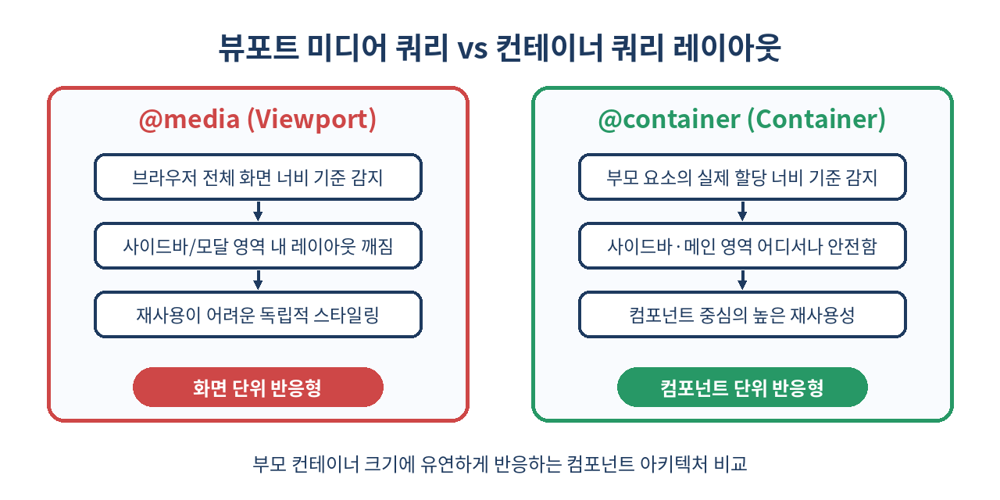
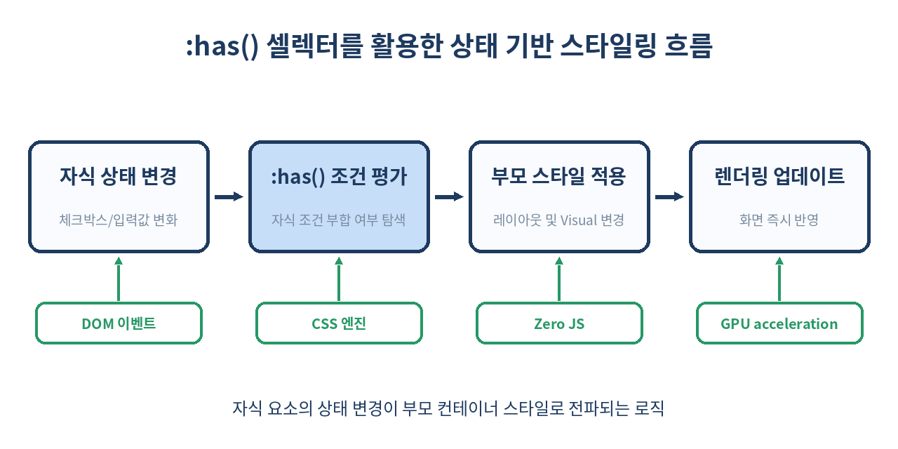

# 🎨 CSS Container Queries와 :has() 부모 선택자로 완성하는 진정한 컴포넌트 기반 레이아웃

> 뷰포트(Viewport) 크기 의존성에서 벗어나, 컴포넌트 자체의 상태와 부모 크기에 반응하는 진정한 모듈형 CSS 시대를 탐구합니다.
> 이 글에서는 Container Queries와 `:has()` 선택자의 기초부터 실무 패턴, 그리고 무한 루프 위험 요소까지 깊이 있게 다룹니다.

---

## 📌 목차
1. 🧭 미디어 쿼리의 한계와 현대 UI의 도전 과제
2. 📦 Container Queries 핵심 개념과 기본 문법
3. 📏 Container Query Units (cqw, cqh, cqmin) 활용법
4. 🎯 :has() 선택자: 자식 상태로 부모를 선택하는 CSS 혁명
5. ⚡ Container Queries와 :has()의 강력한 시너지
6. 💻 실전 예제 1: 어디서나 재사용 가능한 반응형 카드 컴포넌트
7. 💻 실전 예제 2: JavaScript 없이 구현하는 폼 Validation & 상태 레이아웃
8. 🚀 기존 JavaScript 기반 해결 방식과의 성능 및 DX 비교
9. ⚠️ 실무 함정: Container Queries 사용 시 무한 루프와 순환 참조
10. 🚫 이 기술을 신중하게 사용해야 하는 예외적 상황
11. 🔮 브라우저 지원 현황과 하위 호환성 폴백(Fallback) 전략
12. 🧾 정리

---

## 🧭 1. 미디어 쿼리의 한계와 현대 UI의 도전 과제

지난 10여 년간 웹 반응형 레이아웃의 절대적인 표준은 `@media (min-width: ...)` 형태의 뷰포트 미디어 쿼리(Viewport Media Queries)였습니다. 그러나 React, Vue, Svelte와 같은 컴포넌트 기반 아키텍처가 메인스트림으로 자리 잡으면서 미디어 쿼리의 결정적인 한계가 드러나기 시작했습니다.

```css
/* 기존 뷰포트 미디어 쿼리 */
@media (min-width: 768px) {
  .card {
    display: flex;
    flex-direction: row;
  }
}
```

위 코드는 화면 너비가 768px 이상일 때 카드 컴포넌트를 가로 배열로 전환합니다. 하지만 이 카드가 메인 영역(너비 900px)에 들어갈 때와, 사이드바 영역(너비 300px)에 들어갈 때를 생각해보겠습니다. 화면 전체 너비는 1024px이지만 사이드바 내부 공간은 300px에 불과함에도 불구하고, 뷰포트 미디어 쿼리는 화면 너비만 보고 카드를 가로로 렌더링하여 레이아웃이 완전히 깨지게 됩니다.

이 문제를 해결하기 위해 개발자들은 `.sidebar .card` 와 같은 상위 클래스 중첩 방식을 사용하거나, `ResizeObserver`를 이용해 JavaScript로 DOM 요소를 직접 측정하는 편법을 써야 했습니다.



---

## 📦 2. Container Queries 핵심 개념과 기본 문법

CSS Container Queries는 컴포넌트가 위치한 **부모 컨테이너의 크기**를 기준으로 스타일을 재정의할 수 있게 해주는 CSS 사양입니다.

### 컨테이너 정의하기 (`container-type`)
요소를 반응형 컨테이너로 지정하려면 먼저 `container-type` 또는 단축 속성인 `container`를 정의해야 합니다.

```css
.card-container {
  /* inline-size(너비) 기준으로 컨테이너를 측정하도록 설정 */
  container-type: inline-size;
  container-name: card-wrapper; /* 식별용 이름 (선택 사항) */
}

/* 단축 속성 표기법 */
.sidebar-section {
  container: sidebar / inline-size;
}
```

- `inline-size`: 텍스트 흐름 방향의 크기(주로 너비)를 감지합니다. 가장 흔하게 사용됩니다.
- `size`: 너비와 높이 모두를 감지합니다. 컨테이너의 높이가 명확히 고정되어 있어야 합니다.
- `normal`: 컨테이너 측정 대상에서 제외합니다.

### `@container` 쿼리 작성하기

```css
.card {
  display: flex;
  flex-direction: column;
  gap: 1rem;
}

/* 컨테이너의 너비가 400px 이상일 때 동작 */
@container (min-width: 400px) {
  .card {
    flex-direction: row;
    align-items: center;
  }
}

/* 특정 이름의 컨테이너를 지정하여 타겟팅 가능 */
@container sidebar (max-width: 300px) {
  .card-title {
    font-size: 0.875rem;
  }
}
```

---

## 📏 3. Container Query Units (cqw, cqh, cqmin) 활용법

Container Queries는 단순한 `@container` 조건문뿐만 아니라, **컨테이너의 크기에 비례하여 변하는 새로운 CSS 상대 단위**를 제공합니다.

| 단위 | 설명 | 비고 |
|---|---|---|
| `cqw` | 컨테이너 너비(Width)의 1% | `100cqw` = 컨테이너 전체 너비 |
| `cqh` | 컨테이너 높이(Height)의 1% | `container-type: size` 설정 필요 |
| `cqi` | 컨테이너 인라인 축 크기의 1% | 글자 방향 기준 (보통 너비) |
| `cqb` | 컨테이너 블록 축 크기의 1% | 글자 방향 기준 (보통 높이) |
| `cqmin` | `cqi`와 `cqb` 중 더 작은 값 | 폭과 높이 중 소형 축 기준 |
| `cqmax` | `cqi`와 `cqb` 중 더 큰 값 | 폭과 높이 중 대형 축 기준 |

```css
.card-header-title {
  /* 컨테이너 너비의 5% 크기로 폰트 설정, 최소 16px ~ 최대 32px 제한 */
  font-size: clamp(1rem, 5cqw, 2rem);
  padding: 2cqw;
}
```

뷰포트 단위(`vw`)를 사용했을 때 부모 상자가 작아지면 글씨만 비정상적으로 커지던 현상을 `cqw`를 통해 깔끔하게 해결할 수 있습니다.

---

## 🎯 4. :has() 선택자: 자식 상태로 부모를 선택하는 CSS 혁명

`:has()` 선택자는 오랫동안 CSS 개발자들이 열망했던 **부모 선택자(Parent Selector)** 역할을 수행합니다. 특정 자식 요소나 상태가 존재하는지 여부에 따라 부모 요소 또는 이전 형제 요소를 선택할 수 있습니다.

```css
/* 1. 이미지()를 자식으로 가지고 있는 .card 상자의 패딩 제거 */
.card:has(img) {
  padding: 0;
  overflow: hidden;
}

/* 2. 에러 메시지(.error)가 표시된 form 내부의 label 색상 변경 */
form:has(.error-message) label {
  color: #ce4747;
}

/* 3. 체크박스가 체크되어 있는 형제 요소 뒤의 텍스트 스타일 수정 */
.todo-item:has(input[type="checkbox"]:checked) {
  text-decoration: line-through;
  opacity: 0.6;
}
```



---

## ⚡ 5. Container Queries와 :has()의 강력한 시너지

Container Queries와 `:has()`를 결합하면 이전에는 JavaScript 없이는 불가능했던 **상태 및 크기 동시 대응형 UI**를 순수 CSS로 구축할 수 있습니다.

```css
.card-wrapper {
  container-type: inline-size;
}

/* 컨테이너가 500px 이상이면서, 동시에 썸네일 이미지가 존재하는 경우에만 그리드 레이아웃 적용 */
@container (min-width: 500px) {
  .card:has(.card-thumbnail) {
    display: grid;
    grid-template-columns: 200px 1fr;
    gap: 1.5rem;
  }
}
```

이 패턴을 사용하면 자식 데이터(이미지 유무)와 배치 공간(컨테이너 크기)이라는 두 가지 조건이 모두 충족될 때만 레이아웃이 알아서 최적의 형태 변환을 수행합니다.

---

## 💻 6. 실전 예제 1: 어디서나 재사용 가능한 반응형 카드 컴포넌트

다음은 대시보드의 중앙 메인 뷰, 좁은 우측 사이드바, 하단 모달창 등 **어떤 부모 밑에 들어가도 스크립트 없이 스스로 레이아웃을 맞추는** 카드 컴포넌트 예시입니다.

```html
<div class="card-container">
  <article class="card">
    <div class="card-thumbnail">
      
    </div>
    <div class="card-body">
      <span class="badge">Article</span>
      <h2>CSS Container Queries Deep Dive</h2>
      <p>뷰포트에 구애받지 않는 모듈형 CSS 스타일링 기법을 알아봅니다.</p>
    </div>
  </article>
</div>
```

```css
.card-container {
  container-type: inline-size;
  width: 100%;
}

.card {
  display: flex;
  flex-direction: column;
  gap: 1rem;
  border: 1px solid #e2e8f0;
  border-radius: 12px;
  padding: 1rem;
  background: #ffffff;
}

/* 컨테이너 350px 이상: 이미지와 본문 가로 배치 */
@container (min-width: 350px) {
  .card {
    flex-direction: row;
    align-items: center;
  }

  .card-thumbnail {
    width: 120px;
    height: 120px;
    flex-shrink: 0;
  }
}

/* 컨테이너 600px 이상: 폰트 확대 및 추가 여백 제공 */
@container (min-width: 600px) {
  .card {
    padding: 1.5rem;
    gap: 1.5rem;
  }

  .card-thumbnail {
    width: 200px;
    height: 150px;
  }

  .card-body h2 {
    font-size: 1.5rem;
  }
}
```

---

## 💻 7. 실전 예제 2: JavaScript 없이 구현하는 폼 Validation & 상태 레이아웃

`:has()`와 표준 HTML5 Form Validation pseudoclass(`:invalid`, `:focus`)를 결합하면 폼 입력 상태에 맞춰 카드 전체의 시각적 경고 레이아웃을 손쉽게 구성할 수 있습니다.

```html
<form class="user-form">
  <div class="field">
    <label for="email">이메일 주소</label>
    <input type="email" id="email" required placeholder="name@example.com" />
    <span class="error-text">유효한 이메일 형식이 아닙니다.</span>
  </div>
  <button type="submit">제출하기</button>
</form>
```

```css
.user-form {
  border: 2px solid #cbd5e1;
  padding: 1.5rem;
  border-radius: 8px;
  transition: border-color 0.2s ease, box-shadow 0.2s ease;
}

/* 폼 내부에 포커스된 입력창이 존재하는 경우 */
.user-form:has(input:focus) {
  border-color: #5b8fd4;
  box-shadow: 0 4px 12px rgba(91, 143, 212, 0.15);
}

/* 포커스 해제 후 유효하지 않은(invalid) 값이 들어있는 경우 */
.user-form:has(input:not(:focus):invalid:not(:placeholder-shown)) {
  border-color: #ce4747;
  background-color: #fff5f5;
}

/* 에러 상태일 때 메시지 보이기 */
.user-form:has(input:not(:focus):invalid:not(:placeholder-shown)) .error-text {
  display: block;
  color: #ce4747;
  font-size: 0.85rem;
  margin-top: 0.25rem;
}
```

---

## 🚀 8. 기존 JavaScript 기반 해결 방식과의 성능 및 DX 비교

과거에는 이러한 컴포넌트 단위 반응형 레이아웃 및 부모 스타일 변경을 위해 JS 라이브러리나 Custom Event, `ResizeObserver`를 남발해야 했습니다.

| 비교 항목 | 기존 JS 방식 (ResizeObserver / State) | Modern CSS (Container Queries & :has) |
|---|---|---|
| **실행 주체** | 브라우저 JS 메인 스레드 (Main Thread) | 브라우저 렌더링 엔진 (C++ Layout Engine) |
| **성능 (FPS)** | 리사이즈 이벤트 시 JS 연산 및 Reflow 발생 가능 | GPU 및 렌더링 파이프라인에서 최적화 처리 |
| **컴포넌트 독립성** | ResizeObserver 리스너 등록/해제 관리 필요 | CSS 정의만으로 완전한 캡슐화 |
| **코드 가독성 (DX)** | JS 훅, useEffect, State 및 CSS-in-JS 분산 | 단일 stylesheet/module 안에서 깔끔한 선언 |
| **레이아웃 시프트 (CLS)** | JS 실행 전 초기 블링크 및 레이아웃 튐 현상 발생 | 첫 페인팅 시점에 올바른 크기 즉시 계산 |

---

## ⚠️ 9. 실무 함정: Container Queries 사용 시 무한 루프와 순환 참조

Container Queries를 도입할 때 개발자가 가장 흔하게 범하는 실수는 **컨테이너의 자식 스타일 변경이 다시 컨테이너의 크기에 영향을 주어 무한 루프(Infinite Layout Loop)를 유발**하는 것입니다.

### 위험한 패턴 (Layout Thrashing & Loop)

```css
/* BAD: 자식이 컨테이너의 크기를 변화시키는 구조 */
.parent {
  container-type: inline-size;
  width: max-content; /* 자식 요소 크기에 의존함! */
}

@container (min-width: 300px) {
  .child {
    width: 400px; /* 자식이 커지면 parent도 커짐 -> 조건 재평가 반복 */
  }
}
```

### 왜 문제가 되는가?
브라우저는 `@container` 규칙을 계산하기 위해 컨테이너의 `inline-size`를 먼저 확정해야 합니다. 그러나 컨테이너의 너비가 자식의 너비(`max-content`, `fit-content`)에 의존하면, 자식의 크기 변경이 컨테이너 크기를 바꾸고, 이는 다시 `@container` 조건 재평가를 유발하여 레이아웃 계산 불능 상태에 빠집니다.

### 해결 가이드
1. **컨테이너의 너비 확정**: 컨테이너 역할을 하는 상자는 명시적인 너비(`100%`, `flex: 1`, `grid-template-columns` 등)를 가져야 합니다.
2. **`containment` 지침 준수**: `container-type` 속성은 내부적으로 CSS Containment(`contain: layout inline-size`)를 자동으로 적용하므로, 외부 레이아웃 흐름에 영향을 받지 않도록 구성해야 합니다.

---

## 🚫 10. 이 기술을 신중하게 사용해야 하는 예외적 상황

아무리 뛰어난 기술이라도 모든 곳에 무분별하게 적용해서는 안 됩니다.

### 1. 페이지 전체 뷰포트 레이아웃 (GNB, Footer, Overall Page Grid)
페이지 최상위 레이아웃(Header, Footer, Main Content Area)은 여전히 `@media` 뷰포트 쿼리를 사용하는 것이 유리합니다. 전체 페이지의 브레이크포인트(Mobile/Tablet/Desktop)는 화면 전체 크기 변화와 동기화되는 것이 직관적이기 때문입니다.

### 2. 지나치게 깊은 복합 `:has()` 연쇄 중첩
`:has()`는 매우 유용하지만, DOM 트리 깊은 곳까지 검색하는 복잡한 `:has()` 연쇄 조건은 CSS 선택자 엔진의 재계산 오버헤드를 증가시킬 수 있습니다.
```css
/* BAD: 과도한 성능 저하 가능성 */
div:has(> section:has(ul > li:has(a:focus))) { ... }
```

### 3. 고빈도 애니메이션 요소에 컨테이너 설정
`width`나 `transform`이 초당 60프레임 이상으로 연속 애니메이션되는 요소에 `container-type`을 지정하면 매 프레임마다 컨테이너 쿼리 평가가 유발되어 프레임 드랍이 일어날 수 있습니다.

---

## 🔮 11. 브라우저 지원 현황과 하위 호환성 폴백(Fallback) 전략

2026년 현재, CSS Container Queries와 `:has()` 선택자는 Chrome, Edge, Safari, Firefox 등 **모든 최신 브라우저(Baseline Newly/Widely Available)**에서 완벽하게 지원됩니다.

### Progressive Enhancement (점진적 향상) 전략
구형 브라우저 환경을 지원해야 한다면 `@supports` 쿼리를 활용해 기본 레이아웃을 제공하고, 지원 브라우저에서 향상된 레이아웃을 제공하는 방식을 권장합니다.

```css
/* 기본 fallback 레이아웃 (모바일 우선 모놀리식 스타일) */
.card {
  display: flex;
  flex-direction: column;
}

/* Container Queries 지원 시 모듈형 레이아웃 적용 */
@supports (container-type: inline-size) {
  .card-container {
    container-type: inline-size;
  }

  @container (min-width: 400px) {
    .card {
      flex-direction: row;
    }
  }
}
```

---

## 🧾 12. 정리

- **Container Queries**는 뷰포트 화면 크기가 아닌 **부모 컨테이너 크기**를 기준으로 컴포넌트 반응형 레이아웃을 작성할 수 있게 합니다.
- **`:has()` 부모 선택자**는 자식의 존재나 상태(Focus, Checked, Error 등)에 반응하여 부모 또는 형제 요소를 제어합니다.
- `cqw`, `cqh` 등의 단위로 부모 상자에 완벽히 비례하는 타이포그래피와 여백 조절이 가능합니다.
- 컨테이너 요소는 `width: max-content` 같은 자식 의존적 너비를 피해야 무한 레이아웃 평가 루프를 막을 수 있습니다.
- 뷰포트 단위 미디어 쿼리는 전체 페이지 틀에, 컨테이너 쿼리는 재사용 컴포넌트 내부에 적용하는 것이 가장 이상적인 CSS 아키텍처입니다.

> ✨ **한 줄 요약**
> Container Queries와 `:has()`는 웹 컴포넌트의 레이아웃 독립성을 완성하는 차세대 CSS 스탠다드다.

---

## 📚 참고 자료
- [MDN Web Docs: CSS Container Queries](https://developer.mozilla.org/en-US/docs/Web/CSS/CSS_containment/Container_queries)
- [MDN Web Docs: :has() pseudo-class](https://developer.mozilla.org/en-US/docs/Web/CSS/:has)
- [W3C CSS Containment Module Level 3](https://www.w3.org/TR/css-contain-3/)
