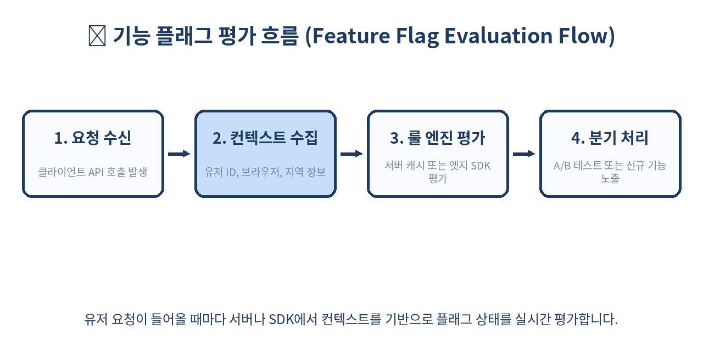
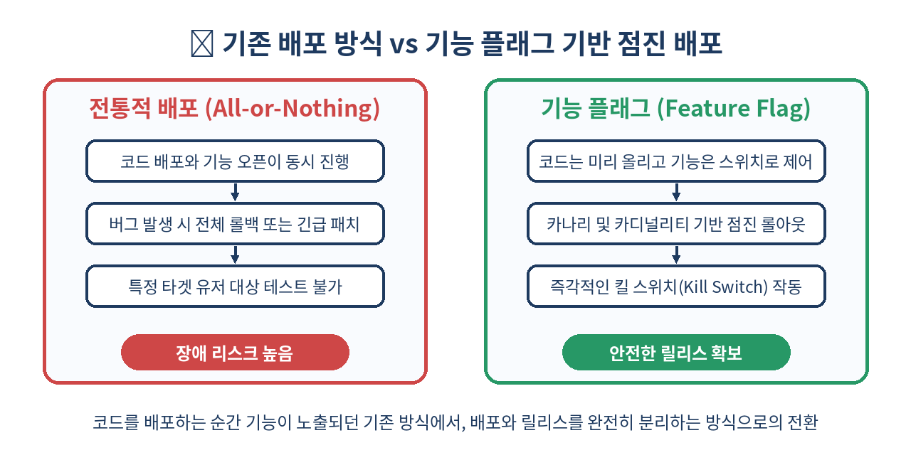

# 🚩 기능 플래그와 점진 배포 완벽 가이드

> 배포(Deployment)와 릴리스(Release)는 다릅니다.
> 코드를 서버에 밀어 넣는 행위와, 사용자에게 기능을 열어주는 행위를 분리하는 아키텍처를 알아봅니다.

---

## 📌 목차
1. 🧭 기능 플래그(Feature Flag)란 무엇인가?
2. 🚀 배포와 릴리스의 개념적 분리
3. ⚙️ 기능 플래그의 아키텍처와 기본 원리
4. 📊 점진적 롤아웃(Gradual Rollout)과 카나리 배포
5. 💻 프론트엔드 및 백엔드에서의 구현 예시
6. 🧪 A/B 테스팅 및 타겟팅 규칙 설정
7. ⚡ 성능 최적화와 엣지(Edge) 기반 플래그 평가
8. ⚠️ 실무 함정: 테크니컬 부채와 플래그 방치
9. 🚫 쓰면 안 되는 경우와 안티 패턴
10. 🧾 정리 및 한 줄 요약
11. 📚 참고 자료

---

## 🧭 1. 기능 플래그(Feature Flag)란 무엇인가?

기능 플래그(Feature Flag, 또는 기능 토글, Feature Toggle)는 코드 수정 없이도 애플리케이션의 동작이나 사용자 인터페이스를 실시간으로 제어할 수 있게 해주는 소프트웨어 개발 기법입니다. 

간단한 조건문(`if/else`)처럼 보일 수 있지만, 대규모 분산 시스템에서는 비즈니스 민첩성을 극대화하는 핵심 인프라 역할을 담당합니다. 예를 들어, 거대한 모놀리식 구조나 복잡한 마이크로서비스 아키텍처(MSA)에서 브랜치 전략의 복잡성을 줄이고, 릴리스 주기를 비즈니스 요구사항과 완전히 분리할 수 있습니다.



### 주요 활용 시나리오
- **Trunk-Based Development 지원**: 장기 브랜치(Long-lived Branch)로 인한 머지 지옥을 방지하고, 모든 코드를 메인 브랜치에 자주 통합합니다.
- **핫픽스 및 서킷 브레이커(Circuit Breaker)**: 신규 기능에 예기치 않은 메모리 누수나 심각한 버그가 발생했을 때, 코드 배포 없이 원격 대시보드 스위치 하나로 기능을 비활성화합니다.
- **베타 테스터 그룹 격리**: 사내 임직원이나 특정 파트너사 사용자에게만 선공개하여 실환경(Production) 테스트를 수행합니다.

---

## 🚀 2. 배포와 릴리스의 개념적 분리

전통적인 개발 프로세스에서는 코드가 프로덕션에 머무르는 순간 모든 사용자에게 노출되었습니다. 하지만 기능 플래그를 도입하면 이 두 개념이 완전히 분리됩니다. 배포는 기술적인 작업이며, 릴리스는 비즈니스적인 결정입니다.

| 구분 | 배포 (Deployment) | 릴리스 (Release) |
|------|-------------------|------------------|
| 정의 | 코드를 서버, 클라우드, 또는 클라이언트 앱 스토어에 전달 | 최종 사용자에게 실제 기능을 공개함 |
| 시점 | CI/CD 파이프라인 완료 시점 (수시로 발생) | 프로덕트 매니저(PM) 또는 비즈니스 운영자의 결정 시점 |
| 주체 | 개발자 및 DevOps 엔지니어 | 프로덕트 오너, 마케터, 비즈니스 리더 |
| 리스크 | 낮음 (동작하지 않는 코드가 안전하게 숨겨짐) | 통제 가능 (문제가 생기면 실시간 스위치 OFF) |
| 롤백 비용 | 높음 (전체 빌드 재배포 필요) | 매우 낮음 (중앙 플래그 상태 토글로 즉시 해결) |

실무에서는 앱 스토어 심사 기간이 소요되는 모바일 앱 환경에서 이 분리의 가치가 극대화됩니다. 기능을 미리 앱 내부에 심어둔 뒤, 특정 날짜와 시간에 서버 플래그를 열어 프로모션을 시작할 수 있습니다.

---

## ⚙️ 3. 기능 플래그의 아키텍처와 기본 원리

플래그 시스템은 일반적으로 중앙 관리 대시보드, 고성능 SDK, 그리고 로컬 캐시 레이어로 구성됩니다. 분산 환경에서 매 요청마다 원격 데이터베이스를 조회하는 것은 네트워크 지연과 병목을 유발하므로, 효율적인 캐싱 전략이 필수적입니다.

```text
[Dashboard / Admin] ---> (Sync Rules / Webhook) ---> [Edge / Client SDK Cache] ---> (Evaluate Flag) ---> [App Logic]
```

### 아키텍처 구성 요소 상세
1. **관리 대시보드 (Control Plane)**: 플래그의 생성, 수정, 타겟팅 규칙 설정, 권한 관리를 수행하는 웹 콘솔입니다.
2. **평가 엔진 (Evaluation Engine)**: 사용자 컨텍스트(ID, 속성, 지역 등)를 받아 해당 사용자에 대한 플래그의 참/거짓 또는 다변량(Multivariate) 값을 계산합니다.
3. **SDK 및 캐시 레이어 (Data Plane)**: 애플리케이션 내부에 임베드되어 주기적으로 규칙을 동기화(Polling 또는 Streaming)하고, 인메모리 메모리 룩업을 통해 밀리초(ms) 단위 이하로 플래그를 평가합니다.

---

## 📊 4. 점진적 롤아웃(Gradual Rollout)과 카나리 배포

새로운 알고리즘이나 대규모 UI 개편을 진행할 때, 100%의 사용자에게 한 번에 노출하는 것은 치명적인 장애로 이어질 수 있습니다. 점진적 롤아웃은 인프라 부하와 에러 스파이크를 안전하게 방어합니다.

- **1단계 (Internal)**: 내부 임직원 및 QA 엔지니어 대상 (0.1% ~ 1% 미만)
- **2단계 (Beta)**: 자발적 베타 테스터 그룹 및 파트너사 사용자 (5%)
- **3단계 (Ramp-up)**: 전체 유저 중 무작위 20% -> 50% -> 100% 확대

```text
[전체 트래픽 100%]
 ├── [비활성화 (50%)] -> 기존 레거시 시스템
 └── [활성화 (50%)]
      ├── 내부 테스터 (5%) -> 실시간 에러 로깅 모니터링
      └── 일반 유저 대상 점진적 확장 (45%) -> Web Vitals & APM 지표 추적
```

이러한 점진적 롤아웃은 에러율, API 응답 시간, 코어 웹 바이탈(Core Web Vitals) 등의 성능 지표 변동을 APM(Application Performance Monitoring) 툴과 연동하여 안전하게 진행될 수 있습니다.

---

## 💻 5. 프론트엔드 및 백엔드에서의 구현 예시

실무에서 자주 사용되는 JavaScript/TypeScript 기반의 기능 플래그 평가 및 안전한 예외 처리 패턴을 살펴봅니다. 네트워크 단절이나 SDK 초기화 지연에 대비한 폴백(Fallback) 처리가 중요합니다.

```typescript
import { initFlags, evaluateFlag } from '@example/feature-flags-sdk';

// 1. 애플리케이션 부팅 시 SDK 초기화
await initFlags({
  sdkKey: 'env-prod-secret-key-12345',
  refreshIntervalMs: 60000,
});

interface UserContext {
  id: string;
  email: string;
  country: string;
  tier: 'free' | 'premium';
}

// 2. 컴포넌트 또는 비즈니스 로직에서의 평가
function DashboardComponent({ user }: { user: UserContext }) {
  // 안전한 폴백(false) 지정으로 SDK 장애 시 서비스 중단 방지
  const isNewDashboardEnabled = evaluateFlag('new-dashboard-ui', {
    key: user.id,
    custom: {
      email: user.email,
      country: user.country,
      tier: user.tier,
    },
  }, false);

  if (isNewDashboardEnabled) {
    return <NewShinyDashboard user={user} />;
  }

  return <LegacyDashboard user={user} />;
}
```

백엔드(Node.js / Express) 환경에서의 API 라우팅 분기 예시입니다.

```javascript
app.post('/api/v2/checkout', async (req, res) => {
  const userContext = { key: req.user.id, tier: req.user.tier };
  
  // 신규 결제 엔진 플래그 평가
  const useNextGenCheckout = evaluateFlag('next-gen-checkout-engine', userContext, false);

  try {
    if (useNextGenCheckout) {
      const result = await nextGenCheckoutService.process(req.body);
      return res.status(200).json({ version: 'v2', data: result });
    } else {
      const result = await legacyCheckoutService.process(req.body);
      return res.status(200).json({ version: 'v1', data: result });
    }
  } catch (error) {
    logger.error('Checkout failed', { error, useNextGenCheckout });
    return res.status(500).json({ error: 'Internal Server Error' });
  }
});
```

---

## 🧪 6. A/B 테스팅 및 타겟팅 규칙 설정

기능 플래그는 단순한 참/거짓 스위치를 넘어 정교한 타겟팅 규칙과 다변량 분기를 지원합니다. 이를 통해 마케팅 및 프로덕트 가설 검증(A/B 테스트)을 수행할 수 있습니다.

- **타겟팅 규칙 예시**:
  - 특정 이메일 도메인(`@internal.company.com`) 사용자에게만 신규 AI 요약 기능 노출
  - iOS 버전 `16.0` 이상이면서 프리미엄 티어인 사용자 그룹 타겟팅
- **일관된 해시 기반 버킷팅 (Consistent Bucketing)**:
  - 사용자 ID의 해시값을 계산하여 50% 그룹에 속한 사용자는 앱을 재시작해도 항상 동일한 실험군(Variant A 또는 B)에 속하도록 보장합니다. 세션마다 화면이 깜빡이는 현상을 방지합니다.

---

## ⚡ 7. 성능 최적화와 엣지(Edge) 기반 플래그 평가

클라이언트 사이드나 서버 사이드 렌더링(SSR) 환경에서 플래그 평가 지연(Latency)은 사용자 경험(UX)을 직접적으로 해칩니다. SSR 페이지 렌더링 도중 원격 API를 호출해 플래그를 가져오면 수백 밀리초의 대기 시간이 발생할 수 있습니다.

Vercel Edge Middleware, Cloudflare Workers, 또는 AWS Lambda@Edge 같은 엣지 컴퓨팅 환경을 적극 활용해야 합니다. 사용자 요청이 도달하는 최인접 엣지 노드에서 쿠키, JWT, 또는 GeoIP 정보를 기반으로 사전에 플래그를 평가하여, HTML 스트리밍 시점에 올바른 컴포넌트나 변형(Variant)을 즉시 렌더링할 수 있습니다.

```text
[Client Request] ---> [Edge Middleware (Flag Evaluated in < 5ms)] ---> [SSR Server with Pre-resolved Flags] ---> [Fast HTML Response]
```

---

## ⚠️ 8. 실무 함정: 테크니컬 부채와 플래그 방치

기능 플래그를 도입했을 때 조직이 가장 흔히 겪는 함정은 **'죽은 코드(Dead Code)의 누적'**과 **'플래그 지옥(Flag Hell)'**입니다.

### 주요 함정 및 해결 가이드
- **플래그 방치 (Zombie Flags)**: 기능이 100% 롤아웃되고 수개월이 지났음에도 코드베이스에 `if (featureFlags.isEnabled('old-feature'))` 형태의 조건문이 영원히 방치되는 경우. 코드 가독성을 떨어뜨리고 불필요한 분기 처리를 유발합니다.
- **조합 폭발 (Combinatorial Explosion)**: 10개의 독립적인 플래그가 존재할 때, 발생 가능한 시스템 상태의 수는 $2^{10} = 1024$가지가 됩니다. QA 팀이 모든 조합을 테스트하는 것은 불가능에 가깝습니다.

### 베스트 프랙티스: 만기일(Expiration Date) 설정
- 모든 기능 플래그 생성 시 **반드시 만기일과 담당자(Owner)**를 명시합니다.
- 정기적인 스프린트나 테크니컬 부채 청산 데이(Tech Debt Day)를 지정하여, 100% 롤아웃이 완료된 플래그와 관련 레거시 코드를 제거하는 PR을 강제합니다.

---

## 🚫 9. 쓰면 안 되는 경우와 안티 패턴

기능 플래그는 강력하지만, 만능 열쇠는 아닙니다. 다음과 같은 영역에서는 사용을 지양해야 합니다.

- **영구적인 설정 값(Configuration) 저장소로 쓸 때**: 데이터베이스 연결 문자열, 타임아웃 임계값, 외부 API 엔드포인트 등의 시스템 설정은 기능 플래그가 아니라 환경 변수나 전용 분산 설정 관리 시스템(예: Consul, AWS Parameter Store)을 사용해야 합니다.
- **보안 인증(Authentication) 및 권한(Authorization) 제어로 쓸 때**: 관리자 권한 검증이나 민감한 데이터 접근 제어는 백엔드 보안 미들웨어와 엄격한 RBAC(Role-Based Access Control) 정책으로 처리해야 합니다. UI 레벨의 플래그로 접근 권한을 숨기는 것은 보안 대책이 아닙니다.
- **단순 비즈니스 상수 값을 난잡하게 늘릴 때**: 특정 상수를 하드코딩하기 싫다는 이유로 모든 매직 넘버를 플래그화하면 시스템 복잡도가 비정상적으로 폭발합니다.



---

## 🧾 10. 정리 및 한 줄 요약

- 배포와 릴리스를 엄격히 분리하여 비즈니스 리스크를 최소화합니다.
- 점진적 롤아웃과 카나리 배포를 통해 장애 범위를 최소 단위로 통제합니다.
- 타겟팅과 일관된 해시 기반 A/B 테스트의 강력한 도구로 활용합니다.
- 방치된 좀비 플래그와 죽은 코드는 정기적으로 제거하여 기술 부채를 방어합니다.
- 엣지 컴퓨팅 환경을 적극 활용해 지연 없는 빠른 플래그 평가를 구현합니다.

> ✨ **한 줄 요약**
> 기능 플래그는 단순히 코드를 숨기는 토글이 아니라, 배포의 두려움을 없애고 비즈니스 속도를 극대화하는 엔지니어링 안전장치다.

---

## 📚 참고 자료
- [Martin Fowler - Feature Toggles (Feature Flags)](https://martinfowler.com/articles/feature-toggles.html)
- [LaunchDarkly Documentation - Best Practices for Feature Management](https://docs.launchdarkly.com/)
- [OpenFeature Standard Specification](https://openfeature.dev/)
- [Google Cloud Architecture Center - Progressive Delivery Strategies](https://cloud.google.com/architecture)
