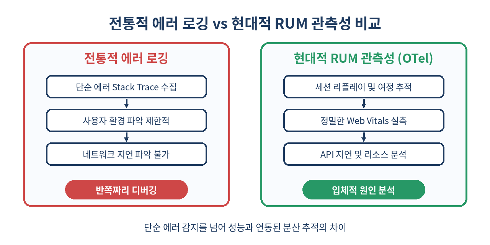
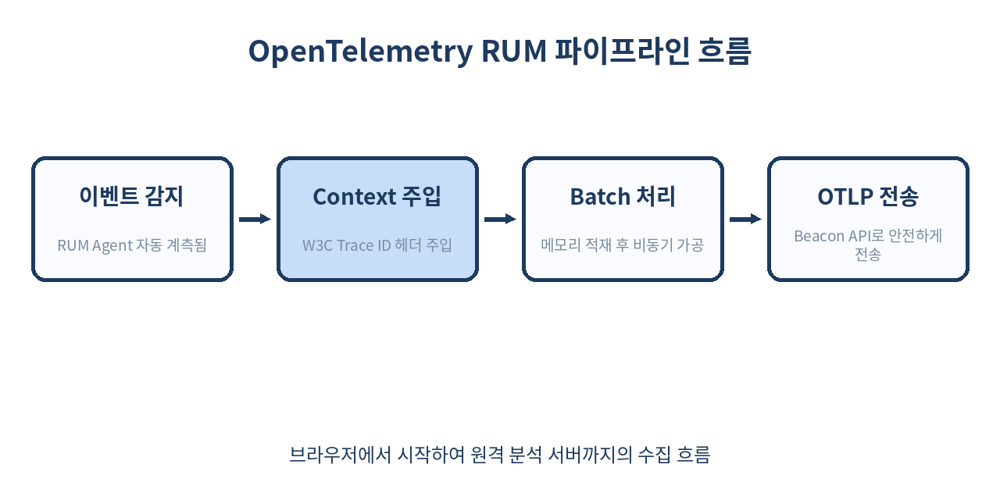

# 👁️ 프론트엔드 관측성(Observability)과 OpenTelemetry + RUM 완벽 가이드

> "내 브라우저에서는 잘 되는데요?" 개발자라면 누구나 한 번쯤 겪어봤을 답답함입니다.
> 브라우저라는 사용자 측 블랙박스를 투명하게 들여다보고, 백엔드 서버의 분산 추적(Distributed Tracing) 체인과 완벽하게 연결하는 OpenTelemetry 기반 RUM(Real User Monitoring) 아키텍처를 파헤쳐 봅니다.

---

## 📌 목차
1. 🧭 프론트엔드 관측성(Observability)의 등장 배경
2. 📊 RUM(Real User Monitoring)의 핵심 지표
3. 🌐 OpenTelemetry가 프론트엔드 표준이 된 이유
4. 🛠️ 브라우저용 OpenTelemetry 환경 구축하기
5. 🧩 Web Tracer Provider와 Instrumentation 설정
6. 🔄 W3C Trace Context와 백엔드 분산 추적 연동
7. 📉 다이어그램으로 보는 관측성 아키텍처
8. ⚖️ RUM 솔루션 비교 분석: Self-Hosted vs SaaS
9. ⚠️ 실무 함정과 안티패턴: 이것만은 피하자
10. ⛔ OpenTelemetry RUM을 도입하면 안 되는 경우
11. 🧾 정리 및 핵심 요약
12. 📚 참고 자료

---

## 🧭 1. 프론트엔드 관측성(Observability)의 등장 배경

서버 모니터링 시스템은 CPU 사용량, 메모리, API 응답 속도 등을 1초 단위로 감시합니다. 하지만 사용자가 실제로 겪는 화면 끊김 현상, 네트워크 지연, 특정 브라우저 환경의 오류는 서버 모니터링만으로 알 수 없습니다. 기존의 **모니터링(Monitoring)**은 "서버가 죽었는가?"와 같은 알려진 문제에 답하는 반면, **관측성(Observability)**은 "왜 특정 브라우저 환경에서 특정 국가의 사용자만 결제 속도가 비정상적으로 느린가?"와 같은 복잡하고 동적인 원인을 시스템 내부 메트릭을 조합해 찾아내는 개념입니다.

과거의 웹 애플리케이션은 서버가 완성된 HTML을 내려주는 단순한 구조였습니다. 그러나 현대 프론트엔드는 Single Page Application(SPA)의 대중화, Server-Side Rendering(SSR) 및 ISR의 도입, 그리고 클라이언트 사이드에서의 복잡한 상태 관리와 비즈니스 로직 연산이 집중되면서 브라우저 자체가 하나의 거대한 분산 애플리케이션 레이어로 진화했습니다. 

이러한 환경에서 사용자 경험을 결정짓는 요인은 서버 응답 시간뿐만이 아닙니다. 다음과 같은 수많은 변수가 사용자 브라우저 안에서 동작합니다.
* 모바일 기기의 CPU 스로틀링 및 메모리 한계
* 저가형 기기에서의 무거운 자바스크립트 실행 지연(Long Tasks)
* 국가별, 통신사별 네트워크 대역폭 및 Latency 편차
* 브라우저 렌더링 엔진(Blink, WebKit, Gecko) 간의 미세한 동작 차이 및 CSS/JS 호환성 오류
* Next.js, React 등 프레임워크의 Hydration 과정에서 발생하는 불일치(Mismatch) 및 병목 현상

클라이언트 측 에러나 지연은 백엔드 게이트웨이 서버의 APM(Application Performance Monitoring) 도구에 잡히지 않습니다. 서버의 에러율은 0%를 기록하고 있지만, 실제 고객은 브라우저 화면이 하얗게 멈추거나 버튼이 클릭되지 않는 치명적인 장애를 겪을 수 있습니다. 결국 사용자 브라우저라는 거대한 '블랙박스' 내부의 상태를 실시간으로 추적하고 계측하는 기술이 서비스 신뢰성 확보의 최우선 과제가 되었습니다.

--- 

## 📊 2. RUM(Real User Monitoring)의 핵심 지표

RUM은 통제된 실험실 환경(Lighthouse 등)의 가상 측정이 아닌, 실제 서비스를 이용하는 실사용자의 메트릭을 원격으로 수집합니다. 통제된 환경은 네트워크 상태가 항상 균일하고 CPU 가용성이 높지만, 실사용자의 환경은 예측할 수 없을 정도로 열악합니다. RUM이 추적해야 하는 필수 지표는 다음과 같습니다.

### Core Web Vitals (핵심 웹 바이탈)
Google이 정의한 사용자 경험의 핵심 척도로, 검색 엔진 최적화(SEO) 점수에도 강력한 영향을 미칩니다.

* **LCP (Largest Contentful Paint):** 페이지 내에서 가장 큰 텍스트 블록이나 이미지 엘리먼트가 화면에 완전히 렌더링될 때까지의 시간입니다. 사용자에게 페이지 로딩이 사실상 완료되었다고 느끼게 만드는 시점을 의미합니다.
* **CLS (Cumulative Layout Shift):** 페이지 로드 중에 예기치 않게 엘리먼트가 움직여 레이아웃이 밀리는 현상을 누적 점수로 계산한 지표입니다. 예컨대 텍스트를 읽고 있는 도중에 비동기로 로드된 배너 광고가 상단에 배치되면서 본문이 아래로 밀려 사용자가 엉뚱한 곳을 클릭하게 만드는 시각적 불안정성을 측정합니다.
* **INP (Interaction to Next Paint):** 사용자가 페이지와 상호작용(마우스 클릭, 터치, 키보드 타이핑 등)을 한 뒤 브라우저가 다음 프레임을 그리기까지 걸리는 최대 지연 시간입니다. 2024년 3월을 기점으로 기존의 FID(First Input Delay)를 완전히 대체하였습니다. FID가 최초 1회성 동작의 '대기 시간'만을 측정했다면, INP는 사용자의 전체 세션 동안 발생하는 모든 상호작용의 '반응 속도'를 전체적으로 대변합니다.

#### Core Web Vitals 성적 기준표
| 지표 | Good (우수) | Needs Improvement (개선 필요) | Poor (불량) |
| :--- | :--- | :--- | :--- |
| **LCP** | 2.5초 이하 | 2.5초 ~ 4.0초 | 4.0초 초과 |
| **CLS** | 0.1 이하 | 0.1 ~ 0.25 | 0.25 초과 |
| **INP** | 200ms 이하 | 200ms ~ 500ms | 500ms 초과 |

### Resource Timing (리소스 타이밍)
스타일시트(CSS), 자바스크립트(JS), 이미지 파일, 그리고 웹 애플리케이션이 호출하는 API 등 개별 네트워크 리소스의 로드 라이프사이클을 추적합니다. DNS lookup, TCP Connection, SSL/TLS handshake, TTFB(Time to First Byte), Content Download 단계를 세부적으로 쪼개어 어느 지점에서 병목이 발생했는지 식별합니다.

### User Interaction Path (사용자 여정 및 세션 추적)
단순한 에러 로그 하나만으로는 버그를 재현하기 어렵습니다. 사용자가 에러를 마주하기 직전 어떤 페이지들을 거쳐 왔는지, 어떤 버튼을 클릭했는지, 네트워크 요청 결과는 무엇이었는지에 대한 세션 수명 주기 전체의 흐름을 인과 관계로 엮어서 파악해야 합니다.

다음은 현대 브라우저가 기본 제공하는 `PerformanceObserver` API를 활용하여 핵심 웹 바이탈(LCP, CLS)을 로우 레벨에서 직접 감지하고 모니터링하는 바닐라 자바스크립트 구현 코드 예시입니다. OpenTelemetry SDK 내부적으로도 이와 유사한 브라우저 API 호출을 추상화하여 구현되어 있습니다.

```typescript
// PerformanceObserver를 이용한 LCP 및 CLS 직접 계측 예제
let cumulativeLayoutShiftScore = 0;

try {
  // 1. CLS 계측용 옵저버 구성
  const clsObserver = new PerformanceObserver((entryList) => {
    for (const entry of entryList.getEntries()) {
      const layoutShift = entry as any;
      // 사용자의 직접적인 입력 동작(클릭 등) 이후 500ms 이내에 발생한 레이아웃 변경은 제외
      if (!layoutShift.hadRecentInput) {
        cumulativeLayoutShiftScore += layoutShift.value;
        console.log(`[CLS Update] Current Score: ${cumulativeLayoutShiftScore}`);
      }
    }
  });

  clsObserver.observe({ type: 'layout-shift', buffered: true });

  // 2. LCP 계측용 옵저버 구성
  const lcpObserver = new PerformanceObserver((entryList) => {
    const entries = entryList.getEntries();
    const lastEntry = entries[entries.length - 1]; // 가장 마지막에 렌더링된 큰 엘리먼트가 최종 LCP
    console.log(`[LCP Metric] Render Time: ${lastEntry.startTime}ms`, lastEntry);
  });

  lcpObserver.observe({ type: 'largest-contentful-paint', buffered: true });

} catch (e) {
  console.warn('이 브라우저에서는 PerformanceObserver의 일부 메트릭 측정을 지원하지 않습니다.', e);
}
```

--- 

## 🌐 3. OpenTelemetry가 프론트엔드 표준이 된 이유

과거에는 Datadog, New Relic, Sentry, Dynatrace 등 특정 타사(SaaS) 벤더의 독자 SDK를 프론트엔드 코드에 심는 것이 모니터링 구축의 유일한 방법이었습니다. 그러나 이 접근법은 오랜 기간 심각한 단점들을 유발했습니다.

1. **벤더 종속성(Vendor Lock-in):** 특정 벤더의 모니터링 솔루션 가격이 급증하거나, 회사 규정상 데이터를 사내 인프라 내부로 격리해야 하는 요구사항이 생겨 타사 솔루션으로 마이그레이션하려 할 때, 프론트엔드 소스코드 전반에 걸쳐 퍼져 있는 벤더 전용 SDK 호출부(`Sentry.captureException(...)`, `datadogRum.addAction(...)` 등)를 전부 찾아서 수동으로 교체해야 합니다. 이는 막대한 리팩토링 비용과 검증 공수를 야기합니다.
2. **분산 추적 맥락의 단절:** 프론트엔드 브라우저에서 백엔드 API로 요청을 보낼 때, 브라우저 단에서 생성한 Trace ID를 HTTP 헤더를 통해 서버로 흘려보내야 전 과정을 하나의 트랜잭션으로 엮을 수 있습니다. 하지만 벤더마다 사용하는 헤더 포맷(`x-datadog-trace-id`, `x-dynatrace-test`, `X-Amzn-Trace-Id` 등)이 상이하여 이종 시스템 간의 추적 체인을 동기화하기가 극도로 어렵고 복잡했습니다.

**OpenTelemetry(OTel)**는 Cloud Native Computing Foundation(CNCF) 주도하에 전 세계의 다양한 모니터링 기업과 오픈소스 커뮤니티가 합의하여 제정한 **업계 표준 텔레메트리 규격**입니다. OpenTelemetry는 데이터를 "어떻게 수집하고 가공하여 전송할 것인가"에 대한 인터페이스(API 및 SDK)와 유선 프로토콜(OTLP - OpenTelemetry Protocol)만을 정의합니다.

개발자는 소스코드 상에서 오직 OpenTelemetry 표준 라이브러리만을 사용하여 코드를 작성합니다. 수집된 트레이스나 메트릭 데이터를 실제로 받아서 시각화할 도구(Datadog, Grafana, Dynatrace, Honeycomb, Zipkin 등)는 애플리케이션 코드를 한 줄도 수정할 필요 없이, 외부 구성 파일(Exporter 주소 설정 등)의 엔드포인트 세팅을 변경하는 것만으로 자유롭게 스위칭할 수 있습니다.

### 독자 SDK vs OpenTelemetry 표준 비교

| 비교 관점 | 독자 벤더 전용 SDK (Sentry, Datadog 등) | OpenTelemetry 표준 SDK |
| :--- | :--- | :--- |
| **코드 이식성** | 낮음 (도구 변경 시 소스코드 재작성 필수) | 매우 높음 (코드 수정 없이 수집 대상 벤더 변경 가능) |
| **라이선스** | 독점 라이선스 (SaaS 서비스 종속) | 오픈소스 (Apache License 2.0, CNCF 프로젝트) |
| **헤더 호환성** | 자체 규격 우선 사용 (상호 연동 작업 필요) | W3C Trace Context 표준 탑재로 이종 백엔드 자동 결합 |
| **커뮤니티 생태계** | 개별 기업이 유지보수 | 수백 개의 글로벌 기업 및 커뮤니티가 공동 기여 |
| **오버헤드 제어** | 제공자가 패키징한 기능 전체를 통째로 로드 | 필요한 플러그인(Instrumentation)만 골라서 경량 빌드 가능 |

--- 

## 🛠️ 4. 브라우저용 OpenTelemetry 환경 구축하기

브라우저 환경에 OpenTelemetry 관측성을 심기 위해서는 브라우저 런타임 특성에 맞춘 Web SDK 모듈들을 설치해야 합니다. Node.js용 SDK와 브라우저용 SDK는 핵심 스펙은 공유하지만, 비동기 컨텍스트 추적 방식과 네트워크 데이터 전송 방식(Fetch/XHR vs gRPC/HTTP-proto)에서 큰 차이가 있습니다.

다음 npm 패키지들을 설치하여 프론트엔드용 OpenTelemetry 기반 RUM 뼈대를 구축합니다.

```bash
npm install @opentelemetry/api \
            @opentelemetry/sdk-trace-web \
            @opentelemetry/exporter-trace-otlp-http \
            @opentelemetry/resources \
            @opentelemetry/semantic-conventions \
            @opentelemetry/instrumentation \
            @opentelemetry/instrumentation-fetch \
            @opentelemetry/instrumentation-xml-http-request \
            @opentelemetry/context-zone
```

### 각 패키지의 핵심 역할 상세
* `@opentelemetry/api`: 개발 코드 내에서 트레이스를 선언하고 스팬(Span)을 열고 닫는 등의 인터페이스를 제공하는 순수 API 패키지입니다. 실제 구현 로직은 담겨있지 않아 무척 가볍습니다.
* `@opentelemetry/sdk-trace-web`: 브라우저 환경에서 동작하는 트레이서 공급자(Tracer Provider)와 메모리 내 스팬 처리 프로세서 등 실질적인 동작 메커니즘을 관장하는 클라이언트 사이드 SDK 코어입니다.
* `@opentelemetry/exporter-trace-otlp-http`: 브라우저에서 획득한 트레이싱 원시 데이터를 HTTP/JSON 포맷(OTLP/HTTP)으로 인코딩하여 외부 수집 서버(OTel Collector 또는 모니터링 백엔드)에 전송하는 내장 익스포터입니다.
* `@opentelemetry/resources` & `@opentelemetry/semantic-conventions`: 수집된 원격 데이터에 범용적인 메타데이터 속성(예: 서비스명, 애플리케이션 버전, 현재 호스트 환경, 브라우저 유형, OS 버전 등)을 업계 표준화된 약속 단어(Semantic Conventions) 형태로 태깅하는 데 사용됩니다.
* `@opentelemetry/context-zone`: 싱글 스레드 기반 브라우저 환경에서 비동기 콜백(Promise, setTimeout, Event Listener 등)의 경계를 넘어 트레이스 컨텍스트(Context)가 유실되지 않도록 Zone.js 개념을 활용해 맥락을 유지시켜 주는 고마운 모듈입니다.

--- 

## 🧩 5. Web Tracer Provider와 Instrumentation 설정

이제 웹 애플리케이션의 엔트리 포인트(예: Next.js의 `_app.tsx` 혹은 일반 SPA의 `main.ts`, `index.js` 최상단)에 탑재할 핵심 초기화 스크립트를 작성해 보겠습니다. 브라우저가 네트워크 요청을 개시하거나 렌더링을 시작하기 전에 이 초기화가 완벽히 이루어져야 유실 없는 트레이싱이 보장됩니다.

```typescript
import { WebTracerProvider } from '@opentelemetry/sdk-trace-web';
import { BatchSpanProcessor } from '@opentelemetry/sdk-trace-web';
import { OTLPTraceExporter } from '@opentelemetry/exporter-trace-otlp-http';
import { Resource } from '@opentelemetry/resources';
import { ATTR_SERVICE_NAME, ATTR_SERVICE_VERSION, ATTR_DEPLOYMENT_ENVIRONMENT } from '@opentelemetry/semantic-conventions';
import { registerInstrumentations } from '@opentelemetry/instrumentation';
import { FetchInstrumentation } from '@opentelemetry/instrumentation-fetch';
import { XMLHttpRequestInstrumentation } from '@opentelemetry/instrumentation-xml-http-request';
import { ZoneContextManager } from '@opentelemetry/context-zone';

// 1. 애플리케이션의 고유 식별 정보 및 메타데이터 정의 (Resource 설정)
const appResource = new Resource({
  [ATTR_SERVICE_NAME]: 'e-commerce-frontend',
  [ATTR_SERVICE_VERSION]: '1.4.2',
  [ATTR_DEPLOYMENT_ENVIRONMENT]: 'production',
  'client.os.name': navigator.platform,
  'client.user_agent': navigator.userAgent,
});

// 2. OTLP 익스포터 구성 (Collector의 CORS 및 주소 설정 준수)
const traceExporter = new OTLPTraceExporter({
  url: 'https://telemetry-api.mycompany.com/v1/traces',
  headers: {
    'X-Client-App-Key': 'frontend-prod-token-93012',
  },
});

// 3. 브라우저 최적화용 Batch Span Processor 결합
// 사용자 인터랙션을 방해하지 않도록 메모리에 스팬을 쌓았다가 비동기로 묶어서 보냅니다.
const spanProcessor = new BatchSpanProcessor(traceExporter, {
  maxQueueSize: 1000,           // 최대 대기 스팬 버퍼 크기
  maxExportBatchSize: 100,      // 한 번에 내보낼 최대 스팬 개수
  scheduledDelayMillis: 5000,   // 데이터 전송 주기 (5초)
  exportTimeoutMillis: 30000,   // 전송 타임아웃
});

const provider = new WebTracerProvider({
  resource: appResource,
});

provider.addSpanProcessor(spanProcessor);

// 4. 비동기 Context 관리를 위해 ZoneContextManager를 장착하여 등록
provider.register({
  contextManager: new ZoneContextManager(),
});

// 5. 자동 계측(Auto-Instrumentation) 대상 라이브러리 및 CORS 타깃 등록
registerInstrumentations({
  instrumentations: [
    new FetchInstrumentation({
      // 지정한 API 도메인 패턴에 한해서만 Trace 헤더(traceparent)를 삽입하도록 제한 (CORS 오버헤드 및 보안 방지)
      propagateTraceHeaderCorsUrls: [
        /api\.mycompany\.com/,
        /internal-gateway\.local/
      ],
      // 특정 정적 에셋 호출이나 헬스체크 URL은 계측에서 누락시켜 불필요한 비용 발생 차단
      ignoreUrls: [
        /\/assets\//,
        /favicon\.ico/,
        /healthcheck/
      ],
      // 커스텀 로직을 통해 필요시 스팬에 추가 데이터를 심는 훅 구성
      applyCustomAttributesOnSpan: (span, request, response) => {
        span.setAttribute('http.request.method', request.method);
        if (response) {
          span.setAttribute('http.response.content_length', response.headers.get('content-length') || 0);
        }
      }
    }),
    new XMLHttpRequestInstrumentation({
      propagateTraceHeaderCorsUrls: [
        /api\.mycompany\.com/
      ],
    }),
  ],
});

console.log('✅ OpenTelemetry RUM Web SDK가 완벽하게 활성화되었습니다.');
```

### 수동 계측(Manual Instrumentation) 실무 예제
자동 계측 패키지가 잡아내지 못하는 비즈니스 도메인 수준의 특정 동작(예: 장바구니 담기 버튼 처리 시간, 이미지 드래그 앤 드롭 업로드 시간 등)은 다음과 같이 직접 스팬을 시작하고 종료하여 정밀 타격하듯 정량화할 수 있습니다.

```typescript
import { trace, SpanStatusCode } from '@opentelemetry/api';

/**
 * 사용자의 상품 구매 요청 트랜잭션을 수동으로 계측하는 함수
 */
export async function measureCheckoutTransaction(productId: string, price: number) {
  // 전역 등록된 Tracer 가져오기
  const tracer = trace.getTracer('user-action-tracer');
  
  // 새 스팬 생성 및 실행 시작
  const checkoutSpan = tracer.startSpan('user_checkout_click', {
    attributes: {
      'ecommerce.product_id': productId,
      'ecommerce.price': price,
      'ecommerce.currency': 'KRW'
    }
  });

  try {
    // 임의의 비즈니스 비동기 로직 시뮬레이션
    const response = await fetch(`https://api.mycompany.com/checkout`, {
      method: 'POST',
      body: JSON.stringify({ productId, price }),
      headers: { 'Content-Type': 'application/json' }
    });

    if (!response.ok) {
      throw new Error(`Checkout Server Error: ${response.statusText}`);
    }

    const data = await response.json();
    
    // 정상 종료 시 메타데이터 기록
    checkoutSpan.setAttribute('ecommerce.order_id', data.orderId);
    checkoutSpan.setStatus({ code: SpanStatusCode.OK });
    
  } catch (error: any) {
    // 예외 발생 시 에러 메트릭화
    checkoutSpan.setStatus({
      code: SpanStatusCode.ERROR,
      message: error.message
    });
    checkoutSpan.recordException(error);
    
    throw error;
  } finally {
    // 스팬의 수명 주기를 확실하게 닫아 타임스탬프 고정
    checkoutSpan.end();
  }
}
```

--- 

## 🔄 6. W3C Trace Context와 백엔드 분산 추적 연동

프론트엔드 관측성의 진정한 꽃은 **백엔드 분산 추적과의 연동**입니다. 브라우저에서 API를 호출할 때 W3C 표준 HTTP 헤더인 `traceparent`를 실어 보내면, 백엔드 서버(Spring Boot, Node.js, Go 등)가 이를 해석하여 프론트엔드의 사용자 액션부터 백엔드 DB 쿼리까지 하나의 단일 Trace ID로 연결합니다.

### W3C `traceparent` 헤더 스펙 구조
`traceparent` 헤더는 하이픈으로 구분된 4가지 영역의 16진수 문자열로 조합됩니다.

```text
traceparent: 00-4bf92f3577b34da6a3ce929d0e0e4736-00f067aa0ba902b7-01
            |  |                                |                |
          버전  Trace ID                         Parent Span ID   Trace Flag
```

* **Version (2자):** 현재 표준 포맷 버전을 표기합니다. (기본값 `00`)
* **Trace ID (32자):** 전체 분산 서비스 연쇄 과정에서 공유되는 유일무이한 전체 트랜잭션 식별 ID입니다.
* **Parent Span ID (16자):** 이 요청을 보낸 직접적 부모 호출부의 Span 식별 ID입니다. (프론트엔드의 fetch 스팬 ID가 백엔드의 첫 번째 엔트리 스팬의 부모 ID가 됩니다.)
* **Trace Flags (2자):** 샘플링 여부 등을 제어하는 8비트 비트맵 값입니다. `01`은 데이터를 실제로 기록(Sampled)하라는 플래그입니다.

### 백엔드 수신측 구현 예시 (Node.js Express 및 OTel API 활용)
다음은 프론트엔드에서 보낸 `traceparent` 컨텍스트를 받아 백엔드 트레이싱 체인에 매끄럽게 승계하는 과정을 시연한 백엔드 예시 코드입니다.

```typescript
import express from 'express';
import { trace, context, propagation, SpanStatusCode } from '@opentelemetry/api';

const app = express();
app.use(express.json());

app.post('/checkout', (req, res) => {
  // 1. HTTP 헤더에서 프론트엔드가 실어 보낸 traceparent 추출 및 복원
  const parentContext = propagation.extract(context.active(), req.headers);
  
  const tracer = trace.getTracer('backend-order-tracer');

  // 2. 복원된 parentContext를 부모로 삼아 하위 Span 생성 및 실행
  context.with(parentContext, async () => {
    const backendSpan = tracer.startSpan('process_payment_server_side');
    
    try {
      console.log(`[Distributed Tracing Linked] Active Trace ID: ${backendSpan.spanContext().traceId}`);
      
      // 가상의 DB 트랜잭션 및 PG사 연동 로직 수행
      await executeDatabaseQuery('UPDATE inventory SET stock = stock - 1 WHERE id = ?', [req.body.productId]);
      
      backendSpan.setStatus({ code: SpanStatusCode.OK });
      res.status(200).json({ orderId: 'ORD-98231-XYZ', success: true });
    } catch (err: any) {
      backendSpan.setStatus({
        code: SpanStatusCode.ERROR,
        message: err.message
      });
      backendSpan.recordException(err);
      res.status(500).json({ error: 'Internal Server Error' });
    } finally {
      backendSpan.end();
    }
  });
});

async function executeDatabaseQuery(query: string, params: any[]) {
  // 실제 DB 질의 로직이 동작하는 척하는 지연 시뮬레이션
  return new Promise(resolve => setTimeout(resolve, 80));
}
```

이와 같은 유기적 연계를 실현하면, 운영 관리자는 모니터링 시스템에서 특정 "결제 API 오류 Trace"를 조회했을 때, **[클라이언트 브라우저의 마우스 클릭] ➡️ [프론트엔드 fetch 호출] ➡️ [서버 게이트웨이 유입] ➡️ [내부 DB 트랜잭션 실행]**까지 전체 타임라인과 누적 병목 시간을 일목요연한 트리 시각화 구조로 감상할 수 있게 됩니다.

--- 

## 📉 7. 다이어그램으로 보는 관측성 아키텍처

기존 모니터링 방식의 투박함을 극복하고 브라우저에서 발생한 텔레메트리 데이터가 수집 장치로 가공·전파되는 단계를 비교식과 흐름식 도표로 구조화하였습니다.



첫 번째 다이어그램은 프론트엔드와 백엔드가 고립되어 각각 파편화된 로그만 쌓던 기존 모니터링 체계와 달리, OpenTelemetry 표준 컨텍스트 전파 메커니즘을 적용하여 양 끝단의 계측 영역을 하나의 단일 Trace ID 사슬로 관통하는 통합 가시성 아키텍처의 차이를 대비해 보여줍니다.



두 번째 다이어그램은 실사용자의 브라우저 내에서 발생하는 다양한 성능 이벤트(Core Web Vitals, API 호출 에러, 수동 이벤트)들이 OpenTelemetry Web JS SDK의 자동 계측 모듈과 수동 익스포터 파이프라인을 거쳐 메모리 내 배치 처리(Batch Processor)된 후, 최종적으로 중앙 집중형 OpenTelemetry Collector 및 SaaS/Self-Hosted 데이터 저장소로 격리 수집되는 전체 데이터 흐름도(Data Flow Pipeline)를 가시적으로 요약합니다.

--- 

## ⚖️ 8. RUM 솔루션 비교 분석: Self-Hosted vs SaaS

프론트엔드 수집 환경을 구현할 때 상용 SaaS를 사용할지, 오픈소스를 활용한 오픈스택을 직접 호스팅할지 장단점을 비교하여 결정해야 합니다.

| 비교 항목 | Self-Hosted (Grafana Faro + OTel Collector) | Commercial SaaS (Datadog / New Relic) |
| :--- | :--- | :--- |
| **비용 청구 모델** | 트래픽 증가에 따른 자체 데이터베이스(Tempo, Loki 등) 및 인프라 서버 유지 비용 발생 (트래픽당 추가 과금 없음) | 활성 세션 유저 수(Active Sessions), 수집된 데이터 기가바이트(GB) 용량 단위로 정량 과금 (트래픽 폭증 시 청구서 폭탄 위험) |
| **인프라 구축 공수** | 수집 파이프라인(Collector), 버퍼링 큐(Kafka 등), 저장소 관리 및 패치 작업을 자체 엔지니어가 전담해야 함 | 라이브러리 설치와 API 키 발급만으로 즉시 동작하며 인프라 유지 관리가 전혀 필요 없음 |
| **데이터 규정 준수 (Compliance)** | 금융, 의료 등 고객 개인정보나 결제 정보 민감도가 높은 산업에서 사내 격리망 내부로 데이터를 가둘 수 있어 완벽한 규정 통제 가능 | 외부 제3자(SaaS 벤더)의 미국/유럽 서버로 실사용자 기기 정보 및 IP, 일부 입력 값이 전송되므로 철저한 마스킹 필수 |
| **기능 성숙도** | 대시보드와 얼럿 구성을 수동으로 바닥부터 디자인해야 하며 세션 리플레이(녹화) 연동 구성이 상대적으로 다소 복잡함 | 세션 비디오 리플레이, 기기 사양별 에러 군집화 알고리즘, 머신러닝 기반 이상 징후 감지 대시보드가 처음부터 완성형으로 제공됨 |
| **학습 곡선** | OpenTelemetry 명세 사양과 Collector 파이프라인 YAML 설정값에 대한 깊이 있는 기술적 이해도를 요구함 | 풍부한 자사 튜토리얼 문서와 자동 주입 스크립트를 제공하므로 입문 개발자도 반나절 만에 통합 완수 가능 |

--- 

## ⚠️ 9. 실무 함정과 안티패턴: 이것만은 피하자

### 1. 성능을 측정하려다 실제 성능을 깎아먹는 모순
가장 빈번하게 발생하는 안티패턴은 매번 스팬이 종결될 때마다 동기식으로 콜렉터 서버에 API 요청을 쏘는 `SimpleSpanProcessor`를 사용하는 것입니다. 이는 사용자 브라우저의 네트워크 소켓 자원을 지속적으로 잠식하며 메인 스레드에 가외 오버헤드를 안깁니다.

* **해결책:** 반드시 **`BatchSpanProcessor`**를 채택하고, 브라우저가 종료되거나 백그라운드로 넘어갈 때 큐에 남은 잔여 데이터를 전송할 수 있도록 브라우저 네이티브 API인 `navigator.sendBeacon` 메커니즘을 지원하는 HTTP Exporter 조합을 채택해야 합니다.

### 2. 무분별한 PII (개인식별정보) 노출 참사
자동 계측(Fetch, XHR)을 사용하면 API 요청 URL에 포함된 사용자의 이메일 주소, 토큰, 전화번호, UUID 등의 민감한 개인 식별 데이터가 아무런 제어 없이 사외 외부 수집 도구로 전송될 수 있습니다. 이는 GDPR, CCPA 및 국내 개인정보보호법에 심각하게 위배되는 보안 위협 요소입니다.

* **해결책:** 수집된 스팬이 익스포터 단계로 밀려 나가기 전에 데이터를 탈탈 털어 마스킹하는 커스텀 `SpanProcessor`를 반드시 중간에 가로채기 필터 형태로 배치해야 합니다.

다음은 스팬 속성 중 URL이나 헤더 내의 민감 정보를 가려주는 보안 필터 프로세서 구현 예제입니다.

```typescript
import { SpanProcessor, ReadableSpan, Span } from '@opentelemetry/sdk-trace-web';

export class PiiSanitizerSpanProcessor implements SpanProcessor {
  forceFlush(): Promise<void> {
    return Promise.resolve();
  }

  onStart(span: Span): void {
    // 스팬 시작 시에는 아무 작업도 하지 않음
  }

  onEnd(span: ReadableSpan): void {
    const attributes = span.attributes;
    
    // 1. HTTP URL 내 민감 패턴 검출 및 마스킹
    if (attributes['http.url'] && typeof attributes['http.url'] === 'string') {
      const sanitizedUrl = this.sanitizeString(attributes['http.url']);
      // ReadableSpan의 attributes는 읽기 전용이므로 내부 수동 주입 혹은 익스포트 전 가공 기법 사용
      (span.attributes as any)['http.url'] = sanitizedUrl;
    }

    // 2. HTTP 요청 바디 혹은 쿼리 문자열 가공
    if (attributes['http.request.body'] && typeof attributes['http.request.body'] === 'string') {
      (span.attributes as any)['http.request.body'] = this.sanitizeString(attributes['http.request.body']);
    }
  }

  shutdown(): Promise<void> {
    return Promise.resolve();
  }

  private sanitizeString(input: string): string {
    // 이메일 주소 정규식 치환
    let result = input.replace(/[a-zA-Z0-9._%+-]+@[a-zA-Z0-9.-]+\.[a-zA-Z]{2,}/g, '[REDACTED_EMAIL]');
    // 전화번호 정규식 치환
    result = result.replace(/\d{3}-\d{3,4}-\d{4}/g, '[REDACTED_PHONE]');
    // JWT 토큰 혹은 베어러 토큰 패턴 치환
    result = result.replace(/Bearer\s[A-Za-z0-9-_=]+\.[A-Za-z0-9-_=]+\.?[A-Za-z0-9-_.+/=]*/g, 'Bearer [REDACTED_TOKEN]');
    
    return result;
  }
}
```

### 3. 고카디널리티(High Cardinality) 폭탄으로 인한 스토리지 고갈
스팬의 이름이나 태그 속성에 매번 고유하게 바뀌는 동적 값(예: `user_id_948271`, `timestamp_170000000`)을 마구잡이로 대입하면 데이터 시각화 툴의 인덱싱 데이터베이스가 터져버리거나 검색 쿼리 속도가 지옥으로 치닫게 됩니다.

* **해결책:** 스팬 이름은 반드시 공통화된 템플릿 형태로 고정(`GET /product/:id`)하고, 고유 식별자는 인덱싱되지 않는 스팬 속성(Attribute)의 하위 속성값으로 격리 수납하는 설계를 준수해야 합니다.

--- 

## ⛔ 10. OpenTelemetry RUM을 도입하면 안 되는 경우

모든 기술에는 트레이드오프가 존재합니다. 다음과 같은 특수성을 가진 프로젝트라면 굳이 복잡하고 무거운 OpenTelemetry RUM 세팅을 고집하지 않는 것이 현명할 수 있습니다.

1. **초경량 모바일 번들 크기 극대화가 절실한 애플리케이션:**
   OpenTelemetry Web SDK 패키지들은 브라우저 비동기 추적을 위해 내부적으로 복잡한 리소스 계측 코드와 `zone.js` 성격의 엔진을 로드합니다. 번들러 압축(Minify)을 거치더라도 추가적인 JS 번들 크기(수십 KB 이상)가 유입되는 것은 피하기 어렵습니다. 만약 모바일 2G/3G 등 네트워크 대역폭 한계가 극도로 빡빡한 오지 타깃 개발도상국용 경량 웹 서비스를 만들고 있다면 이 추가 번들은 First Contentful Paint(FCP) 로딩 점수를 심대하게 떨어트리는 주범이 됩니다.
2. **상태 변화가 극히 희소한 고전적 정적 다중 페이지 웹사이트(Static MPA):**
   서버에서 미리 렌더링을 끝내서 주기적으로 정적 배포되는 렌더링 기반 블로그, 회사 공식 문서 소개 사이트 등은 사용자가 페이지를 넘길 때마다 전체 문서 새로고침이 수반됩니다. 이러한 사이트들은 단순 서버 인프라 액세스 로그 분석이나 Google Analytics, Plausible 같은 1KB 내외의 단순 트래커만으로도 필요한 마케팅 데이터를 수집하고 이상 행동을 충분히 제어할 수 있으므로, 굳이 고차원적인 분산 추적(Tracing) 기반의 OTel을 구축하는 것은 오버엔지니어링입니다.
3. **인적 리소스가 극도로 제한된 단기 파일럿 스타트업 부트캠프 프로젝트:**
   인프라를 직접 프로비저닝하고, 수집된 트레이스를 분석하고 대시보드를 유지 보수하는 작업에는 꽤 큰 기술적 비용과 전담 인프라 엔지니어링 시간이 소비됩니다. 단기간에 비즈니스 MVP(Minimum Viable Product)를 검증하고 빠르게 피벗해야 하는 극초기 단계의 비즈니스 조직이라면 오픈소스 OTel 스택을 유지하기 위해 골머리를 앓는 것보다, 상용 SaaS(예: Sentry 무료 티어 등)를 사용해 가시성을 아주 거칠게 확보한 채 비즈니스 모델 완성을 향해 내달리는 것이 기회비용 측면에서 영리한 판단입니다.

--- 

## 🧾 11. 정리 및 핵심 요약

* **프론트엔드 관측성**은 사용자 브라우저라는 사각지대의 데이터 흐름과 에러 이벤트를 실시간으로 모니터링하는 패러다임입니다.
* **OpenTelemetry**는 벤더 종속성 없이 프론트엔드와 백엔드의 모니터링 파이프라인을 단일 표준 스펙으로 통합합니다.
* **W3C Trace Context**(`traceparent`)를 API 요청 헤더에 삽입하여, 클라이언트에서 백엔드 전체로 이어지는 분산 추적 사슬을 완성합니다.
* 실무에서는 성능 저하를 방지하기 위해 반드시 **`BatchSpanProcessor`**와 비동기 비콘 전송을 활용해야 합니다.
* 데이터 수집 과정에서 개인 식별 정보(PII)가 무분별하게 전송되지 않도록 **전처리 필터링 가로채기** 설계가 선행되어야 안전합니다.

> ✨ **한 줄 요약**
> OpenTelemetry RUM을 통해 브라우저 에러에서 시작하여 백엔드 깊은 소스 영역의 병목까지 하나의 고리로 이어지는 거시적 가시성을 손에 넣을 수 있습니다.

---

## 📚 12. 참고 자료

* [OpenTelemetry Javascript SDK 공식 문서](https://opentelemetry.io/docs/languages/js/)
* [W3C Trace Context 규약 표준서](https://www.w3.org/TR/trace-context/)
* [Grafana Faro Web SDK Github 저장소](https://github.com/grafana/faro-web-sdk)
* [MDN Performance API 공식 레퍼런스](https://developer.mozilla.org/en-US/docs/Web/API/Performance_API)
