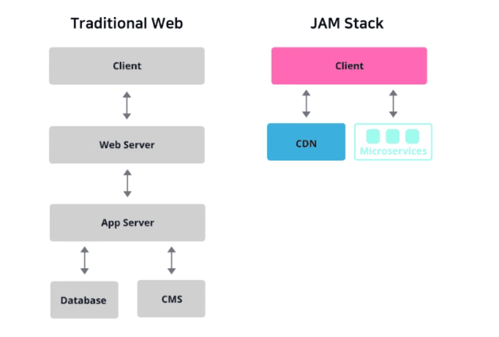
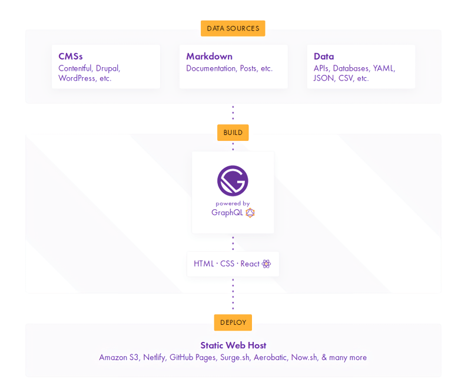

## 들어가며
개발을 시작하며 나만의 기술 블로그를 만들고 싶었다. 
간단히 notion을 사용하여 정리를 하고 있었지만 마음에 내키지 않고, 정리 또한 되지 않았다
내가 해왔던 언어가 아닌 새로운 언어를 통해 만들고자 하였고 편의성을 고려하여 Gatsby를 사용하여 블로그를 만들었다.
그리하여.. 블로그의 첫게시물은 블로그를 만들게 해준 Gatsby에 대하여 작성 하고자 한다.

## Gatsby란 무엇일까...?
Gatsby는 JAM Stack을 활용한 정적 사이트 생성기라고 한다.  
Gatsby JS는 가공할 정보를 GraphQL에서 가져와서 빌드 시점에 정적 페이지를 만들어 내는 방식이며,
그래프 형태의 데이터 인터페이스를 제공한다.
데이터 노드를 구성한다. 프리셋인 플러그인을 통해 확장할 수도 있고.구성한 데이터를 GraphQL로 쿼리 해서 페이지 코드에서 사용한다.
먼저 Gatsby를 알아보고자 한다면 JAM stack에 대해 무엇인지 알아보자

## JAM stack 이란.. ?
JAM Stack(JavaScript, API, Markup Stack)은 JavaScript, API, HTML이나 CSS 등을 칭하는 Markup으로 이루어진 웹 구성 방법이다.

JAM Stack(JavaScript, API, Markup Stack) 으로 홈페이지를 만든다는 것이 기존 웹사이트와 어떤 차이점이 있을까?

  

전통적인 웹사이트의 방식은 서버에서 Database 또는 CMS(Content Management System)로부터 추출한 데이터를 프론트엔드에 보여주는 방식이다. 많은 절차를 거쳐야 하기 때문에 구조가 복잡하다.
이와는 다르게 JAM Stack을 이용한 방식은 매우 간단하다.
마크업 요소들과 다양한 API를 통해 만든 정적 웹 사이트를 Pre-Render한 것을 CDN(Content Delivery Network)을 통해 웹 사이트를 열람할 수 있다.
  

그래서 JAM Stack은 다음과 같은 장점을 가진다.
- 기존 방식에 비해 더 빠르게 웹 사이트를 제공할 수 있다.
대부분의 웹 사이트는 첫 접속 시, 서버를 통해 데이터를 받아와 렌더링하는 과정이 필요하다.
JAM Stack은 렌더링할 화면들을 모두 Pre-Render하여 제공되기 때문에 사용자에게 화면을 보여주기 위해 준비하는 시간을 단축할 수 있기 때문에 더 좋은 사용자경험을 제공할 수 있다.

-  안전한 웹 사이트를 제공할 수 있다.
JAM Stack은 API를 통해 정적 사이트를 생성하는데, 이 API는 각 프레임워크에서의 마이크로 서비스로 사이트 생성을 위한 프로세스가 추상화되어 있다. 따라스 그만큼 공격 노출 범위가 감소하게 된다.

- 스케일링하기 쉬운 웹 사이트를 제공할 수 있다.
정적 웹 사이트에서의 스케일링은 더 많은 지역에서 홈페이지를 제공할 수 있게 하는 의미이다.
미리 빌드 된 파일 제공을 담당하는 CDN이 그 역할을 충분히 수행해낼 수 있다고 한다.

### Gatsby를 왜 사용할까...?
4가지 대표적인 Jam Stack기반 프레임워크에는 Next, Gatsby, Nuxt, Jekyll이 있다.
다운로드 수는 Next.js가 제일 많으며 그 다음은 Gatsby가 많다.
나도 처음엔 왜 대세인 NextJS가 아닌 Gatsby를 쓰는 것일까 의아했다.

그 이유는, 두 프레임워크 사용 용도가 다르기 때문이었다.
Next.js는 정적 사이트 생성의 기능도 가지고 있지만 주로, 서버 사이드 렌더링을 위해 사용하는 프레임워크이다.
서버와 통신을 하면서 요청이 있을시마다 동적으로 웹 사이트를 생성한다.

그러나 Gatsby는 서버 없이 오로지 정적 사이트 생성을 위해 사용하는 프레임워크이다.
그리하여여 Gatsby는 주로 소개 페이지나 블로그 등에 사용된다.

### Gatsby 구조
확인할 수 있는 Data Sources, Build, Deploy 세 개의 단계로 알아 볼 수 있다.

  
 
- Data Sources
블로그나 웹사이트를 만들려면 데이터가 필요합니다. 이 데이터를 가져오는 곳을 Gatsby에서는 데이터 소스라고 부른다.
여기서 데이터 소스는 위에 JAM Stack에서 살펴본 거처럼 Wordpress 같은 CMS 도구가 될 수도 있고 다른 정적 사이트 생성기처럼 Markdown 파일이 될 수도 있고 API 등을 통해서 다른 곳에서 가져올 수도 있다.

- Build
Gatsby는 플러그인 시스템이 잘 되어 있어서 다양한 데이터 소스에서 데이터를 가져올 수 있다.
Gatsby는 기본적으로 GraphQL을 사용해서 데이터 소스에서 데이터를 가져온다.
플러그인을 이용해서 RESTful API에서 데이터를 가져올 수도 있지만 GraphQL이 Gatsby에 포함되어 있어서 GraphQL을 사용하면 훨씬 쉽게 쓸 수 있고 원하는 데이터를 선택해서 가져올 수 있다.
웹 사이트는 React를 이용해서 만들고, 코드는 React를 이용해서 컴포넌트 작성하듯이 사용하지만, 공통 레이아웃을 관리하거나 페이지를 생성하거나 데이터 소스와 컴포넌트를 연결하는 기능을 Gatsby에서 제공하고 있어서 쉽게 만들 수 있다.

- Deploy
이를 빌드하면 정적 사이트로 만들어 준다.
여기서 SPA가 아닌 정적 사이트로 만드는 부분이 중요하다. CMS나 파일 등의 데이터 소스에서 GraphQL로 가져온 데이터를 빌드할 때 모두 가져와서 정적 파일의 데이터로 포함된다..
SPA라면 API로 가져오는 로직이 소스에 들어있고 사용자가 SPA 사이트를 실행할 때 API로 가져오게 되지만 Gatsby는 정적 사이트를 만들어주므로 빌드 시에 GraphQL로 데이터를 가져와서 빌드된 배포 파일에 포함된다.
그러므로 사이트를 운영할 때 데이터 소스로 이용한 API 서버나 파일은 제공하지 않아도 되고, 이 부분이 다른 도구들과 Gatsby의 가장 큰 차이점이다.

---