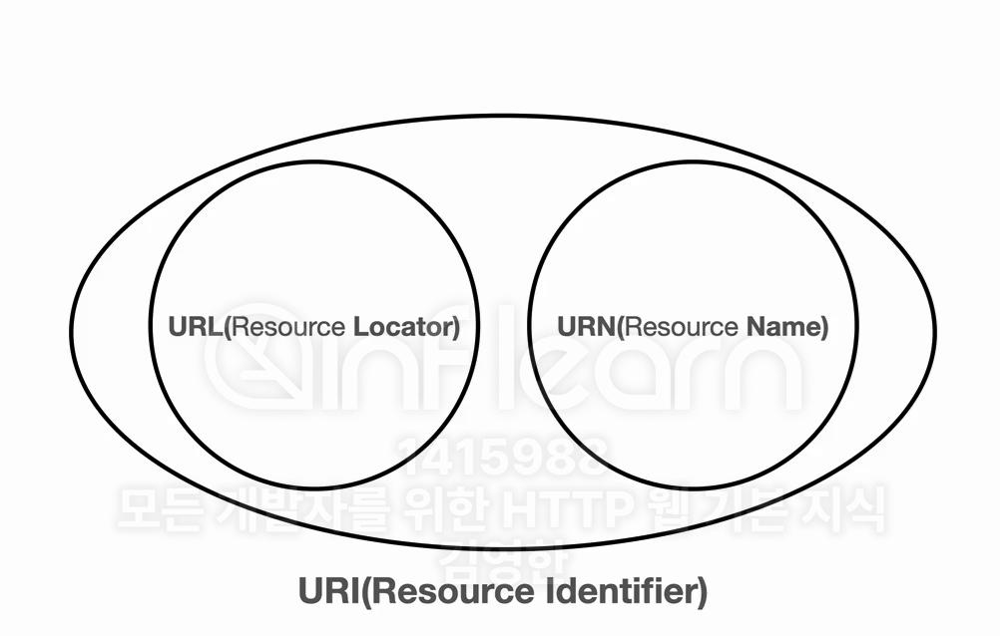
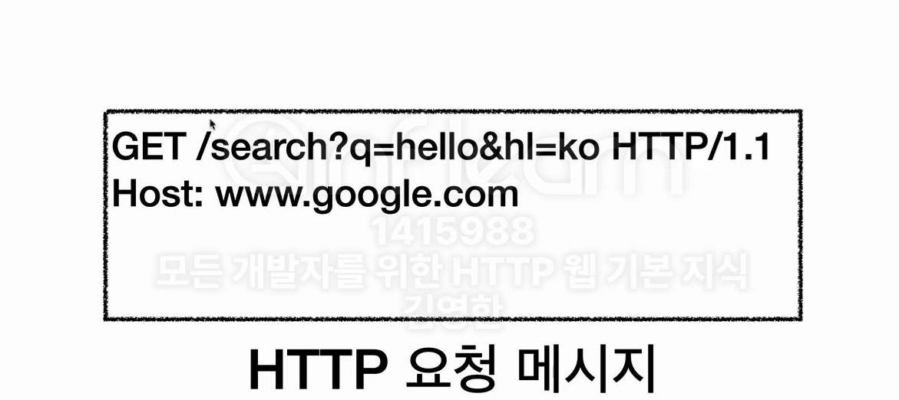
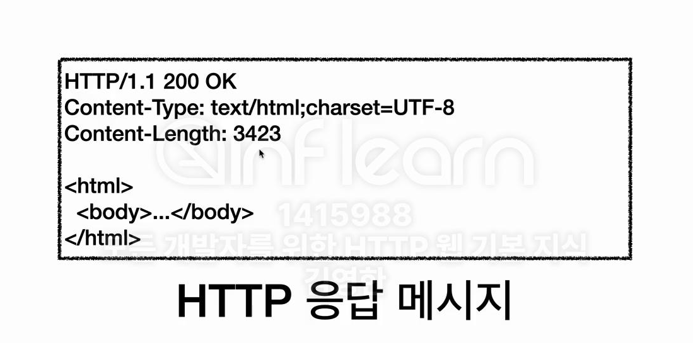

## 들어가며

네트워크의 핵심 개념인 DNS와 URI에 대해 자세히 알아보겠습니다. 이들은 웹 서비스 개발에서 매우 중요한 역할을 하는 기술입니다.

## DNS(Domain Name System)

IP 주소는 숫자로 이루어져 있어 기억하기 어렵고 변경될 가능성이 있습니다. DNS는 이러한 문제를 해결하기 위해 사용자 친화적인 도메인 이름을 IP 주소로 변환해주는 시스템입니다.

### DNS 서버 예시

| 도메인명 | IP |
|:---:|:---:|
| google.com | 200.200.200.2 |

DNS 서버는 위와 같이 도메인 이름과 IP 주소의 매핑 정보를 관리합니다. IP 주소가 변경되더라도 사용자는 동일한 도메인 이름으로 접근할 수 있습니다.

## URI(Uniform Resource Identifier)

URI는 인터넷 상의 자원을 고유하게 식별하기 위한 통합 자원 식별자입니다.

### URI의 구성 요소

- **Uniform**: 리소스를 식별하는 통일된 방식
- **Resource**: 식별 가능한 모든 자원
- **Identifier**: 자원을 구분하기 위한 식별 정보

URI는 URL과 URN을 포함하는 상위 개념입니다.



## URL(Uniform Resource Locator)

URL은 인터넷 상에서 자원의 위치를 나타내는 주소입니다.

### URL 문법 구조

기본 형식:
```
scheme://[userinfo@]host[:port][/path][?query][#fragment]
```

예시:
```
https://www.google.com/search?q=hello&hl=ko
```

### URL 구성 요소 설명

- **scheme**: 프로토콜 지정 (http, https, ftp 등)
- **userinfo**: 사용자 정보 (거의 사용하지 않음)
- **host**: 도메인명 또는 IP 주소
- **port**: 서버 포트 번호 (생략 가능)
- **path**: 리소스 경로 (계층적 구조)
- **query**: 쿼리 파라미터 (?key=value 형식)
- **fragment**: 문서 내 북마크 (#)

## URN(Uniform Resource Name)

URN은 자원의 이름을 기반으로 식별하는 방식입니다. 현재는 실제 사용이 제한적이며, 대부분의 웹 서비스는 URL을 사용합니다.

## 웹 브라우저 요청 흐름

웹 브라우저에서 URL을 입력했을 때의 처리 과정:

1. **DNS 조회**
   - 도메인 이름을 IP 주소로 변환

2. **HTTP 메시지 생성**
   

3. **TCP/IP 패킷 생성**
   - 소켓 라이브러리를 통한 데이터 전달
   - TCP/IP 프로토콜을 사용한 패킷 생성

4. **서버 처리**
   - 패킷 수신 및 HTTP 메시지 해석
   - 요청 처리

5. **HTTP 응답 생성**
   
   - 상태 코드
   - 컨텐츠 타입
   - 인코딩 정보
   - 컨텐츠 길이 등

6. **클라이언트 처리**
   - 응답 패킷 수신
   - HTML 렌더링

---