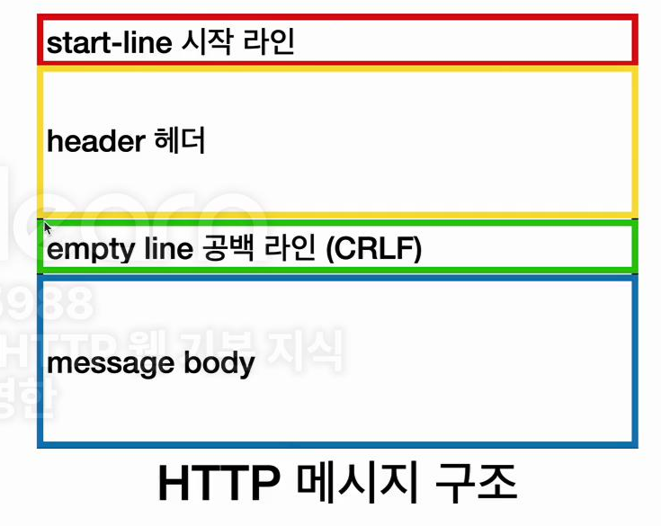

## 들어가며
실제로 프로젝트에서 자주 언급이 되는 HTTP에 대하여 본격적으로 파악해보자

---

> Http는 `HyperText Transfer Protocol` 로 Html, Text ,Image,음성,영상,파일
JSON,XML (API) 등 거의 모든 형태의 데이터 전송하는 프로토콜이다.

심지어 서버간 데이터를 주고 받을 때도 대부분 HTTP 사용 하고, 대다수가 Http 통신을 주로 사용한다. 

## HTTP 역사 ...?
HTTP는 연도 별로 성능 개선 및 업데이트를 지원해 왔다.

- HTTP/0.9 초창기엔 Get 메서드만 지원, 헤더 X 
- HTTP/1.0 메서드, 헤더 추가 및 
- HTTP/1.1 가장 많이 사용 됐고 가장중요한 버전 
- HTTP/2 성능 개선 
- HTTP/3 진행중 : TCP 대신에 UDP 사용, 성능 개선 

>기반 프로토콜  
>TCP : HTTP/1.1, HTTP/2   
>UDP: HTTP/3 (속도 때문에 )
>현재 HTTP/1.1 주로 사용 
>HTTP/2 , HTTP/3 도 점점 증가 

## HTTP 특징

1. 클라이언트 서버 구조로 주로 사용된다.
2. 무상태 프로토콜(스테이스리스),비연결성 중요
3. HTTP 메시지 통하여 통신
4. 단순함, 확장 가능  

  
  
##### 1.  클라이언트 서버 구조 
일반적으로 서버는 대기 하고, 클라이언트는 http 요청 메시지 만들어서 요청 > 서버는 요청에 대한 응답 하는 구조이다.

기본적으로 서버와 클라이언트 분리는 중요 하다...  
구조란..?

>서버엔 데이터 및 비즈니스 로직 위주
>클라이언트는 UI/UX 집중 

``이렇게 분리가 되어 있어야 독립적으로 진화가능(ex. 대용량 트래픽고려시 서버만 고민하면 된다.) ``
  

##### 2. 무상태 프로토콜(스테이스리스),비연결성 중요
일반적으로 HTTP 통신은 무상태 프로토콜 지향한다.
무상태라는 것은 `스테이스리스(stateless)`를 뜻하는데데

`스테이스리스(stateless)`는 서버가 클라이언트의 상태 보존하지 않는것을 말한다.
계속해서 상태에 대하여 언급을 하여 알 수 있게 하고, 필요한 데이터를 그대로 적재적소에 통신 할 수 있다.

`상태 유지 (stateful)`는 ㄴ 서버가 클라이언트의 이전 상태를 계속 문맥을 보존하는것 
중간에 컨텍스트 문맥이 바뀌면 오류가 날 가능성이있음, 항상 같은서버에 유지가 되어야 한다.

`스테이스리스(stateless)` 와 `상태 유지 (stateful)` 차이

>상태 유지: 중간에 다른 문맥으로 바뀌면 안된다.(바뀐 정보를 미리알려줘야함)
>무상태: 중간에 다른 문맥으로 바뀌어도 되고 , 클라이언트 요청이 증가해도 서버를 대거 투입 가능 
>무상태는 응답서버를 쉽게 바 꿀 수 있다.-> 무한한 서버 증설 가능 

`상태 유지 (stateful)`는
항상 같은서버에 유지가 되어야 한다.
중간에 서버가 장애나면? 처음부터 다시 시작해야한다. 
`스테이스리스(stateless)`는 아무서버나 호출해도됨(상태를 보관하지 않는다.) 
서버가 장애가 나도 상관없이 없어진다. 이러한 특성으로 스케일 아웃 - 수평 확장 유리하다.

#### 스테이스리스(stateless) 한계
모든것을 무상태로 설계 할 수 있고 없을 수 있다. 
`스테이스리스(stateless)` 
예) 로그인이 필요 없는 단순한 서비스 소개 화면 

`상태 유지 (stateful)`
예 ) 로그인 
로그인한 사용자의 경우 로그인 했다는 상태를 서버에 유지(브라우저 쿠키+ 서버 세션) 
상태 유지는 최소한만 사용도록 설계를 해야한다.

`스테이스리스(stateless)` 의 단점 - 너무 많은 데이터를 전송해야한다.(문맥상 어떤것을 원하는지 계속 전달행야한다.)

> 웹어플리케이션 설계는 최대한 무상태로 설계하되, 어쩔수 없는 경우만 상태 유지로 설계한다.

### 비연결성
`TCP/IP`는 일반적으로 계속 연결을 한다. (클라이언트와 서버)
그렇지만 연결을 하지 않는 모델도 있다. 클라이언트와 서버 통신시에만 연결하고 이후엔 연결 끊음 서버입장에선 자원을 최소한으로 줄일 수 있다.(요청시 재연결)  

>비연결성
HTTP는 기본이 연결을 유지하지 않는 모델이다. 일반적으로 초단위의 이하의 빠른 속도 응답하기 떄문이고 이로써 서버 자원을 매우 효율적으로 사용 할 수 있다.

##### 한계와 극복
`TCP/IP` 연결을 새로 맺어야함 -`3 way hanshake` 시간 추가되어 늦어지게 되는 단점이 존재한다. 
웹 브라우저로 사이트를 요청하려면 html뿐 아니라 자바스크립,css,추가이미지 등 수 많은 자원 이 함께 다운로드 된다. 
그리하여... 현잰  지금은 HTTP  지속 연결(Persistent Connections)로 변경 (기본적인 적용)

##### HTTP  지속 연결(Persistent Connections)
왠만한 html 요청받을땐 다른 자원 받을때 까지 지속적으로 연결 해놓는다.

### Http 메시지 
> HTTP 메시지는 클라이언트와 서버에서 요청 및 응답을 해줄때 서로 전송하는 메시지 라고 생각하면 간단하다. 

`요청 메시지` 및 `응답 메시지`
    

`요청 메시지 ` 와 `응답 메시지 ` 구조가 다르다

    
헤더 및 공백 라인이 있음 (공백라인은 무조건 사용해야함)

##### `요청 메시지` 의 구조
- 요청메시지 시작라인
- 요청헤더
- 요청 바디(데이터 담기는 영역)

##### `응답 메시지` 구조
- 시작라인 
- 헤더값
- 바디
- http 응답바디 (보통 html이 들어가있음)

### 요청 메시지
##### 시작라인
start-line = request-line /statues-line 
request-line = method SP(공백) request-target SP HTTP-version CRLF(엔터)

HTTP 메서드(GET:조회), 요청 대상(/search?q=hello&hl=ko), HTTP Version  구조로 되어 있고, HTTP 메서드 종류 GET,POST,PUT,DELETE 가 있다.

HTTP 메서드는 서버가 수행해야할 동작 지정한는 것이라고 생각하면 된다.
> GET:리소스 조회(계속 달라고만 하는것) 
>POST: 요청 내역 처리 

##### 요청 대상 
absolute-path[?query](절대경로)

##### 마지막은 HTTP 버전
마지막은 HTTP 버전의 정보가 들어간다.

### 응답메시지

##### 시작라인
start=line/status-line,HTTP 버전,HTTP 상태코드 : 요청 성공, 실패를 나타냄 
HTTP 상태코드 종류
- 200:성공
- 400:클라이언트 요청 오류
- 500:서버 내부 오류
- 이유문구 : 사람이 이해할 수 있는 짧은 코드 설명 글 

##### HTTP 헤더 
HTTP 전송에 필요한 모든 부가정보 
예) 메시지 바디의 내용, 메시지 바디의 크기,압축,인증,요청 클라이언트 정보 , 서버 애플리케이션 정보, 캐시 관리 정보 

표준 헤더가 너무 많고 ,프로젝트에서 임의적으로 협의 및 필요시 임의의 헤더 추가 가능하다.

##### HTTP 메시지 바디 
실제 전송할 데이터 가 들어가있음
HTML 문서,이미지,영상,JSON 등등 byte로 표현할 수있는 모든 데이터 전송 가능 

### 끝으로...
HTTP 맟 HTTP 메시지는 사용및 구조가 매우 간단하다. 그렇기 때문에 확장 가능성도 열려 있고, 그래서 대다수의 사람들이 사용하는게 아닐까 싶다.

---