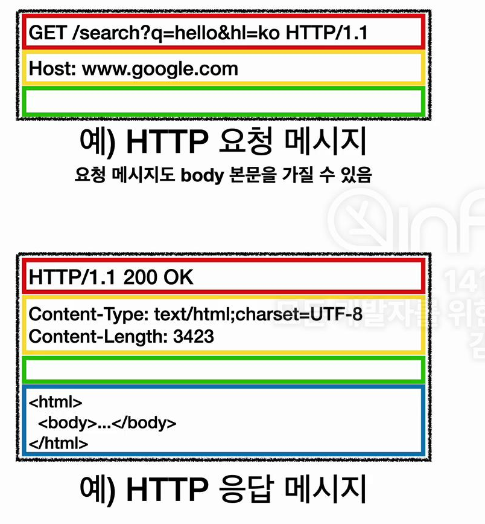

## 들어가며
HTTP는 웹에서 가장 널리 사용되는 프로토콜이다. HTML, 텍스트, 이미지, 음성, 영상, 파일, JSON, XML(API) 등 거의 모든 형태의 데이터를 전송할 수 있으며, 서버 간 통신에서도 주로 사용된다.

## HTTP의 역사
HTTP는 시간이 지남에 따라 지속적으로 발전해왔다:

- **HTTP/0.9**: 초기 버전으로, GET 메서드만 지원했다
- **HTTP/1.0**: 메서드와 헤더가 추가되었다
- **HTTP/1.1**: 가장 널리 사용되는 중요 버전이다
- **HTTP/2**: 성능 개선에 중점을 두었다
- **HTTP/3**: UDP 기반으로 성능을 개선하고 있다

### 기반 프로토콜
- TCP: HTTP/1.1, HTTP/2를 사용한다
- UDP: HTTP/3가 성능 개선을 위해 사용한다

## HTTP의 주요 특징

### 1. 클라이언트-서버 구조
- **서버**: 데이터와 비즈니스 로직을 담당한다
- **클라이언트**: UI/UX에 집중한다
- **장점**: 각각 독립적으로 발전할 수 있다 (서버 확장성도 별도로 고려할 수 있다)

### 2. 무상태성(Stateless)과 비연결성

#### 무상태성(Stateless)
- 서버가 클라이언트의 상태를 보존하지 않는다
- 각 요청이 독립적으로 처리된다
- 서버 확장성이 증가한다

#### 상태 유지(Stateful)와의 비교
- **상태 유지**: 이전 맥락 유지가 필요하며, 서버 종속성이 있다
- **무상태**: 자유로운 서버 확장이 가능하고 가용성이 높다

#### 무상태성의 한계
- 로그인 등 상태 유지가 필요한 상황이 존재한다
- 많은 데이터 전송이 필요하다

### 3. 비연결성(Connectionless)
- 요청-응답 후 연결을 종료한다
- 서버 자원을 효율적으로 사용한다
- HTTP/1.1부터 지속 연결(Persistent Connections)을 도입했다

#### 지속 연결(Persistent Connections)
- 특정 시간 동안 연결을 유지한다
- 여러 리소스 요청에 효율적이다

## HTTP 메시지 구조

### 요청 메시지

1. **시작 라인**
   - HTTP 메서드를 지정한다
   - 요청 대상을 명시한다
   - HTTP 버전을 표시한다

2. **헤더**
   - 요청에 대한 부가 정보를 포함한다

3. **본문**
   - 전송할 데이터를 포함한다

### 응답 메시지

1. **상태 라인**
   - HTTP 버전을 표시한다
   - 상태 코드를 포함한다
   - 상태 메시지를 전달한다

2. **헤더**
   - 응답에 대한 부가 정보를 포함한다

3. **본문**
   - 전송되는 데이터를 포함한다

### 주요 상태 코드
- **200**: 요청이 성공했다
- **400**: 클라이언트 요청에 오류가 있다
- **500**: 서버 내부에 오류가 발생했다

## HTTP 헤더
다양한 부가 정보를 전달한다:
- 메시지 바디 정보를 포함한다
- 크기와 압축 방식을 명시한다
- 인증 정보를 전달한다
- 클라이언트/서버 정보를 포함한다
- 캐시 제어 정보를 설정한다

## 마치며
HTTP는 단순하면서도 확장성이 높은 프로토콜이다. 이러한 특성으로 인해 웹의 기본 프로토콜로 자리잡았으며, 계속해서 발전하고 있다.

---