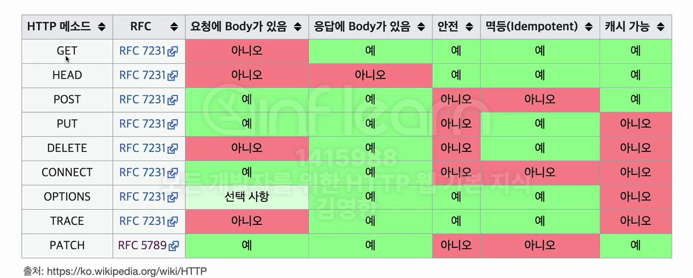

## 들어가며
HTTP 메서드는 웹 API 설계의 핵심 요소이다. 이번 글에서는 각 HTTP 메서드의 특징과 올바른 사용법에 대해 자세히 알아본다.

## URI 설계와 리소스

### 리소스의 개념
리소스는 웹에서 식별 가능한 모든 것을 의미한다. 예를 들어, '회원'이라는 개념에서 '등록', '수정', '조회' 등의 행위가 아닌 '회원' 자체가 리소스이다.

### URI 설계 원칙
1. **리소스 중심 설계**
   - URI는 리소스만 식별한다
   - 행위는 HTTP 메서드로 표현한다

2. **계층 구조 활용**
   - 예: `/members/{id}`와 같이 구성한다
   - 리소스 구조를 명확하게 표현한다

## HTTP 메서드 상세

### 1. GET
- **목적**: 리소스를 조회한다
- **특징**:
  - 쿼리 파라미터로 데이터를 전달한다
  - 메시지 바디 사용을 권장하지 않는다

### 2. POST
- **목적**: 요청 데이터를 처리한다
- **사용 사례**:
  1. 새로운 리소스를 생성한다
  2. 프로세스를 처리한다
  3. 복잡한 조회를 수행한다

### 3. PUT
- **목적**: 리소스를 생성하거나 완전히 대체한다
- **특징**:
  - 클라이언트가 리소스 URI를 지정한다
  - 기존 리소스를 완전히 대체한다
  - 없으면 새로 생성한다

### 4. PATCH
- **목적**: 리소스를 부분적으로 수정한다
- **특징**:
  - 리소스의 일부분만 변경한다
  - 원본을 유지하면서 수정한다

### 5. DELETE
- **목적**: 리소스를 제거한다
- **특징**:
  - 클라이언트가 URI를 지정한다
  - 리소스를 완전히 제거한다

## 기타 메서드
- **HEAD**: GET과 동일하나 바디를 제외한다
- **OPTIONS**: 지원하는 메서드를 확인한다
- **CONNECT**: 프록시 터널과 연결한다
- **TRACE**: 요청 메시지를 그대로 반환한다

## HTTP 메서드 속성

### 1. 안전성(Safe Methods)
- **정의**: 리소스를 변경하지 않는 메서드를 의미한다
- **해당 메서드**: GET, HEAD가 이에 해당한다
- **주의**: 리소스 외의 영향(로그 등)은 고려하지 않는다

### 2. 멱등성(Idempotent)
- **정의**: f(f(x)) = f(x)와 같이 여러 번 호출해도 결과가 동일하다
- **해당 메서드**:
  - GET: 조회 결과가 항상 동일하다
  - PUT: 같은 내용으로 여러 번 대체해도 결과가 같다
  - DELETE: 여러 번 삭제해도 한 번 삭제한 것과 같다
- **활용**: 자동 복구 매커니즘에 사용한다

### 3. 캐시 가능성(Cacheable)
- **캐시 가능한 메서드**:
  - GET을 주로 캐시한다
  - HEAD도 캐시할 수 있다
  - POST도 가능하나 실제로는 잘 사용하지 않는다
  - PATCH도 가능하나 거의 사용하지 않는다

## 실무 적용 가이드
1. **리소스 설계를 우선한다**
   - 리소스를 먼저 식별한다
   - URI는 리소스 중심으로 설계한다

2. **메서드 선택 기준**
   - 조회는 GET을 사용한다
   - 생성은 POST를 사용한다
   - 전체 수정은 PUT을 사용한다
   - 부분 수정은 PATCH를 사용한다
   - 삭제는 DELETE를 사용한다

3. **애매한 경우**
   - POST 사용을 검토한다
   - REST 컨트롤러 URI를 고려한다

---