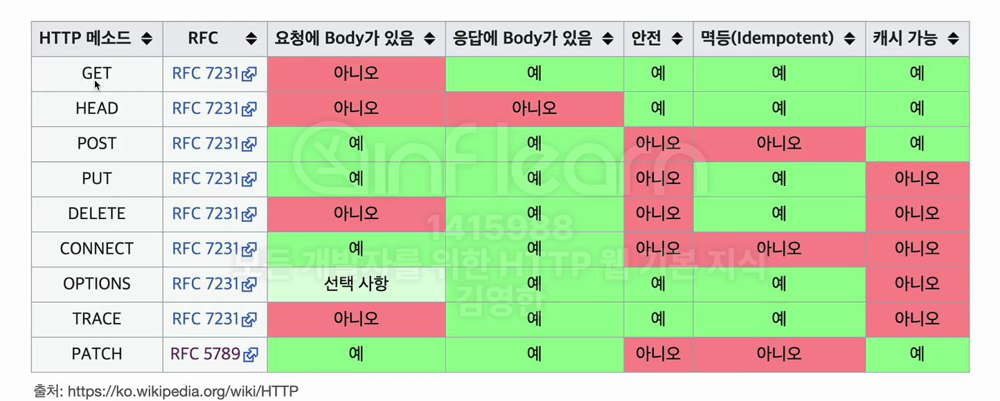

## 들어가며
주에 한번 스터디 그룹을 시작햇다. 너무 그동안 블로그 글을 작성하지 못하여 이 기회에 매주 한개의 게시물을 작성을 목표로 세우고 시작해보고자 한다. 

---
HTTP 메서드에 대하여 이번에 알아보고자 한다.
먼저 URI 설계에 대하여 생각을 해보자. 

회원 등록이라는 서비스의 URI를 설계한다고 가정한다.

##### 리소스란 뭘까...? 
회원 등록하고 수정하고 조회하는게 리소스스가 아니다 회원 근본 자체가 리소스 이다. 

##### 리소스 어떻게 식별하면 좋을까? 
회원이라는 리소스만 식별하면 된다. -> 회원 리소스를 URI 매핑 
> 보통 URI는 계층 구조 활용
> ex) 회원 목록 조회/members/{id} 형태로 구분 
 
***URI를 설계할때 리소스와 행위를 분리하는 것은 중요하다***  
URI는 리소스로만 식별 하는것을 권장한다.
- URI는 리소스만 식별
- 리소스와 해당 리소스를 대상으로 하는 행위를 분리
- 리소스: 회원
- 행위: 조회,등록,삭제,변경 

> 행위는 어떻게 구분? HTTP 메서드르 구분 가능하다. 

## HTTP 메서드 종류 

- GET: 리소스 조회 
- POST: 요청 데이터 처리,주로 등록에 사용
- PUT: 리소스를 대체, 해당 리소스가 없으면 생성
- PATCH: 리소스 부분 변경 
- DELETE: 리소스 삭제

## 기타 메서드 
- HEADER: GET과 동일하지만 메시지 부분을 제외하고,상태 줄과 헤더만 반환
- OPTIONS: 대상 리소스에 대한 통신 가능 옵션(메서드)을 설명(주로 CORS에서 사용)
- CONNECT 대상 자원으로 식별되는 서버에 대한 터널을 설정
- TRACE:대상 리소스에 대한 경로를 따라 메시지 루프백 테스트를 수행

### GET 메서드(조회용)
1. 리소스 조회
서버에 전달하고 싶은 데이터는 query(쿠러 파라미터,쿼리 스트링)를 통해서 전달
메시지 바디를 사용해서 데이터를 전달할 수 있지만, 지원하지 않는 곳이 많아서 권장하지 않음

    

2. 진행과정
클라이언트에서 메시지 생성 및 전달 -> 서버 확인 -> 응답 메시지 만들어서 전달

### POST 메서드(다른 메서드 대체가능(무적형))
1. 요청 데이터 처리 
메시지 바디를 통해 서버로 요청 데이터 저ㄴ달
2. 서버는 요청 데이터를 처리
메시지 바디를 통해 들어온 데이터를 처리하는 모드 기능을 수행한다.
3. 메시지 바디를 통해 들어온 데이터를 처리하는 모드 기능을 수행한다.
주로 전달된 데이터로 신규 리소스 등록,프로세스 처리에 사용
4. 진행과정
요청 메시지 전달 -> 신규 리소스 생성 -> 응답메시지 생성 및 전송(GET 과의 차이점은 상태코드 및 path 등 추가되서 전송된다.)

##### 요청 데이터를 어떻게 처리하는 것인가
스펙: POST 메서드는 대상 리소스가 리소스의 고유 한 의미 체계에 따라 요청에 포함된 표현을 처리하도록 요청합니다,

예시) HTML에서 필드와 같은 데이터 블록을 데이터 처리 프로세스에 제공 

##### 정리
1. 새 리소스 생성(등록)
   ㄴ서버가 아직 식별하지 않은 새 리소스 생성

2. 요청 데이터 처리
 ㄴ단순히 데이터를 생성하거나,변경하는 것을 넘어서 프로세스를 처리해야하는 경우 
예) 주문에서 결제완료 -> 배달 시작 -> 배달 완료 처럼 단순히 값 변경을 넘어 프로세스의 상태가 변경되는 경우 
예) POST/orders/{orderId}/start-delivery(컨트롤 URI) 
보통 URI 설계시 동사가 들어가지 않고 리소스로만 하면 이상적이지만 실무에선 아닌 경우 도 존재할 수 있음

3. 다른 메서드로 처리하기 애매한 경우
예) JSON 으로 조회데이터룰 넘겨야 하는데, GET 메서드를 사용하기 어려운경우 
애매 하면 POST 쓰자

### PUT(리소스생성 및 대체)
1. 리소스를 대체
리소스가 있으면 대체
리소스가 없으면 생성
쉽게 이야기해서 덮어버림

2. 중요 클라이언트가 리소스를 식별
클라이언트가 리소스 위치를 알고 URI 지정
- POST와 차이점 
클라이인트가 리소스 전체 URI를 알고 지정을해버린다.(클라이언트가 리소스 식별)

3. 진행과정
리소스 지정해서 서버로 메시지 보냄
서버에서 요청 메시지 받아 대체 (완전히 대체) 없으면 신규생성 

***클라이언트에서 요청보낸 리소스에 대해서만 변경이 됨*** 
예) 클라이언트에서 {age :50} 전송 -> 서버 리소스 {ex:1 age:30} 인 리소스가 {age :50}으로 대체됨

>주의사항은은 리소스가 완전히 대체해 버려서 update와는 맞지가 않고 insert 만 >해야할듯 

### PATCH (업데이트)
1. 리소스 부분 변경
클라이언트에서 요청보낸 리소스에 대해서만 변경이 됨 

> 클라이언트에서 {age :50} 전송 -> 서버 리소스 {ex:1 age:30} 인 리소스가 {ex:1 age:50}으로 변경됨

### DELETE 
1. 리소스 제거 
-클라이언트가 리소스 위치를 알고 URI 지정하여 요청 보내면 실제 데이터 가 지워진다. 

> 리소스변경시에 PATCH 가 안되는 경우도 있는데 그런 경우에는 POST 메소드 사용하면 
> 된다, 결국 POST 메서드는 무적이라고 생각하자 .

## HTTP 메서드의 속성
    

### 안전(safe)
호출해도 리소스를 변경하지 않는다. 
그래서 계속 호출해서, 로그 같은게 쌓여서 장애가 발생한다면?
안전은 해당 리소스만 고려한다. 그런 부분까지 고려하지 않는다. 

### 멱등 (idempotent)
f(f(x)) = f(x)
한번 호출하든 두번 호출하든 100번 호출하든 결과가 똑같아야함
멱등 메서드 
> GET: 한번 조회하든, 두번 조회하든 같은 결과가 조회된다. 
> PUT: 결과를 대체한다. 따라서 같은 요청을 여러번 해도 최종 결과는 같다.
> DELETE: 결과를 삭제한다. 같은 요청을 여러번해도 삭제된 결과는 똑같다. 
- POST 멱등이 아니다. 두번 호출하면 같은 결제가 중복해서 발 생 할 수있다. 

- 활용 
 자동 복구 매커니즘 (요청시 서버 응답없을때 똑같은 요청을 다시보냄 -> 괜찮음 멱등하기에) 
 서버가 TIMEOUT 등으로 정상 응답을 못주었을 떄, 클라이언트가 같은 요청을 다시 해도되는가> 판단 근거

- 주의사항
멱등 : 재요청 중간에 다른 곳에서 리소스를 변경해버리면? (멱둥은 외부 요인으로 중간에 리소스가 변경되는 것 까지는 고려하지는 않는다,) 

### 캐시가능 cacheable

##### 응답 결과 리소스를 캐시해서 사용해도 되는가 ..?
GET, HEAD, POST,PATCH 캐시 가능 

> 실제로는 GET,HEAD 정도만 캐시로 사용
> POST, PATCH는 본문 내용까지 캐시 키로 고려해야 하는데, 구현이 쉽지 않음

---