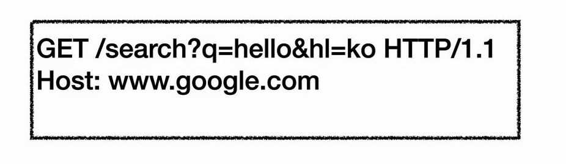

## 들어가며

HTTP 메서드는 웹 API 설계의 핵심 요소입니다. 이번 글에서는 각 HTTP 메서드의 특징과 올바른 사용법에 대해 자세히 알아보겠습니다.

## URI 설계와 리소스

### 리소스의 개념

리소스는 웹에서 식별 가능한 모든 것을 의미합니다. 예를 들어, '회원'이라는 개념에서 '등록', '수정', '조회' 등의 행위가 아닌 '회원' 자체가 리소스입니다.

### URI 설계 원칙

1. **리소스 중심 설계**
   - URI는 리소스만 식별
   - 행위는 HTTP 메서드로 표현

2. **계층 구조 활용**
   - 예: `/members/{id}`
   - 명확한 리소스 구조화

## HTTP 메서드 상세

### 1. GET

- **목적**: 리소스 조회
- **특징**:
  - 쿼리 파라미터로 데이터 전달
  - 메시지 바디 사용 권장하지 않음

### 2. POST

- **목적**: 요청 데이터 처리
- **사용 사례**:
  1. 새 리소스 생성
  2. 프로세스 처리
  3. 복잡한 조회 요청

### 3. PUT

- **목적**: 리소스 생성 또는 완전한 대체
- **특징**:
  - 클라이언트가 리소스 URI 지정
  - 기존 리소스 완전 대체
  - 없으면 생성

### 4. PATCH

- **목적**: 리소스 부분 수정
- **특징**:
  - 리소스 일부만 변경
  - 원본 유지하면서 수정

### 5. DELETE

- **목적**: 리소스 제거
- **특징**:
  - 클라이언트가 URI 지정
  - 리소스 완전 제거

## 기타 메서드

- **HEAD**: GET과 동일하나 바디 제외
- **OPTIONS**: 지원 메서드 확인
- **CONNECT**: 프록시 터널 연결
- **TRACE**: 요청 메시지 루프백

## HTTP 메서드 속성

### 1. 안전성(Safe Methods)

- **정의**: 리소스를 변경하지 않는 메서드
- **해당 메서드**: GET, HEAD
- **주의**: 리소스 외 영향(로그 등) 미고려

### 2. 멱등성(Idempotent)

- **정의**: f(f(x)) = f(x)
- **해당 메서드**:
  - GET: 조회 결과 동일
  - PUT: 대체 결과 동일
  - DELETE: 삭제 결과 동일
- **활용**: 자동 복구 매커니즘

### 3. 캐시 가능성(Cacheable)

- **캐시 가능 메서드**:
  - GET
  - HEAD
  - POST (실제 잘 사용되지 않음)
  - PATCH (실제 잘 사용되지 않음)

## 실무 적용 가이드

1. **리소스 설계 우선**
   - 리소스를 먼저 식별
   - URI는 리소스 중심으로 설계

2. **메서드 선택 기준**
   - 조회: GET
   - 생성: POST
   - 완전한 수정: PUT
   - 부분 수정: PATCH
   - 삭제: DELETE

3. **애매한 경우**
   - POST 활용 검토
   - REST 컨트롤러 URI 고려

---