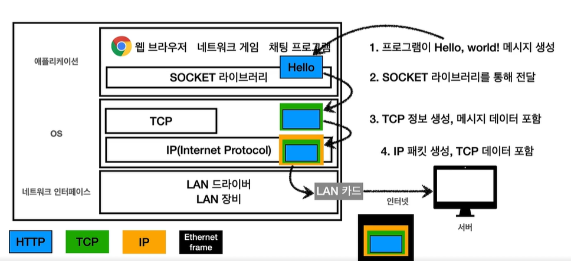
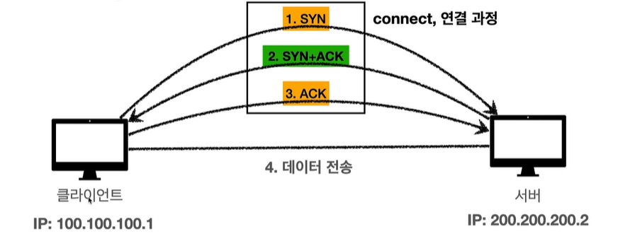

## 들어가며
Http 가 뭔지 제대로 알지도 못하면서 프로젝트를 경험했을때 아는듯 이야기한적이 많았다. 이번 기회에 Http, 네트워크 개념을 정리하면서 복기 할 수 있도록 정리를 해보자.

---

먼저 HTTP를 알아보기전에 네트워크에 대한 것 부터 알아보도록 하자.  
  
## 네트워크 ...?
클라이언트와 서버가 분리된 상황에서 인터넷 망을 통해서 서로 통신을 한다. (붙어있다면 쉽게 케이블로 연결 했다고도 한다.)

#### IP(인터넷 프로토콜)
IP주소를 바탕으로 클라이언트와 서버는 통신한다(지정한 IP 주소로 데이터전달)
http 메시지를 IP패킷으로 으로 한번 감싸 현재 IP 및 목적지 IP를 입력하여 서로 통신이 가능하게 된다.

>ps. 패킷이란...? 
패키지 (수화물 ) + 버킷 의 합성어 뭔가 담는 의미를 담은 단어

##### IP 프로토콜의 한계

- 비연결성( 있다고 가정하고 던지기 때문)-> 실제 IP가없어도 던질수 있기때문
- 비신뢰성 (신뢰 불가능) -> 소실 될수 있음 서버를 계속 거치기 떄문 
- 패킷 전달 순서 문제 발생 가능(패킷이 클경우 짤라서 보내는데, 인터넷 서버는 순간순간 노드를 바꿀수있기때문)
- 프로그램 구분이 가능한지(동일한 IP가 있다면) 

### 그러면 어떤것을 써야 하나...?

상단의 이유들과 같이 IP만을 사용하는 것은 안정성 측면에서 문제가 많아보인다. 현시점엔 이러한 IP의 단점들을 보완하고자 TCP 를 주로 사용한다.

> TCP는 전송 제어 프로토콜(Transmission Control protocol)이라고 한다. 

인터넷 프로토콜 4계층 
- 애플리케이션 계층- HTTP,FTP
- 전송계층 - TCP,UDP 
- 인터넷 계층 -IP 
- 네트워크 인터페이스 계층

  

전체적인 프로세스 흐름
프로그랭임 메시지 생성 -> TCP 가 한번 본인의 정보 감싸고 -> IP가 또한번 감쌈(IP 패킷 생성)-> 네트워크 인터페이스(LAN 드라이버)

여기서 말하는 TCP는 IP와는 별개로로 PORT 와 전송 제어, 순서 정보를 담아둔다. 이에 대한 정보들은 다음의 장점을 가진다.

##### TCP 장점

- TCP 3 way handshake()
클라이언트와 서버 둘다 연결이 됐는지 미리 요청을 보낸다.(syc,ark 서로 미리 요청하여 연결 확인)
그 후에 데이터를 전송을 하여 신뢰성이 생긴다.
중요한건 TCP 3 way handshake 물리적 연결이 아니라 가상연결(논리적 연결)인 부분이다. 

  

- 데이터 전달 보증
클라이언트에서 데이터를 보내면 서버에선 해당 전송에대한 응답을 보낸다. 

- 순서보장 
패킷을 잘라서 보냈을때, 순서대로 오지 않거나 오지 않은 패킷이 존재할 때 다시 클라이언트로 잘못된 패킷부터 보내라고 재요청한다.

>이러한 이유는 TCP에는 전송 제어 정보 ,순서정보,port 등이 포함되어 있기때문이다. 

### 그러면 UDP는 뭘까..?

사용자 데이터그램 프로토콜 로 딱히 IP 보다 나은 이점이 없다.
IP와의 차이점은 PORT 정보를 들고 있는것 뿐이다.
  
 #### UDP 장점
TCP는 인증 검증 단계때문에 안정적이지만 속도를 개선하기 어렵다. 
UDP 는 아무것도 안되어있기 때문에 사용자가 커스텀해서 더빠르게 사용 할 수 있다.  
  

>최근은 UDP가 뜬다 이유는..?
최근엔 TCP 통신과정이 복잡하기 떄문에 더 최적화 해보자하여 UDP를 사용하여 커스텀 하는 추세이다.  
  

### PORT에 대하여....
하나의 IP에서 둘이상의 서버에 연결해야한다면? 
그 통신에 맞게 구분을 해줘야하는데 구분을 해주는것이 PORT 라고 생각하면 된다. 

패킷정보에 출발IP,도착IP,출발 PORT,도착 PORT 의 정보를 담고있어서 하나의 클라이언트 아이피에서 여러 어플리케이션(서버)에 통신을 구분지어서 가능한것 

> 비유를 하자면, 하나의 아파트는 IP라고 생각하면 되고, port는 그안의 몇동 몇호 라고 생각하면 이해하기가 쉽다.

보통적으로 포트는 0 ~ 65535 할당 가능하지만 0 ~ 1023은 잘알려진 포트라 피하는게 좋다.
- FTP - 20,21
- TELNET - 23 
- HTTP - 80
- HTTPS -443 

대표적으로 많이 사용 된다.

---