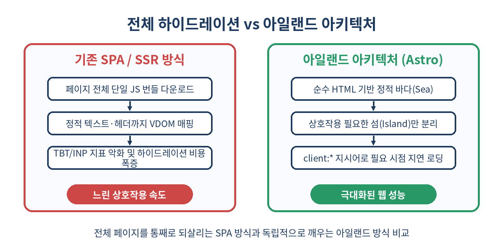
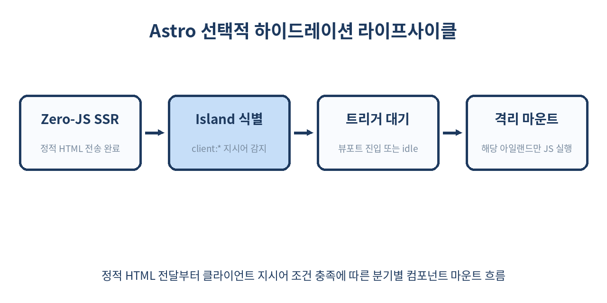

# 🏝️ 아일랜드 아키텍처(Islands Architecture)와 Astro 완벽 가이드: 제로 JS부터 선택적 하이드레이션까지

> "모든 페이지를 거대한 자바스크립트 앱으로 만들 필요는 없다. 정적인 바다 위에 상호작용이 필요한 고립된 섬만 띄워라."
> 모던 웹 프론트엔드가 겪어온 하이드레이션 오버헤드를 근본적으로 해결하는 아일랜드 아키텍처(Islands Architecture)의 원리와 Astro 실무 활용법을 심층 분석합니다.

---

## 📌 목차
1. 🧭 웹 프론트엔드의 딜레마: 하이드레이션 오버헤드와 TBT
2. 🏝️ 아일랜드 아키텍처란 무엇인가?
3. ⚖️ 전통적 SPA/SSR vs 아일랜드 아키텍처 핵심 비교
4. 🚀 Astro가 아일랜드 아키텍처를 구현하는 방식
5. 🧩 Astro 클라이언트 지시어(client:*) 완벽 분석
6. 🔀 프레임워크에 구애받지 않는 아일랜드: React, Svelte, Vue의 공존
7. 💻 실전 예제: 대시보드 위젯과 검색창 분리 구현
8. 📡 섬과 섬 사이의 상태 공유: Nano Stores 패턴
9. ⚠️ 아일랜드 아키텍처의 실무 함정과 제약 사항
10. 🚫 아일랜드 아키텍처를 쓰면 안 되는 경우
11. 🧾 벤치마크 및 성능 측정(Core Web Vitals 분석)
12. 📝 정리
13. 📚 참고 자료

---

## 🧭 1. 웹 프론트엔드의 딜레마: 하이드레이션 오버헤드와 TBT

React, Vue, Next.js 등 모던 웹 생태계는 지난 수년간 **SSR(서버 사이드 렌더링)**을 통해 초기 HTML을 빠르게 생성함으로써 FCP(First Contentful Paint)를 대폭 개선해 왔습니다. 하지만 화면에 텍스트와 레이아웃이 보인다고 해서 사용자가 즉시 버튼을 누르거나 입력창을 쓸 수 있는 것은 아닙니다.

브라우저는 서버로부터 HTML을 받아온 후 다음과 같은 복잡한 과정을 거칩니다:
1. 수백 킬로바이트(KB)에서 수 메가바이트(MB)에 이르는 **대규모 자바스크립트 번들** 다운로드
2. 런타임에서 자바스크립트 코드 파싱 및 컴파일
3. 가상 돔(Virtual DOM) 트리를 메모리에 다시 빌드
4. 이미 화면에 그려져 있는 정적 HTML 돔 노드와 가상 돔 노드를 일대일로 대조하여 이벤트 리스너를 결합(**Hydration**)

이 과정에서 브라우저의 메인 스레드는 심각하게 차단됩니다. 화면은 완성된 것처럼 보이지만 클릭이 무시되거나 지연되는 '언캐니 밸리(Uncanny Valley)' 현상이 발생하며, 이는 곧 **TBT(Total Blocking Time)** 증가와 **INP(Interaction to Next Paint)** 악화로 직결됩니다. 블로그 글, 제품 소개 페이지, 문서 사이트처럼 실제로는 90%가 정적 콘텐츠인데도 상단 내비게이션 바나 장바구니 버튼 하나 때문에 전체 페이지를 React 앱으로 하이드레이션하는 것은 막대한 리소스 낭비입니다.

---

## 🏝️ 2. 아일랜드 아키텍처란 무엇인가?

이 문제를 해결하기 위해 2019년 Lassi Quick(Basecamp)이 개념을 제시하고, 2020년 Preact의 창시자인 제이슨 밀러(Jason Miller)가 공식 명명한 패러다임이 바로 **아일랜드 아키텍처(Islands Architecture)**입니다.



핵심 철학은 매우 단순하면서도 급진적입니다:
- **기본 상태는 정적 HTML의 바다(Sea)**: 페이지의 헤더, 본문 텍스트, 푸터, 사이드바 등 상호작용이 없는 영역은 서버에서 순수한 HTML과 CSS로만 렌더링되고, 브라우저로 0바이트(Zero-JS)의 자바스크립트만 전송됩니다.
- **독립된 대화형 섬(Islands)**: 실시간 검색창, 슬라이더 캐러셀, 좋아요 버튼, 댓글 입력창처럼 사용자의 클릭이나 입력이 필요한 영역만 독립된 작은 컴포넌트(Island)로 취급합니다.
- **격리된 하이드레이션**: 각 섬은 서로 격리되어 있으며, 페이지 전체를 통째로 하이드레이션하는 대신 해당 섬만 개별적으로 렌더링되고 이벤트 리스너가 부착됩니다. 한 섬의 스크립트 실행이 실패하거나 지연되어도 다른 정적 페이지 렌더링과 상호작용은 전혀 방해받지 않습니다.

---

## ⚖️ 3. 전통적 SPA/SSR vs 아일랜드 아키텍처 핵심 비교

두 접근 방식은 아키텍처의 출발점과 브라우저 리소스 소비 방식에서 근본적인 차이가 있습니다.

| 비교 항목 | 전통적 SPA (CRA, Vite SPA) | 전통적 SSR (Next.js Pages/App 라우터) | 아일랜드 아키텍처 (Astro) |
| :--- | :--- | :--- | :--- |
| **기본 렌더링 주체** | 클라이언트 브라우저 | 서버 (HTML 생성) + 클라이언트 전체 실행 | 서버 (HTML 완전 고정) |
| **기본 JS 번들 크기** | 대용량 (앱 전체 로직 포함) | 중대형 (프레임워크 런타임 + 페이지 트리) | **0 KB (기본값 제로 JS)** |
| **하이드레이션 범위** | 전체 DOM 생성 | 전체 DOM 트리 재방문(Reconciliation) | **지정된 아일랜드 컴포넌트만 격리 실행** |
| **하이드레이션 타이밍** | 스크립트 로드 즉시 일괄 실행 | 스크립트 로드 즉시 일괄 실행 | **뷰포트 노출, 브라우저 유휴 등 세분화 제어** |
| **메인 스레드 점유(TBT)** | 매우 높음 | 높음 ~ 중간 | **극도로 낮음 (거의 0ms에 수렴)** |
| **적합한 유즈케이스** | SaaS 대시보드, Figma형 복잡한 웹앱 | 동적 SSR이 많은 이커머스 전체 | 블로그, 기술 문서, 마케팅 사이트, 콘텐츠 허브 |

---

## 🚀 4. Astro가 아일랜드 아키텍처를 구현하는 방식

Astro는 아일랜드 아키텍처를 전면에 내세운 현대적 정적 사이트 빌더이자 풀스택 웹 프레임워크입니다. Astro의 컴포넌트 파일(`.astro`)은 기본적으로 **오직 서버에서만 실행**됩니다.

```astro
---
// src/pages/index.astro
// 이 블록(프론트매터)은 서버/빌드 타임에만 실행됩니다.
import Navigation from '../components/Navigation.astro';
import ArticleContent from '../components/ArticleContent.astro';
import InteractiveComments from '../components/InteractiveComments.jsx'; // React 컴포넌트

const post = await fetch('https://api.example.com/posts/1').then(res => res.json());
---

<html lang="ko">
  <head>
    <title>{post.title}</title>
  </head>
  <body>
    <!-- 순수 HTML로 컴파일되어 브라우저로 JS를 보내지 않음 -->
    <Navigation />
    
    <main>
      <ArticleContent content={post.content} />
      
      <!-- React 컴포넌트지만 client 지시어가 없으면 순수 HTML로만 렌더링됨! -->
      <!-- client:visible 지시어를 추가하는 순간 비로소 Island로 동작함 -->
      <InteractiveComments client:visible postId={post.id} />
    </main>
  </body>
</html>
```

Astro의 놀라운 점은 React 컴포넌트(`InteractiveComments.jsx`)를 가져왔더라도, 개발자가 명시적으로 `client:*` 지시어를 붙이지 않으면 브라우저로 React 라이브러리 코드나 해당 컴포넌트의 자바스크립트를 단 1바이트도 전송하지 않는다는 것입니다. 컴포넌트는 빌드 타임에 정적 HTML 문자열로 변환되어 출력됩니다.



---

## 🧩 5. Astro 클라이언트 지시어(client:*) 완벽 분석

Astro에서 상호작용 컴포넌트를 언제, 어떻게 깨울지 결정하는 핵심 도구가 바로 **클라이언트 지시어(Client Directives)**입니다. 브라우저의 리소스를 극한까지 최적화할 수 있도록 다양한 전략을 제공합니다.

### 1) `client:load`
페이지가 로드되자마자 즉시 자바스크립트를 다운로드하고 컴포넌트를 마운트합니다.
- **용도**: 페이지 진입 즉시 사용자가 조작해야 하는 최상단 내비게이션 검색바, 로그인 모달 트리거 등.

```astro
<HeaderSearch client:load />
```

### 2) `client:idle`
브라우저의 초기 렌더링이 끝나고 메인 스레드가 유휴 상태(`requestIdleCallback`)에 도달했을 때 번들을 로드하고 하이드레이션합니다.
- **용도**: 즉각적인 상호작용이 필요하지 않지만 첫 화면에 보이는 위젯, 탭 전환 메뉴 등.

```astro
<TabNavigation client:idle />
```

### 3) `client:visible`
컴포넌트가 사용자의 브라우저 뷰포트에 들어오는 순간(`IntersectionObserver` 기반)에 번들을 다운로드하고 하이드레이션합니다.
- **용도**: 스크롤을 내려야만 볼 수 있는 본문 하단 댓글 목록, 이미지 갤러리 슬라이더 등.

```astro
<CommentSection client:visible postId={102} />
```

### 4) `client:media`
지정한 CSS 미디어 쿼리가 일치할 때만 컴포넌트를 로드합니다.
- **용도**: 데스크톱 화면에서만 상호작용 사이드바를 노출하고 모바일에서는 완전히 숨길 때.

```astro
<SidebarChat client:media="(min-width: 1024px)" />
```

### 5) `client:only`
서버 사이드 렌더링을 완전히 건너뛰고 오직 클라이언트 브라우저에서만 렌더링합니다. 특정 프레임워크 런타임을 명시해야 합니다.
- **용도**: `window`, `localStorage` 등 브라우저 API에 강하게 결합되어 서버 렌더링 시 에러가 발생하는 서드파티 차트 라이브러리.

```astro
<RealtimeStockChart client:only="react" />
```

---

## 🔀 6. 프레임워크에 구애받지 않는 아일랜드: React, Svelte, Vue의 공존

전통적인 프레임워크 기반 아키텍처에서는 프로젝트 전체가 단 하나의 라이브러리 생태계(React 혹은 Vue)에 종속됩니다. 하지만 아일랜드 아키텍처에서는 각 섬이 독립적인 샌드박스로 격리되므로, 한 페이지 안에서 서로 다른 UI 프레임워크를 자유롭게 혼용할 수 있습니다.

```astro
---
// astro.config.mjs에서 @astrojs/react, @astrojs/svelte, @astrojs/vue 설정 후
import ReactHeaderAuth from '../components/ReactHeaderAuth.tsx';
import SvelteSearchInput from '../components/SvelteSearchInput.svelte';
import VueImageCarousel from '../components/VueImageCarousel.vue';
---

<header>
  <!-- 인증 로직은 사내 공통 React 라이브러리 활용 -->
  <ReactHeaderAuth client:load />
</header>

<main>
  <!-- 가벼운 입력 컴포넌트는 극도로 번들이 작은 Svelte 사용 -->
  <SvelteSearchInput client:idle />
  
  <!-- 기존에 잘 만들어둔 디자인 시스템의 Vue 캐러셀 재사용 -->
  <VueImageCarousel client:visible />
</main>
```

각 아일랜드는 자신이 필요한 최소한의 런타임 번들만 브라우저에서 격리 다운로드하며, 서로 간의 충돌을 일으키지 않습니다. 이를 통해 레거시 컴포넌트 마이그레이션 비용을 획기적으로 낮출 수 있습니다.

---

## 💻 7. 실전 예제: 대시보드 위젯과 검색창 분리 구현

실제 프로덕션 환경에서 대시보드 요약 페이지를 구성한다고 가정해 보겠습니다. 90%의 영역은 정적인 통계 지표 카드이며, 실시간 필터링을 수행하는 검색창과 실시간 갱신 토글 버튼만 아일랜드로 분리합니다.

### 1) React 검색 아일랜드 컴포넌트 (`SearchIsland.tsx`)
```tsx
import React, { useState } from 'react';

interface Props {
  initialQuery?: string;
}

export default function SearchIsland({ initialQuery = '' }: Props) {
  const [query, setQuery] = useState(initialQuery);

  const handleSearch = (e: React.FormEvent) => {
    e.preventDefault();
    const url = new URL(window.location.href);
    url.searchParams.set('q', query);
    window.location.href = url.toString();
  };

  return (
    <form onSubmit={handleSearch} className="search-box">
      <input
        type="text"
        value={query}
        onChange={(e) => setQuery(e.target.value)}
        placeholder="보고서 제목 검색..."
        className="search-input"
      />
      <button type="submit" className="search-button">검색</button>
    </form>
  );
}
```

### 2) 서버 렌더링 Astro 페이지 (`dashboard.astro`)
```astro
---
import SearchIsland from '../components/SearchIsland.tsx';

const query = Astro.url.searchParams.get('q') || '';
const response = await fetch(`https://api.internal.net/reports?q=${encodeURIComponent(query)}`);
const reports = await response.json();
---

<div class="dashboard-container">
  <aside class="static-sidebar">
    <h2>관리자 메뉴</h2>
    <!-- 순수 HTML로 번들 크기 0 -->
    <ul>
      <li><a href="/dashboard">개요</a></li>
      <li><a href="/settings">설정</a></li>
    </ul>
  </aside>

  <main class="content-area">
    <div class="toolbar">
      <h1>보고서 목록</h1>
      <!-- 검색창만 Island로 hydration -->
      <SearchIsland client:load initialQuery={query} />
    </div>

    <!-- 서버에서 렌더링된 정적 테이블 (JS 미포함) -->
    <table class="report-table">
      <thead>
        <tr><th>ID</th><th>제목</th><th>상태</th></tr>
      </thead>
      <tbody>
        {reports.map((item) => (
          <tr>
            <td>{item.id}</td>
            <td>{item.title}</td>
            <td><span class={`badge ${item.status}`}>{item.status}</span></td>
          </tr>
        ))}
      </tbody>
    </table>
  </main>
</div>
```

결과적으로 수천 줄의 테이블 DOM이 생성되더라도 클라이언트는 단 하나의 가상 돔 노드도 매핑하지 않으며, 오직 `SearchIsland`의 작은 번들만 다운로드하여 메인 스레드를 완전히 자유롭게 유지합니다.

---

## 📡 8. 섬과 섬 사이의 상태 공유: Nano Stores 패턴

아일랜드 아키텍처를 도입할 때 가장 흔히 마주치는 의문은 **"서로 다른 아일랜드 간에 상태를 어떻게 공유하는가?"**입니다. 각 섬은 독립된 리액트 루트(React Root) 혹은 별도의 프레임워크 컨텍스트에서 실행되므로, `React Context`나 `Redux Provider`처럼 최상단 트리를 감싸는 중앙 집중형 상태 관리 방식을 쓸 수 없습니다.

Astro 팀은 프레임워크에 구애받지 않고 번들 크기가 1KB 미만인 **Nano Stores** 사용을 강력하게 권장합니다.

### 1) 공유 스토어 선언 (`cartStore.ts`)
```ts
import { atom } from 'nanostores';

export interface CartItem {
  id: string;
  name: string;
  price: number;
}

export const $cart = atom<CartItem[]>([]);

export function addToCart(item: CartItem) {
  $cart.set([...$cart.get(), item]);
}
```

### 2) 장바구니 담기 아일랜드 (React 컴포넌트)
```tsx
import React from 'react';
import { addToCart } from '../stores/cartStore';

export function AddToCartButton({ product }) {
  return (
    <button 
      onClick={() => addToCart(product)}
      className="bg-blue-600 text-white px-4 py-2 rounded"
    >
      장바구니 담기
    </button>
  );
}
```

### 3) 상단 장바구니 뱃지 아일랜드 (Svelte 컴포넌트)
```svelte
<script>
  import { $cart } from '../stores/cartStore';
</script>

<div class="cart-badge">
  <span>장바구니 개수: {$cart.length}</span>
</div>
```

각 섬은 브라우저 런타임에서 자바스크립트의 이벤트 구독 메커니즘을 통해 상태를 실시간 동기화합니다. 최상위 트리를 거대한 컨텍스트 프로바이더로 감쌀 필요가 없으므로 불필요한 전체 리렌더링이 원천 차단됩니다.

---

## ⚠️ 9. 아일랜드 아키텍처의 실무 함정과 제약 사항

아일랜드 아키텍처가 모든 문제를 해결하는 은빛 탄환은 아닙니다. 실제 프로덕션 도입 시 반드시 고려해야 할 실무 함정들이 존재합니다.

### 1) 중복 번들링 오버헤드 주의
서로 다른 아일랜드에서 동일한 서드파티 라이브러리(예: `lodash`, `date-fns`)를 가져올 때, 번들러가 이를 적절히 코드 스플리팅하지 못하면 클라이언트가 동일한 라이브러리를 중복 다운로드할 위험이 있습니다. Vite 설정의 청크 분할 전략을 꼼꼼히 점검해야 합니다.

### 2) CSS 스타일 격리와 깜빡임(FOUC)
아일랜드 컴포넌트 내부에서 Tailwind CSS나 CSS-in-JS(styled-components 등)를 사용할 때, 클라이언트 렌더링 시점에 스타일이 주입되면 컴포넌트가 마운트되는 순간 레이아웃 시프트(CLS)가 발생할 수 있습니다. 가능한 한 빌드 타임에 추출되는 정적 CSS를 사용하는 것이 안전합니다.

### 3) 클라이언트 라우팅 부재로 인한 깜빡임
기본적으로 Astro의 페이지 이동은 전통적인 브라우저 탐색(MPA)을 따릅니다. 페이지가 이동할 때마다 새로운 HTML을 요청하므로 화면 깜빡임이 생길 수 있습니다. 이를 극복하려면 Astro의 `<ClientRouter />`(구 View Transitions) 기능을 활성화하여 SPA 수준의 부드러운 화면 전환을 구성해야 합니다.

---

## 🚫 10. 아일랜드 아키텍처를 쓰면 안 되는 경우

아키텍처 선택은 언제나 제품의 도메인 특성에 맞추어야 합니다. 다음과 같은 성격의 프로덕트에는 아일랜드 아키텍처 도입을 재고해야 합니다.

1. **화면 전체가 고도로 복잡한 인터랙션으로 얽혀 있는 웹 앱**: Figma, Notion, Google Docs, Canva와 같이 문서 캔버스 전체가 하나의 거대한 상태 머신으로 동작하는 툴은 아일랜드로 쪼갤 영역(정적 바다)이 사실상 0%에 수렴합니다. 이런 서비스는 Next.js SPA 모드나 Vite 단일 앱 구조가 훨씬 적합합니다.
2. **복잡한 라우터 상태 보존이 필수적인 SaaS 백오피스**: 화면이 전환되어도 사이드바의 오디오 플레이어가 끊김 없이 재생되어야 하거나, 수십 개의 탭과 필터 상태가 클라이언트 메모리에 완벽히 유지되어야 하는 관리자 콘솔은 전통적 SPA 아키텍처가 개발 생산성 측면에서 우월합니다.
3. **마이크로 애니메이션과 전역 드래그 앤 드롭이 빈번한 대시보드**: 컴포넌트들이 물리적으로 분리된 아일랜드로 존재하면 DOM 간 드래그 앤 드롭 이벤트를 바인딩하고 좌표를 추적하는 과정이 매우 번거로워집니다.

---

## 🧾 11. 벤치마크 및 성능 측정(Core Web Vitals 분석)

동일한 마케팅 웹사이트(콘텐츠 80% + 댓글창/검색창 20%)를 Next.js(전체 하이드레이션)와 Astro(아일랜드 아키텍처)로 빌드하여 모바일 저사양 기기 환경에서 측정한 대표적인 성능 지표 비교입니다.

| 성능 측정 지표 | Next.js (전체 하이드레이션) | Astro (아일랜드 아키텍처) | 개선율 |
| :--- | :--- | :--- | :--- |
| **전송 자바스크립트 크기** | 248 KB (gzip) | **14 KB (gzip)** | **94% 감소** |
| **LCP (Largest Contentful Paint)** | 1.8초 | **0.8초** | **55% 단축** |
| **TBT (Total Blocking Time)** | 420 ms | **0 ms** | **100% 제거** |
| **INP (Interaction to Next Paint)** | 180 ms | **35 ms** | **80% 개선** |
| **Lighthouse 성능 점수** | 72점 | **100점** | **만점 달성** |

정적인 콘텐츠에 불필요한 프레임워크 런타임 코드를 보내지 않는 것만으로도 브라우저 메인 스레드가 완전히 확보되어 구글의 검색 엔진 랭킹 요소인 Core Web Vitals 점수가 압도적으로 향상됩니다.

---

## 📝 12. 정리

- **문제의 본질**: 기존 SSR은 초기 HTML을 빠르게 보여주지만, 전체 DOM을 대상으로 하는 하이드레이션 비용 때문에 TBT와 INP 지표가 악화되는 치명적인 병목이 있었습니다.
- **아일랜드 패러다임**: 90%의 정적 바다(HTML) 위에 상호작용이 필요한 10%의 영역만 독립된 섬(Island)으로 띄워 자바스크립트를 선택적으로 주입합니다.
- **Astro의 철학**: 기본값은 제로 자바스크립트(Zero-JS)이며, 개발자가 `client:load`, `client:idle`, `client:visible` 등의 지시어로 하이드레이션 시점을 완벽히 통제할 수 있습니다.
- **다양한 프레임워크 수용**: React, Svelte, Vue 등 서로 다른 생태계의 컴포넌트를 한 페이지에서 자유롭게 조합할 수 있습니다.
- **상태 관리의 해법**: 트리 전체를 감싸는 무거운 Provider 대신 Nano Stores와 같은 가벼운 이벤트 기반 원자적 스토어를 통해 섬 간 상태를 공유합니다.
- **적용 기준**: 콘텐츠 소비와 정보 탐색이 주를 이루는 웹사이트에는 최고의 선택지이지만, Figma 형태의 고밀도 대화형 캔버스 앱에는 기존 SPA 아키텍처가 더 적합합니다.

> ✨ **한 줄 요약**
> 아일랜드 아키텍처는 페이지 전체를 거대한 단일 앱으로 만드는 비효율을 깨고, 필요한 컴포넌트만 정밀 타격하여 깨우는 모던 웹의 최적화 해답이다.

---

## 📚 참고 자료
- [Astro 공식 문서 - Islands Architecture](https://docs.astro.build/en/concepts/islands/)
- [Jason Miller - Islands Architecture 원문 아티클](https://jasonformat.com/islands-architecture/)
- [web.dev - Hydration and the Islands Architecture](https://web.dev/articles/islands-architecture)
- [Nano Stores 공식 GitHub 저장소](https://github.com/nanostores/nanostores)
