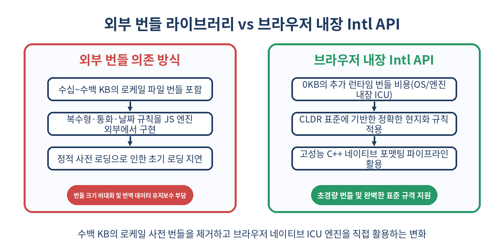
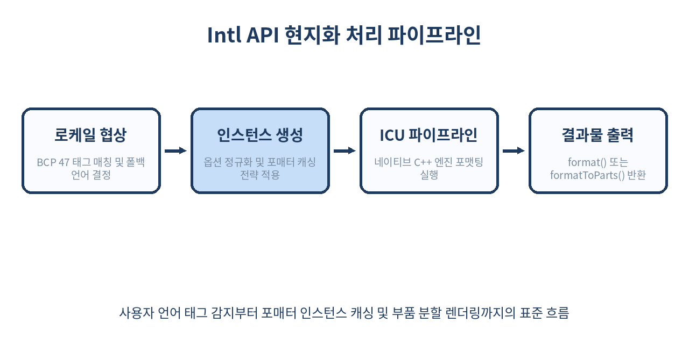

# 🌍 국제화(i18n)와 JavaScript Intl API 완벽 가이드

> "언어 번역(Translation)은 국제화(Internationalization)의 작은 일부분일 뿐이다."
> 모던 브라우저에 내장된 `Intl` 네임스페이스를 통해 번들 크기 0KB로 통화, 날짜, 복수형, 목록 서식, 텍스트 분절까지 완벽하게 현지화하는 방법을 살펴봅니다.

---

## 📌 목차
1. 🌐 국제화(i18n)의 본질과 왜 `Intl` API인가?
2. 🏛️ ECMAScript 국제화 API와 ICU/CLDR 표준
3. 🏷️ BCP 47 언어 태그와 로케일 협상(Locale Negotiation)
4. 📅 `Intl.DateTimeFormat`: 날짜와 시간의 완벽한 현지화
5. 💵 `Intl.NumberFormat`: 통화, 단위, 백분율, 콤팩트 표기
6. ⏳ `Intl.RelativeTimeFormat`: "방금 전", "3일 후" 상대 시간 처리
7. 🔢 `Intl.PluralRules`: 언어별 복수형(Pluralization) 규칙의 마법
8. 📜 `Intl.ListFormat`: "A, B, 그리고 C" 자연스러운 목록 연결
9. 🔤 `Intl.Collator` & `Intl.Segmenter`: 다국어 정렬과 텍스트 분절
10. 🏷️ `Intl.DisplayNames` & `Intl.DurationFormat`: 최신 표준 확장
11. 🧩 `formatToParts()`와 UI 스타일링 연계 기법
12. ⚡ 성능 최적화: 포매터 인스턴스 재사용과 메모이제이션
13. ⚠️ 실무 함정과 플랫폼별 주의사항 (Node.js vs 브라우저)
14. 🚫 언제 내장 `Intl`만으로 부족하고 외부 도구가 필요할까?
15. 🧾 정리

---

## 🌐 1. 국제화(i18n)의 본질과 왜 `Intl` API인가?

글로벌 웹 서비스를 구축할 때 많은 프론트엔드 엔지니어들이 가장 먼저 하는 실수는 단순 '문자열 사전(Key-Value Dictionary)' 라이브러리만을 도입하는 것입니다. 하지만 실제 사용자가 경험하는 언어권별 차이는 단순히 단어를 번역하는 것에 그치지 않습니다.

- **날짜 표기**: 미국은 `월/일/년`, 유럽 대부분은 `일/월/년`, 한국과 일본은 `년. 월. 일.`을 사용합니다.
- **숫자와 소수점**: 한국과 미국은 쉼표를 천 단위 구분자로, 마침표를 소수점으로 쓰지만(`1,234.56`), 독일과 프랑스는 이를 반대로 씁니다(`1.234,56`).
- **복수형 규칙**: 영어는 단수(1)와 복수(2 이상)의 2단계이지만, 아랍어는 0, 단수, 쌍수, 소수, 다수, 기타 등 6단계의 복수형 규칙을 가집니다.
- **목록 나열**: 한국어는 "A, B 및 C", 영어는 "A, B, and C", 프랑스어는 "A, B et C"로 연결 조사가 완전히 다릅니다.

과거에는 이러한 처리를 위해 `Moment.js`, `date-fns`, `numeral.js`, `i18next`의 무거운 플러그인들을 모조리 번들에 포함해야 했습니다. 그 결과 수백 킬로바이트에 달하는 로케일 데이터가 클라이언트 번들을 잠식했습니다.



JavaScript의 `Intl` 객체는 ECMAScript 402 표준 명세로 브라우저와 Node.js에 기본 내장되어 있습니다. 추가적인 번들 다운로드 없이 운영체제와 런타임이 제공하는 가장 신뢰할 수 있는 다국어 처리 엔진을 직접 호출할 수 있습니다.

---

## 🏛️ 2. ECMAScript 국제화 API와 ICU/CLDR 표준

브라우저 벤더들은 어떻게 전 세계 수천 개 언어의 문법과 표기 규칙을 알고 있을까요? 그 비밀은 **CLDR(Common Locale Data Repository)**과 **ICU(International Components for Unicode)** 프로젝트에 있습니다.

| 구성 요소 | 역할 | 실체 |
| :--- | :--- | :--- |
| **CLDR** | 유니코드 컨소시엄에서 관리하는 전 세계 언어/문화권 표기 데이터베이스 | 방대한 XML 기반 로케일 사전 |
| **ICU** | C/C++ 및 Java 기반의 국제화 지원 핵심 라이브러리 | V8, JavaScriptCore, SpiderMonkey 내장 |
| **ECMAScript 402** | ICU의 강력한 기능을 JavaScript 개발자에게 노출하는 W3C/TC39 표준 규격 | `Intl` 전역 네임스페이스 |

우리가 `Intl.NumberFormat('ko-KR')`을 호출할 때 자바스크립트 엔진은 별도의 스크립트 파일을 다운로드하는 것이 아니라, C++ 수준에서 브라우저 바이너리에 컴파일되어 있는 ICU 엔진을 직접 실행합니다. 따라서 연산 속도가 압도적으로 빠르며 메모리 효율이 뛰어납니다.

---

## 🏷️ 3. BCP 47 언어 태그와 로케일 협상(Locale Negotiation)

`Intl` API의 모든 생성자는 첫 번째 인자로 **BCP 47 언어 태그(Language Tag)**를 받습니다.

```text
[language]-[script]-[region]-[extension]
  ko         Kore      KR       -u-nu-hanidec
```

### BCP 47 기본 구조와 실무 예시
- `ko`: 언어(한국어)
- `ko-KR`: 언어-지역(대한민국 한국어)
- `en-US`: 미국 영어
- `en-GB`: 영국 영어
- `zh-Hans-CN`: 중국 간체(한족 스크립트, 중국 본토)
- `zh-Hant-TW`: 중국 번체(대만)
- `ja-JP-u-ca-japanese`: 일본 로케일 + 일본 연호 달력 확장

```js
// 사용자가 요청한 언어 중 시스템이 지원하는 언어를 매칭하는 로케일 협상
const requestedLocales = ['fr-CA', 'fr', 'en-US'];
const supported = Intl.DateTimeFormat.supportedLocalesOf(requestedLocales, {
  localeMatcher: 'lookup' // 'lookup' 또는 'best fit'
});
console.log(supported); // ['fr-CA', 'fr', 'en-US']
```

브라우저는 `navigator.languages`에 사용자의 우선순위 언어 배열을 담고 있습니다. 이를 `Intl` 생성자에 그대로 전달하면 브라우저가 최적의 로케일을 스스로 선택합니다.

```js
const formatter = new Intl.NumberFormat(navigator.languages);
```

---

## 📅 4. `Intl.DateTimeFormat`: 날짜와 시간의 완벽한 현지화

날짜 포맷팅은 가장 흔하게 접하는 국제화 과제입니다. `Intl.DateTimeFormat`은 가벼우면서도 매우 정교한 옵션을 제공합니다.

```js
const now = new Date('2026-10-09T14:30:00Z');

// 1. 한국 로케일: 긴 형식
const koFormatter = new Intl.DateTimeFormat('ko-KR', {
  dateStyle: 'full',
  timeStyle: 'medium',
  timeZone: 'Asia/Seoul'
});
console.log(koFormatter.format(now));
// "2026년 10월 9일 금요일 오후 11:30:00"

// 2. 미국 로케일: 짧은 형식
const usFormatter = new Intl.DateTimeFormat('en-US', {
  dateStyle: 'short',
  timeStyle: 'short',
  timeZone: 'America/New_York'
});
console.log(usFormatter.format(now));
// "10/9/26, 10:30 AM"
```

### 날짜/시간 구간(Range) 표현하기
두 날짜 사이의 간격을 표현할 때도 수작업 문자열 덧셈 대신 `formatRange`를 사용할 수 있습니다.

```js
const startDate = new Date('2026-10-09T09:00:00');
const endDate = new Date('2026-10-12T18:00:00');

const rangeFormatter = new Intl.DateTimeFormat('ko-KR', {
  month: 'short',
  day: 'numeric'
});

console.log(rangeFormatter.formatRange(startDate, endDate));
// "10월 9일 ~ 12일"
```

---

## 💵 5. `Intl.NumberFormat`: 통화, 단위, 백분율, 콤팩트 표기

숫자 포맷팅은 화폐 단위, 세 자리 콤마, 소수점 처리 등 문화권별 규약이 가장 엄격한 영역입니다.

```js
const amount = 1234567.89;

// 통화 표기 (원화 vs 미국 달러 vs 유로)
const krwFormat = new Intl.NumberFormat('ko-KR', { style: 'currency', currency: 'KRW' });
const usdFormat = new Intl.NumberFormat('en-US', { style: 'currency', currency: 'USD' });
const eurFormat = new Intl.NumberFormat('de-DE', { style: 'currency', currency: 'EUR' });

console.log(krwFormat.format(amount)); // "₩1,234,568" (원화는 정수 단위 기본 반올림)
console.log(usdFormat.format(amount)); // "$1,234,567.89"
console.log(eurFormat.format(amount)); // "1.234.567,89 €"
```

### 단위(Unit) 및 콤팩트(Compact) 표기

유튜브 조회수나 SNS 팔로워 수를 표기할 때 유용한 `notation: 'compact'` 기능도 기본 지원합니다.

```js
// 콤팩트 숫자 표기
const viewsFormatKo = new Intl.NumberFormat('ko-KR', { notation: 'compact' });
const viewsFormatEn = new Intl.NumberFormat('en-US', { notation: 'compact' });

console.log(viewsFormatKo.format(3450000)); // "345만"
console.log(viewsFormatEn.format(3450000)); // "3.5M"

// SI 물리 단위 표기
const speedFormat = new Intl.NumberFormat('ko-KR', {
  style: 'unit',
  unit: 'kilometer-per-hour',
  unitDisplay: 'long'
});
console.log(speedFormat.format(120)); // "시속 120킬로미터"
```

---

## ⏳ 6. `Intl.RelativeTimeFormat`: "방금 전", "3일 후" 상대 시간 처리

SNS 타임라인이나 알림 목록에서 흔히 볼 수 있는 상대적 시간 표현(`3 minutes ago`, `어제`, `2달 후`)을 위해 무거운 외부 유틸리티를 쓸 필요가 없습니다.



```js
const rtfKo = new Intl.RelativeTimeFormat('ko-KR', { numeric: 'auto' });
const rtfEn = new Intl.RelativeTimeFormat('en-US', { numeric: 'auto' });

console.log(rtfKo.format(-1, 'day')); // "어제" (`numeric: 'always'`면 "1일 전")
console.log(rtfKo.format(0, 'day'));  // "오늘"
console.log(rtfKo.format(3, 'day'));  // "3일 후"
console.log(rtfKo.format(-15, 'minute')); // "15분 전"

console.log(rtfEn.format(-1, 'day')); // "yesterday"
console.log(rtfEn.format(2, 'month')); // "in 2 months"
```

실무에서는 현재 시각과 대상 시각의 차이(밀리초)를 계산한 뒤 적절한 단위(초, 분, 시, 일)를 판별해 `format()`에 넘겨주기만 하면 됩니다.

---

## 🔢 7. `Intl.PluralRules`: 언어별 복수형(Pluralization) 규칙의 마법

단순히 단어 끝에 `s`나 `es`를 붙이는 것만으로는 다국어 복수형을 처리할 수 없습니다. 폴란드어, 아랍어, 러시아어는 숫자의 일의 자리, 십의 자리에 따라 명사의 형태가 완전히 바뀝니다.

`Intl.PluralRules`는 주어진 숫자가 해당 언어권에서 어떤 카테고리(`zero`, `one`, `two`, `few`, `many`, `other`)에 속하는지를 반환합니다.

```js
// 영어 복수형 규칙 판별
const prEn = new Intl.PluralRules('en-US');
console.log(prEn.select(0)); // "other" (영어는 0개일 때 0 items)
console.log(prEn.select(1)); // "one"
console.log(prEn.select(5)); // "other"

// 아랍어 복수형 규칙 판별
const prAr = new Intl.PluralRules('ar-EG');
console.log(prAr.select(0));  // "zero"
console.log(prAr.select(1));  // "one"
console.log(prAr.select(2));  // "two"
console.log(prAr.select(3));  // "few"
console.log(prAr.select(15)); // "many"
console.log(prAr.select(100));// "other"
```

### 복수형 규칙과 사전 매핑 패턴

```js
function getMessage(count, locale = 'en-US') {
  const rules = new Intl.PluralRules(locale);
  const category = rules.select(count);

  const messages = {
    'en-US': {
      one: `${count} item selected`,
      other: `${count} items selected`
    },
    'ko-KR': {
      other: `${count}개 항목이 선택됨` // 한국어는 복수 구분이 없어 'other'만 존재
    }
  };

  return messages[locale]?.[category] ?? messages[locale]?.other;
}

console.log(getMessage(1, 'en-US')); // "1 item selected"
console.log(getMessage(4, 'en-US')); // "4 items selected"
console.log(getMessage(4, 'ko-KR')); // "4개 항목이 선택됨"
```

---

## 📜 8. `Intl.ListFormat`: "A, B, 그리고 C" 자연스러운 목록 연결

배열 안의 항목들을 문장 안에서 쉼표와 접속사로 묶을 때, 언어마다 문법 규칙이 다릅니다.

```js
const team = ['Alice', 'Bob', 'Charlie'];

// 접속(conjunction): 기본형 (A, B and C)
const listKo = new Intl.ListFormat('ko-KR', { style: 'long', type: 'conjunction' });
const listEn = new Intl.ListFormat('en-US', { style: 'long', type: 'conjunction' });

console.log(listKo.format(team)); // "Alice, Bob 및 Charlie"
console.log(listEn.format(team)); // "Alice, Bob, and Charlie" (옥스퍼드 콤마 자동 적용)

// 분리(disjunction): 또는 (A, B or C)
const disjEn = new Intl.ListFormat('en-US', { style: 'short', type: 'disjunction' });
console.log(disjEn.format(team)); // "Alice, Bob, or Charlie"
```

하드코딩된 `.join(', ')` 대신 `Intl.ListFormat`을 사용하면 번역 품질이 비약적으로 향상됩니다.

---

## 🔤 9. `Intl.Collator` & `Intl.Segmenter`: 다국어 정렬과 텍스트 분절

### 언어에 맞는 정확한 문자열 정렬: `Intl.Collator`
기본 `Array.prototype.sort()`는 단순 유니코드 코드 포인트(ASCII 코드) 순으로 정렬하기 때문에, 악센트가 붙은 문자나 비영어권 문자가 엉뚱한 위치로 갑니다.

```js
const words = ['ä', 'z', 'a'];

// 기본 sort (ASCII 순 정렬)
console.log([...words].sort()); // ['a', 'z', 'ä'] -> 독일어 기준 잘못된 순서

// 독일어 Collator 사용 정렬
const collatorDe = new Intl.Collator('de');
console.log([...words].sort(collatorDe.compare)); // ['a', 'ä', 'z'] -> 올바른 사전 순서

// 대소문자 무시 및 숫자 크기 인식 정렬
const files = ['file10.txt', 'file2.txt', 'file1.txt'];
const naturalSort = new Intl.Collator(undefined, { numeric: true, sensitivity: 'base' });
console.log(files.sort(naturalSort.compare)); // ['file1.txt', 'file2.txt', 'file10.txt']
```

### 단어 및 문자 분절: `Intl.Segmenter`

공백으로 단어를 구분하지 않는 언어(일본어, 태국어, 중국어 등)에서 단어 개수를 세거나 줄 바꿈(Line break) 위치를 찾을 때 `Intl.Segmenter`는 필수적입니다.

```js
const text = 'こんにちは世界！Intl APIを学びます。';
const segmenter = new Intl.Segmenter('ja-JP', { granularity: 'word' });

const segments = Array.from(segmenter.segment(text));
console.log(segments.filter(s => s.isWordLike).map(s => s.segment));
// ['こんにちは', '世界', 'Intl', 'API', 'を', '学び', 'ます']
```

이모지(예: `👨‍👩‍👧‍👦`)처럼 여러 코드 포인트가 결합된 문자의 실제 '사용자 인지 글자 수(Grapheme)'를 정확히 셀 때도 `granularity: 'grapheme'`을 사용합니다.

```js
const emoji = '👨‍👩‍👧‍👦';
console.log(emoji.length); // 11 (UTF-16 코드 유닛)

const graphemeSegmenter = new Intl.Segmenter('en', { granularity: 'grapheme' });
console.log([...graphemeSegmenter.segment(emoji)].length); // 1 (실제 보이는 글자 1개)
```

---

## 🏷️ 10. `Intl.DisplayNames` & `Intl.DurationFormat`: 최신 표준 확장

### 언어 코드, 국가 코드를 사람이 읽는 이름으로: `Intl.DisplayNames`

```js
const regionNames = new Intl.DisplayNames(['ko-KR'], { type: 'region' });
console.log(regionNames.of('US')); // "미국"
console.log(regionNames.of('FR')); // "프랑스"

const langNames = new Intl.DisplayNames(['ko-KR'], { type: 'language' });
console.log(langNames.of('es')); // "스페인어"

const currencyNames = new Intl.DisplayNames(['ko-KR'], { type: 'currency' });
console.log(currencyNames.of('JPY')); // "일본 엔"
```

### 시간 경과(소요 시간) 표기: `Intl.DurationFormat`

기존에는 `2시간 15분 30초`를 표현하기 위해 포맷팅 함수를 직접 만들어야 했지만, 신규 표준인 `Intl.DurationFormat`이 이를 완전히 표준화했습니다.

```js
// Intl.DurationFormat (ECMAScript 최신 표준)
if ('DurationFormat' in Intl) {
  const durationFormat = new Intl.DurationFormat('ko-KR', { style: 'long' });
  console.log(durationFormat.format({
    hours: 2,
    minutes: 45,
    seconds: 10
  }));
  // "2시간 45분 10초"
}
```

---

## 🧩 11. `formatToParts()`와 UI 스타일링 연계 기법

현대 웹 프론트엔드에서는 포맷팅된 문자열의 특정 부분(예: 통화 기호, 소수점 이하 자리, 오전/오후 태그)에만 다른 CSS 스타일이나 색상을 입혀야 하는 경우가 매우 많습니다.

`formatToParts()` 메서드는 결과를 통짜 문자열 대신 구조화된 토큰 배열로 반환합니다.

```js
const amount = 12500.5;
const formatter = new Intl.NumberFormat('en-US', {
  style: 'currency',
  currency: 'USD'
});

const parts = formatter.formatToParts(amount);
console.log(parts);
/*
[
  { type: 'currency', value: '$' },
  { type: 'integer', value: '12' },
  { type: 'group', value: ',' },
  { type: 'integer', value: '500' },
  { type: 'decimal', value: '.' },
  { type: 'fraction', value: '50' }
]
*/
```

### React / JSX 컴포넌트에서의 실무 활용

```jsx
function PriceTag({ value, currency = 'USD', locale = 'en-US' }) {
  const formatter = new Intl.NumberFormat(locale, { style: 'currency', currency });
  const parts = formatter.formatToParts(value);

  return (
    <span className="price-container">
      {parts.map((part, index) => {
        if (part.type === 'currency') {
          return <span key={index} className="text-xs text-gray-500">{part.value}</span>;
        }
        if (part.type === 'fraction') {
          return <sup key={index} className="text-sm text-blue-600">{part.value}</sup>;
        }
        return <span key={index} className="font-bold text-lg">{part.value}</span>;
      })}
    </span>
  );
}
```

이 기법을 사용하면 통화 기호의 위치가 언어권마다 앞(`$100`) 또는 뒤(`100 €`)에 붙더라도 UI 레이아웃이 깨지지 않고 완벽하게 의도한 스타일이 적용됩니다.

---

## ⚡ 12. 성능 최적화: 포매터 인스턴스 재사용과 메모이제이션

`Intl` API를 사용할 때 가장 경계해야 할 성능 문제는 **렌더링 루프 안에서의 반복 생성**입니다.

`new Intl.DateTimeFormat()`이나 `new Intl.NumberFormat()`을 호출하는 과정은 BCP 47 태그 파싱, 로케일 협상, ICU 엔진 내부 옵션 정규화를 거치므로 순수 문자열 연산에 비해 초기화 비용이 꽤 큽니다.

### 잘못된 안티패턴
```js
// ❌ 수만 개의 데이터를 순회할 때마다 인스턴스를 생성함
const list = getBigDataList(); // 10,000건
const formatted = list.map(item => {
  const nf = new Intl.NumberFormat('ko-KR', { style: 'currency', currency: 'KRW' });
  return nf.format(item.price);
});
```

### 올바른 인스턴스 재사용 패턴
```js
// ⭕ 인스턴스를 루프 바깥에서 단 한 번만 생성하거나 캐시 객체를 운용
const krwFormatter = new Intl.NumberFormat('ko-KR', { style: 'currency', currency: 'KRW' });
const formatted = list.map(item => krwFormatter.format(item.price));
```

### 범용 메모이제이션 유틸리티
```js
const formatterCache = new Map();

function getNumberFormatter(locale, options = {}) {
  const key = `${locale}-${JSON.stringify(options)}`;
  if (!formatterCache.has(key)) {
    formatterCache.set(key, new Intl.NumberFormat(locale, options));
  }
  return formatterCache.get(key);
}
```

벤치마크 테스트 시, 인스턴스를 재사용하는 것만으로 대량 데이터 포맷팅 성능이 15~30배 이상 향상됩니다.

---

## ⚠️ 13. 실무 함정과 플랫폼별 주의사항

### 1) Node.js 환경의 ICU 데이터 빌드 차이
브라우저는 기본적으로 풀 ICU 데이터를 내장하지만, 경량화된 Node.js 도커 이미지(예: Alpine Linux 기반 컨테이너)는 바이너리 용량을 줄이기 위해 기본 로케일(영어)만 포함하는 `small-icu`로 빌드되어 있을 수 있습니다.

```bash
# Node.js가 full-icu를 지원하는지 확인하는 명령
node -e "console.log(new Intl.DateTimeFormat('ko-KR', { month: 'long' }).format(new Date()))"
# 출력 결과가 "10월"이 아니라 "October"로 나온다면 full-icu가 빠져 있는 상태입니다.
```

**해결책**: 최신 Node.js 버전(v14 이상)은 기본적으로 `full-icu`가 내장되어 있으나, 임베디드나 최소 설치 환경이라면 시스템 ICU 라이브러리를 바인딩하거나 공식 풀 패키지를 사용해야 합니다.

### 2) 비표준 문자열 보간(String Concatenation)의 유혹
통화 기호와 숫자를 `"₩" + price.toLocaleString()` 형태로 분리해서 붙이지 마십시오. 어떤 로케일에서는 통화 기호와 숫자 사이에 공백(Non-breaking space)이 필수이며, 기호가 숫자 뒤에 위치해야 합니다. 모든 포맷팅은 반드시 `format()`의 완제품 출력을 신뢰해야 합니다.

### 3) SSR과 클라이언트 간의 Hydration Mismatch
Next.js나 Remix 같은 SSR/SSG 프레임워크에서 `navigator.language`를 기반으로 날짜나 숫자를 렌더링하면 서버(보통 UTC, 서버 로케일)와 클라이언트(사용자 기기 로케일)의 결과가 달라져 하이드레이션 오류가 발생합니다.

```jsx
// ❌ 서버 환경과 브라우저 환경의 로케일 불일치로 Hydration Mismatch 유발
export default function Price({ amount }) {
  const formatted = new Intl.NumberFormat(navigator.language).format(amount);
  return <div>{formatted}</div>;
}
```

**해결책**: 
1. 사용자 선호 로케일을 쿠키나 `Accept-Language` 헤더에서 추출하여 서버와 클라이언트가 동일한 로케일을 사용하도록 강제합니다.
2. 마운트 전까지는 중립적인 텍스트를 보여주고, 클라이언트 `useEffect` 이후에만 로케일 기반 포맷을 적용합니다.

---

## 🚫 14. 언제 내장 `Intl`만으로 부족하고 외부 도구가 필요할까?

`Intl` API가 강력하다고 해서 모든 i18n 라이브러리가 쓸모없어진 것은 아닙니다. `Intl`이 담당하는 영역과 전용 i18n 프레임워크가 담당하는 영역을 명확히 구분해야 합니다.

| 기능 분류 | 내장 `Intl` API 적합 | i18next / FormatJS 등 외부 도구 필요 |
| :--- | :---: | :---: |
| 숫자, 통화, 단위, 퍼센트 포맷팅 | ✅ 최적 | 굳이 별도 도구 불필요 |
| 날짜, 시간, 상대 시간, 경과 시간 | ✅ 최적 | 굳이 별도 도구 불필요 |
| 단어/문장 분절, 다국어 정렬 | ✅ 최적 | 굳이 별도 도구 불필요 |
| 복수형(Plural) 규칙 판별 | ✅ 최적 (규칙 반환) | ⚠️ 텍스트 템플릿과의 결합 번거로움 |
| 다국어 정적 번역 사전 관리 (JSON 번들) | ❌ 미지원 (직접 구현 필요) | ✅ 자동 로딩, 네임스페이스 분할 지원 |
| ICU MessageFormat 템플릿 구문 파싱 | ❌ 미지원 | ✅ `{gender, select, ...}` 구문 완전 지원 |
| 번역 키 추출 CLI 및 번역 플랫폼 연동 | ❌ 미지원 | ✅ Crowdin, Lokalise 연동 CLI 제공 |

**결론**: 포맷팅과 로케일 규칙 변환은 **내장 `Intl` API**를 주력으로 삼고, 번역 파일의 로딩·캐싱 및 메시지 파싱 워크플로우에만 최소한의 경량 번역 라이브러리를 결합하는 하이브리드 아키텍처가 2026년 기준 가장 이상적인 접근법입니다.

---

## 🧾 15. 정리

- `Intl` 네임스페이스는 ECMAScript 402 명세로 모든 모던 브라우저 및 Node.js 런타임에 내장된 C++ 수준의 표준 국제화 API입니다.
- 날짜(`DateTimeFormat`), 숫자·통화(`NumberFormat`), 상대 시간(`RelativeTimeFormat`), 목록(`ListFormat`), 복수형(`PluralRules`)을 0KB 번들로 완벽하게 다룰 수 있습니다.
- `formatToParts()`를 사용하면 포맷팅 결과를 토큰 배열로 분해하여 정밀한 디자인 시스템 컴포넌트(JSX)로 재구성할 수 있습니다.
- `Intl` 포매터 생성자는 초기화 비용이 존재하므로, 대량 데이터 처리 시 반드시 인스턴스를 재사용하거나 캐싱해야 합니다.
- SSR 환경에서는 서버와 클라이언트 간 로케일 불일치로 인한 하이드레이션 오류를 방지하기 위해 로케일 공급 전략(헤더 기반 동기화)을 명확히 수립해야 합니다.

> ✨ **한 줄 요약**  
> 무거운 번들 라이브러리를 걷어내고, 브라우저가 이미 알고 있는 표준 `Intl` 엔진을 활용하여 군더더기 없는 글로벌 웹 서비스를 구축하세요.

---

## 📚 참고 자료
- [MDN Web Docs: Intl Namespace Reference](https://developer.mozilla.org/en-US/docs/Web/JavaScript/Reference/Global_Objects/Intl)
- [ECMA-402 ECMAScript Internationalization API Specification](https://tc39.es/ecma402/)
- [Unicode CLDR: Common Locale Data Repository](https://cldr.unicode.org/)
- [Unicode ICU: International Components for Unicode](https://icu.unicode.org/)
