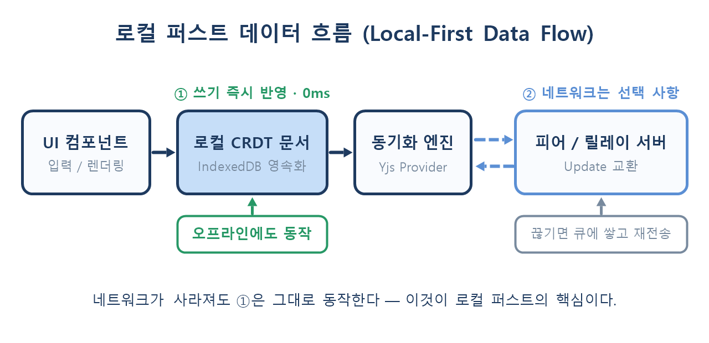
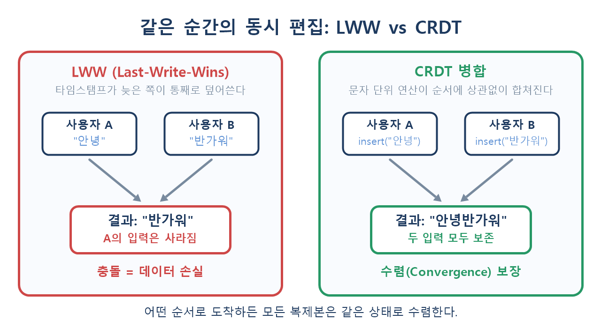

# 🔄 로컬 퍼스트(Local-First) 웹과 CRDT 완벽 가이드

> "서버가 아니라 **내 기기가 원본(Source of Truth)** 이다."
>
> 스피너 없는 UI, 비행기 안에서도 끊기지 않는 편집, 그리고 저절로 합쳐지는 데이터.
> 그 뒤에 있는 **CRDT**라는 자료구조를 기초부터 실무 도입까지 정리합니다.

---

## 📌 목차

1. 왜 지금 로컬 퍼스트인가
2. 서버 중심 웹의 구조적 한계
3. 로컬 퍼스트의 7가지 원칙
4. CRDT란 무엇인가 — 수학적 배경
5. CRDT의 종류와 동작 원리
6. 직접 만들어 보는 미니 CRDT
7. Yjs로 구현하는 실전 로컬 퍼스트
8. Automerge와의 비교
9. 저장·전송·용량 관리
10. 실무에서 마주치는 함정
11. CRDT를 쓰면 **안 되는** 경우
12. 아키텍처 선택 가이드
13. 기존 프로젝트에 점진 도입하기
14. 정리

---

## 🧭 1. 왜 지금 로컬 퍼스트인가

지난 15년간 웹 애플리케이션은 **"서버가 진실, 브라우저는 창문"** 이라는 전제 위에 세워졌습니다.
그런데 이 전제가 최근 몇 가지 흐름과 충돌하기 시작했습니다.

- **기기 성능 과잉**: 스마트폰조차 수 GB 메모리와 멀티코어 CPU를 갖췄지만, 대부분 네트워크를 기다리는 데 쓰입니다.
- **브라우저 저장소 성숙**: IndexedDB, Origin Private File System, Storage Buckets 등으로 수백 MB 단위의 로컬 영속화가 현실화됐습니다.
- **프라이버시 요구**: 데이터를 서버에 올리지 않는 것 자체가 기능이자 세일즈 포인트가 되었습니다.
- **AI의 로컬 실행**: 브라우저 안에서 모델을 돌리는 흐름(WebGPU 기반 추론)은 "데이터도 로컬에 있어야" 완성됩니다.

즉 로컬 퍼스트는 **유행이 아니라, 기기 성능과 저장소가 서버 왕복의 필요성을 앞질러 버린 결과**입니다.

---

## 🐌 2. 서버 중심 웹의 구조적 한계

일반적인 CRUD 앱에서 사용자가 글자 하나를 입력하면 이런 일이 벌어집니다.

```text
입력 → 디바운스 → fetch(PATCH) → 네트워크 왕복(50~400ms) → DB 트랜잭션 → 응답 → 리렌더
```

여기서 생기는 문제는 세 가지입니다.

| 문제 | 증상 | 기존 해법 | 한계 |
|------|------|-----------|------|
| **지연** | 타이핑마다 스피너·저장 중 표시 | 낙관적 업데이트(Optimistic UI) | 실패 시 롤백 로직이 폭발적으로 복잡해짐 |
| **단절** | 터널·기내·엘리베이터에서 앱이 죽음 | 오프라인 큐 | 재접속 시 **충돌 해결을 직접** 짜야 함 |
| **동시 편집** | 마지막 저장이 앞의 편집을 삭제 | 락(Lock), 버전 충돌 경고 | 사용자에게 "충돌났습니다" 모달을 던지는 것은 해결이 아님 |

낙관적 업데이트는 "겉보기 속도"를 벌어 주지만, **진실은 여전히 서버에 있습니다.**
그래서 실패·재시도·충돌이 발생하는 순간 UI가 과거로 되돌아갑니다.

로컬 퍼스트는 이 전제를 뒤집습니다.

> **쓰기는 항상 로컬에서 즉시 성공한다. 네트워크는 "나중에 알려주는 채널"일 뿐이다.**



---

## 📜 3. 로컬 퍼스트의 7가지 원칙

2019년 Ink & Switch 연구소가 제시한 원칙으로, 오늘날 이 분야의 사실상 헌장 역할을 합니다.

| # | 원칙 | 실무적 의미 |
|---|------|-------------|
| 1 | **빠른 속도** | 모든 상호작용이 네트워크 없이 즉시 반영 |
| 2 | **멀티 디바이스** | 노트북·폰·태블릿이 같은 문서를 공유 |
| 3 | **오프라인 동작** | 네트워크는 최적화일 뿐, 필수 조건이 아님 |
| 4 | **협업** | 여러 사람이 동시에 편집해도 데이터가 살아남음 |
| 5 | **장기 보존** | 서비스가 종료돼도 내 기기의 데이터는 남음 |
| 6 | **보안·프라이버시** | 종단 간 암호화와 자연스럽게 결합됨 |
| 7 | **소유권** | 사용자가 자기 데이터의 실제 사본을 가짐 |

3·4번을 동시에 만족시키는 것이 기술적으로 가장 어렵습니다.
**"오프라인에서 각자 편집했는데, 합쳤더니 아무것도 잃지 않았다"** 를 보장해야 하기 때문입니다.
바로 이 지점에 CRDT가 들어옵니다.

---

## 🧮 4. CRDT란 무엇인가 — 수학적 배경

**CRDT(Conflict-free Replicated Data Type, 충돌 없는 복제 자료형)** 는
"어떤 순서로 합쳐도 결국 같은 결과가 나오는" 성질을 자료구조 자체에 심어 놓은 것입니다.

병합 함수 `merge(a, b)` 가 아래 세 가지를 만족하면 됩니다.

```text
교환법칙 (Commutative)  : merge(a, b) = merge(b, a)
결합법칙 (Associative)  : merge(merge(a, b), c) = merge(a, merge(b, c))
멱등성   (Idempotent)   : merge(a, a) = a
```

이 세 조건을 만족하면 상태들은 **반격자(Semilattice)** 를 이루고,
> 메시지가 **중복 도착**하든, **순서가 뒤바뀌든**, **여러 번 재전송되든**
> 모든 복제본은 반드시 같은 상태로 **수렴(Convergence)** 합니다.

이것이 CRDT의 전부입니다. 중앙 조정자도, 합의 알고리즘(Paxos/Raft)도, 락도 필요 없습니다.

### 4.1 LWW와 무엇이 다른가

많은 팀이 "타임스탬프 비교해서 늦은 쪽이 이기게 하면 되지 않나?"라고 생각합니다.
이것이 **LWW(Last-Write-Wins)** 이고, 실제로 가장 단순한 CRDT의 일종이기도 합니다.
문제는 **충돌을 해결하는 방식이 "한쪽을 버리는 것"** 이라는 점입니다.



같은 문단을 두 사람이 동시에 고쳤을 때,
LWW는 한 사람의 작업을 통째로 날리지만 CRDT는 **양쪽 연산을 모두 보존**합니다.

---

## 🧩 5. CRDT의 종류와 동작 원리

### 5.1 State-based vs Operation-based

| 구분 | CvRDT (State-based) | CmRDT (Operation-based) |
|------|---------------------|--------------------------|
| 전송 내용 | 상태 전체(또는 델타) | 연산 자체 |
| 네트워크 요구 | 느슨함(중복·순서 무관) | 정확히 한 번 전달 필요 |
| 대역폭 | 큼 (델타 CRDT로 완화) | 작음 |
| 구현 난이도 | 쉬움 | 까다로움 |
| 대표 | Riak, 델타 CRDT | Yjs, Automerge(내부적으로 혼합) |

실무 라이브러리는 대부분 **델타/연산 기반을 혼합**해 "작은 업데이트 바이너리"를 주고받습니다.

### 5.2 대표 자료형

- **G-Counter**: 증가만 가능한 카운터. 노드별 카운트를 따로 보관하고 합칠 때 각 노드의 최댓값을 취함
- **PN-Counter**: 증가용·감소용 G-Counter 두 개를 결합
- **LWW-Register**: 값 + 타임스탬프. 설정값·토글처럼 "최신 하나만 의미 있는" 필드에 적합
- **OR-Set (Observed-Remove Set)**: 원소마다 고유 태그를 붙여, 추가와 삭제가 경합해도 **추가가 살아남도록** 처리
- **RGA / YATA**: 문자마다 고유 ID와 선후 관계를 부여하는 **텍스트 전용** 구조. Yjs가 YATA를 사용

### 5.3 텍스트 CRDT가 어려운 이유

배열 인덱스는 협업에서 **의미가 없습니다.**
A가 0번에 글자를 넣는 순간 B가 기억하던 5번은 6번이 되어 버리기 때문입니다.

그래서 텍스트 CRDT는 인덱스 대신 **"어떤 문자 뒤에 온다"는 불변 ID**를 씁니다.

```text
"안녕"  ->  [ {id: A1, ch: '안', after: null},
             {id: A2, ch: '녕', after: A1} ]

B가 A1 뒤에 '하'를 삽입  ->  {id: B1, ch: '하', after: A1}

병합 결과: A1 → (A2, B1을 ID 순으로 정렬) → 결정적인 순서 확정
```

인덱스가 아니라 **ID 그래프**이기 때문에 순서가 뒤바뀐 업데이트도 안전하게 삽입됩니다.

---

## 🔬 6. 직접 만들어 보는 미니 CRDT

개념을 손에 익히기 위해 30줄짜리 CRDT를 만들어 봅니다.

### 6.1 G-Counter

```js
class GCounter {
  constructor(nodeId) {
    this.nodeId = nodeId;
    this.counts = Object.create(null); // { nodeId: number }
  }

  increment(n = 1) {
    this.counts[this.nodeId] = (this.counts[this.nodeId] ?? 0) + n;
  }

  get value() {
    return Object.values(this.counts).reduce((a, b) => a + b, 0);
  }

  // 핵심: 노드별 최댓값 = 교환·결합·멱등을 모두 만족
  merge(other) {
    for (const [id, n] of Object.entries(other.counts)) {
      this.counts[id] = Math.max(this.counts[id] ?? 0, n);
    }
    return this;
  }
}
```

```js
const a = new GCounter('a');
const b = new GCounter('b');

a.increment(3);
b.increment(5);

a.merge(b);
b.merge(a);
b.merge(a); // 몇 번을 합쳐도 결과는 동일 (멱등)

console.log(a.value, b.value); // 8 8
```

> 📌 `Math.max`를 `+=`로 바꾸는 순간 CRDT가 아니게 됩니다.
> 같은 메시지를 두 번 받으면 값이 부풀기 때문입니다. **멱등성은 협상 대상이 아닙니다.**

### 6.2 LWW-Map

```js
class LWWMap {
  constructor(nodeId) {
    this.nodeId = nodeId;
    this.entries = new Map(); // key -> { value, ts, node }
  }

  set(key, value) {
    this.entries.set(key, { value, ts: Date.now(), node: this.nodeId });
  }

  get(key) {
    return this.entries.get(key)?.value;
  }

  merge(other) {
    for (const [key, incoming] of other.entries) {
      const current = this.entries.get(key);
      if (!current || this.#isNewer(incoming, current)) {
        this.entries.set(key, incoming);
      }
    }
    return this;
  }

  // 타임스탬프가 같을 때 nodeId로 결정적 tie-break (이것이 없으면 수렴이 깨진다)
  #isNewer(a, b) {
    return a.ts !== b.ts ? a.ts > b.ts : a.node > b.node;
  }
}
```

`#isNewer`의 tie-break가 실무에서 가장 자주 빠뜨리는 부분입니다.
기기 시계가 밀리초 단위로 겹치는 일은 생각보다 흔하고, 이때 **노드마다 다른 승자**를 고르면 영영 수렴하지 않습니다.

---

## ⚙️ 7. Yjs로 구현하는 실전 로컬 퍼스트

직접 구현은 학습용이고, 실제 서비스는 검증된 라이브러리를 씁니다.
가장 널리 쓰이는 것이 **Yjs**입니다.

```bash
npm install yjs y-indexeddb y-websocket y-protocols
```

### 7.1 공유 문서 정의

```js
import * as Y from 'yjs';

const doc = new Y.Doc();

const text  = doc.getText('content');     // 협업 텍스트
const meta  = doc.getMap('meta');         // 키-값 (제목, 태그 등)
const items = doc.getArray('checklist');  // 순서 있는 목록

doc.transact(() => {
  meta.set('title', '기획 문서');
  text.insert(0, '첫 문단입니다.');
  items.push([{ id: 1, done: false, label: '초안 작성' }]);
});
```

> `doc.transact()`로 감싸면 여러 변경이 **하나의 업데이트**로 묶여 전송량과 undo 단위가 깔끔해집니다.

### 7.2 로컬 영속화 — 로컬 퍼스트의 심장

```js
import { IndexeddbPersistence } from 'y-indexeddb';

const local = new IndexeddbPersistence('doc-room-42', doc);

local.on('synced', () => {
  // 네트워크와 무관하게, 이 시점부터 이전 작업이 모두 복구되어 있다
  console.log('로컬 복구 완료');
});
```

이 열 줄이 **새로고침·브라우저 종료·오프라인을 모두 흡수**합니다.
서버 연결은 아직 등장하지도 않았다는 점이 중요합니다.

### 7.3 동기화 연결 (선택 사항)

```js
import { WebsocketProvider } from 'y-websocket';

const remote = new WebsocketProvider('wss://sync.example.com', 'doc-room-42', doc);

remote.on('status', ({ status }) => {
  // 'connected' | 'disconnected' — UI 배지에만 반영하고, 입력은 절대 막지 않는다
  setBadge(status === 'connected' ? '동기화 중' : '오프라인 (로컬 저장됨)');
});
```

### 7.4 커서·접속자 표시 (Awareness)

```js
remote.awareness.setLocalStateField('user', {
  name: '임채명',
  color: '#5B8FD4',
});

remote.awareness.on('change', () => {
  const others = [...remote.awareness.getStates().entries()]
    .filter(([clientId]) => clientId !== doc.clientID)
    .map(([, state]) => state.user);

  renderPresence(others);
});
```

Awareness 상태는 **CRDT 문서에 저장되지 않습니다.** 휘발성이며 연결이 끊기면 사라집니다.
커서 위치를 문서에 넣으면 히스토리가 순식간에 오염되므로, 반드시 분리해야 합니다.

### 7.5 React 바인딩

```jsx
import { useSyncExternalStore, useCallback } from 'react';

function useYArray(yArray) {
  const subscribe = useCallback((cb) => {
    yArray.observeDeep(cb);
    return () => yArray.unobserveDeep(cb);
  }, [yArray]);

  return useSyncExternalStore(
    subscribe,
    () => yArray.toJSON(),
    () => yArray.toJSON(), // SSR 스냅샷
  );
}
```

`toJSON()`은 매번 새 객체를 만들기 때문에 문서가 커지면 비용이 큽니다.
실무에서는 `observeDeep`에서 받은 **이벤트의 delta만 읽어** 부분 갱신하는 편이 안전합니다.

### 7.6 되돌리기

```js
const undoManager = new Y.UndoManager(text, {
  trackedOrigins: new Set([doc.clientID]), // 내 편집만 되돌린다
});

undoManager.undo();
undoManager.redo();
```

협업 환경에서 `Ctrl+Z`가 **남의 편집까지 지워 버리는** 사고는 `trackedOrigins`로 막습니다.

---

## 🔍 8. Automerge와의 비교

| 항목 | Yjs | Automerge |
|------|-----|-----------|
| 최적화 초점 | 속도·메모리 (YATA + 런 인코딩) | 히스토리 보존·풍부한 API |
| 히스토리 | 기본적으로 축약 | 모든 변경을 Git처럼 추적 |
| 구현 | JavaScript | Rust → WASM |
| 번들 크기 | 상대적으로 작음 | WASM 포함으로 큼 |
| 텍스트 성능 | 매우 빠름 | 개선됐으나 상대적으로 무거움 |
| 적합한 곳 | 실시간 에디터, 화이트보드 | 감사 추적·버전 비교가 중요한 문서 |

선택 기준은 단순합니다.

- **"지금 같이 편집"이 핵심이면 → Yjs**
- **"누가 언제 무엇을 바꿨는지"가 핵심이면 → Automerge**

---

## 💾 9. 저장·전송·용량 관리

CRDT는 공짜가 아닙니다. **메타데이터 비용**을 지불합니다.

### 9.1 업데이트만 주고받기

```js
import * as Y from 'yjs';

// 변경이 생길 때마다 바이너리 델타 발행
doc.on('update', (update, origin) => {
  if (origin === 'remote') return;   // 에코 방지
  socket.send(update);               // Uint8Array
});

// 수신 측
socket.onmessage = (e) => {
  Y.applyUpdate(doc, new Uint8Array(e.data), 'remote');
};
```

### 9.2 상태 벡터로 차이만 요청

```js
// 클라이언트: "나는 여기까지 알고 있다"
const sv = Y.encodeStateVector(doc);

// 서버: 부족한 부분만 계산해서 전송
const diff = Y.encodeStateAsUpdate(serverDoc, sv);
```

전체 문서가 아니라 **모르는 부분만** 전송하므로, 오래 오프라인이었던 기기의 재접속도 가볍습니다.

### 9.3 삭제해도 줄지 않는 문서

CRDT는 삭제를 **비석(Tombstone)** 으로 표시합니다. "이 문자는 지워졌다"는 기록 자체가 남아야
다른 복제본이 그 삭제를 반영할 수 있기 때문입니다.

대응 전략은 세 가지입니다.

1. **스냅샷 압축**: 모든 참여자가 동기화된 시점에 문서를 새 `Y.Doc`으로 재구성
2. **문서 분할**: 하나의 거대 문서 대신 페이지/블록 단위로 쪼개기
3. **보관 전환**: 오래된 문서는 CRDT를 버리고 일반 JSON으로 아카이브

```js
// 스냅샷으로 재구성 (비석 제거)
const snapshot = Y.encodeStateAsUpdate(doc);
const fresh = new Y.Doc();
Y.applyUpdate(fresh, snapshot);
```

> ⚠️ 재구성된 문서는 **새로운 히스토리**를 가집니다.
> 아직 동기화되지 않은 기기가 있다면 그 기기의 편집은 합쳐지지 않으므로, 반드시 전원 동기화 확인 후 수행해야 합니다.

---

## 🕳️ 10. 실무에서 마주치는 함정

### 10.1 서버가 내용을 검증할 수 없다

업데이트는 바이너리 델타입니다. 서버가 "이 필드는 관리자만 수정 가능"을 강제하려면
**문서를 서버에서도 실행(hydrate)** 해야 합니다.

```js
// 서버 측 검증 예시 (Node)
const before = serverDoc.getMap('meta').get('ownerId');
Y.applyUpdate(serverDoc, incomingUpdate);
const after = serverDoc.getMap('meta').get('ownerId');

if (before !== after && !user.isAdmin) {
  // 거부: 문서를 이전 상태로 되돌리고 클라이언트에 정정 업데이트 전송
  rejectAndResync(user, serverDoc);
}
```

**권한 모델이 필드 단위로 촘촘한 서비스라면 CRDT 도입 비용이 급격히 올라갑니다.**

### 10.2 스키마 마이그레이션

기존 DB처럼 `ALTER TABLE` 한 번으로 끝나지 않습니다.
오프라인 기기가 **옛 스키마로 작성한 업데이트를 며칠 뒤 보내오기 때문**입니다.

```js
const SCHEMA_VERSION = 3;

function migrate(doc) {
  const meta = doc.getMap('meta');
  const v = meta.get('schemaVersion') ?? 1;

  doc.transact(() => {
    if (v < 2) meta.set('tags', new Y.Array());
    if (v < 3) meta.set('visibility', meta.get('isPublic') ? 'public' : 'private');
    meta.set('schemaVersion', SCHEMA_VERSION);
  }, 'migration');
}
```

원칙: **필드를 지우지 말고 더하기**, 그리고 **마이그레이션은 멱등하게**.

### 10.3 "합쳐졌지만 말이 안 되는" 상태

CRDT는 **데이터 손실**을 막아 주지만 **의미적 정합성**은 보장하지 않습니다.

```text
A: 회의 시간을 14시로 변경
B: 회의 장소를 (14시에는 닫는) 카페로 변경
→ 병합 결과: 문 닫은 카페에서 14시 회의 (데이터는 완벽, 현실은 오류)
```

이 문제는 자료구조가 아니라 **도메인 규칙과 UX**로 풀어야 합니다.
"최근에 다른 사람이 이 항목을 바꿨습니다" 같은 알림이 필요한 이유입니다.

### 10.4 기기 시계를 믿지 말 것

LWW 기반 필드를 쓴다면 `Date.now()`는 위험합니다. 사용자 기기의 시계는 틀어져 있을 수 있습니다.
**Lamport clock** 이나 **hybrid logical clock**을 쓰는 라이브러리를 선택하는 편이 안전합니다.

### 10.5 저장소 한도

IndexedDB는 무한하지 않으며, 브라우저가 **조용히 데이터를 정리**할 수 있습니다.

```js
if (navigator.storage?.persist) {
  const persisted = await navigator.storage.persist();
  const { usage, quota } = await navigator.storage.estimate();
  console.log(persisted, usage, quota);
}
```

로컬 퍼스트를 표방하면서 **영속 권한을 요청하지 않는 것**은 치명적인 누락입니다.

---

## 🚫 11. CRDT를 쓰면 안 되는 경우

"충돌이 없다"는 말은 **"불변 조건(Invariant)을 지킨다"는 뜻이 아닙니다.**

```text
잔고 100원, 두 기기가 각각 오프라인에서 80원 출금
→ CRDT 병합: 두 출금 모두 성공적으로 보존 → 잔고 -60원
```

CRDT는 두 연산을 **모두 살리는 것이 정답**이라고 판단합니다. 회계상으로는 재앙입니다.

| 쓰지 말아야 할 곳 | 이유 |
|-------------------|------|
| 계좌 잔고, 결제 | 전역 불변 조건(잔고 ≥ 0) 위반 |
| 재고·좌석·티켓 수량 | 유일성·한정 수량 보장 불가 |
| 고유 ID·중복 없는 이름 | 유일성 제약을 분산 환경에서 강제 불가 |
| 강한 권한 분리 | 서버 검증 비용이 이득을 초과 |

> ✅ **적합**: 문서, 노트, 화이트보드, 칸반, 주석, 설정, 디자인 캔버스, 태스크 목록
> ❌ **부적합**: 돈, 수량, 유일성, 규제 대상 트랜잭션

실무에서는 **혼합 아키텍처**가 정답인 경우가 많습니다.
*문서 본문은 CRDT로, 결제와 권한은 기존 트랜잭션 API로.*

---

## 🧭 12. 아키텍처 선택 가이드

| 방식 | 오프라인 | 동시 편집 | 구현 난이도 | 서버 부담 | 적합한 앱 |
|------|:--------:|:---------:|:-----------:|:---------:|-----------|
| 일반 REST/CRUD | ❌ | ❌ | 낮음 | 낮음 | 관리자 화면, 게시판 |
| 낙관적 업데이트 | △ | ❌ | 중간 | 낮음 | 일반 SaaS |
| OT (Operational Transform) | △ | ✅ | **매우 높음** | **높음**(중앙 서버 필수) | 구글 docs형 대규모 서비스 |
| **CRDT** | ✅ | ✅ | 중간 | 낮음(릴레이만) | 에디터, 노트, 보드, 협업 도구 |

OT는 성숙한 기술이지만 **변환 함수를 직접 증명해야 하고 중앙 서버가 필수**입니다.
반면 CRDT는 라이브러리가 성숙해지면서, 대부분의 팀에게 **훨씬 현실적인 선택지**가 되었습니다.

---

## 🪜 13. 기존 프로젝트에 점진 도입하기

한 번에 갈아엎을 필요는 없습니다. 위험이 낮은 순서로 올라가면 됩니다.

**1단계 — 읽기 캐시 (위험도 0)**
서버 응답을 IndexedDB에 저장해 재방문 시 즉시 렌더. CRDT는 아직 필요 없습니다.

**2단계 — 단일 화면에 CRDT 투입**
댓글, 메모, 체크리스트처럼 **충돌해도 손해가 작은 기능**부터 Yjs로 교체합니다.

**3단계 — 동기화 서버 도입**
`y-websocket` 릴레이를 붙입니다. 이 서버는 DB가 아니라 **우체국**입니다. 상태를 해석하지 않으므로 가볍습니다.

**4단계 — 서버 측 문서 실행**
검색 색인, 권한 검증, 알림이 필요해지는 시점에 서버에서도 문서를 hydrate합니다.

**5단계 — 아카이브 전략**
오래된 문서의 스냅샷을 정규 DB에 적재해 분석·백업 경로를 확보합니다.

```text
읽기 캐시 → 부분 CRDT → 릴레이 → 서버 hydrate → 아카이브
   (며칠)     (1~2주)     (1주)      (2~4주)      (상시)
```

---

## 🧾 14. 정리

- 로컬 퍼스트는 **"네트워크는 선택 사항"** 이라는 한 문장으로 요약된다.
- CRDT는 병합을 **교환·결합·멱등**으로 만들어, 순서·중복·지연과 무관한 수렴을 보장한다.
- 텍스트 CRDT는 인덱스 대신 **불변 ID 그래프**로 위치를 표현한다.
- 실무에서는 **Yjs + IndexedDB**만으로도 오프라인·협업의 80%가 해결된다.
- 대가는 **메타데이터 용량, 서버 검증의 어려움, 스키마 마이그레이션**이다.
- **돈·수량·유일성**처럼 전역 불변 조건이 필요한 도메인은 여전히 트랜잭션의 영역이다.

> ✨ **한 줄 요약**
> CRDT는 "충돌을 해결하는 기술"이 아니라 **"충돌이라는 개념 자체를 없애는 자료구조"** 다.
> 서버를 진실의 자리에서 내려놓는 순간, 스피너도 오프라인 에러도 함께 사라진다.

---

## 📚 참고 자료

- [Local-first software (Ink & Switch)](https://www.inkandswitch.com/local-first/)
- [Yjs 공식 문서](https://docs.yjs.dev/)
- [Automerge 공식 사이트](https://automerge.org/)
- [CRDT.tech — 자료형 모음](https://crdt.tech/)
- [MDN: Storage API (persist / estimate)](https://developer.mozilla.org/en-US/docs/Web/API/StorageManager)
- [MDN: IndexedDB API](https://developer.mozilla.org/en-US/docs/Web/API/IndexedDB_API)
