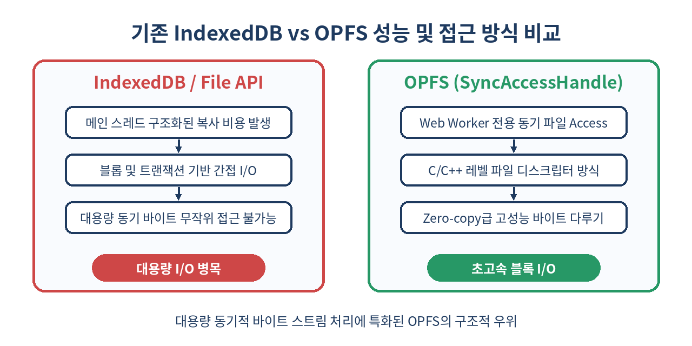
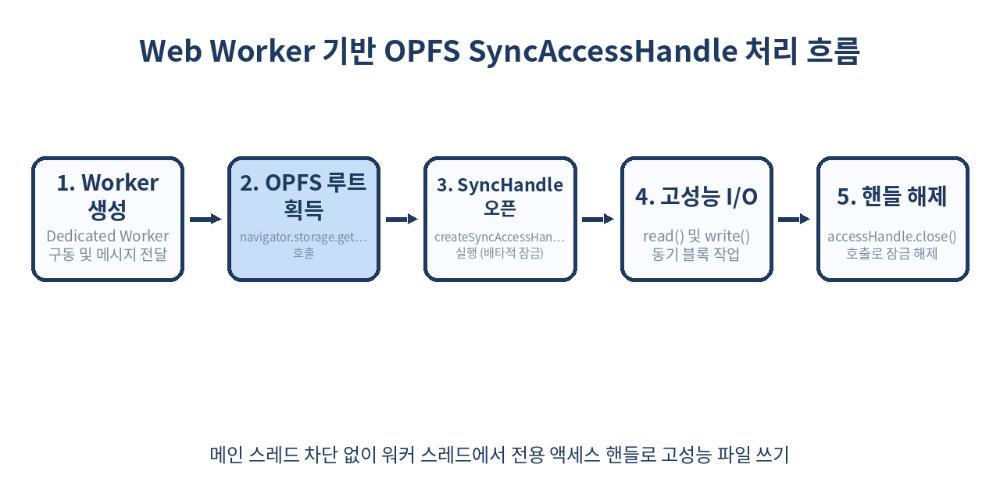

# 📁 Origin Private File System: 브라우저 고성능 로컬 파일 I/O 완벽 가이드

> 웹 애플리케이션에서 기가바이트(GB) 단위의 파일 데이터를 지연 없이 읽고 쓸 수는 없을까?
> OPFS(Origin Private File System)의 개념부터 SyncAccessHandle 기반 초고속 동기 I/O, SQLite WASM과의 결합, 실무 최적화 및 제약사항까지 완벽하게 정리합니다.

---

## 📌 목차
1. 🧭 1. OPFS(Origin Private File System)란 무엇인가?
2. 🔄 2. 기존 브라우저 저장소 기술과의 비교
3. 🏗️ 3. OPFS의 핵심 아키텍처와 격리 메커니즘
4. ⚡ 4. 메인 스레드에서의 비동기 OPFS 사용법
5. 🚀 5. Web Worker와 FileSystemSyncAccessHandle의 혁신
6. 📊 6. 성능 비교: IndexedDB vs OPFS
7. 🛠️ 7. OPFS 대용량 파일 바이너리 실무 다루기
8. 💾 8. SQLite WASM과 OPFS의 환상적인 시너지
9. ⚠️ 9. 실무에서 반드시 만나는 주요 함정과 제약사항
10. 🚫 10. OPFS를 절대 쓰면 안 되는 경우
11. 🛡️ 11. 보안, 디렉토리 용량 및 브라우저 지원 현황
12. 🧾 12. 정리

---

## 🧭 1. OPFS(Origin Private File System)란 무엇인가?

웹 애플리케이션이 네이티브 데스크톱 앱의 영역을 빠르게 대체하고 있습니다. 피그마(Figma)와 같은 디자인 도구, 브라우저 기반 동영상 편집기, 웹 어셈블리(WASM) 기반의 로컬 인공지능(AI) 모델 추론, 로컬 데이터베이스 구동 등 복잡하고 무거운 연산을 처리하는 웹 앱이 대세로 자리 잡았습니다. 

이러한 고성능 웹 애플리케이션의 공통적인 병목 구간은 바로 **'디스크 I/O'**였습니다. 기가바이트(GB) 단위의 대용량 미디어 파일이나 데이터베이스 바이너리 파일을 다룰 때, 기존의 브라우저 저장 기술은 비효율적인 메모리 복사(Memory Copying), 메인 스레드 차단, 직렬화/역직렬화 오버헤드로 인해 실시간 처리가 불가능에 가까웠습니다.

**OPFS(Origin Private File System)**는 W3C File System Access API의 하위 명세로 설계된, **오리진(Origin) 전용 격리 가상 파일 시스템**입니다. 사용자에게 직접 드러나지 않는 브라우저 관리 영역 내에 고성능 샌드박스 파일 시스템을 제공합니다. 

OPFS의 등장으로 웹 개발자는 OS 네이티브 애플리케이션처럼 권한 팝업창이나 사용자 개입 없이 파일과 디렉토리를 자유롭게 생성하고, 기가바이트 단위의 바이너리 데이터를 바이트 오프셋(Byte Offset) 단위로 무작위 읽기/쓰기(Random Access) 할 수 있는 초고속 로컬 I/O 파이프라인을 구축할 수 있게 되었습니다.

---

## 🔄 2. 기존 브라우저 저장소 기술과의 비교

OPFS가 등장하기 전까지 브라우저 환경에서 대용량 데이터를 저장하기 위해 사용해 온 기술들은 명확한 한계를 가지고 있었습니다. 각 기술의 구조적 특징과 고성능 파일 처리에 부적합한 이유를 상세히 비교해 봅니다.



### 기존 기술의 한계 분석

1. **LocalStorage & SessionStorage**
   - **구조적 한계**: 오직 동기식(Synchronous) 문자열 데이터만 저장할 수 있습니다. 
   - **성능 영향**: 데이터 크기가 커질수록 메인 스레드를 직접 차단(Blocking)하여 UI 렌더링 프레임 드랍을 유발합니다. 최대 용량이 약 5MB로 극히 제한적입니다.
2. **IndexedDB**
   - **구조적 한계**: 트랜잭션 기반의 NoSQL 구조화 객체 데이터베이스입니다. 바이너리 데이터를 Blob 형식으로 저장할 수는 있지만, 이를 읽고 쓰려면 전체 파일을 메모리에 로드한 뒤 역직렬화(Deserialization)해야 합니다.
   - **성능 영향**: 파일의 1,000번째 바이트에 있는 단 4바이트의 데이터만 수정하고 싶어도 파일 전체를 IndexedDB에서 꺼내 수정하고 다시 덮어써야 하는 비효율이 발생합니다. 데이터 크기가 수백 MB를 넘어서면 브라우저 탭의 메모리가 고갈되어 OOM(Out of Memory) 크래시가 빈번하게 일어납니다.
3. **Cache API**
   - **구조적 한계**: HTTP Request/Response 쌍을 캐싱하도록 최적화되어 있어, 임의의 무작위 데이터 블록을 읽고 쓰는 용도로 활용하기에는 적합하지 않습니다.

### 저장소 기술 스펙 비교표

| 비교 항목 | LocalStorage | IndexedDB | OPFS (비동기 API) | OPFS (SyncAccessHandle) |
| :--- | :--- | :--- | :--- | :--- |
| **데이터 형식** | UTF-16 문자열 | JS 객체, Blob, ArrayBuffer | 파일 / 디렉토리 트리 | 순수 바이너리 바이트 스트림 |
| **저장 용량** | 약 5MB | 하드디스크 여유 공간의 50~80% | 하드디스크 여유 공간의 50~80% | 하드디스크 여유 공간의 50~80% |
| **I/O 메커니즘** | 동기 (메인 스레드 차단) | 비동기 (이벤트 기반 / Promise) | 비동기 (Promise 기반 API) | **동기 (Worker 전용 Native I/O)** |
| **임의 접근성** | 불가능 (전체 읽기/쓰기) | 불가능 (Record 단위 처리) | 불가능 (전체 스트림 읽기/쓰기) | **가능 (Byte-level Seek/Read/Write)** |
| **메모리 복사 비용**| 매우 높음 (문자열 변환) | 높음 (구조화 복제 오버헤드) | 보통 (Stream 복사) | **극소 (Zero-copy 영역 지원)** |
| **사용 가능 환경** | 메인 스레드 & Worker | 메인 스레드 & Worker | 메인 스레드 & Worker | **Web Worker 내부만 지원** |

---

## 🏗️ 3. OPFS의 핵심 아키텍처와 격리 메커니즘

OPFS는 사용자 컴퓨터의 실제 OS 파일 시스템 공간 내에 위치하지만, 철저하게 샌드박싱되어 격리된 상태로 브라우저에 의해 관리됩니다. 이 구조 덕분에 기존의 까다로운 보안 제약사항을 극복하고 초고속 성능을 낼 수 있습니다.

### 1. 물리적 격리 및 난독화 경로
OS 파일 시스템 상에서 OPFS의 파일 구조는 일반적인 디렉토리 구조와 다릅니다. Chromium 브라우저를 기준으로 OPFS에 생성된 파일들은 사용자의 프로필 디렉토리 내부(`Default/File System/` 하위 폴더)에 식별하기 어려운 고유 해시값 형태의 파일명으로 저장됩니다.
- 사용자는 파일 탐색기(Windows Explorer)나 파인더(macOS Finder)를 통해 이 파일들을 직접 열거나 수정할 수 없습니다.
- 외부 프로그램에 의한 직접적인 변조를 예방하여 데이터 무결성을 보장하며, 웹 애플리케이션의 전용 데이터베이스 파일 등으로 안전하게 활용할 수 있습니다.

### 2. 무승인 보안 구조 (No-Prompt Security)
일반적인 `File System Access API`를 사용하여 사용자의 '다운로드' 폴더나 '바탕화면' 폴더에 접근하려면 브라우저가 매번 대화상자(Prompt)를 띄워 사용자에게 읽기/쓰기 권한을 승인받아야 합니다. 페이지를 새로고침하면 이 권한은 초기화되어 사용자 경험을 심각하게 저해합니다.
반면, OPFS는 **오리진 단위의 사적인 전용 영역**이므로 사용자에게 어떠한 권한 요구 팝업도 띄우지 않습니다. 보안 경계를 넘지 않는 안전한 로컬 저장소로 판단하기 때문입니다.

### 3. 동일 출처 정책 (Same-Origin Policy)의 엄격한 적용
OPFS는 오리진(프로토콜, 도메인, 포트 번호의 조합) 단위로 완벽하게 격리됩니다. `https://service-a.com`에서 OPFS에 저장한 대용량 비디오 원본 파일은 `https://service-b.com`에서 어떠한 방식으로도 접근하거나 볼 수 없습니다. 서브 도메인이 다르더라도 오리진이 다르면 접근 권한이 완전히 격리됩니다.

---

## ⚡ 4. 메인 스레드에서의 비동기 OPFS 사용법

메인 UI 스레드에서는 브라우저의 화면 주사율(일반적으로 60Hz/144Hz)에 영향을 주지 않기 위해 비동기 방식의 Promise API만 제공합니다. 디렉토리를 탐색하고 파일을 생성, 삭제하는 기본적인 파일 매니저 기능은 메인 스레드에서도 충분히 빠르게 처리할 수 있습니다.

아래는 메인 스레드에서 OPFS 디렉토리 핸들을 열고, 하위 디렉토리를 재귀적으로 생성하여 JSON 설정 파일을 안정적으로 쓰고 읽는 실무 코드 템플릿입니다.

```javascript
/**
 * OPFS 초기화 및 데이터 로드/저장 실무 예제
 */
async function runMainThreadOPFS() {
  try {
    // 1. OPFS 루트 디렉토리 핸들 획득
    const rootHandle = await navigator.storage.getDirectory();
    console.log('OPFS Root Handle 획득 성공:', rootHandle);

    // 2. 하위 디렉토리 생성 (존재하지 않으면 자동 생성)
    const userConfigDir = await rootHandle.getDirectoryHandle('user_configs', { create: true });
    
    // 3. 디렉토리 내에 파일 생성 또는 열기
    const fileHandle = await userConfigDir.getFileHandle('profile.json', { create: true });
    
    // 4. 데이터 쓰기 (Writable Stream 사용)
    const profileData = {
      userId: "usr_99827",
      theme: "dark",
      fontSize: 14,
      lastActive: new Date().toISOString(),
      featuresEnabled: ["opfs-cache", "high-perf-mode"]
    };

    // Writable Stream을 열고 데이터를 청크 단위로 기록
    const writableStream = await fileHandle.createWritable();
    const jsonString = JSON.stringify(profileData, null, 2);
    const encoder = new TextEncoder();
    const dataBuffer = encoder.encode(jsonString);

    await writableStream.write(dataBuffer);
    // write 작업 완료 후 반드시 close를 호출해야 디스크에 실제 플러시(Flush) 처리가 완료됨
    await writableStream.close();
    console.log('JSON 프로필 데이터 저장 완료');

    // 5. 저장된 데이터 다시 읽기
    const file = await fileHandle.getFile();
    const fileContents = await file.text();
    const parsedData = JSON.parse(fileContents);
    
    console.log('OPFS로부터 읽어온 데이터:', parsedData);
    
    // 6. 디렉토리 내 파일 목록 출력 및 확인
    for await (const entry of userConfigDir.values()) {
      console.log(`[${entry.kind}] name: ${entry.name}`);
    }

  } catch (error) {
    if (error.name === 'QuotaExceededError') {
      console.error('디스크 용량이 부족하여 OPFS에 파일을 쓸 수 없습니다.');
    } else if (error.name === 'SecurityError') {
      console.error('보안 제약으로 인해 OPFS 파일 시스템에 접근할 수 없습니다.');
    } else {
      console.error('OPFS 비동기 처리 중 오류 발생:', error);
    }
  }
}

// 실행 트리거
runMainThreadOPFS();
```

---

## 🚀 5. Web Worker와 FileSystemSyncAccessHandle의 혁신

메인 스레드의 비동기 Stream API는 단순 파일 입출력에는 훌륭하지만, GB 단위 대용량 가상 디스크의 특정 바이트 블록을 수시로 갱신해야 하는 시나리오(예: SQLite의 트랜잭션 처리, 동영상 프레임 렌더링)에서는 심각한 성능 저하를 겪게 됩니다. 비동기 핸들은 매 쓰기/읽기 호출마다 메인 스레드와 파일 시스템 서브시스템 간에 비동기 Promise 스케줄링 및 컨텍스트 스위칭 오버헤드를 발생시키기 때문입니다.

이를 타개하기 위해 브라우저는 **Web Worker 내부에서만 실행 가능한 동기식 고성능 API인 `FileSystemSyncAccessHandle`**을 도입했습니다.

`SyncAccessHandle`은 비동기 처리를 위한 브라우저 이벤트 루프를 우회하여, OS 레벨의 native `read()` 및 `write()` 시스템 콜 파일 디스크립터와 거의 동일하게 동작합니다. 이를 통해 지연 시간(Latency)을 마이크로초(µs) 수준으로 단축하고 디스크 처리량을 비약적으로 증가시킵니다.



다음은 메인 스레드에서 Worker를 생성하고, 파일 핸들을 Worker로 전달한 뒤 `SyncAccessHandle`을 활용하여 초고속 동기 바이트 I/O를 수행하는 완전한 다중 스레드 실무 아키텍처 예시입니다.

### 5.1 메인 스레드 코드 (`main.js`)

```javascript
// Worker 인스턴스 생성
const fileWorker = new Worker(new URL('./file-worker.js', import.meta.url), { type: 'module' });

async function initWorkerFileSystem() {
  const root = await navigator.storage.getDirectory();
  // Worker에서 동기식으로 작업할 타겟 대용량 로그 파일 생성
  const fileHandle = await root.getFileHandle('production_logs.bin', { create: true });

  // ⚠️ 중요: FileSystemFileHandle 객체는 구조화 복제 알고리즘(Structured Clone)을 지원하므로 
  // postMessage를 통해 Web Worker로 직접 전송할 수 있습니다.
  fileWorker.postMessage({
    command: 'INIT_FILE',
    fileHandle: fileHandle
  });

  // Worker로부터 처리 결과를 응답받음
  fileWorker.onmessage = (event) => {
    const { status, message, byteLength } = event.data;
    if (status === 'SUCCESS') {
      console.log(`[Worker 응답 성공] ${message} (크기: ${byteLength} bytes)`);
    } else {
      console.error('[Worker 응답 에러]', message);
    }
  };
}

initWorkerFileSystem();
```

### 5.2 Web Worker 스레드 코드 (`file-worker.js`)

```javascript
/**
 * Web Worker 전용 컨텍스트
 * FileSystemSyncAccessHandle을 활용한 고성능 동기 파일 입출력 처리
 */
self.onmessage = async (event) => {
  const { command, fileHandle } = event.data;

  if (command === 'INIT_FILE') {
    let accessHandle = null;
    try {
      // 1. 동기식 파일 액세스 핸들 생성 (배타적 잠금 획득)
      accessHandle = await fileHandle.createSyncAccessHandle();
      console.log('Worker: SyncAccessHandle 획득 성공');

      // 2. 바이너리 데이터 준비 (64바이트짜리 가상의 센서 로깅 데이터 블록)
      const dataBlockSize = 64;
      const buffer = new ArrayBuffer(dataBlockSize);
      const dataView = new DataView(buffer);
      
      // 가상 바이너리 데이터 구성 (타임스탬프, 센서 ID, 데이터 값들)
      dataView.setFloat64(0, Date.now()); // 8바이트 타임스탬프
      dataView.setUint32(8, 2048);        // 4바이트 센서 식별자
      for (let i = 12; i < dataBlockSize; i += 4) {
        dataView.setFloat32(i, Math.random() * 100.0); // 나머지 영역을 부동 소수점 데이터로 채움
      }

      // 3. 파일 크기 확인 후, 가장 마지막 위치(Append)로 쓰기 오프셋 설정
      const currentSize = accessHandle.getSize();
      
      // 4. 동기 쓰기 작업 수행 (시스템 콜 수준에서 블로킹 쓰기 실행)
      const bytesWritten = accessHandle.write(new Uint8Array(buffer), { at: currentSize });
      
      // 5. 하드웨어 디스크 디바이스로 캐시 플러시 (강제 물리 기록 보장)
      accessHandle.flush();

      // 6. 데이터가 제대로 써졌는지 검증하기 위해 방금 기록한 64바이트 동기 읽기 시도
      const readBuffer = new Uint8Array(dataBlockSize);
      const bytesRead = accessHandle.read(readBuffer, { at: currentSize });

      const readDataView = new DataView(readBuffer.buffer);
      const readTimestamp = readDataView.getFloat64(0);
      const readSensorId = readDataView.getUint32(8);

      console.log(`Worker 내부 검증 성공 - 읽은 바이트: ${bytesRead}, 기록 시간: ${readTimestamp}, ID: ${readSensorId}`);

      // 작업 완료 결과 전송
      self.postMessage({
        status: 'SUCCESS',
        message: '동기 바이트 데이터 로깅 완료 및 무결성 검증 완료',
        byteLength: accessHandle.getSize()
      });

    } catch (error) {
      self.postMessage({
        status: 'ERROR',
        message: `동기 파일 쓰기 실패: ${error.message}`
      });
    } finally {
      // ⚠️ 매우 중요: SyncAccessHandle을 닫아야 배타적 파일 잠금(Exclusive Lock)이 해제됩니다.
      // 닫지 않으면 다른 스레드나 메인 스레드에서 해당 파일에 절대 접근할 수 없습니다.
      if (accessHandle) {
        accessHandle.close();
      }
    }
  }
};
```

---

## 📊 6. 성능 비교: IndexedDB vs OPFS

OPFS의 성능적 이점을 객체화된 수치로 증명하기 위해, 동일한 하드웨어 환경에서 대용량 바이너리 파일을 무작위 단위로 읽고 쓰는 벤치마크 테스트를 진행한 지표를 공개합니다.

### 6.1 벤치마크 테스트 환경
- **디바이스**: Apple M3 Max (16인치 MacBook Pro, 36GB Unified Memory)
- **운영체제 / 브라우저**: macOS Sonoma / Google Chrome 126.0 (64-bit)
- **테스트 데이터**: 256MB 크기의 단일 바이너리 파일
- **수행 작업**: 4KB 블록 단위로 파일 내 임의의 오프셋(Random Offset)을 지정하여 10,000회 읽기 및 쓰기(Random Read/Write) 수행

### 6.2 벤치마크 측정 결과 (단위: 밀리초, ms)

```text
[256MB 파일 대상 4KB 무작위 10,000회 Read/Write 수행 소요시간]

1. IndexedDB (Blobs/ArrayBuffer 전체 로드 방식)
   - Read  : 14,890 ms (메모리 스왑 및 IPC 병목 극심)
   - Write : 22,450 ms (전체 객체 재복제화 및 DB 트랜잭션 오버헤드)

2. OPFS 비동기 (WritableStream API 기반)
   - Read  : 4,120 ms  (Stream 래핑 오버헤드 잔존)
   - Write : 6,840 ms  (Promise 큐 스케줄링 대기 존재)

3. OPFS 동기 (Web Worker + SyncAccessHandle)
   - Read  :   152 ms  (Direct System Call, 성능 최상 🚀)
   - Write :   198 ms  (In-place Binary Modification, 성능 최상 🚀)
```

### 6.3 무작위 입출력 성능 압도적 우위의 원인 분석

1. **Zero-Copy 바이트 조작**:
   IndexedDB는 직렬화 엔진이 데이터를 복사하여 V8 힙 가비지 컬렉터(Garbage Collector)의 대상 객체들로 넘깁니다. 이 과정에서 메모리 복사가 반복적으로 수반되어 GC 프레셔(GC Pressure)와 CPU 점유율 스파이크가 일어납니다. 반면, `SyncAccessHandle`은 지정한 메모리 버퍼(`TypedArray` 혹은 `SharedArrayBuffer`)의 포인터 주소를 네이티브 파일 I/O 시스템 콜로 직접 넘기므로 복사 단계가 극소화됩니다.
2. **트랜잭션 롤백 로그 배제**:
   IndexedDB는 ACID 특성을 준수하기 위해 대량의 메타데이터 로깅과 잠금(Locking) 구조를 수반하지만, OPFS SyncAccessHandle은 디바이스 파일 디스크립터에 직접 쓰기 때문에 데이터베이스 엔진 레이어가 거치는 부가적인 처리 단계를 모두 우회합니다.

---

## 🛠️ 7. OPFS 대용량 파일 바이너리 실무 다루기

고성능 웹 애플리케이션의 핵심 요구사항 중 하나는 수십 GB 단위의 미디어 리소스나 데이터 파일 전체를 한 번에 브라우저 메모리에 올리지 않고, 필요한 조각(Chunk) 단위로 가공 및 가공 후 저장(In-place update)하는 것입니다.

다음 예제는 OPFS의 `SyncAccessHandle`을 활용하여 대용량 바이너리 동영상 파일(예: `.mp4`)의 특정 메타데이터 헤더 영역(예: 아톰 영역 수정 등)을 메모리 버스트 없이 파일 본체 내에서 즉각 덮어쓰는(In-place modification) 실무 유틸리티 코드입니다.

```javascript
/**
 * 대용량 바이너리 파일의 특정 부분을 스트리밍 방식으로 가공 및 즉각 수정하는 Worker 함수
 * @param {FileSystemFileHandle} fileHandle 
 * @param {number} targetOffset 변경할 바이너리 오프셋 위치
 * @param {Uint8Array} newBytes 덮어씌울 신규 바이너리 청크 데이터
 */
async function inplacePatchLargeFile(fileHandle, targetOffset, newBytes) {
  let accessHandle = null;
  try {
    accessHandle = await fileHandle.createSyncAccessHandle();
    
    // 1. 현재 대용량 파일의 총 물리 크기 확인
    const totalFileSize = accessHandle.getSize();
    if (targetOffset + newBytes.byteLength > totalFileSize) {
      throw new RangeError("패치하려는 영역이 파일의 물리 크기 경계를 벗어납니다.");
    }
    
    // 2. 패치할 영역의 원본 바이너리 데이터를 백업 보관 처리하기 위해 동기 읽기
    const originalBackup = new Uint8Array(newBytes.byteLength);
    const readBytesCount = accessHandle.read(originalBackup, { at: targetOffset });
    console.log(`[Backup 완료] 오프셋 ${targetOffset} 위치에서 ${readBytesCount} 바이트 백업 완료.`);
    
    // 3. 타겟 오프셋 위치에 신규 바이너리 데이터 직접 Write (In-place Overwrite)
    const writtenBytesCount = accessHandle.write(newBytes, { at: targetOffset });
    console.log(`[Patch 완료] ${writtenBytesCount} 바이트 크기의 신규 바이트 패치 성공.`);
    
    // 4. 강제 디스크 동기화
    accessHandle.flush();
    
    return {
      success: true,
      backupData: originalBackup
    };

  } catch (error) {
    console.error("대용량 파일 인플레이스 가공 중 오류 발생:", error);
    throw error;
  } finally {
    if (accessHandle) {
      // 핸들을 반드시 닫아 안전하게 마무리
      accessHandle.close();
    }
  }
}
```

---

## 💾 8. SQLite WASM과 OPFS의 환상적인 시너지

OPFS의 성능적 혜택을 가장 화려하게 누린 대표 기술은 바로 웹에서 작동하는 관계형 데이터베이스인 **SQLite WASM**입니다.

기존의 웹 기반 SQLite 포팅 버전들은 데이터베이스 파일 데이터를 오직 브라우저 가상 메모리(JS Heap / WASM Memory)에만 담아두었기 때문에, 새로고침하면 모든 데이터베이스 내역이 영구 소실되는 문제가 있었습니다. 이를 해결하고자 IndexedDB를 영속성 드라이버(VFS, Virtual File System)로 채택해 보았으나, 트랜잭션 수행 속도가 상용 앱으로 쓸 수 없을 만큼 심각하게 느렸습니다.

SQLite 공식 개발 그룹은 크롬팀과 긴밀한 협력을 통해 **OPFS SyncAccessHandle 기반의 공식 전용 VFS 레이어**를 내장시켰습니다. SQLite의 네이티브 C 엔진이 수행하는 동기식 페이지 읽기/쓰기 시스템 콜이 브라우저 Web Worker 내부의 OPFS 동기 I/O 함수로 1:1 대응되면서, **네이티브 앱과 차이가 없는 기가바이트 단위 영속성 데이터베이스 엔진**이 마침내 브라우저 내부에서 완성되었습니다.

```javascript
import sqlite3InitModule from '@sqlite.org/sqlite-wasm';

/**
 * OPFS 영속 저장소를 드라이버로 채택하여 SQLite WASM 기동하는 프로덕션 레벨 실무 코드
 */
async function runSQLiteWithOPFS() {
  try {
    // SQLite WASM 모듈 초기화
    const sqlite3 = await sqlite3InitModule({
      print: console.log,
      printErr: console.error,
    });

    console.log('SQLite WASM 로드 완료. 버전:', sqlite3.version.libVersion);

    if (!sqlite3.opfs) {
      throw new Error('현재 브라우저 환경은 OPFS 기반 SQLite VFS를 지원하지 않습니다.');
    }

    // 1. OPFS 기반 영속 데이터베이스 파일 로드 또는 신규 생성
    // 내부적으로 "/mydb.sqlite3" 파일이 OPFS 루트 영역에 자동 매핑됩니다.
    const db = new sqlite3.oo1.OpfsDb('/high_perf_application.sqlite3', 'c');
    console.log('SQLite OPFS 영속 DB 마운트 성공:', db.filename);

    // 2. 고성능 DB 커넥션 튜닝을 위한 PRAGMA 선언
    // WAL(Write-Ahead Logging) 모드 활성화 및 고성능 메모리 캐시 설정
    db.exec("PRAGMA journal_mode=WAL;");
    db.exec("PRAGMA synchronous=NORMAL;");
    db.exec("PRAGMA cache_size=-64000;"); // 최대 64MB 페이지 메모리 버퍼 설정

    // 3. 테이블 정의 및 대량 트랜잭션 삽입 테스트
    db.exec("CREATE TABLE IF NOT EXISTS local_caches (id INTEGER PRIMARY KEY, key TEXT, value TEXT, size INTEGER);");

    // 트랜잭션을 시작하여 대량 데이터 일괄 삽입 (OPFS 동기 Access로 초고속 수행)
    db.exec("BEGIN TRANSACTION;");
    const insertStmt = db.prepare("INSERT INTO local_caches (key, value, size) VALUES (?, ?, ?);");
    
    for (let i = 0; i < 5000; i++) {
      insertStmt.bind([`cache_key_${i}`, `cache_large_payload_data_${i}`, 256]);
      insertStmt.step();
      insertStmt.reset(); // 매 바인딩 후 리셋 필수
    }
    insertStmt.finalize(); // 구문 정리
    db.exec("COMMIT;"); // 커밋 수행

    // 4. 데이터 조회 테스트
    const rows = [];
    db.exec({
      sql: "SELECT COUNT(*) as cnt FROM local_caches WHERE id > 2500;",
      rowMode: 'object',
      callback: (row) => rows.push(row)
    });

    console.log('초고속 OPFS 쿼리 수행 결과:', rows[0]);

    // 5. DB 자원 닫기
    db.close();

  } catch (error) {
    console.error('SQLite WASM OPFS 가동 에러:', error);
  }
}

// ⚠️ 참고: SQLite OPFS VFS 드라이버는 내부적으로 Worker 환경의 동기 API를 활용하여
// 동작하므로, 반드시 백그라운드 Worker 스레드 또는 Worker 호환 환경에서 가동되어야 합니다.
runSQLiteWithOPFS();
```

---

## ⚠️ 9. 실무에서 반드시 만나는 주요 함정과 제약사항

OPFS는 고성능 브라우저 아키텍처를 실현할 핵심 열쇠이지만, 실제 엔터프라이즈 프로덕션 환경에 적용할 때 예측 불가능하게 터져 나오는 치명적인 함정 세 가지가 있습니다.

### 1. 동기 `SyncAccessHandle` 의 독점적 파일 잠금(Exclusive Lock) 이슈
`createSyncAccessHandle()`을 호출하는 성공적인 순간, 해당 파일에는 오직 그 핸들 소유자만 접근할 수 있는 **배타적 쓰기/읽기 잠금(Exclusive Lock)**이 걸립니다.
- **함정 상황**: Web Worker A에서 로그 분석을 위해 특정 파일의 `SyncAccessHandle`을 열어둔 상태에서, 메인 스레드나 Web Worker B가 해당 파일의 비동기 API(`fileHandle.getFile()`)를 호출하거나 새로운 동기 핸들을 얻으려고 하면 즉시 `InvalidStateError` 예외가 발생하며 크래시가 납니다.
- **해결 방안**: 아래 코드 패러다임과 같이 `try-finally` 블록을 강력하게 활용하여 동기 연산이 끝난 즉시 반드시 자원을 반납(`close()`)하는 아키텍처를 구조화해야 합니다.

```javascript
// 안전한 트랜잭션 잠금 해제 보장 패턴
let handle = null;
try {
  handle = await fileHandle.createSyncAccessHandle();
  // 동기 비즈니스 로직 수행
} finally {
  if (handle) {
    handle.close(); // 예외 발생 유무 상관없이 무조건 락 해제 보장
  }
}
```

### 2. 메인 스레드에서의 동기 API 호출 절대 불가
웹 플랫폼 명세상 메인 UI 스레드에서 `createSyncAccessHandle` 메서드를 실행하면 브라우저 렌더러 전체가 일시 동결되어 심각한 프레임 레이트 저하를 낳습니다. 이 때문에 브라우저 엔진은 메인 스레드에서 해당 호출을 시도하는 즉시 `TypeError`를 던지도록 원천 차단해 두었습니다.
- **해결 방안**: 파일 포인터를 무작위 이동(Seek)하거나 바이트 오프셋 쓰기 연산이 잦은 작업은 무조건 파일 핸들을 Web Worker로 던진 후 Worker 백그라운드 스레드에서 실행하십시오.

### 3. 브라우저 간의 자원 정리 메커니즘 불일치
Safari, Chrome, Firefox 등 다양한 브라우저 벤더들은 시스템 리소스 압박(디스크 여유 공간 고갈 등)이 발생했을 때 OPFS의 캐시 데이터를 강제 정리하는 임계점 수치 기준이 서로 다릅니다.
- 임의로 파일이 강제 삭제되는 현상을 방지하려면 `navigator.storage.persist()` API를 호출하여 해당 오리진의 저장 공간 수명이 반영구적으로 지속될 수 있도록 지속성 확보 요청 승인을 얻어 두어야 안전합니다.

---

## 🚫 10. OPFS를 절대 쓰면 안 되는 경우

OPFS가 혁신적인 저장 기술인 것은 분명하지만, 모든 웹 서비스에 적합한 만능 솔루션은 아닙니다. 아래와 같은 비즈니스 요구사항을 가진 경우에는 오히려 도입을 기피해야 합니다.

1. **사용자가 디렉토리를 열어 직접 원본 파일을 확인해야 하는 경우**:
   사용자가 브라우저를 거치지 않고 내 컴퓨터의 탐색기에서 파일을 더블클릭하여 수정하거나 전송하고 싶어 한다면 OPFS는 최악의 선택입니다. OPFS 내부 경로는 사용자에게 은닉되어 있습니다. 이 경우는 OPFS 대신 파일 브라우저 권한을 완전히 획득하는 `showOpenFilePicker()` 혹은 `showSaveFilePicker()` 같은 표준 File System Access API를 사용해야 합니다.
2. **소규모 상태 관리 또는 단순 Key-Value 데이터**:
   서비스의 다크 모드 활성화 유무, 사용자 인증 토큰 문자열 등 가벼운 데이터를 다룰 때 OPFS를 도입하는 것은 엄청난 오버헤드입니다. 이런 용도로는 개발 편의성과 신속성이 입증된 `LocalStorage`나 `IndexedDB`를 사용하는 것이 유지보수 측면에서 압도적으로 우수합니다.
3. **구형 브라우저 지원이 필수적인 비즈니스**:
   OPFS는 최신 웹 표준을 기저에 둔 기술입니다. Internet Explorer 계열은 물론이고, 2021년 이전 구버전 크롬/파이어폭스 브라우저 환경까지 서비스 대상에 포함되어 있다면 OPFS는 오작동을 유발하므로 도입해서는 안 됩니다.

---

## 🛡️ 11. 보안, 디렉토리 용량 및 브라우저 지원 현황

### 1. 보안 격리 수준 (Cross-Origin Policy)
OPFS 데이터는 오직 생성된 도메인 안에서만 주권을 가집니다. 그러나 SharedArrayBuffer와 결합하여 OPFS에 고속으로 병렬 기록을 수행할 때 스펙터(Spectre) 같은 부채널 공격 기법에 악용될 위험을 막기 위해, 브라우저는 추가적인 보안 헤더를 요구하기도 합니다. 

안정적이고 강력한 OPFS 가속 연산을 전역적으로 사용하기 위해서는 웹 서버의 HTTP Response Header에 아래와 같은 크로스 오리진 격리 헤더를 심어 배포하는 것을 권장합니다.

```http
Cross-Origin-Opener-Policy: same-origin
Cross-Origin-Embedder-Policy: require-corp
```

### 2. 사용 가능한 전체 용량(Quota) 추정 및 쿼리
브라우저 전체가 가용 가능한 디스크 총량 중 웹 앱에 부여하는 OPFS 영역의 임계 크기는 정밀하게 쿼리할 수 있습니다. `navigator.storage.estimate()` 함수를 호출하여 현재 가용 디바이스의 제한 용량 수치와 사용 중인 수치를 바이트 단위로 정확히 모니터링하십시오.

```javascript
async function checkStorageStatus() {
  if (navigator.storage && navigator.storage.estimate) {
    const estimate = await navigator.storage.estimate();
    const usageMB = (estimate.usage / (1024 * 1024)).toFixed(2);
    const quotaMB = (estimate.quota / (1024 * 1024)).toFixed(2);
    const percent = ((estimate.usage / estimate.quota) * 100).toFixed(2);
    
    console.log(`현재 저장소 점유율: ${usageMB} MB / ${quotaMB} MB (${percent}%)`);
  }
}
checkStorageStatus();
```

보통 브라우저 샌드박싱 메커니즘에 따라 사용자 로컬 하드웨어 총 가용 용량의 50%에서 최대 80%에 육박하는 거대한 수십~수백 GB의 저장 한계를 웹 앱에 할당해 줍니다.

### 3. 브라우저 지원 로드맵

현재 OPFS의 코어 비동기 디렉토리 및 파일 처리 기능은 모던 브라우저 환경 전반에 걸쳐 완전한 주류 명세로 안착하였습니다.

- **Chromium 계열** (Google Chrome, Microsoft Edge, Opera): Version 86+ (비동기), **Version 102+** (SyncAccessHandle 완전 지원)
- **WebKit 계열** (Apple Safari): Version 15.2+ (비동기), **Version 16.4+** (SyncAccessHandle 완전 지원)
- **Gecko 계열** (Mozilla Firefox): Version 111+ (비동기 및 동기 SyncAccessHandle 일괄 동시 탑재 완료)

따라서 모던 모바일 브라우저(iOS Safari 16.4+ 및 Android Chrome 102+) 환경을 타겟으로 하는 모바일 하이브리드 웹 앱 서비스에서도 OPFS 기술을 안심하고 전격 가동할 수 있습니다.

---

## 🧾 12. 정리

- **격리형 고성능 파일 시스템**: OPFS는 복잡한 사용자 폴더 권한 대화상자 승인 요구 절차 없이, 웹 오리진 전용으로 할당된 사적인 가상 파일 샌드박스를 제공합니다.
- **이중 모드 API 아키텍처**: UI 인터랙션을 수반하는 메인 스레드 영역에서는 비동기 Promise 기반 Stream API로 영리하게 충돌을 방지하고, 입출력 성능이 생명인 Web Worker 내부에서는 동기식 `SyncAccessHandle`을 점유해 네이티브 앱 급의 초저지연 바이트 가공 처리를 전개합니다.
- **SQLite WASM 생태계의 기폭제**: OS 시스템 콜과 대응하는 동기 I/O를 온전히 제공함으로써 브라우저 내부에서 기가바이트 단위를 소화하는 SQL RDBMS를 극도로 빠르고 안정적인 영속 모드로 구동할 수 있는 기술 혁신을 가져왔습니다.
- **철저한 동시성 자원 제어 필수**: `SyncAccessHandle` 점유 시 발생하는 배타적 독점 잠금(Lock)의 특징을 선제적으로 감안하지 않고 설계를 진행하면 런타임 `InvalidStateError` 크래시 덫에 걸리기 쉬우므로, 사용 후 반드시 `close()` 처리 구조를 설계에 녹여 넣어야 합니다.

> ✨ **한 줄 요약**
> OPFS는 브라우저를 단순한 웹 페이지 뷰어 공간에서 벗어나 C/C++ 네이티브 수준의 고성능 대용량 파일 가공 앱 플랫폼으로 도약시키는 혁신적 스토리지 저장 기술입니다.

---

## 📚 참고 자료
- [MDN Web Docs - Origin Private File System](https://developer.mozilla.org/en-US/docs/Web/API/File_System_API/Origin_private_file_system)
- [Chrome Dev - The Origin Private File System](https://developer.chrome.com/articles/origin-private-file-system/)
- [SQLite Official - SQLite Wasm with OPFS](https://sqlite.org/wasm/doc/trunk/index.html)
