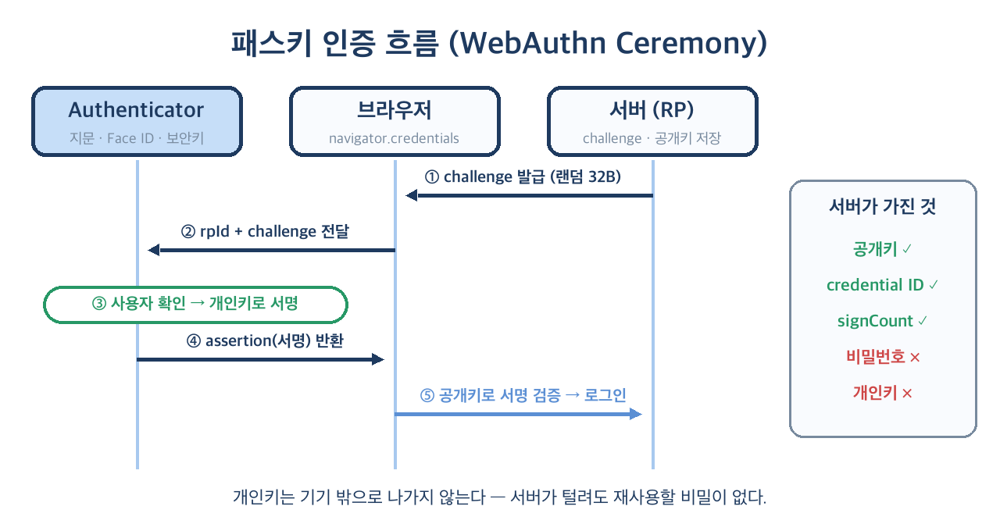
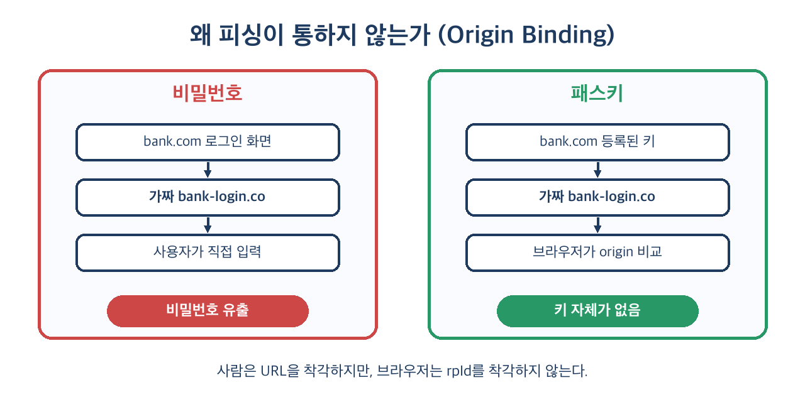

# 🔑 패스키(Passkeys)와 WebAuthn 완벽 가이드

> "가장 안전한 비밀번호는 **존재하지 않는 비밀번호**다."
>
> 지문 한 번, 얼굴 한 번으로 끝나는 로그인. 그 뒤에서 돌아가는 **공개키 암호와 WebAuthn API**를
> 개념부터 프론트·백엔드 구현, 그리고 실무에서 반드시 부딪히는 함정까지 정리합니다.

---

## 📌 목차

1. 왜 비밀번호는 끝나가고 있는가
2. 패스키란 무엇인가 — 한 문장 정의
3. 용어 정리: FIDO2, WebAuthn, CTAP, Passkey
4. 동작 원리 — 공개키 암호 30초 요약
5. 등록(Registration) 흐름과 코드
6. 인증(Authentication) 흐름과 코드
7. 조건부 UI — 자동완성으로 뜨는 패스키
8. 서버 검증: 무엇을, 왜 확인하는가
9. 동기화 패스키 vs 기기 결합 패스키
10. 피싱이 통하지 않는 이유
11. 실무에서 마주치는 함정
12. 패스키를 **바로 도입하면 안 되는** 경우
13. 기존 서비스에 점진 도입하기
14. 정리

---

## 🧭 1. 왜 비밀번호는 끝나가고 있는가

비밀번호는 50년 넘게 인증의 기본값이었지만, 구조적으로 세 가지 약점을 안고 있습니다.

- **공유 비밀(Shared Secret)**: 사용자와 서버가 같은 비밀을 알고 있어야 합니다. 서버 DB가 털리면 해시라도 오프라인 크래킹 대상이 됩니다.
- **사람이 입력한다**: 사람은 URL을 착각합니다. `bank.com`과 `bank-login.co`를 구분하지 못하는 순간 피싱이 성립합니다.
- **재사용된다**: 대부분의 사용자는 여러 사이트에 같은 비밀번호를 씁니다. 한 곳이 털리면 크리덴셜 스터핑으로 연쇄 피해가 납니다.

그래서 OTP, SMS 인증, 푸시 승인 같은 2단계 인증(2FA)이 덧대어졌지만, 이것들도 **실시간 피싱 프록시(AiTM)** 앞에서는 무력합니다.
사용자가 가짜 사이트에 OTP를 입력하면 공격자가 그대로 진짜 사이트에 중계하면 되니까요.

| 방식 | 서버 유출 시 | 피싱 저항 | 사용자 경험 |
|------|--------------|-----------|-------------|
| 비밀번호 | ❌ 해시 크래킹 위험 | ❌ | 외워야 함 |
| 비밀번호 + SMS OTP | ⚠️ | ❌ (중계 가능, SIM 스와핑) | 느림 |
| 비밀번호 + TOTP 앱 | ⚠️ | ❌ (중계 가능) | 앱 전환 필요 |
| **패스키** | ✅ 공개키뿐이라 무의미 | ✅ origin 바인딩 | 생체 인증 1회 |

2020년대 중반 이후 Apple·Google·Microsoft가 OS와 비밀번호 관리자 수준에서 패스키를 기본 지원하면서,
패스키는 "보안팀이 원하는 기능"에서 **"사용자가 더 편해서 쓰는 기능"** 으로 넘어왔습니다.

---

## 🔐 2. 패스키란 무엇인가 — 한 문장 정의

> **패스키 = 특정 웹사이트(도메인)에 묶인 공개키·개인키 쌍. 개인키는 사용자 기기 안에만 있고, 생체 인증이나 PIN으로 잠금 해제된다.**

사용자 입장에서는 이렇게 보입니다.

```text
[아이디 입력칸 클릭] → "패스키로 로그인" 제안 → 지문/Face ID → 끝
```

비밀번호를 **입력하지 않습니다**. 서버로 전송되는 비밀도 없습니다.
기기가 서버가 보낸 무작위 문자열(challenge)에 **개인키로 서명**하고, 서버는 저장해 둔 **공개키로 검증**할 뿐입니다.

중요한 오해 하나를 짚고 가겠습니다.

> 🙅 "지문 데이터가 서버로 간다" — **아닙니다.**
> 생체 정보는 기기 안에서 개인키 잠금을 푸는 용도로만 쓰이고, 기기 밖으로 나가지 않습니다.
> 서버는 사용자가 지문을 썼는지 PIN을 썼는지조차 알 수 없고, "사용자 확인이 됐다(UV 플래그)"는 사실만 받습니다.

---

## 📚 3. 용어 정리: FIDO2, WebAuthn, CTAP, Passkey

이 분야는 이름이 많아서 처음에 헷갈립니다. 계층으로 보면 명확해집니다.

| 용어 | 정체 | 누가 만듦 | 한 줄 설명 |
|------|------|-----------|------------|
| **FIDO2** | 표준 묶음의 이름 | FIDO Alliance + W3C | WebAuthn + CTAP의 총칭 |
| **WebAuthn** | 브라우저 JS API | W3C | `navigator.credentials.create/get` |
| **CTAP2** | 기기 간 통신 프로토콜 | FIDO Alliance | 브라우저 ↔ 보안키/휴대폰 (USB·NFC·BLE) |
| **Authenticator** | 키를 보관·서명하는 주체 | — | Touch ID, Windows Hello, YubiKey, 휴대폰 |
| **Relying Party (RP)** | 인증을 요청하는 서비스 | — | 우리가 만드는 웹 서비스 (+ 서버) |
| **Passkey** | 마케팅 용어이자 사실상 표준명 | 업계 공통 | **발견 가능한(discoverable) FIDO 크리덴셜** |

기술적으로 패스키는 WebAuthn의 **Discoverable Credential(구 Resident Key)** 입니다.
아이디를 먼저 묻지 않아도 기기가 "이 사이트용 키가 있다"고 스스로 찾아 줄 수 있는 크리덴셜이라는 뜻입니다.

---

## 🧮 4. 동작 원리 — 공개키 암호 30초 요약

패스키를 이해하는 데 필요한 암호학은 딱 이것뿐입니다.

```text
개인키로 서명한 것은 → 짝이 되는 공개키로만 검증할 수 있다.
공개키를 알아도 → 개인키를 역산할 수 없다.
```

여기에 두 가지 장치가 더해집니다.

1. **Challenge**: 서버가 매번 새로 만드는 무작위 값. 서명을 재사용(리플레이)하지 못하게 합니다.
2. **rpId 바인딩**: 키는 생성 시점의 도메인(`example.com`)에 묶입니다. 다른 도메인에서는 키가 아예 **보이지 않습니다.**



결과적으로 서버 DB에는 공개키만 남습니다. DB가 통째로 유출되어도 공격자가 할 수 있는 일은
"이 공개키로 서명을 검증하는 것"뿐이고, 서명을 **만들 수는** 없습니다.

---

## 📝 5. 등록(Registration) 흐름과 코드

등록은 "이 계정에 새 키를 묶는" 과정입니다. 보통 로그인된 상태(또는 회원가입 직후)에서 진행합니다.

### 5-1. 서버: 옵션 생성

Node.js에서는 사실상 표준인 `@simplewebauthn/server`를 쓰면 바이너리 파싱을 직접 할 필요가 없습니다.

```js
// server/passkey.js
import { generateRegistrationOptions } from '@simplewebauthn/server';

const rpID = 'example.com';
const rpName = 'Logic-Phantom';

app.post('/passkey/register/options', async (req, res) => {
  const user = req.session.user;
  const existing = await db.credentials.findByUser(user.id);

  const options = await generateRegistrationOptions({
    rpName,
    rpID,
    userName: user.email,
    userDisplayName: user.nickname,
    userID: user.webauthnUserId,          // ⚠️ 이메일이 아닌 랜덤 바이트
    attestationType: 'none',
    excludeCredentials: existing.map((c) => ({ id: c.credentialId })),
    authenticatorSelection: {
      residentKey: 'required',            // 패스키(발견 가능)로 생성
      userVerification: 'preferred',
    },
  });

  req.session.currentChallenge = options.challenge; // 서버 세션에 보관
  res.json(options);
});
```

### 5-2. 브라우저: 키 생성

최신 브라우저는 JSON ↔ ArrayBuffer 변환 헬퍼를 내장하고 있어 Base64URL 변환 코드를 따로 짤 필요가 줄었습니다.

```js
// client/register.js
async function registerPasskey() {
  const optionsJSON = await fetch('/passkey/register/options', { method: 'POST' })
    .then((r) => r.json());

  const publicKey = PublicKeyCredential.parseCreationOptionsFromJSON(optionsJSON);
  const credential = await navigator.credentials.create({ publicKey });

  await fetch('/passkey/register/verify', {
    method: 'POST',
    headers: { 'Content-Type': 'application/json' },
    body: JSON.stringify(credential.toJSON()),
  });
}
```

> 💡 `parseCreationOptionsFromJSON`을 지원하지 않는 구형 브라우저까지 대응해야 한다면
> `@simplewebauthn/browser`의 `startRegistration()`을 쓰면 폴리필을 대신 해 줍니다.

### 5-3. 서버: 검증 후 저장

```js
import { verifyRegistrationResponse } from '@simplewebauthn/server';

app.post('/passkey/register/verify', async (req, res) => {
  const { verified, registrationInfo } = await verifyRegistrationResponse({
    response: req.body,
    expectedChallenge: req.session.currentChallenge,
    expectedOrigin: 'https://example.com',
    expectedRPID: 'example.com',
  });
  req.session.currentChallenge = undefined; // 1회용

  if (!verified) return res.status(400).end();

  const { credential, credentialDeviceType, credentialBackedUp } = registrationInfo;
  await db.credentials.insert({
    userId: req.session.user.id,
    credentialId: credential.id,
    publicKey: Buffer.from(credential.publicKey),
    counter: credential.counter,
    transports: req.body.response.transports,
    deviceType: credentialDeviceType,   // 'singleDevice' | 'multiDevice'
    backedUp: credentialBackedUp,
    createdAt: new Date(),
  });
  res.json({ ok: true });
});
```

저장해야 할 컬럼은 최소 다음과 같습니다.

| 컬럼 | 용도 |
|------|------|
| `credential_id` | 인증 시 어떤 키인지 찾는 키 (UNIQUE 인덱스) |
| `public_key` | 서명 검증용 (COSE 형식 바이너리) |
| `user_id` | 계정 연결 (1:N — 한 계정에 여러 패스키) |
| `counter` | signCount, 복제 탐지용 |
| `transports` | `internal`, `hybrid`, `usb` 등 — 인증 시 힌트 |
| `backed_up` | 동기화 여부 — 복구 정책 판단에 사용 |
| `created_at`, `last_used_at` | 관리 화면에 "마지막 사용" 표시 |

---

## 🔓 6. 인증(Authentication) 흐름과 코드

인증은 등록보다 단순합니다. 서버가 challenge를 주고, 기기가 서명하고, 서버가 검증합니다.

```js
// server
import { generateAuthenticationOptions, verifyAuthenticationResponse } from '@simplewebauthn/server';

app.post('/passkey/login/options', async (req, res) => {
  const options = await generateAuthenticationOptions({
    rpID,
    userVerification: 'preferred',
    allowCredentials: [],     // 비워 두면 기기가 이 사이트의 패스키를 알아서 찾음
  });
  req.session.currentChallenge = options.challenge;
  res.json(options);
});

app.post('/passkey/login/verify', async (req, res) => {
  const cred = await db.credentials.findById(req.body.id);
  if (!cred) return res.status(404).end();

  const { verified, authenticationInfo } = await verifyAuthenticationResponse({
    response: req.body,
    expectedChallenge: req.session.currentChallenge,
    expectedOrigin: 'https://example.com',
    expectedRPID: rpID,
    credential: { id: cred.credentialId, publicKey: cred.publicKey, counter: cred.counter },
  });
  req.session.currentChallenge = undefined;

  if (!verified) return res.status(401).end();

  await db.credentials.update(cred.id, {
    counter: authenticationInfo.newCounter,
    lastUsedAt: new Date(),
  });
  req.session.userId = cred.userId;   // 로그인 성공
  res.json({ ok: true });
});
```

```js
// client
const optionsJSON = await fetch('/passkey/login/options', { method: 'POST' }).then((r) => r.json());
const publicKey = PublicKeyCredential.parseRequestOptionsFromJSON(optionsJSON);
const assertion = await navigator.credentials.get({ publicKey });
await fetch('/passkey/login/verify', {
  method: 'POST',
  headers: { 'Content-Type': 'application/json' },
  body: JSON.stringify(assertion.toJSON()),
});
```

### Spring 진영이라면

Spring Security 6.4부터 WebAuthn(패스키) 지원이 들어왔습니다. 최소 설정은 이 정도입니다.

```java
@Bean
SecurityFilterChain security(HttpSecurity http) throws Exception {
    return http
        .authorizeHttpRequests(a -> a.anyRequest().authenticated())
        .formLogin(Customizer.withDefaults())
        .webAuthn(w -> w
            .rpName("Logic-Phantom")
            .rpId("example.com")
            .allowedOrigins("https://example.com"))
        .build();
}
```

기본 구현은 인메모리 저장소를 쓰므로, 운영에서는 `UserCredentialRepository`와
`PublicKeyCredentialUserEntityRepository`를 JDBC 구현으로 교체해야 합니다.
더 세밀한 제어가 필요하면 `webauthn4j`나 Yubico의 `java-webauthn-server`를 직접 쓰는 방법도 있습니다.

---

## ✨ 7. 조건부 UI — 자동완성으로 뜨는 패스키

"패스키로 로그인" 버튼을 따로 두면 사용자가 잘 누르지 않습니다.
**Conditional Mediation**을 쓰면 아이디 입력칸의 자동완성 목록에 패스키가 비밀번호와 함께 나타납니다.

```html
<input type="text" name="username" autocomplete="username webauthn" />
```

```js
async function initConditionalUI() {
  if (!(await PublicKeyCredential.isConditionalMediationAvailable?.())) return;

  const optionsJSON = await fetch('/passkey/login/options', { method: 'POST' }).then((r) => r.json());
  const assertion = await navigator.credentials.get({
    publicKey: PublicKeyCredential.parseRequestOptionsFromJSON(optionsJSON),
    mediation: 'conditional',   // 모달 없이 자동완성에 대기
  });
  await verifyOnServer(assertion);
}

initConditionalUI(); // 페이지 로드 시 바로 호출
```

핵심 포인트:

- `autocomplete` 값에 **`webauthn` 토큰이 반드시** 들어가야 합니다. 없으면 목록에 뜨지 않습니다.
- `get()`은 사용자가 패스키를 고를 때까지 **pending 상태로 대기**합니다. 다른 로그인 방식(비밀번호 제출)으로 넘어갈 때는 `AbortController`로 취소하세요.
- 기존 비밀번호 폼을 그대로 둔 채 **덧붙이기만** 하면 되므로 도입 비용이 가장 낮은 진입점입니다.

최근에는 비밀번호로 로그인한 직후, 비밀번호 관리자가 **자동으로 패스키를 만들어 주는 조건부 생성**(`create()`에 `mediation: 'conditional'`)도 등장했습니다.
지원 여부는 `PublicKeyCredential.getClientCapabilities()`로 확인할 수 있습니다.

```js
const caps = await PublicKeyCredential.getClientCapabilities?.() ?? {};
if (caps.conditionalCreate) {
  // 비밀번호 로그인 성공 직후 조용히 패스키 업그레이드 시도
}
```

---

## 🛡️ 8. 서버 검증: 무엇을, 왜 확인하는가

라이브러리가 해 주더라도 **무엇을 검증하는지** 알아야 설정 실수를 잡을 수 있습니다.

| 검증 항목 | 위치 | 왜 필요한가 |
|-----------|------|-------------|
| `type` | clientDataJSON | `webauthn.create` / `webauthn.get` 혼용 방지 |
| `challenge` | clientDataJSON | 리플레이 공격 방지 — 서버가 발급한 값과 일치 + 1회용 |
| `origin` | clientDataJSON | 피싱 사이트·다른 서브도메인에서 온 요청 차단 |
| `rpIdHash` | authenticatorData | 키가 우리 도메인용인지 확인 |
| **UP 플래그** | authenticatorData | 사용자가 실제로 존재(터치)했는가 |
| **UV 플래그** | authenticatorData | 생체/PIN으로 본인 확인했는가 — 필요 시 `required` |
| `signCount` | authenticatorData | 값이 줄어들면 키 복제 의심 |
| 서명 | signature | 저장된 공개키로 `authenticatorData + hash(clientDataJSON)` 검증 |

authenticatorData의 플래그 바이트는 다음 비트로 구성됩니다.

```text
bit 0  UP  User Present       — 터치했다
bit 2  UV  User Verified      — 생체/PIN으로 본인 확인
bit 3  BE  Backup Eligible    — 동기화 가능한 키인가
bit 4  BS  Backup State       — 지금 실제로 백업되어 있는가
bit 6  AT  Attested data      — 등록 시 공개키 포함
bit 7  ED  Extension data     — 확장 데이터 포함
```

---

## ☁️ 9. 동기화 패스키 vs 기기 결합 패스키

패스키 확산의 결정적 계기는 **동기화**였습니다. 예전 FIDO 키는 기기를 잃어버리면 끝이었지만,
지금의 패스키는 iCloud 키체인, Google 비밀번호 관리자, 1Password 같은 **패스키 제공자**를 통해 기기 간에 동기화됩니다.

| 구분 | 동기화 패스키 (Multi-device) | 기기 결합 패스키 (Device-bound) |
|------|------------------------------|--------------------------------|
| 예시 | iCloud 키체인, Google PM, 1Password | YubiKey, 일부 기업용 Windows Hello |
| 기기 분실 시 | 다른 기기에서 그대로 사용 | 해당 키 사용 불가 |
| BE / BS 플래그 | 1 / 1 | 0 / 0 |
| signCount | 대부분 항상 0 | 증가함 |
| 보안 수준 | 제공자 계정 보안에 의존 | 가장 높음 (하드웨어 격리) |
| 적합한 곳 | 일반 소비자 서비스 | 금융·관리자 콘솔·규제 산업 |

다른 기기(예: 친구 PC)에서 로그인할 때는 **하이브리드(Hybrid) 전송**이 쓰입니다.
PC 화면의 QR 코드를 휴대폰으로 찍으면, 블루투스로 **근접성을 확인**한 뒤 휴대폰이 서명해 줍니다.
블루투스 근접 확인 덕분에 원격 공격자가 QR만 가로채서는 인증할 수 없습니다.

---

## 🎣 10. 피싱이 통하지 않는 이유

패스키의 진짜 가치는 편의성이 아니라 **구조적 피싱 저항성**입니다.



- 브라우저는 `create()`/`get()`을 호출한 페이지의 origin을 **직접** `clientDataJSON`에 기록합니다. 페이지 JS가 위조할 수 없습니다.
- 인증기는 요청된 rpId에 해당하는 키만 꺼냅니다. `bank-login.co`에는 `bank.com`의 키가 **존재하지 않습니다.**
- 설령 공격자가 서명을 중계하더라도, 서명 안의 origin이 `bank-login.co`로 찍혀 있어 서버 검증에서 탈락합니다.

즉 **사용자가 속더라도 인증이 성립하지 않습니다.** 사용자 교육에 의존하던 보안을 프로토콜이 대신 떠맡는 셈입니다.

---

## ⚠️ 11. 실무에서 마주치는 함정

### ① rpId는 사실상 되돌릴 수 없다

패스키는 등록 시점의 rpId에 영구히 묶입니다. `app.example.com`으로 등록하면 나중에 `example.com`에서 쓸 수 없습니다.

```text
✅ rpId = 'example.com'        → example.com, app.example.com, admin.example.com 모두 사용 가능
❌ rpId = 'app.example.com'    → 상위 도메인·형제 서브도메인에서 사용 불가
```

처음부터 **등록 가능한 최상위 도메인**을 rpId로 잡으세요. 서로 다른 도메인(예: `example.com`과 `example.co.kr`)을 묶어야 한다면
`https://example.com/.well-known/webauthn`에 허용 origin 목록을 두는 **Related Origin Requests**를 검토해야 합니다.

### ② `user.id`에 이메일을 넣지 마라

`user.id`(user handle)는 인증기에 저장되고, 인증 응답에 그대로 돌아옵니다. 개인정보를 넣으면 안 되고,
이메일 변경 시 연결이 깨집니다. **계정당 64바이트 이하의 랜덤 값**을 따로 생성해 저장하세요.

### ③ challenge를 클라이언트에 맡기지 마라

challenge를 쿠키나 hidden 필드에 넣어 두고 "돌아온 값과 비교"하면 리플레이 방어가 무너집니다.
**서버 세션(또는 짧은 TTL의 서버 저장소)** 에 두고, 한 번 쓰면 즉시 폐기합니다.

### ④ signCount 0을 에러로 처리하지 마라

동기화 패스키는 대부분 signCount를 항상 `0`으로 보냅니다. "카운터가 증가하지 않았다 → 복제"로 판단하면
정상 사용자를 전부 막게 됩니다. **두 값이 모두 0이면 검사를 건너뛰는** 것이 표준 동작입니다.

### ⑤ 삭제한 패스키가 기기에 유령처럼 남는다

서버에서 크리덴셜을 지워도 사용자 기기의 패스키는 남아 있어, 선택하면 로그인이 실패합니다.
최신 브라우저가 제공하는 **Signal API**로 비밀번호 관리자에게 알려 줄 수 있습니다.

```js
// 서버가 "모르는 credential"이라고 응답했을 때
await PublicKeyCredential.signalUnknownCredential?.({
  rpId: 'example.com',
  credentialId: assertion.id,
});
```

### ⑥ iframe·WebView에서는 기본적으로 막혀 있다

- iframe 안에서 호출하려면 부모 페이지에 `allow="publickey-credentials-get *"` 권한 정책이 필요합니다.
- 안드로이드 앱의 WebView는 브라우저와 동작이 다릅니다. 앱이라면 **Credential Manager API**(Android), **AuthenticationServices**(iOS) 같은 네이티브 API와 `assetlinks.json` / `apple-app-site-association` 연결을 고려하세요.

### ⑦ 개발 환경은 HTTPS 또는 localhost

WebAuthn은 Secure Context에서만 동작합니다. `http://localhost`는 예외로 허용되지만,
`http://192.168.0.10:3000`처럼 IP로 접속하면 `navigator.credentials`가 동작하지 않습니다. 모바일 실기 테스트는 터널(HTTPS)을 쓰세요.

---

## 🚫 12. 패스키를 **바로 도입하면 안 되는** 경우

패스키가 만능은 아닙니다. 다음 상황에서는 "비밀번호 제거"를 서두르면 안 됩니다.

| 상황 | 이유 | 대안 |
|------|------|------|
| **계정 복구 체계가 없다** | 모든 기기를 잃은 사용자를 구제할 수단이 없음 | 복구 코드·본인확인 절차를 먼저 설계 |
| **공용 PC·키오스크 중심 서비스** | 개인 기기에 키를 저장한다는 전제가 깨짐 | 하이브리드(QR) 로그인 또는 기존 방식 유지 |
| **사내 레거시 브라우저 강제** | 구형 IE 모드·임베디드 브라우저 미지원 | 지원 브라우저 전환 이후로 연기 |
| **공유 계정 문화** | 팀이 하나의 계정을 돌려 쓰면 키 관리 불가 | 계정 분리 + 권한 모델 먼저 정비 |
| **규제상 기기 결합 필수** | 동기화 패스키는 "소지 요소" 인정이 모호할 수 있음 | attestation 검증 + 하드웨어 키 한정 |

특히 첫 번째가 가장 흔한 실패입니다. **"패스키 도입"은 사실 "계정 복구 재설계"와 같은 프로젝트**라고 생각해야 합니다.
복구 경로가 SMS 하나라면, 공격자는 패스키 대신 복구 경로를 공격합니다. 가장 약한 고리가 전체 보안 수준을 결정합니다.

---

## 🪜 13. 기존 서비스에 점진 도입하기

한 번에 비밀번호를 없애는 서비스는 없습니다. 검증된 순서는 다음과 같습니다.

```text
1단계  패스키를 "추가 로그인 수단"으로 제공      (설정 > 보안 > 패스키 추가)
2단계  조건부 UI 적용                            (아이디 칸 자동완성에 노출)
3단계  비밀번호 로그인 직후 패스키 등록 권유      (또는 조건부 생성)
4단계  패스키 보유자에게 2FA 면제                  (UX 보상)
5단계  신규 가입을 패스키 우선으로               (비밀번호는 선택)
6단계  패스키 전용 계정 허용 (비밀번호 삭제 옵션)
```

단계마다 측정해야 할 지표도 정해 두면 좋습니다.

| 지표 | 의미 |
|------|------|
| 패스키 등록률 | 활성 사용자 중 패스키 1개 이상 보유 비율 |
| 패스키 로그인 비중 | 전체 로그인 중 패스키로 성공한 비율 |
| 등록 이탈률 | 등록 모달에서 취소(`NotAllowedError`)한 비율 |
| 로그인 소요 시간 | 비밀번호 대비 단축 폭 |
| 복구 요청 건수 | 도입 후 증가한다면 복구 UX 점검 신호 |

그리고 설정 화면에는 반드시 **패스키 목록 관리** 기능을 두세요. 이름(예: "iCloud 키체인", "YubiKey 5C"),
등록일, 마지막 사용일, 삭제 버튼 정도면 충분합니다. 사용자가 무엇을 등록했는지 모르면 신뢰가 생기지 않습니다.

> 💡 패스키 이름은 등록 응답의 `aaguid`로 인증기 종류를 조회해 자동으로 붙일 수 있습니다.
> 커뮤니티가 관리하는 passkey-authenticator-aaguids 목록을 참고하면 편합니다.

---

## 🧾 14. 정리

- 패스키는 **도메인에 묶인 공개키 쌍**이며, 개인키는 기기를 떠나지 않는다
- 서버에는 공개키만 남아 **DB 유출이 곧 계정 탈취로 이어지지 않는다**
- 브라우저가 origin을 직접 기록하므로 **사용자가 속아도 피싱이 성립하지 않는다**
- 구현의 핵심은 `navigator.credentials.create/get` + 서버의 challenge·origin·rpId 검증
- **rpId 설계, user handle, signCount 0, 계정 복구**가 실무 4대 함정이다
- 도입은 "추가 수단 → 조건부 UI → 등록 권유 → 패스키 우선" 순으로 점진적으로

> ✨ **한 줄 요약**
> 패스키는 사용자를 더 똑똑하게 만드는 대신, **속아도 안전한 구조**를 만든다.

---

## 📚 참고 자료

- [W3C Web Authentication Level 3](https://www.w3.org/TR/webauthn-3/)
- [MDN — Web Authentication API](https://developer.mozilla.org/en-US/docs/Web/API/Web_Authentication_API)
- [passkeys.dev — 개발자 가이드](https://passkeys.dev/)
- [FIDO Alliance — Passkeys](https://fidoalliance.org/passkeys/)
- [SimpleWebAuthn 문서](https://simplewebauthn.dev/)
- [Spring Security — Passkeys](https://docs.spring.io/spring-security/reference/servlet/authentication/passkeys.html)
- [web.dev — 폼 자동완성을 통한 패스키 로그인](https://web.dev/articles/passkey-form-autofill)
