# 🌟 PWA: 웹과 앱의 경계를 허물다

## 💡 PWA란 무엇인가?

Progressive Web App(PWA)은 웹사이트에 네이티브 앱과 같은 경험을 제공하는 최신 웹 기술입니다. 
사용자는 웹사이트를 스마트폰의 홈 화면에 설치하고, 오프라인에서도 사용할 수 있습니다.

## 🎯 주요 특징

### 1. 설치 가능 (Installable) 
```javascript
// manifest.json
{
  "name": "My PWA App",
  "short_name": "PWA",
  "start_url": "/",
  "display": "standalone"
}
```
- 홈 화면에 앱처럼 설치
- 앱 서랍에서 실행 가능
- 스플래시 스크린 지원

### 2. 오프라인 지원 (Offline Support)
```javascript
// service-worker.js
workbox.routing.registerRoute(
  ({request}) => request.destination === 'image',
  new workbox.strategies.CacheFirst()
);
```
- 서비스 워커를 통한 캐싱
- 네트워크 없이도 동작
- 백그라운드 동기화

### 3. 앱과 같은 경험 (App-like Experience)
- 전체 화면 모드
- 푸시 알림 지원
- 네이티브 기능 접근

## 🛠 기술 스택

### 핵심 요소
1. **Service Workers**
   - 오프라인 기능 제공
   - 백그라운드 동기화
   - 푸시 알림 처리

2. **Web App Manifest**
   - 앱 설치 설정
   - 아이콘 및 테마 설정
   - 시작 URL 및 표시 모드

3. **Workbox**
   - 서비스 워커 관리
   - 캐싱 전략 구현
   - 라우팅 제어

## 📱 사용자 경험 향상

### 성능 향상

```mermaid
graph LR
    A[첫 방문] --> B[캐시 저장]
    B --> C[빠른 로딩]
    C --> D[앱 같은 경험]
```


### 참여도 증가
- 푸시 알림으로 사용자 재방문 유도
- 홈 화면 아이콘으로 접근성 향상
- 오프라인 지원으로 끊김 없는 경험

## 🔍 PWA 체크리스트

### 필수 요구사항
- [x] HTTPS 지원
- [x] 반응형 디자인
- [x] 서비스 워커 구현
- [x] Web App Manifest
- [x] 오프라인 동작

### 권장 사항
- [x] 빠른 로딩 시간
- [x] 크로스 브라우저 지원
- [x] SEO 최적화
- [ ] 푸시 알림 (선택적)

## 🌈 PWA의 미래

### 발전 방향
1. **더 강력한 네이티브 기능**
   - 파일 시스템 접근
   - 하드웨어 제어
   - 백그라운드 프로세스

2. **향상된 성능**
   - 더 빠른 로딩
   - 더 나은 캐싱
   - 최적화된 리소스 관리

3. **보안 강화**
   - 더 안전한 데이터 저장
   - 향상된 인증 방식
   - 개인정보 보호

## 💫 결론

PWA는 웹의 미래입니다. 네이티브 앱의 장점과 웹의 접근성을 결합하여, 
사용자에게 최상의 경험을 제공합니다. 특히 Gatsby와 같은 최신 프레임워크와 
결합하면, 더욱 강력하고 효율적인 웹 애플리케이션을 만들 수 있습니다.

> 💡 **Tip**: PWA는 점진적 향상(Progressive Enhancement)의 철학을 따릅니다. 
> 기본적인 웹 경험부터 시작하여, 사용자의 브라우저가 지원하는 만큼 
> 더 나은 경험을 제공합니다.

## 📚 참고 자료

- [PWA Documentation - MDN](https://developer.mozilla.org/en-US/docs/Web/Progressive_web_apps)
- [Google PWA Guide](https://web.dev/progressive-web-apps/)
- [Workbox Documentation](https://developers.google.com/web/tools/workbox) 