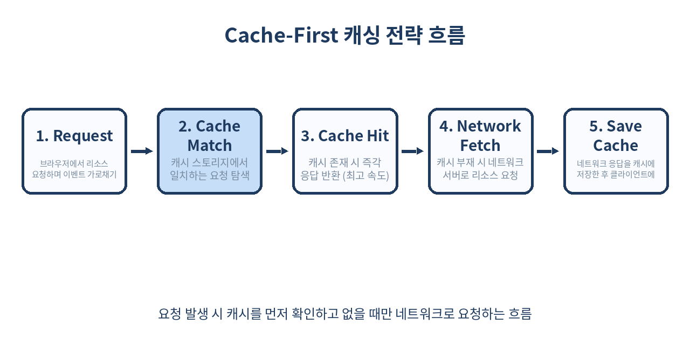
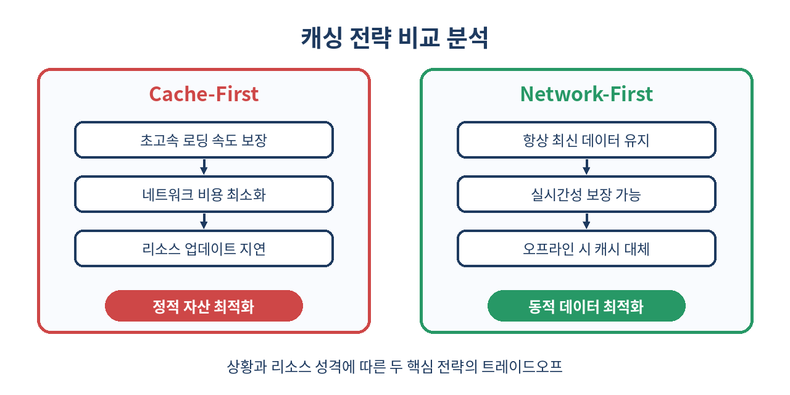

# ⚡ 서비스 워커 캐싱 전략 마스터 가이드

> "네트워크가 끊겨도 우리 서비스는 멈추지 않는다."
> 오프라인 우선(Offline-First) 웹 앱을 구축하기 위한 서비스 워커(Service Worker) 캐싱 전략의 모든 것을 실무 코드를 통해 깊이 있게 파헤칩니다.

---

## 📌 목차
1. 🧭 서비스 워커 캐싱의 본질
2. 🛠️ Cache-First 전략과 구현 기법
3. 🌐 Network-First 전략과 구현 기법
4. 🔄 Stale-While-Revalidate 전략
5. 🛑 Cache-Only와 Network-Only 전략
6. 📊 캐싱 전략 한눈에 비교하기
7. ⚠️ 캐시 수명과 무효화(Cache Invalidation) 기법
8. ⚡ 대용량 미디어 및 스트리밍 캐싱의 함정
9. 🚫 서비스 워커 캐싱을 절대 쓰면 안 되는 경우
10. ⚙️ 실무 디버깅 및 크롬 개발자 도구 활용 팁
11. 🧾 정리 및 핵심 체크리스트

---

## 🧭 1. 서비스 워커 캐싱의 본질

브라우저의 일반적인 HTTP 캐시는 브라우저가 정한 규칙이나 단순한 HTTP 헤더(`Cache-Control`)에 의존하여 작동합니다. 하지만 서비스 워커(Service Worker)가 제공하는 캐시 스토리지 API(Cache Storage API)를 사용하면 개발자가 자바스크립트로 직접 네트워크 요청을 가로채고(Intercept), 어떤 리소스를 어떻게 저장하고 반환할지 완벽하게 프로그래밍할 수 있습니다.

서비스 워커는 클라이언트와 실제 네트워크 중간에 위치하는 **프록시(Proxy) 서버** 역할을 수행하며, 이를 통해 완전한 오프라인 상태에서도 동작하는 진정한 PWA(Progressive Web App)를 구축할 수 있게 됩니다.

### HTTP 캐시 vs 서비스 워커 캐시의 아키텍처 차이

일반적인 HTTP 캐시는 브라우저 내부의 블랙박스 영역에 존재합니다. `Cache-Control: max-age=3600`과 같은 선언형 헤더에 의해 수동적으로 동작하며, 세밀한 조건부 제어나 오프라인 폴백(Fallback) 처리가 불가능합니다. 

반면 서비스 워커 캐시는 개발자가 직접 제어 가능한 명령형(Imperative) 캐시입니다. 서비스 워커는 메인 스레드와 분리된 단독 스레드(Worker Context)에서 실행되며, DOM에 직접 접근할 수 없는 대신 `fetch` 이벤트를 리스닝하여 네트워크로 나가는 모든 패킷을 검사, 수정, 우회할 수 있는 강력한 권한을 가집니다.

```
[브라우저 메인 스레드 (UI / DOM)]
               │
       (1) Fetch 요청 발생
               ▼
[서비스 워커 (Service Worker Thread)] ──(2) 캐시 확인──▶ [캐시 스토리지 (Cache Storage)]
               │                                                │
       (3) 캐시 미스 발생 시                                    │ (2-A) 캐시 히트 시 즉시 반환
               ▼                                                ▼
     [실제 네트워크 (인터넷)] ◀───────────────────────── [브라우저 화면 표출]
```

이러한 구조 덕분에 네트워크 환경이 불안정한 지하철 내부, 엘리베이터, 혹은 완전히 오프라인 상태인 극단적인 환경에서도 사용자에게 끊김 없는 서비스 제공이 가능해집니다.

---

## 🛠️ 2. Cache-First 전략과 구현 기법

**Cache-First** (또는 Cache-Falling-Back-to-Network) 전략은 성능을 극대화하고 네트워크 대역폭을 절약하는 가장 대표적인 기법입니다. 요청이 들어오면 먼저 로컬 캐시에서 해당 리소스를 찾고, 캐시에 없다면 그제서야 네트워크 요청을 보냅니다.



이 전략은 이미지, 폰트, 빌드 시 해시값이 포함된 정적 자산(CSS, JS) 등에 매우 적합합니다. 한 번 로컬에 저장되면 거의 변경될 일이 없는 자산들에 대해 불필요한 네트워크 왕복 시간(RTT)을 완전히 제거하여 0ms에 수렴하는 극적인 렌더링 속도를 확보할 수 있습니다.

### 실무용 프로덕션 레벨 Cache-First 구현

실무에서는 단순히 캐시를 반환하는 것에 그치지 않고, 서드파티 라이브러리 차단, 비정상 응답 필터링, 그리고 오프라인 시 대체할 디폴트 에셋(Fallback Asset) 반환 등의 정교한 예외 처리가 수반되어야 합니다.

```js
// sw.js - 정밀하게 설계된 Cache-First 전략
const STATIC_CACHE_NAME = 'static-assets-v2';
const FALLBACK_IMAGE_URL = '/images/fallback-placeholder.png';

// 설치(install) 단계에서 핵심 자산 및 폴백 이미지 사전 캐싱 (Precaching)
self.addEventListener('install', (event) => {
  event.waitUntil(
    caches.open(STATIC_CACHE_NAME).then((cache) => {
      console.log('[Service Worker] 필수 정적 에셋 프리캐싱 진행 중...');
      return cache.addAll([
        '/',
        '/index.html',
        '/css/main.css',
        '/js/app.js',
        FALLBACK_IMAGE_URL
      ]);
    }).then(() => self.skipWaiting())
  );
});

self.addEventListener('fetch', (event) => {
  const requestUrl = new URL(event.request.url);

  // GET 요청 및 정적 자산(이미지, 폰트, 스타일 등)에 대해서만 Cache-First 적용
  if (event.request.method === 'GET' && 
      (event.request.destination === 'image' || 
       event.request.destination === 'font' || 
       requestUrl.pathname.startsWith('/static/'))) {
    
    event.respondWith(
      caches.open(STATIC_CACHE_NAME).then((cache) => {
        return cache.match(event.request).then((cachedResponse) => {
          if (cachedResponse) {
            // 캐시 히트: 로컬에서 즉시 반환 (성능 최적화의 핵심)
            return cachedResponse;
          }

          // 캐시 미스: 네트워크에서 가져온 후 유효성 검증을 거쳐 캐시에 기록
          return fetch(event.request).then((networkResponse) => {
            // 응답이 유효하지 않은 경우(에러 페이지, 불완전 응답 등) 캐싱하지 않고 그대로 반환
            if (!networkResponse || networkResponse.status !== 200 || networkResponse.type !== 'basic') {
              return networkResponse;
            }

            // 응답 스트림은 단 한 번만 읽을 수 있으므로 복제(Clone)하여 보관
            cache.put(event.request, networkResponse.clone());
            return networkResponse;
          }).catch((err) => {
            console.error('[Service Worker] 네트워크 요청 실패. 폴백 처리 진행.', err);
            // 만약 이미지 요청이 실패한 경우, 사전에 준비한 폴백 대체 이미지 반환
            if (event.request.destination === 'image') {
              return cache.match(FALLBACK_IMAGE_URL);
            }
            throw err;
          });
        });
      })
    );
  }
});
```

### ⚠️ Cache-First의 치명적 함정: CORS와 불투명 응답(Opaque Response)
서드파티 CDN(예: Google Fonts, AWS S3 등)에서 가져오는 리소스에 대해 Cache-First를 적용할 때, CORS 헤더가 올바르게 설정되어 있지 않으면 브라우저는 이를 **불투명 응답(Opaque Response)**으로 처리합니다. 
이때 응답 코드는 `0`이 되며, 실제 크기를 알 수 없어 크롬 내부적으로 약 **7MB**의 가상 패딩 용량을 캐시 스토리지에 할당해 버립니다. 단 몇 개의 이미지 캐싱만으로도 브라우저 할당량(Quota Limit)이 초과되어 캐시가 강제 삭제되는 원인이 되므로, 외부 리소스 요청 시에는 반드시 `crossorigin` 속성을 부여하거나 불투명 응답을 캐시에서 제외하는 정밀 제어가 필요합니다.

---

## 🌐 3. Network-First 전략과 구현 기법

**Network-First** (또는 Network-Falling-Back-to-Cache) 전략은 항상 최신의 데이터를 보여주어야 하는 상황에 적합합니다. 요청이 발생하면 우선 네트워크 연결을 시도하고, 네트워크가 불안정하거나 완전히 오프라인 상태일 때에만 미리 보관해 두었던 캐시 데이터를 반환합니다.

이 전략은 실시간 트렌드 피드, 프로필 정보, 대시보드 데이터 등 동적 API 요청이나 주기적으로 콘텐츠가 변경되는 메인 페이지(HTML)에 필수적으로 사용됩니다.

```
[요청 발생] ──▶ (1) 네트워크 호출 시도 ──▶ [성공] ──▶ 캐시 업데이트 후 응답 반환
                    │
                 [실패 / 타임아웃]
                    ▼
          (2) 캐시 스토리지 조회 ──▶ [성공] ──▶ 이전 캐시 데이터 반환 (오프라인 폴백)
                    │
                 [실패]
                    ▼
          (3) 최후의 에러 핸들러 작동 (예: "네트워크 연결이 끊겼습니다" 안내)
```

### 실무용 프로덕션 레벨 Network-First 구현 (네트워크 타임아웃 기법 적용)

네트워크가 완전히 차단된 상태가 아니라 극도로 느린 상태(예: 3G 음영 지역)에서는 네트워크 요청이 무한히 펜딩(Pending)되어 사용자 경험이 극도로 악화됩니다. 실무에서는 일정 시간(예: 3초) 내에 네트워크 응답이 오지 않으면 강제로 캐시 데이터를 반환하는 **네트워크 타임아웃 헬퍼**가 반드시 탑재되어야 합니다.

```js
// sw.js - 네트워크 타임아웃이 결합된 Network-First 전략
const DYNAMIC_CACHE_NAME = 'dynamic-api-v2';
const NETWORK_TIMEOUT_MS = 3000; // 3초 타임아웃 지정

// 지정된 시간 이후 강제로 reject하는 타이머 프로미스 생성 헬퍼
function timeout(ms) {
  return new Promise((_, reject) => {
    setTimeout(() => reject(new Error('Network request timed out')), ms);
  });
}

self.addEventListener('fetch', (event) => {
  const requestUrl = new URL(event.request.url);

  // 사용자 프로필 정보 및 대시보드 API 요청에 적용
  if (requestUrl.pathname.startsWith('/api/v2/user/') || requestUrl.pathname.includes('/dashboard')) {
    event.respondWith(
      caches.open(DYNAMIC_CACHE_NAME).then((cache) => {
        // Promise.race를 이용해 네트워크 요청과 타임아웃 타이머 중 먼저 완료되는 쪽을 실행
        return Promise.race([
          fetch(event.request).then((networkResponse) => {
            // 정상 응답 수신 시 캐시 갱신 후 반환
            if (networkResponse.status === 200) {
              cache.put(event.request, networkResponse.clone());
            }
            return networkResponse;
          }),
          timeout(NETWORK_TIMEOUT_MS)
        ]).catch((error) => {
          console.warn('[Service Worker] 네트워크 지연 또는 장애 발생. 로컬 캐시 조회 진행.', error);
          
          // 네트워크 실패 또는 타임아웃 시 캐시 스토리지에서 대체 데이터 탐색
          return cache.match(event.request).then((cachedResponse) => {
            if (cachedResponse) {
              return cachedResponse;
            }
            // 캐시에도 없다면 JSON 포맷의 오프라인 안내 객체 반환
            return new Response(
              JSON.stringify({ 
                error: 'offline', 
                message: '현재 네트워크에 연결되어 있지 않으며, 저장된 오프라인 데이터가 없습니다.' 
              }), 
              { headers: { 'Content-Type': 'application/json' } }
            );
          });
        });
      })
    );
  }
});
```

---

## 🔄 4. Stale-While-Revalidate 전략

**Stale-While-Revalidate** 전략은 성능과 최신성 사이에서 가장 이상적인 절충안을 제시합니다. 화면에는 일단 캐시된 오래된 데이터(Stale)를 즉시 보여주어 사용자 경험을 비약적으로 끌어올리고, 백그라운드에서는 조용히 네트워크 요청을 보내 캐시를 새로운 데이터로 갱신(Revalidate)합니다.

이 전략은 웹 앱의 메인 자바스크립트, CSS 파일 또는 자주 변경되지만 실시간 즉각 반영이 치명적이지 않은 뉴스 피드 리스트 등에 엄청난 효과를 발휘합니다. 사용자는 항상 초고속으로 페이지 진입을 완료하고, 다음 새로고침 시 자연스럽게 최신 화면을 보게 됩니다.

```js
// sw.js - Stale-While-Revalidate 전략 구현 및 UI 동기화 기법
const REVALIDATE_CACHE_NAME = 'stale-assets-v2';

self.addEventListener('fetch', (event) => {
  const requestUrl = new URL(event.request.url);

  // 메인 스크립트 및 자주 변경되는 레이아웃 스타일 적용
  if (event.request.destination === 'script' || event.request.destination === 'style') {
    event.respondWith(
      caches.open(REVALIDATE_CACHE_NAME).then((cache) => {
        return cache.match(event.request).then((cachedResponse) => {
          
          // 백그라운드에서 네트워크 요청을 비동기로 조용히 수행
          const fetchPromise = fetch(event.request).then((networkResponse) => {
            if (networkResponse.status === 200) {
              // 캐시 데이터가 업데이트되었음을 감지하여 메인 스레드로 브로드캐스트 전송 가능 (옵션)
              cache.put(event.request, networkResponse.clone()).then(() => {
                // UI를 실시간으로 업데이트하기 위해 postMessage 활용 가능
                self.clients.matchAll().then((clients) => {
                  clients.forEach((client) => {
                    client.postMessage({
                      type: 'CACHE_UPDATED',
                      url: event.request.url
                    });
                  });
                });
              });
            }
            return networkResponse;
          }).catch((err) => console.log('[Service Worker] 백그라운드 갱신 실패 (오프라인 상태 등):', err));

          // 캐시 데이터가 존재하면 즉시 반환(성능 최적화), 없으면 백그라운드 fetch 완료 시까지 대기하여 반환
          return cachedResponse || fetchPromise;
        });
      })
    );
  }
});
```

---

## 🛑 5. Cache-Only와 Network-Only 전략

이 두 전략은 다른 복합 전략의 뼈대가 되거나, 엄격한 데이터 일관성이 요구되는 특정 비즈니스 상황에서 매우 한정적인 유스케이스로 사용됩니다.

### 1) Cache-Only 전략
오직 캐시 스토리지에만 리소스를 요청하며, 절대로 네트워크를 타지 않습니다. 이 전략은 웹 앱 빌드 시 완전히 고정되어 절대 바뀌지 않는 로컬 로고 이미지, 에러 페이지 전용 오프라인 HTML 파일, 고정 템플릿 등에 주로 사용됩니다.

```js
// sw.js - Cache-Only 구현
const OFFLINE_STATIC_CACHE = 'offline-static-v1';

self.addEventListener('fetch', (event) => {
  const requestUrl = new URL(event.request.url);
  
  if (requestUrl.pathname.includes('/assets/static-logos/')) {
    event.respondWith(
      caches.match(event.request).then((cachedResponse) => {
        if (cachedResponse) {
          return cachedResponse;
        }
        // 캐시에 없을 경우 브라우저 레벨 에러 발생 방지를 위한 빈 픽셀 응답 처리
        return new Response('', { status: 404, statusText: 'Not Found in Cache' });
      })
    );
  }
});
```

### 2) Network-Only 전략
캐싱 레이어를 거치지 않고 무조건 실제 외부 네트워크에 직접 통신합니다. 결제 트랜잭션 API, 파일 업로드 스트림, 보안 OTP 토큰 검증, 실시간 푸시 알림 수신 등 찰나의 데이터 정합성이 깨질 경우 치명적인 금융/보안/인프라 영역에 강제 설정해야 합니다.

```js
// sw.js - Network-Only 구현 및 예외 경로 지정
self.addEventListener('fetch', (event) => {
  const requestUrl = new URL(event.request.url);

  // 결제 검증 및 실시간 메시지 발송 API는 원천적으로 캐시 처리 배제
  if (requestUrl.pathname.startsWith('/api/v2/payment/') || requestUrl.pathname.startsWith('/api/v2/chat/send')) {
    event.respondWith(
      fetch(event.request).catch((err) => {
        // 네트워크 연결 실패 시 에러 응답 직접 가공하여 반환
        return new Response(
          JSON.stringify({ 
            success: false, 
            error: 'NetworkRequired', 
            message: '보안 통신 경로로써 반드시 안정적인 인터넷 연결이 필요합니다.' 
          }), 
          { status: 503, headers: { 'Content-Type': 'application/json' } }
        );
      })
    );
  }
});
```

---

## 📊 6. 캐싱 전략 한눈에 비교하기

각 서비스 내 리소스 유형(정적 자산, API 데이터, 중요 트랜잭션)에 따라 가장 부합하는 전략을 선택할 수 있도록 상세 기준을 비교 분석한 지표입니다.



| 캐싱 전략 | 로딩 속도 | 데이터 최신성 | 주 사용 리소스 유형 | 오프라인 완벽 지원 여부 | CORS 영향 및 단점 |
| :--- | :--- | :--- | :--- | :--- | :--- |
| **Cache-First** | 극도로 빠름 (0ms에 수렴) | 매우 낮음 (수동 무효화 필수) | 웹 폰트, 이미지 에셋, 청크 파일 | **완벽 지원** | 불투명 응답(Opaque Response) 시 가상 용량 패딩 문제 발생 |
| **Network-First** | 네트워크 환경에 종속 | 매우 높음 (실시간급) | 사용자 데이터, 실시간 피드, 동적 API | **지원** (이전 캐시 제공) | 느린 네트워크에서 로딩이 무한 대기할 위험 존재 (타임아웃 필수) |
| **Stale-While-Revalidate** | 극도로 빠름 (0ms에 수렴) | 보통 (다음 진입 시 최신화) | 메인 CSS/JS, 탭 리스트 데이터 | **완벽 지원** | 백그라운드 네트워크 트래픽이 지속적으로 발생함 |
| **Cache-Only** | 극도로 빠름 | 매우 낮음 (빌드 타임 고정) | 오프라인 에러 안내 HTML, 공통 로고 | **완벽 지원** | 동적 업데이트가 완전히 배제되므로 사전에 신중한 설계 필요 |
| **Network-Only** | 네트워크 환경에 종속 | 실시간 최신 | 결제 인증, 일회성 API, 파일 업로드 | **지원 안 됨** | 오프라인 시 브라우저 기본 에러 페이지 노출 위험 |

---

## ⚠️ 7. 캐시 수명과 무효화(Cache Invalidation) 기법

캐싱 전략보다 중요한 것은 **"어떻게 안전하게 캐시를 비워낼 것인가"**입니다. 서비스 워커 캐시 스토리지는 HTTP 캐시와 달리 유효기간(TTL) 개념이 내장되어 있지 않기 때문에, 한 번 캐싱된 파일은 수동으로 지우지 않는 한 사용자의 로컬 기기에 영원히 남아 구버전 화면만 띄우게 만듭니다.

### 1) 해시 기반 정적 파일 관리 (Vite / Webpack)
빌드 도구를 세팅하여 JS, CSS 등 결과물 파일에 유니크한 청크 해시값(예: `main.7d2b90ff.js`)을 파일명에 삽입합니다. 파일 내용이 바뀌면 해시가 바뀌어 경로 자체가 새롭게 생성되므로 자연스럽게 `Cache-First`를 우회하고 새 파일을 캐시하게 됩니다.

### 2) 서비스 워커 활성화(`activate`) 단계에서의 구형 캐시 완전 소거
가장 견고한 방법은 서비스 워커 스크립트 상단의 캐시 버전 코드(`CACHE_NAME`)를 업데이트하고, 활성화 단계에서 이전 버전 캐시를 통째로 완전 소거하는 루틴을 작성하는 것입니다.

```js
// sw.js - 프로덕션 수준의 구형 캐시 버전 스위칭 및 소거 기법
const CACHE_VERSION = 'v3';
const CURRENT_CACHES = {
  static: `static-cache-${CACHE_VERSION}`,
  dynamic: `dynamic-cache-${CACHE_VERSION}`
};

self.addEventListener('activate', (event) => {
  const expectedCacheNames = Object.values(CURRENT_CACHES);

  event.waitUntil(
    caches.keys().then((cacheNames) => {
      return Promise.all(
        cacheNames.map((cacheName) => {
          // 현재 활성화된 캐시 버전 목록에 포함되어 있지 않은 구형 캐시는 전부 삭제
          if (!expectedCacheNames.includes(cacheName)) {
            console.warn('[Service Worker] 구형 캐시 발견 및 자동 청소 중:', cacheName);
            return caches.delete(cacheName);
          }
        })
      );
    }).then(() => {
      // 새로운 서비스 워커가 활성화되자마자 대기 중인 클라이언트들을 강제로 제어(Claim)
      return self.clients.claim();
    })
  );
});
```

### 3) 캐시 개수 및 용량 제한 (LRU 알고리즘 직접 구현)
동적 이미지 캐싱 등 무제한으로 캐시 크기가 증가하는 것을 막기 위해, 최장 미사용(LRU) 관점에 기초하여 아이템의 개수나 전체 용량을 제한하는 자바스크립트 가비지 컬렉터를 직접 삽입하여 운영해야 합니다.

```js
// sw.js - 캐시 보관 개수 제한 헬퍼 구현
function trimCache(cacheName, maxItems) {
  caches.open(cacheName).then((cache) => {
    cache.keys().then((keys) => {
      if (keys.length > maxItems) {
        // 가장 오래된 첫 번째 캐시 아이템부터 삭제 조치 (FIFO 변형)
        cache.delete(keys[0]).then(() => {
          trimCache(cacheName, maxItems); // 재귀 호출로 한계치 도달 시까지 반복
        });
      }
    });
  });
}

// 사용 예시: 동적 캐싱이 일어날 때마다 호출
// trimCache(CURRENT_CACHES.dynamic, 50); // 최대 50개 유지
```

---

## ⚡ 8. 대용량 미디어 및 스트리밍 캐싱의 함정

오디오 및 비디오와 같은 대용량 미디어 파일은 일반적인 HTTP 요청과 다르게 브라우저가 필요한 부분만 조금씩 나누어 다운로드하는 `Range Request`를 사용합니다. 일반적인 캐싱 구조에서는 이 `Range: bytes=...` 헤더가 포함된 요청을 제대로 처리하지 못해 동영상이 무한 로딩되거나 재생 실패 오류를 내뱉게 됩니다.

Safari 브라우저(iOS/macOS) 환경의 `<video>` 태그는 스트리밍 시 반드시 `Range` 요청을 요구하며, HTTP 응답으로 `206 Partial Content`를 받지 못하고 전체 파일(`200 OK`)을 서비스 워커로부터 전달받으면 즉시 재생 오작동 및 에러 코드를 출력합니다.

```js
// sw.js - Range Request 감지 시 서비스 워커 가로채기 바이패스 처리
self.addEventListener('fetch', (event) => {
  const requestHeaders = event.request.headers;
  
  // 요청 헤더에 range 속성이 포함되어 있는지 명확히 감지
  if (requestHeaders.has('range')) {
    event.respondWith(
      // Range 요청은 단순 캐시 조작이 불가하므로, 서비스 워커 개입을 차단하고 
      // 네트워크로 직접 연결(Bypass)하여 브라우저 네이티브 스트리밍 모듈에 제어권을 위임합니다.
      fetch(event.request)
        .catch((err) => {
          console.error('[Service Worker] Range 요청을 네트워크로 바이패스하는 도중 실패:', err);
          // 오프라인 상태일 경우 적절한 대체 미디어 반환 불가 시 에러 처리
          return new Response('Offline Media Unavailable', { status: 503 });
        })
    );
  }
});
```

실무에서 미디어 파일을 서비스 워커 수준에서 완벽하게 캐싱하여 오프라인 재생을 구현하려면, 구글의 Workbox 라이브러리(`workbox-range-requests`) 플러그인을 가져와 가상 슬라이싱 로직을 직접 주입하는 구조적 설계가 반드시 선행되어야 합니다.

---

## 🚫 9. 서비스 워커 캐싱을 절대 쓰면 안 되는 경우

서비스 워커 캐싱은 매우 강력한 도구이지만, 잘못 다룰 경우 심각한 비즈니스 리스크를 초래할 수 있습니다. 다음과 같은 시나리오에서는 반드시 캐싱 영역에서 해당 경로를 완벽히 격리해야 합니다.

```js
// sw.js - 보안 및 정합성 보존을 위한 강력한 블랙리스트 패턴 필터링 예제
const BLACKLIST_PATTERNS = [
  /\/api\/v[0-9]\/auth\//,         // 사용자 로그인/MFA 인증 토큰 API
  /\/api\/v[0-9]\/payment\//,      // 결제, 환불, 카드 승인 트랜잭션 API
  /\/api\/v[0-9]\/admin\//,        // 관리자 백오피스 제어 API
  /service-worker\.js$/,           // 서비스 워커 자체 파일 (캐싱 시 영원히 업데이트 불가)
  /index\.html$/                   // 메인 HTML (자산 변경 추적이 복잡한 정적 세팅의 경우)
];

function isBlacklisted(url) {
  return BLACKLIST_PATTERNS.some((pattern) => pattern.test(url));
}

self.addEventListener('fetch', (event) => {
  const requestUrl = event.request.url;

  if (isBlacklisted(requestUrl)) {
    // 블랙리스트 매칭 시 캐시 스토리지를 아예 거치지 않고 Network-Only로 직접 패스스루 처리
    event.respondWith(fetch(event.request));
    return;
  }
});
```

### 필수 바이패스 대상 및 리스크 요인
1. **금융 및 결제 처리 트랜잭션**: 카드 승인, 계좌 조회, 송금 API 등은 단 한 번의 오차도 허용되어서는 안 됩니다. 캐시된 가짜 성공 응답이 사용자 기기에 남아있을 경우 중복 인출이나 비정상 결제 승인으로 즉각 이어집니다.
2. **다중 인증(MFA) 및 일회성 비밀번호(OTP)**: 보안 토큰 발급 결과나 세션 쿠키 제어 정보가 캐싱되어 로컬 파일에 보관되면, 동일한 모바일 기기나 공용 PC를 사용하는 타인에게 세션 하이재킹 등 치명적인 보안 취약점이 고스란히 노출될 위험이 있습니다.
3. **서비스 워커 파일 그 자체 (`service-worker.js`)**: 만약 브라우저 혹은 이전 서비스 워커가 `service-worker.js` 스크립트 파일을 로컬에 수개월 동안 영구 캐싱하게 만드는 실수를 저지르는 순간, 배포된 신규 서비스 워커 소스 코드를 사용자의 브라우저가 영원히 내려받지 못하는 **데드락(Deadlock) 지옥**에 빠지게 됩니다. 서비스 워커 파일 자체는 절대로 서비스 워커 및 HTTP 캐시가 보관하게 두어서는 안 되며, 서버 레벨에서 `Cache-Control: no-store, no-cache` 헤더를 강제해야 합니다.

---

## ⚙️ 10. 실무 디버깅 및 크롬 개발자 도구 활용 팁

서비스 워커는 백그라운드 환경에서 비동기적으로 상시 실행되는 특수 스레드이므로, 일반 자바스크립트 콘솔만으로는 흐름을 완벽히 포착하기 어렵습니다. 크롬 개발자 도구의 강력한 모니터링 기능과 연동하여 정밀 진단하는 기법을 마스터해야 합니다.

### 1) 서비스 워커 강제 즉시 반영 (Update on reload)
개발자 도구(`F12`)의 **Application** 탭 ➡️ 왼쪽 메뉴 **Service Workers**로 이동합니다.
* **Update on reload** 옵션을 체크해 두면, 새로고침을 누를 때마다 소스 코드 수정을 감지하여 서비스 워커의 `install` -> `activate` 수명 주기를 즉시 강제 컴파일합니다. 대기 상태(Waiting in queue)에 머물며 소스 코드가 바뀌지 않던 현상을 미연에 방지해 줍니다.
* **Bypass for network** 옵션을 체크하면, 서비스 워커의 모든 `fetch` 이벤트 리스너를 비활성화하고 순수한 다이렉트 네트워크 연결로만 테스트를 진행할 수 있습니다.

```
[Application 탭] ➡️ [Service Workers]
┌────────────────────────────────────────────────────────┐
│ ⬜ Offline      ☑️ Update on reload     ⬜ Bypass for network │
└────────────────────────────────────────────────────────┘
```

### 2) 캐시 내용 실시간 검사 및 우클릭 파괴
**Application** 탭 ➡️ **Cache Storage** 메뉴로 들어가면 현재 기기에 생성된 도메인별 캐시 이름 리스트가 실시간으로 노출됩니다.
* 개별 캐시 항목을 누르면 내부에 적재된 자산 목록(`Request URL`, `Response Status`, `Content-Length` 등)이 트리 뷰로 정밀히 매핑되어 보입니다.
* 캐시 무효화 디버깅 중 특정 파일이 왜 업데이트 안 되는지 의문이 생긴다면, 해당 캐시 데이터 행을 우클릭한 후 **Delete**를 눌러 수동으로 타겟팅 정리를 수행하며 롤백 단계를 관찰해 보아야 합니다.

### 3) 오프라인 모드 시뮬레이션
**Network** 탭 상단 혹은 **Application** 탭 내부의 **Offline** 체크박스를 활성화하여 무선 랜 카드가 끊긴 최악의 오프라인 모드를 가상 재현해 봅니다.
* 이때 페이지를 새로고침하거나 클릭 액션을 보냈을 때, `Network-First` 전략을 구성한 API가 에러 레이아웃으로 완벽히 전이되는지, 혹은 `Cache-First` 에셋들이 오프라인 상황에서도 화면에 깨짐 없이 즉각 주입되는지 가시적인 QA가 가능합니다.

---

## 🧾 11. 정리 및 핵심 체크리스트

서비스 워커 캐싱은 오프라인에서도 기동하는 완전한 웹 경험을 주도하는 마법과 같은 기술이지만, 무분별하게 적용된 캐시는 오히려 사용자에게 고장 난 과거의 서비스 화면을 송출하게 만듭니다. 안정적인 서비스 출시를 위해 다음 핵심 체크리스트를 반드시 완벽하게 검토해 주십시오.

- [x] **서비스 워커 파일 자체(`service-worker.js`)의 HTTP Cache-Control 헤더는 최장 `max-age=0` 혹은 `no-cache`로 명시되어 배포 데드락을 방지하고 있는가?**
- [x] **변동이 잦은 dynamic 리소스 및 개인 대시보드는 Network-First 혹은 Stale-While-Revalidate 전략을 사용하고 있는가?**
- [x] **거의 변경되지 않는 빌드 자산, 폰트, 공통 UI 이미지는 Cache-First 전략으로 0ms에 가깝게 로딩 속도를 최적화했는가?**
- [x] **서비스 워커의 활성화(`activate`) 라이프사이클 이벤트 리스너 내부에서 오래된 캐시 공간을 무결하게 파괴하는 자동 청소 비동기 코드가 가동되고 있는가?**
- [x] **비디오, 오디오 등 미디어 재생 시 유발되는 iOS/Safari용 `Range Request` 요청에 대한 우회(Bypass) 처리가 안전하게 구현되었는가?**
- [x] **결제 승인, 민감 금융 거래, 개인 비밀번호 검증 등 무결성이 필수적인 API는 블랙리스트 정규식 등으로 완벽히 차단하여 `Network-Only`로 직접 연결하고 있는가?**

> ✨ **한 줄 요약**
> 올바른 서비스 워커 캐싱 전략은 느린 모바일 환경과 오프라인 상황에서도 사용자 경험을 즉각적이고 매끄럽게 유지하는 최선의 무기이다.

---

## 📚 참고 자료
- [MDN Web Docs - Service Worker API 공식 레퍼런스](https://developer.mozilla.org/ko/docs/Web/API/Service_Worker_API)
- [Google Developers - Web Fundamentals: Workbox Caching Strategies 디자인 가이드](https://developer.chrome.com/docs/workbox/modules/workbox-strategies/)
- [W3C Service Workers Specification - 최신 웹 표준 명세서](https://w3c.github.io/ServiceWorker/)
