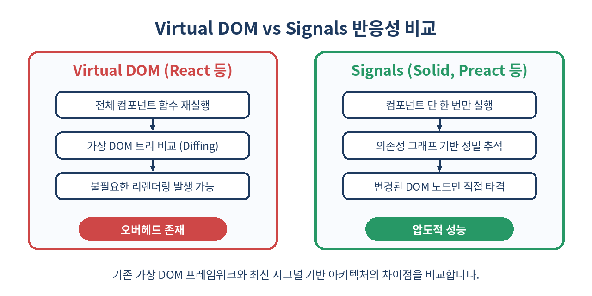
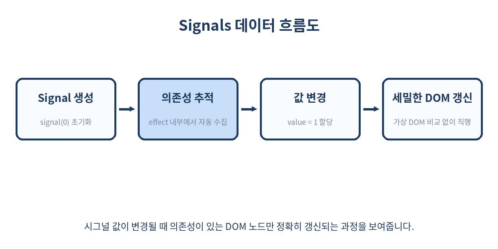

# ⚡ Signals 기반 반응성 완벽 가이드

> 프론트엔드 성능의 새로운 패러다임, 가상 DOM의 한계를 뛰어넘다
> 컴포넌트 재실행 없는 세밀한 반응성 시스템의 원리와 실무 적용법을 알아봅니다.

---

## 📌 목차
1. 🔍 Signals 개념 이해하기
2. 🧬 가상 DOM과의 근본적인 차이
3. ⚙️ 미니 시그널 구현해보기
4. 🔄 의존성 자동 추적(Dependency Tracking)의 원리
5. 📦 대표적인 프레임워크 생태계
6. 💻 기본 사용법 및 코드 예제
7. 🔗 연산된 시그널(Computed Signals)
8. 🌊 사이드 이펙트(Effects) 관리하기
9. ⚠️ 실무에서 마주하는 함정
10. 🚫 Signals를 쓰면 안 되는 경우
11. 🧾 정리 및 요약
12. 📚 참고 자료

---

## 🔍 1. Signals 개념 이해하기

모던 프론트엔드 개발에서 상태 관리와 반응성(Reactivity)은 애플리케이션의 뼈대를 형성하는 핵심 요소입니다. 과거에는 수동으로 DOM을 조작하거나, 데이터가 바뀔 때 전체 컴포넌트를 다시 그려야 했습니다. Signals는 상태(State)가 변경되었을 때 어떤 컴포넌트나 DOM 요소가 업데이트되어야 하는지 수동으로 지정하지 않아도, 시스템이 스스로 의존성을 파악하여 갱신하는 가장 미세한 단위의 프레미티브(Primitive)입니다.

실무에서 자주 쓰이는 Preact 환경의 기본적인 시그널 선언과 구독 예제는 다음과 같습니다.

```js
import { signal, effect } from '@preact/signals';

const count = signal(0);

effect(() => {
  console.log(`현재 카운트 값은: ${count.value}`);
});

count.value++; // 콘솔에 '현재 카운트 값은: 1'이 즉시 출력됨
```

이 방식은 기존 리액트의 `useState`와 유사해 보이지만, 컴포넌트의 렌더링 주기와 완전히 독립되어 동작한다는 결정적인 차이가 있습니다. 시그널은 변수에 불과하며, 이 변수가 읽히고 쓰이는 모든 곳을 미세하게 추적합니다.

---

## 🧬 2. 가상 DOM과의 근본적인 차이

전통적인 React 같은 라이브러리는 상태가 바뀌면 컴포넌트 함수 전체를 다시 실행합니다. 그 후 이전 Virtual DOM과 새로운 Virtual DOM을 비교(Diffing)하여 변경된 부분만 실제 DOM에 반영합니다. 반면 Signals는 컴포넌트를 단 한 번만 실행하고, 상태가 바뀔 때 DOM 노드나 이펙트 콜백을 직접 호출합니다.

아래 표는 가상 DOM 기반 반응성과 Signals 기반 반응성의 아키텍처 차이를 명확히 보여줍니다.

| 비교 항목 | 가상 DOM (Virtual DOM / React 등) | Signals (Solid, Preact Signals, Angular Signals) |
| :--- | :--- | :--- |
| **상태 변경 시 동작** | 컴포넌트 함수 전체 재실행 (Re-render) | 변경된 시그널을 구독하는 노드/이펙트만 직접 갱신 |
| **비용 (Complexity)** | 트리의 크기에 비례하는 Diffing 연산 발생 $O(N)$ | 구독된 리스너 호출 중심의 $O(1)$ 혹은 $O(K)$ |
| **의존성 관리** | `useEffect`, `useMemo` 등의 의존성 배열 수동 관리 | 게터(Getter) 접근을 통한 자동 추적 (Automatic) |
| **메모리 오버헤드** | 가상 DOM 트리 메모리 유지 필요 | 세밀한 구독 관계를 위한 Set/Map 구조체 유지 |



이처럼 가상 DOM은 컴포넌트 단위의 대규모 비교 연산을 수반하지만, 시그널은 포인터처럼 정확히 변경된 지점만을 타겟팅하여 연산 횟수를 극적으로 줄입니다. 대규모 데이터 그리드나 실시간 차트 렌더링에서 이 차이는 수십 배 이상의 프레임 드랍 감소로 이어집니다.

---

## ⚙️ 3. 미니 시그널 구현해보기

시그널의 동작 원리를 뼈대부터 이해하기 위해, 바닐라 자바스크립트로 아주 단순한 반응성 시스템을 직접 작성해 볼 수 있습니다. 전역 변수에 현재 실행 중인 이펙트를 저장하고, 게터(Getter)와 세터(Setter)를 통해 구독 관계를 맺는 방식입니다.

```js
let currentEffect = null;

export function signal(initialValue) {
  let value = initialValue;
  const subscribers = new Set();

  return {
    get value() {
      // 현재 실행 중인 이펙트가 존재한다면 구독 관계로 등록
      if (currentEffect) {
        subscribers.add(currentEffect);
      }
      return value;
    },
    set value(newValue) {
      if (value !== newValue) {
        value = newValue;
        // 등록된 모든 구독자(이펙트)를 순회하며 재실행
        subscribers.forEach(sub => sub());
      }
    }
  };
}

export function effect(fn) {
  const execute = () => {
    currentEffect = execute;
    try {
      fn();
    } finally {
      currentEffect = null;
    }
  };
  execute();
}
```

위 구현체는 시그널이 어떻게 전역 컨텍스트를 활용해 의존성을 수집하는지 명확하게 보여줍니다. 실무 라이브러리들은 메모리 누수를 막기 위한 WeakMap 기반의 정리 작업과 배치(Batching) 업데이트 최적화를 추가로 적용하여 구현되어 있습니다.

---

## 🔄 4. 의존성 자동 추적(Dependency Tracking)의 원리

시그널 내부의 `get value` 접근자가 호출되는 순간, 현재 실행 중인 이펙트나 컴포넌트가 해당 시그널의 구독자 목록에 동적으로 등록됩니다. 이 과정을 통해 개발자가 직접 `useEffect([dep])` 의존성 배열을 수동으로 관리할 필요가 완전히 사라집니다.

```js
const firstName = signal('홍');
const lastName = signal('길동');

effect(() => {
  // 이 블록이 실행될 때 firstName.value와 lastName.value가 모두 호출됨
  // 따라서 이 이펙트는 두 시그널 모두를 구독(Subscribe)하게 됨
  console.log(`이름: ${firstName.value} ${lastName.value}`);
});

// 성만 바꿔도 이펙트가 자동으로 다시 실행됨
firstName.value = '김'; // 콘솔: '이름: 김 길동'
```

이 방식은 수동 의존성 배열 관리로 인한 버그(예: 누락된 의존성으로 인한 오래된 값 참조 문제)를 원천 차단합니다. 코드가 실행되는 런타임 경로에 따라 동적으로 의존성이 맺어지고 끊어지기 때문에 조건문 안의 시그널도 유연하게 추적됩니다.

---

## 📦 5. 대표적인 프레임워크 생태계

Signals 패턴은 여러 모던 프레임워크와 라이브러리 진영에 적극적으로 도입되며 프론트엔드 생태계의 판도를 바꾸고 있습니다.

1. **Solid.js**: 컴파일 타임에 JSX를 실제 DOM 조작 코드로 변환하며, 내부적으로 파인 그리디(Fine-grained) 시그널 반응성을 완벽하게 구현하여 벤치마크 최상위권을 유지합니다.
2. **Preact Signals**: 기존 Preact 및 React 생태계에서도 시그널 기반 상태 관리를 쓸 수 있도록 오버레이 패키지 형태로 강력한 성능 향상을 제공합니다.
3. **Angular Signals**: Angular v16부터 도입되어 RxJS의 복잡한 연산자 없이도 템플릿과 컴포넌트 상태를 고성능으로 동기화할 수 있는 표준 반응성 메커니즘으로 자리 잡았습니다.
4. **Vue.js (Reactivity API)**: Vue 3의 `ref`와 `reactive` 역시 프락시(Proxy) 기반의 시그널 아키텍처와 매우 유사한 철학을 공유합니다.

---

## 💻 6. 기본 사용법 및 코드 예제

실무에서 Preact나 지원되는 환경에서 컴포넌트를 작성할 때의 전형적인 카운터 및 폼 입력 예제입니다. 복잡한 훅 보일러플레이트가 눈에 띄게 줄어듭니다.

```jsx
import { signal } from '@preact/signals';

const count = signal(0);
const text = signal('');

export function CounterForm() {
  const handleIncrement = () => {
    count.value += 1;
  };

  const handleInput = (e) => {
    text.value = e.target.value;
  };

  return (
    <div style={{ padding: '20px', fontFamily: 'sans-serif' }}>
      <h2>시그널 기반 폼 및 카운터</h2>
      <p>현재 카운트: {count.value}</p>
      <button onClick={handleIncrement}>증가하기</button>
      
      <div style={{ marginTop: '15px' }}>
        <input 
          type="text" 
          value={text.value} 
          onInput={handleInput} 
          placeholder="텍스트를 입력하세요" 
        />
        <p>입력된 값 메아리: {text.value}</p>
      </div>
    </div>
  );
}
```

이 컴포넌트는 `count.value`나 `text.value`가 바뀔 때 전체 `CounterForm` 함수가 재실행되지 않고, 오직 `{count.value}`와 `{text.value}`가 바인딩된 DOM 텍스트 노드나 속성만 직접 갱신됩니다.

---

## 🔗 7. 연산된 시그널(Computed Signals)

다른 시그널의 값에 기반하여 파생된 값을 만들어야 할 때는 `computed`를 사용합니다. 의존하는 시그널이 변경될 때만 캐시를 무효화하고 재연산(Lazy Evaluation)하므로 대규모 연산이나 가공 로직에서 불필요한 비용을 막아줍니다.

```js
import { signal, computed } from '@preact/signals';

const items = signal([
  { id: 1, name: '노트북', price: 1200000, selected: true },
  { id: 2, name: '마우스', price: 35000, selected: false },
  { id: 3, name: '키보드', price: 150000, selected: true },
]);

// 선택된 아이템들의 총합을 계산하는 파생 시그널
const totalPrice = computed(() => {
  console.log('총합 계산 중...'); // 의존성이 바뀔 때만 호출됨
  return items.value
    .filter(item => item.selected)
    .reduce((sum, item) => sum + item.price, 0);
});

console.log(totalPrice.value); // 최초 연산: 1350000 출력 ('총합 계산 중...' 로그 출력)
console.log(totalPrice.value); // 캐시된 값 반환 ('총합 계산 중...' 로그 출력 안 됨)
```

이처럼 `computed`는 파생 상태를 안전하고 효율적으로 관리하게 해주며, 메모이제이션을 위해 `useMemo` 같은 훅을 일일이 작성할 필요가 없습니다.

---

## 🌊 8. 사이드 이펙트(Effects) 관리하기

시그널 값 변화에 따라 외부 시스템(예: 로컬 스토리지, 웹소켓, 쿠키, 분석 툴)과 동기화하거나 네트워크 요청을 트리거하는 등의 부수 효과는 `effect` 내부에서 처리합니다.

```js
import { signal, effect } from '@preact/signals';

const theme = signal('light');
const userId = signal(1042);

// 테마 변경 시 DOM 및 로컬 스토리지 동기화
effect(() => {
  document.body.className = theme.value;
  localStorage.setItem('app-theme', theme.value);
});

// 사용자 ID 변경 시 로그 전송
effect(() => {
  if (userId.value) {
    navigator.sendBeacon('/api/track-user', JSON.stringify({ id: userId.value }));
  }
});
```

`effect` 블록은 내부에 사용된 시그널들의 변화를 자동으로 감지하므로, 의존성 배열 누락으로 인한 버그나 무한 루프 위험을 크게 줄여줍니다. 단, 부수 효과 내부에서 다시 시그널을 잘못 수정하면 무한 루프가 발생할 수 있으므로 주의해야 합니다.

---

## ⚠️ 9. 실무에서 마주하는 함정

시그널을 사용할 때 개발자들이 흔히 겪는 대표적인 함정들은 다음과 같습니다.

1. **비동기 컨텍스트에서의 의존성 누락**
   `await` 키워드 이후에 시그널에 접근하면 자바스크립트의 비동기 마이크로태스크 큐 전환으로 인해 현재 실행 중인 이펙트 컨텍스트(`currentEffect`)가 유실되어 구독이 맺어지지 않습니다.

2. **객체나 배열 내부 속성 직접 변경**
   시그널에 담긴 객체의 프로퍼티를 직접 수정(`state.value.name = 'kim'`)하면 세터가 호출되지 않아 구독자들에게 알림이 가지 않습니다. 새로운 객체 레퍼런스를 할당(`state.value = { ...state.value, name: 'kim' }`)해야 합니다.



아래는 비동기 함수 내부에서 시그널 구독이 끊어지는 대표적인 안티패턴과 올바른 해결 예제입니다.

```js
import { signal, effect } from '@preact/signals';

const userId = signal(1);
const userData = signal(null);

// ❌ 안티패턴: await 이후에 시그널에 접근하면 의존성 추적이 누락됨
effect(async () => {
  const id = userId.value; // 여기서는 구독이 맺어짐
  const response = await fetch(`/api/user/${id}`);
  const data = await response.json();
  userData.value = data; 
});

// ✅ 올바른 패턴: 비동기 호출 전에 필요한 시그널 값을 미리 캡처하거나 동기적으로 분리
effect(() => {
  const id = userId.value; // 동기적으로 의존성 확보
  
  async function fetchUser() {
    const response = await fetch(`/api/user/${id}`);
    const data = await response.json();
    userData.value = data;
  }
  
  fetchUser();
});
```

---

## 🚫 10. Signals를 쓰면 안 되는 경우

모든 아키텍처가 그렇듯 Signals가 항상 은총알(Silver Bullet)은 아닙니다. 다음과 같은 상황에서는 도입을 신중히 검토해야 합니다.

- **극도로 단순한 정적 페이지 및 컴포넌트**: 상태 변화가 거의 없고 마크업 중심인 랜딩 페이지에서는 상태 관리 라이브러리나 시그널 도입 자체가 번거로운 오버헤드가 될 수 있습니다.
- **기존 거대한 React 컴포넌트 에코시스템과의 충돌**: 서드파티 라이브러리들이 엄격한 React Context나 훅 라이프사이클에 강하게 결합되어 있는 경우, 시그널 값과 React 렌더링 주기를 일치시키는 어댑터 레이어가 복잡해질 수 있습니다.
- **팀원의 학습 곡선**: 기존 `useState`나 `Redux/Zustand` 패러다임에 익숙한 팀에게 `.value` 접근자 기반의 세밀한 반응성 모델은 초기 코드 리뷰 과정에서 혼란을 줄 수 있습니다.

---

## 🧾 11. 정리 및 요약

- Signals는 가상 DOM의 비용 큰 diffing 오버헤드를 제거하고 상태와 DOM을 실시간 직결합니다.
- 컴포넌트 재실행 없이 값 변화가 필요한 DOM 노드나 이펙트만 직접 갱신됩니다.
- 의존성 배열을 수동으로 관리할 필요가 없어 코드가 간결하고 유지보수하기 좋습니다.
- `computed`와 `effect`를 통해 파생 상태와 외부 시스템 동기화를 안전하고 빠르게 처리할 수 있습니다.
- 비동기 컨텍스트에서의 구독 누락이나 객체 뮤테이션 등 미묘한 동작 방식을 정확히 이해하고 사용해야 합니다.

> ✨ **한 줄 요약**
> 시그널은 가상 DOM이라는 거울을 깨고, 상태와 DOM을 실시간으로 직결하는 가장 빠르고 세밀한 반응성 도구입니다.

---

## 📚 참고 자료
- [Preact Signals 공식 문서](https://preactjs.com/guide/v10/signals/)
- [Solid.js Reactivity Overview](https://www.solidjs.com/tutorial/introduction_reactivity)
- [Angular Signals Guide](https://angular.dev/guide/signals)
