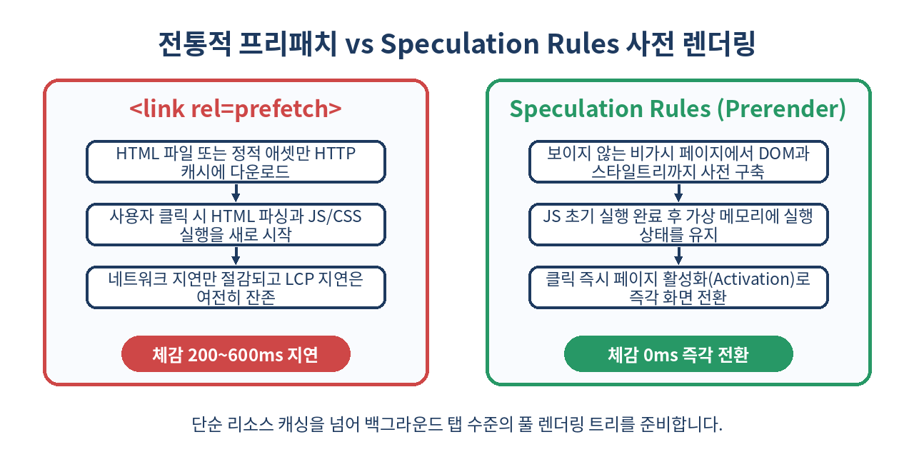
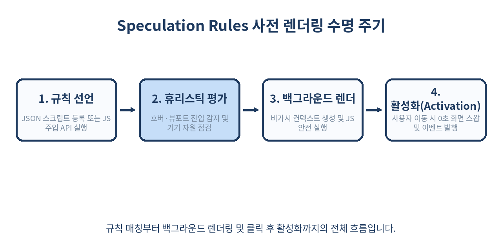

# ⚡ Speculation Rules API 완벽 가이드: 초저지연 사전 렌더링(Prerender)과 0초 로딩

> 웹 사용자가 링크를 클릭하기 직전, 브라우저는 이미 다음 페이지의 렌더링을 끝마쳐 둘 수 있습니다.
> 자원 낭비 없이 0ms 네비게이션을 달성하는 차세대 웹 표준 Speculation Rules API의 원리와 실무 적용 전략을 심층 분석합니다.

---

## 📌 목차
1. 🧭 서론: 웹 성능 최적화의 종착지, 즉각 전환(Instant Loading)
2. 📜 레거시 프리패치의 한계와 Speculation Rules의 등장 배경
3. ⚙️ 핵심 개념: Prefetch vs Prerender의 결정적 차이
4. 🧱 Speculation Rules JSON 문법과 선언 방식
5. 🎯 링크 매칭 규칙(Document Rules)과 동적 트리거링
6. 🧠 eagemess 속성: 백그라운드 작업 부하를 통제하는 전략
7. 💻 JavaScript 동적 규칙 삽입 API (`HTMLScriptElement` vs `speculationRules`)
8. 🔄 사전 렌더링 수명 주기와 API 제약 사항 (`document.prerendering`)
9. 📊 성능 지표(Core Web Vitals) 영향도와 LCP/INP 최적화
10. ⚠️ 실무 함정: 분석 툴(GA4), 광고 노출 수 왜곡 및 세션 오염 방지
11. 🚫 Speculation Rules를 쓰면 안 되는 상황과 보안/안전성 체크리스트
12. 🧾 정리: 점진적 향상(Progressive Enhancement) 전략
13. 📚 참고 자료

---

## 🧭 1. 서론: 웹 성능 최적화의 종착지, 즉각 전환(Instant Loading)

웹 성능 최적화는 지난 10여 년간 번들 크기 축소, 코드 스플리팅, 이미지 지연 로딩(Lazy Loading), HTTP/3 도입 등 다양한 진화를 거듭해 왔습니다. 하지만 아무리 프론트엔드 자산을 경량화하고 엣지(Edge) 네트워크에서 렌더링하더라도, 물리적인 네트워크 왕복 시간(RTT)과 브라우저의 DOM/CSSOM 트리 파싱 및 JavaScript 파싱/실행 시간으로 인해 링크를 누른 뒤 최소 100~300ms의 공백이 필연적으로 발생합니다.

사용자 관점에서 진정한 '앱과 같은 반응성'은 대기 시간이 0에 수렴하는 **즉각 전환(Instant Loading)**입니다. 모바일 네이티브 앱은 화면 전환 시 백그라운드 메모리에 적재된 뷰를 즉각 스왑(Swap)하여 지연을 숨깁니다. 브라우저에서도 이와 동일한 메커니즘을 표준 웹 플랫폼 API로 구현하기 위해 도입된 규격이 바로 **Speculation Rules API**입니다.

이 API는 링크 목록이나 특정 URL 패턴을 브라우저에 JSON 형태로 알려줌으로써, 브라우저가 사용자 상호작용 의도를 감지했을 때 리소스를 미리 당겨오거나(Prefetch), 심지어 보이지 않는 백그라운드 페이지 샌드박스에서 렌더링까지 끝마치도록(Prerender) 지시합니다.

---

## 📜 2. 레거시 프리패치의 한계와 Speculation Rules의 등장 배경

브라우저에는 과거부터 사전 로딩을 위한 선언적 힌트들이 존재했습니다.

- `<link rel="prefetch" href="/page.html">`: 다음 탐색에 필요할 수 있는 단일 HTML 리소스를 브라우저 HTTP 캐시에 다운로드합니다.
- `<link rel="prerender" href="/page.html">`: 페이지 전체를 사전에 렌더링하도록 요청했습니다(과거 Chrome에서 실험적으로 지원되다 폐기).

그러나 과거의 `<link rel="prerender">`는 심각한 문제점들을 안고 있었습니다:

1. **엄청난 자원 낭비**: 페이지에 있는 무거운 서드파티 스크립트, 웹소켓 연결, 무한 반복 애니메이션까지 무조건 실행되어 CPU와 배터리를 고갈시켰습니다.
2. **사이드 이펙트 제어 불가**: 사용자가 실제로 방문하지 않았음에도 데이터베이스 쓰기 작업(POST/PUT), 결제 세션 만료, 분석 태그 수치 왜곡 등이 일어났습니다.
3. **투박한 프로그래밍 제어**: 링크 태그 하나당 URL 하나를 일일이 하드코딩해야 했으며, 마우스 호버 여부나 기기 메모리 상태에 따른 세밀한 조절이 불가능했습니다.

이로 인해 브라우저 벤더들은 구형 `link rel="prerender"`를 폐기하고, **구조화된 JSON 규칙**, **세밀한 실행 격리**, **휴리스틱 기반의 적응형 실행**을 지원하는 Speculation Rules API를 W3C WICG 표준으로 설계하여 Chrome 108부터 본격적으로 배포하기 시작했습니다.



---

## ⚙️ 3. 핵심 개념: Prefetch vs Prerender의 결정적 차이

Speculation Rules API는 크게 두 가지 동작 모드를 제공합니다.

| 비교 항목 | `prefetch` (사전 수집) | `prerender` (사전 렌더링) |
| :--- | :--- | :--- |
| **가져오는 리소스** | 대상 URL의 기본 HTML 문서 (경우에 따라 하위 리소스) | HTML, CSS, JavaScript, 이미지, 서드파티 스크립트 전체 |
| **실행 단계** | 단순 HTTP 다운로드 후 메모리/디스크 캐시 저장 | 백그라운드 탭에서 DOM/CSSOM 구축 및 JS 초기 실행 완료 |
| **전환 속도** | HTML 다운로드 시간 절약 (약 150~400ms 단축) | 클릭 즉시 뷰포트 스왑 (0~50ms, 완전한 체감 0초) |
| **메모리 및 CPU 소모** | 매우 낮음 | 비교적 높음 (새로운 렌더러 프로세스/컨텍스트 소비) |
| **적용 권장 대상** | 외부 사이트 이동, 모바일 저사양 기기, 무거운 상세 페이지 | 전환 확률이 높은 핵심 유저 플로우, 장바구니→결제, 블로그 다음 글 |

기존의 `<link rel="prefetch">`와 달리 Speculation Rules API의 `prefetch` 모드는 HTTP 캐시 파티셔닝(Cache Partitioning) 문제를 우회하지 않고도 브라우저 내부의 자격 증명(Credential)과 쿠키를 표준에 맞게 안전하게 처리하며, Service Worker와의 연동도 매끄럽습니다.

---

## 🧱 4. Speculation Rules JSON 문법과 선언 방식

Speculation Rules API는 HTML 문서 내에 `<script type="speculationrules">` 블록을 선언하여 사용합니다. 이 스크립트는 실행형 자바스크립트가 아니며 순수 JSON 데이터 블록으로 파싱됩니다.

```html
<script type="speculationrules">
{
  "prerender": [
    {
      "source": "list",
      "urls": ["/checkout/step1", "/products/popular"]
    }
  ],
  "prefetch": [
    {
      "source": "list",
      "urls": ["/about", "/contact"]
    }
  ]
}
</script>
```

### 주요 속성 구조
- **행위 지정 최상위 키**: `"prerender"` 또는 `"prefetch"` 배열을 선언합니다.
- **`source`**: 대상 대상을 어떻게 지정할 것인지 정의합니다.
  - `"list"`: 명시적인 URL 문자열 목록을 직접 열거합니다.
  - `"document"`: 현재 DOM 트리에 렌더링된 `<a>` 태그들을 검사하여 조건에 맞는 링크를 자동으로 매칭합니다.
- **`urls`**: `source: "list"`일 때 사용되며, 절대 경로 또는 상대 경로 문자열 배열을 받습니다.

---

## 🎯 5. 링크 매칭 규칙(Document Rules)과 동적 트리거링

대규모 전자상거래 플랫폼이나 블로그에서 모든 링크를 일일이 `urls: [...]`로 열거하는 것은 비현실적입니다. 이를 해결하기 위해 표준에 추가된 것이 **Document Rules (`source: "document"`)**입니다.

```html
<script type="speculationrules">
{
  "prerender": [
    {
      "source": "document",
      "where": {
        "and": [
          { "href_matches": "/articles/*" },
          { "not": { "href_matches": "/articles/archive/*" } },
          { "not": { "selector_matches": ".no-prerender" } }
        ]
      },
      "eagerness": "moderate"
    }
  ]
}
</script>
```

### `where` 절의 주요 연산자
1. **`href_matches`**: URL 패턴 표준(URL Pattern API) 문법을 따릅니다. 와일드카드(`*`), 매개변수 바인딩(`:id`)을 사용할 수 있습니다.
2. **`selector_matches`**: CSS 선택자를 기반으로 특정 클래스나 속성이 있는 `<a>` 태그만을 선택하거나 제외합니다.
3. **논리 연산자**: `"and"`, `"or"`, `"not"`을 조합하여 정교한 화이트리스트/블랙리스트 필터링이 가능합니다.

이 방식을 적용하면 마크업 개발자는 단순히 중요한 링크에 `<a href="/articles/123" class="instant-link">`와 같은 속성을 부여하는 것만으로 브라우저가 알아서 사전 렌더링 후보로 등록하게 만들 수 있습니다.

---

## 🧠 6. eagerness 속성: 백그라운드 작업 부하를 통제하는 전략

언제 사전 로딩을 시작할 것인가는 기기 배터리와 네트워크 대역폭 보호를 위한 핵심 제어 요소입니다. Speculation Rules는 `eagerness` 속성으로 4단계의 실행 민감도를 제공합니다.

| eagerness 단계 | 동작 트리거 조건 | 권장 사용 케이스 |
| :--- | :--- | :--- |
| **`immediate`** | 규칙이 파싱되자마자 즉시 사전 렌더링/프리패치 시작 | 다음 이동 경로가 95% 이상 확실한 경우 (예: 로그인 폼 입력 중 메인 대시보드) |
| **`eager`** | 사용자가 상호작용하기 전이라도 가능한 한 빠르게 시작 | 현재 뷰포트에 보이는 중요 링크, 추천 상품 1순위 |
| **`moderate`** | 마우스 커서를 링크에 올리거나(200ms hover) 터치를 시작할 때 | 블로그 글 목록, 탐색 바 메뉴, 대부분의 일반 웹사이트 (가장 추천) |
| **`conservative`** | 마우스 클릭 누름(`mousedown`) 또는 터치 시작(`touchstart`) 시점 | 결제 직전 단계 등 잘못 렌더링했을 때 위험이 큰 페이지 |

실무에서는 **`moderate`**가 가장 압도적인 성능 대 비용 효율을 자랑합니다. 인간의 반응 시간상 마우스를 올린 후 실제로 클릭을 완료하기까지 평균 200~350ms의 지연이 발생합니다. `moderate`는 이 200ms의 공백을 감지하여 즉시 사전 렌더링을 시작하므로, 대역폭을 낭비하지 않으면서도 클릭 순간에는 렌더링이 완료된 상태를 만들어 냅니다.

---

## 💻 7. JavaScript 동적 규칙 삽입 API (`HTMLScriptElement` vs `speculationRules`)

단일 페이지 애플리케이션(SPA)이나 무한 스크롤, 비동기 데이터 로딩 환경에서는 DOM이 동적으로 생성되므로 자바스크립트를 통해 규칙을 주입하고 제거할 수 있어야 합니다.

### 1) `<script>` 요소를 동적으로 추가하는 방식 (크로스 브라우저 호환)

```js
// Speculation Rules를 지원하는지 체크
if (HTMLScriptElement.supports && HTMLScriptElement.supports('speculationrules')) {
  const specScript = document.createElement('script');
  specScript.type = 'speculationrules';
  
  const rules = {
    prerender: [
      {
        source: 'list',
        urls: ['/cart/checkout'],
        eagerness: 'immediate'
      }
    ]
  };
  
  specScript.textContent = JSON.stringify(rules);
  document.head.appendChild(specScript);
  
  // 더 이상 필요 없으면 DOM에서 제거하여 취소 유도
  // document.head.removeChild(specScript);
}
```

### 2) 최신 브라우저의 프로그래밍 API: `document.speculationRules`

최신 명세에서는 스크립트 태그를 DOM에 삽입하지 않고도 자바스크립트 객체 형태로 규칙을 등록할 수 있는 `document.speculationRules` 인터페이스가 제안되고 있습니다.

```js
// Speculation Rules 프로그래밍 객체 조작 패턴
if ('speculationRules' in document) {
  // 규칙 동적 등록
  const ruleSet = document.speculationRules.add({
    prerender: [{
      source: 'list',
      urls: ['/dashboard/reports']
    }]
  });
  
  // 특정 시점에 규칙 해제
  // ruleSet.delete();
}
```

이러한 동적 삽입 기법을 사용하면 마우스 커서가 특정 컴포넌트 근처로 다가오는 제스처(Pointer Velocity 예측)를 프론트엔드 라우터가 계산하여 필요한 타깃 페이지만 정밀하게 프리렌더할 수 있습니다.

---

## 🔄 8. 사전 렌더링 수명 주기와 API 제약 사항 (`document.prerendering`)

사전 렌더링(Prerender)은 완전히 독립된 백그라운드 브라우징 컨텍스트에서 실행됩니다. 이때 사용자가 보지도 않은 페이지에서 오디오가 재생되거나 웹캠 권한 요청 팝업이 뜨면 안 되므로 브라우저는 강력한 제약과 수명 주기 이벤트를 부여합니다.



### 제약되는 브라우저 API
- `alert()`, `confirm()`, `prompt()`: 호출 즉시 무시되거나 에러 발생
- `navigator.mediaDevices.getUserMedia()`: 활성화 전까지 호출 보류
- `Notification.requestPermission()`: 사용자 상호작용 전까지 차단
- 비디오/오디오 자동재생: 활성화 전까지 오디오 트랙 자동 음소거(Muted)

### 코드에서 사전 렌더링 감지하기

스크립트는 자신이 현재 보이지 않는 사전 렌더링 상태인지, 아니면 실제 화면에 노출되었는지를 `document.prerendering` 불리언 속성과 `prerenderingchange` 이벤트를 통해 파악해야 합니다.

```js
// analytics.js - 사전 렌더링 상태를 고려한 로깅 스크립트
function sendPageView() {
  fetch('/api/analytics/pageview', {
    method: 'POST',
    headers: { 'Content-Type': 'application/json' },
    body: JSON.stringify({ path: window.location.pathname, timestamp: Date.now() }),
    keepalive: true
  });
}

if (document.prerendering) {
  console.log('[Speculation] 현재 페이지는 백그라운드에서 사전 렌더링 중입니다.');
  
  // 사용자가 실제로 페이지로 진입하여 활성화될 때까지 실행을 연기
  document.addEventListener('prerenderingchange', () => {
    console.log('[Speculation] 페이지가 화면에 활성화(Activated)되었습니다.');
    sendPageView();
  }, { once: true });
} else {
  // 일반적인 즉시 로드
  sendPageView();
}
```

`prerenderingchange` 리스너를 적절히 활용하지 않으면 사용자가 방문하지도 않고 링크 위를 스쳐 지나간 수천 명의 가짜 페이지뷰가 분석 서버에 전송되는 대참사가 일어납니다.

---

## 📊 9. 성능 지표(Core Web Vitals) 영향도와 LCP/INP 최적화

Speculation Rules를 적용했을 때 실측 사용자 경험 지표(RUM: Real User Monitoring)는 극적인 개선을 보여줍니다.

### 1) LCP (Largest Contentful Paint)의 극단적 단축
일반적인 페이지 이동 시 LCP는 보통 1.2초~2.5초 내외로 형성됩니다. 그러나 `prerender`가 완료된 페이지로 전환되면, 화면 전환 시점에는 이미 브라우저 내부 렌더 트리가 완성되어 있으므로 **LCP 수치가 0ms에 가까운 10~50ms 수준으로 수렴**합니다. Chrome User Experience Report(CrUX) 지표에서 녹색 구간(Good, 2.5s 이하) 비율이 99%에 달하게 됩니다.

### 2) INP (Interaction to Next Paint) 개선
클릭 시점에 메인 스레드가 다음 페이지 번들을 파싱하느라 멈추는 현상이 사라집니다. 이전 페이지에서 링크를 클릭하는 동작 자체의 시각적 반응 속도가 최적화되어 상호작용 지연이 대폭 감소합니다.

### 3) TTFB (Time to First Byte)의 체감 0화
백그라운드에서 이미 TCP/TLS 핸드셰이크와 HTTP 응답 수신을 완료해 두었기 때문에, 네비게이션 시점의 실질적 TTFB는 0ms가 됩니다.

---

## ⚠️ 10. 실무 함정: 분석 툴(GA4), 광고 노출 수 왜곡 및 세션 오염 방지

실무 도입 시 반드시 고려해야 할 부작용과 해결 방안입니다.

### 1) Google Analytics 4 (GA4) 및 서드파티 트래커 왜곡
기본 Google 태그(`gtag.js`) 최신 버전은 브라우저의 `document.prerendering`을 감지하여 활성화될 때까지 `page_view` 이벤트를 자동으로 대기시킵니다. 그러나 사내 자체 로깅 솔루션, 페이스북 픽셀, 핫자(Hotjar) 등 커스텀 추적 스크립트는 이 처리가 되어 있지 않은 경우가 많습니다.
- **해결책**: 모든 추적 함수는 최상단에서 `if (document.prerendering)` 검사를 수행하는 공통 래퍼(Wrapper) 함수를 통해 실행되도록 강제해야 합니다.

### 2) 서버 세션 오염 및 CSRF 토큰 소모
사전 렌더링 중에 세션을 갱신하거나 1회용 CSRF 토큰을 새로 발급받는 로직이 백그라운드에서 실행되면, 정작 사용자가 머물고 있는 현재 탭의 토큰이 만료되어 폼 제출 시 에러가 날 수 있습니다.
- **해결책**: 백그라운드 렌더링 요청에는 브라우저가 자동으로 `Sec-Purpose: prefetch;prerender` HTTP 요청 헤더를 전송합니다. 백엔드 서버는 이 헤더를 감지하여 상태를 변경하지 않는 읽기 전용 로직만 처리해야 합니다.

```http
GET /checkout HTTP/1.1
Host: example.com
Sec-Purpose: prefetch;prerender
```

### 3) HTTP 헤더 제어: `Speculation-Rules` 응답 헤더
HTML 문서 본문에 인라인 스크립트를 넣는 대신, 웹 서버 응답 헤더를 통해 규칙 파일의 URL을 브라우저에 내려줄 수도 있습니다.

```http
Speculation-Rules: "/rules/site-speculation.json"
```

이를 통해 정적 캐싱된 HTML을 수정하지 않고도 CDN 단에서 유연하게 프리렌더 정책을 배포할 수 있습니다.

---

## 🚫 11. Speculation Rules를 쓰면 안 되는 상황과 보안/안전성 체크리스트

강력한 기술인 만큼 잘못 적용하면 시스템 비용이 폭증하고 유저 데이터가 파괴될 수 있습니다.

### 쓰면 안 되는 경우
1. **GET 요청임에도 서버 상태를 변경하는 엔드포인트**
   - 예: `/api/logout`, `/cart/delete?item=1` 같은 안티패턴 URL. 백그라운드 렌더링 순간 강제 로그아웃되거나 상품이 삭제됩니다.
2. **유료 API 및 종량제 서드파티 위젯이 포함된 페이지**
   - 렌더링될 때마다 외부 지도 API 호출 비용이나 AI 크레딧이 차감되는 화면에는 절대 `immediate` 프리렌더를 걸면 안 됩니다.
3. **저사양 모바일 기기 및 데이터 절약 모드(Save-Data)**
   - 브라우저가 자체적으로 Data Saver 상태에서는 무시하지만, 자바스크립트 레벨에서도 `navigator.connection.saveData` 및 기기 메모리(`navigator.deviceMemory`)를 체크하는 방어 코드를 두는 것이 좋습니다.

```js
// 클라이언트 측 방어적 사전 렌더링 검사기
function canPrerenderSafely() {
  const connection = navigator.connection || {};
  if (connection.saveData) return false; // 데이터 절약 모드
  if (connection.effectiveType && connection.effectiveType.includes('2g')) return false;
  if (navigator.deviceMemory && navigator.deviceMemory < 4) return false; // 저사양 기기
  return true;
}
```

---

## 🧾 12. 정리: 점진적 향상(Progressive Enhancement) 전략

Speculation Rules API는 브라우저가 지원하지 않더라도 오류를 내지 않고 조용히 무시되는(Graceful Degradation) 완벽한 하위 호환 구조를 갖추고 있습니다.

- **차세대 0ms 네비게이션**: 단순 리소스 프리패치를 넘어 비가시 렌더 트리를 완성해 두는 궁극의 속도 최적화
- **Document Rules 활용**: 복잡한 수동 URL 관리 대신 CSS 셀렉터와 URL 패턴으로 선언적 관리 가능
- **`moderate` eagerness 권장**: 200ms 마우스 호버 시간을 활용하여 비용 없는 즉각 렌더링 달성
- **`document.prerendering` 방어 코드 필수**: 분석 데이터 왜곡 및 세션 오염을 방지하기 위해 라이프사이클 이벤트 분기 구현
- **HTTP 헤더 감지**: 서버 단에서 `Sec-Purpose` 헤더를 분기하여 불필요한 백엔드 쓰기 방지

> ✨ **한 줄 요약**
> Speculation Rules API는 브라우저의 비가시 백그라운드 렌더링을 선언적으로 지휘하여 클릭 즉시 다음 화면을 띄워내는 차세대 웹의 치트키다.

---

## 📚 참고 자료
- [W3C WICG Speculation Rules Specification](https://wicg.github.io/nav-speculation/speculation-rules.html)
- [MDN Web Docs: Speculation Rules API](https://developer.mozilla.org/en-US/docs/Web/API/Speculation_Rules_API)
- [Chrome for Developers: Prerender pages in Chrome for instant page navigations](https://developer.chrome.com/docs/web-platform/prerender-pages)
- [Web.dev: Debugging speculation rules](https://developer.chrome.com/docs/devtools/application/debugging-speculation-rules)
