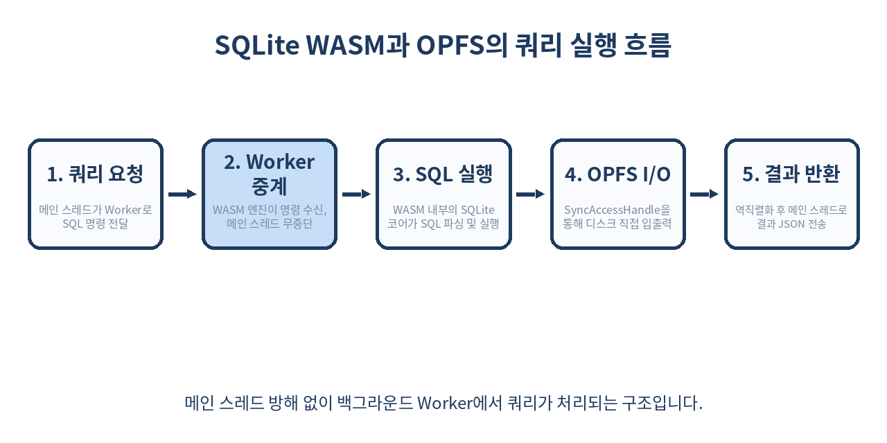
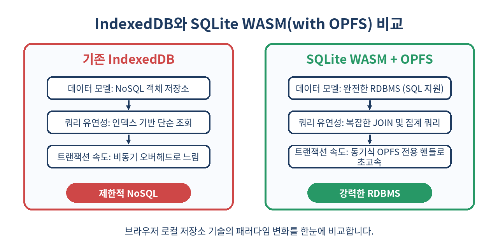

# 💾 웹 브라우저 안의 완전한 RDBMS: SQLite WASM과 OPFS 완벽 가이드

> "모든 데이터를 서버로 보낼 필요는 없습니다. 브라우저에서 직접 SQL로 밀리초 단위의 관계형 쿼리를 수행해 보세요."
> 이 가이드에서는 SQLite WASM과 Origin Private File System(OPFS)이 결합하여 열어젖힌 초고속 로컬 클라이언트 사이드 데이터베이스의 원리와 실무 적용법을 상세히 다룹니다.

---

## 📌 목차
1. 🚀 왜 웹 브라우저에서 SQLite인가?
2. 🏗️ SQLite WASM 아키텍처의 핵심 구조
3. 📂 OPFS(Origin Private File System)와의 초고속 시너지
4. 🛠️ SQLite WASM 설치 및 보안 헤더 설정
5. 💻 실제 동작하는 데이터베이스 초기화 구현
6. 📊 SQL 쿼리 실행 및 트랜잭션 최적화 기법
7. ⚡ 성능 비교: IndexedDB vs SQLite WASM
8. 🧵 멀티스레드 환경을 위한 Web Worker 구현 패턴
9. ⚠️ 실무에서 반드시 마주하는 3가지 함정과 해결책
10. 🚫 SQLite WASM을 도입하면 안 되는 경우
11. 🧾 요약 및 핵심 정리
12. 📚 참고 자료

---

## 🚀 1. 왜 웹 브라우저에서 SQLite인가?

최근 프론트엔드 생태계는 서버 의존성을 최소화하고 오프라인에서도 매끄럽게 작동하는 **로컬 퍼스트(Local-First)** 패러다임이 급부상하고 있습니다. 하지만 브라우저가 기본 제공해 온 저장 기술들은 저마다 명확한 한계를 지니고 있었습니다.

- **localStorage / sessionStorage**: 용량이 최대 5MB로 제한되며, 동기식 동기화 차단 방식으로 인해 대용량 데이터 처리 시 화면이 버벅입니다.
- **IndexedDB**: 비동기 트랜잭션과 기가바이트 단위의 고용량 저장을 지원하지만, NoSQL 객체 저장소 기반이라 관계형 데이터를 다루기가 극도로 난해하며 복잡한 쿼리(JOIN, Group By) 수행 시 성능이 무너집니다.

이러한 문제를 완전히 해결하는 게임 체인저가 바로 **SQLite WASM**입니다. 세계에서 가장 널리 사용되는 신뢰도 높은 RDBMS인 SQLite를 WebAssembly로 컴파일하여, 브라우저 환경에서 서버 수준의 관계형 SQL 쿼리를 밀리초 단위로 실행할 수 있게 되었습니다.

---

## 🏗️ 2. SQLite WASM 아키텍처의 핵심 구조

SQLite WASM은 단순히 C언어로 작성된 SQLite 소스 코드를 Emscripten 툴체인을 활용하여 WebAssembly(.wasm) 파일로 가상 컴파일한 것입니다. 이 구조는 다음과 같은 핵심 요소로 구동됩니다.

1. **SQLite Core (C Engine)**: 파일 내에서 테이블 생성, 인덱싱, B-Tree 탐색, 트랜잭션 원자성(ACID)을 구현하는 내장 로직입니다.
2. **VFS (Virtual File System) API**: SQLite가 데이터를 디스크에 물리적으로 읽고 쓰기 위해 사용하는 추상화 레이어입니다. WASM 환경에서는 이 VFS를 브라우저 API에 맞게 어댑터 형태로 구현해야 합니다.
3. **JS Glue Code**: JavaScript 메인 스레드와 WASM 가상 머신 간의 힙 메모리 데이터 교환(Marshalling)을 안전하게 연결하고, 개발자가 다루기 편리한 고수준 API 인터페이스를 제공합니다.

---

## 📂 3. OPFS(Origin Private File System)와의 초고속 시너지

초기 WASM 기반 SQL 엔진들은 모든 데이터를 브라우저 메모리 상에만 올리는 인메모리(In-Memory) 방식이나, IndexedDB를 가상 디스크 삼아 우회 기록하는 비효율적인 방식을 사용했습니다. 이는 데이터 유실 가능성이 높거나 입출력 속도가 치명적으로 느리다는 약점이 있었습니다.

이 문제를 완벽히 해결한 기술이 바로 **OPFS(Origin Private File System)** 입니다. OPFS는 각 오리진(Origin)에 할당된 샌드박스형 비공개 로컬 파일 시스템입니다. 특히 백그라운드 Web Worker 환경에서만 접근할 수 있는 `FileSystemSyncAccessHandle`을 제공하여, 메인 스레드의 비동기 이벤트 루프를 방해하지 않고 직접적인 동기식 이진 파일 입출력(Raw Binary I/O)을 수행할 수 있습니다.

SQLite WASM은 OPFS 전용 VFS를 기본 탑재하고 있어, 데이터의 완벽한 영속성(Persistence)과 디스크 직접 입출력 수준의 압도적인 속도를 동시에 달성합니다.



---

## 🛠️ 4. SQLite WASM 설치 및 보안 헤더 설정

### 패키지 설치

공식적으로 유지보수되는 `@sqlite.org/sqlite-wasm` 라이브러리를 프로젝트에 추가합니다.

```bash
npm install @sqlite.org/sqlite-wasm
```

### 필수 보안 헤더 설정 (COOP / COEP)

OPFS에서 고성능 쓰기를 보장하는 `FileSystemSyncAccessHandle` 및 스레드 간 고속 데이터 전달용 `SharedArrayBuffer`를 정상 동작시키려면, 웹 서버의 응답 헤더에 아래 두 가지 강력한 격리 설정이 반드시 포함되어야 합니다. 이 헤더가 누락되면 브라우저는 보안 위협(예: Spectre 공격) 방지를 위해 고성능 공유 메모리 접근을 원천 차단합니다.

```text
Cross-Origin-Opener-Policy: same-origin
Cross-Origin-Embedder-Policy: require-corp
```

로컬 개발용 Vite 환경을 사용 중이라면 `vite.config.js`에 아래 설정을 적용하여 간단히 우회할 수 있습니다.

```javascript
export default {
  server: {
    headers: {
      'Cross-Origin-Opener-Policy': 'same-origin',
      'Cross-Origin-Embedder-Policy': 'require-corp'
    }
  }
};
```

---

## 💻 5. 실제 동작하는 데이터베이스 초기화 구현

메인 UI 스레드가 굳는 현상을 방지하기 위해, 데이터베이스의 생성과 연결은 반드시 백그라운드 Web Worker 내에서 수행되어야 합니다. 다음은 OPFS 영속성 스토리지를 활용하여 SQLite WASM을 로드하고 초기화하는 코드입니다.

```javascript
// sqlite-worker.js
import sqlite3InitModule from '@sqlite.org/sqlite-wasm';

let db = null;

async function initDatabase() {
  try {
    // 1. WASM 모듈 초기화
    const sqlite3 = await sqlite3InitModule({
      print: console.log,
      printErr: console.error,
    });

    console.log('SQLite WASM 성공적으로 로드됨:', sqlite3.version.libVersion);

    // 2. OPFS 가용 여부 확인 및 연결
    if ('opfs' in sqlite3) {
      db = new sqlite3.oo1.OpfsDb('/my_app_database.sqlite3', 'c');
      console.log('OPFS 영속성 저장소를 사용하여 DB를 열었습니다.');
    } else {
      db = new sqlite3.oo1.DB();
      console.warn('OPFS를 사용할 수 없어 인메모리 임시 DB를 사용합니다.');
    }

    // 3. 기본 테이블 생성
    db.exec(`
      CREATE TABLE IF NOT EXISTS users (
        id INTEGER PRIMARY KEY AUTOINCREMENT,
        name TEXT NOT NULL,
        email TEXT UNIQUE NOT NULL,
        created_at DATETIME DEFAULT CURRENT_TIMESTAMP
      );
    `);
  } catch (err) {
    console.error('SQLite WASM 초기화 실패:', err);
  }
}

initDatabase();
```

---

## 📊 6. SQL 쿼리 실행 및 트랜잭션 최적화 기법

SQLite WASM에서 데이터를 읽고 쓸 때는 C언어 바인딩 기반의 저수준 동작 방식을 유념해야 합니다. 성능과 보안을 모두 잡을 수 있는 준비된 구문(Prepared Statement)과 트랜잭션 활용 방법을 소개합니다.

### 안전한 데이터 바인딩 및 삽입

사용자 입력을 SQL 쿼리에 직접 결합하면 SQL 인젝션 취약점에 노출됩니다. 반드시 `bind` 파라미터를 활용하세요.

```javascript
function insertUser(name, email) {
  if (!db) return;

  // ? 플레이스홀더를 사용한 Prepared Statement 생성
  const stmt = db.prepare('INSERT INTO users (name, email) VALUES (?, ?)');
  
  try {
    stmt.bind([name, email]);
    stmt.step(); // 실행
  } finally {
    // 메모리 누수 방지를 위한 자원 해제 필수
    stmt.finalize();
  }
}
```

### 트랜잭션을 통한 일괄 삽입(Batch Insert) 최적화

로컬 환경에서 수천 건의 대량 이벤트를 동기화해야 할 때, 트랜잭션을 사용하지 않으면 매 행마다 물리적인 파일 쓰기 커밋이 일어나 디바이스 성능이 급격히 저하됩니다. 반드시 단일 트랜잭션으로 묶어 배치 처리해야 합니다.

```javascript
function insertBulkUsers(usersList) {
  if (!db) return;

  // TRANSACTION 구문 실행
  db.transaction((dbInstance) => {
    const stmt = dbInstance.prepare('INSERT INTO users (name, email) VALUES (?, ?)');
    try {
      for (const user of usersList) {
        stmt.bind([user.name, user.email]);
        stmt.stepReset(); // 동일 statement 재사용을 위한 리셋
      }
    } finally {
      stmt.finalize();
    }
  });
}
```

---

## ⚡ 7. 성능 비교: IndexedDB vs SQLite WASM

SQLite WASM과 전통적인 IndexedDB의 정량적인 특징과 활용성을 비교해 보겠습니다.



| 비교 항목 | 기존 IndexedDB | SQLite WASM (OPFS)
| :--- | :--- | :---
| **데이터 패러다임** | NoSQL Key-Value / Object Store | 관계형 데이터베이스 (RDBMS)
| **지원 쿼리** | 단순 검색, 인덱스 커서 조회 | 완벽한 표준 SQL (JOIN, 서브쿼리, Group By)
| **1,000건 삽입 속도** | 약 150ms ~ 400ms (비동기 오버헤드) | 약 15ms ~ 40ms (동기식 일괄 트랜잭션)
| **복잡한 JOIN 처리** | JS단에서 수동 맵핑 및 루프 처리 필요 | SQL 엔진 내부 인덱싱 검색으로 극히 빠름
| **초기 로딩 크기** | 없음 (브라우저 내장 API) | 약 800KB ~ 1.5MB (WASM 바이너리 다운로드)
| **보안 요구사항** | 기본 오리진 샌드박스 정책 적용 | COOP/COEP 등 강력한 격리 헤더 설정 필수

---

## 🧵 8. 멀티스레드 환경을 위한 Web Worker 연동

실무 어플리케이션을 구현할 때는 메인 스레드(UI)와 SQLite 백엔드 스레드(Worker) 간의 메시지 채널을 구조화하는 클래스를 구현하는 것이 깔끔합니다.

### 1. 백그라운드 워커 코드 (sqlite-worker.js)

```javascript
import sqlite3InitModule from '@sqlite.org/sqlite-wasm';

let db = null;

self.onmessage = async (e) => {
  const { type, payload, id } = e.data;

  if (type === 'INIT') {
    const sqlite3 = await sqlite3InitModule();
    db = new sqlite3.oo1.OpfsDb('/app_db.sqlite3', 'c');
    db.exec(`CREATE TABLE IF NOT EXISTS logs (id INTEGER PRIMARY KEY, msg TEXT);`);
    self.postMessage({ id, status: 'SUCCESS' });
    return;
  }

  if (type === 'QUERY_LOGS') {
    try {
      const result = [];
      db.exec({
        sql: 'SELECT * FROM logs ORDER BY id DESC LIMIT 100',
        rowMode: 'object',
        callback: (row) => result.push(row)
      });
      self.postMessage({ id, status: 'SUCCESS', data: result });
    } catch (err) {
      self.postMessage({ id, status: 'ERROR', error: err.message });
    }
  }
};
```

### 2. 메인 스레드 컨트롤러 (db-client.js)

```javascript
class DBClient {
  constructor() {
    this.worker = new Worker(new URL('./sqlite-worker.js', import.meta.url), { type: 'module' });
    this.resolvers = new Map();
    this.reqId = 0;

    this.worker.onmessage = (e) => {
      const { id, status, data, error } = e.data;
      const resolve = this.resolvers.get(id);
      if (resolve) {
        this.resolvers.delete(id);
        if (status === 'SUCCESS') resolve(data);
        else console.error('Worker DB 에러:', error);
      }
    };
  }

  async init() {
    return this.send('INIT');
  }

  async getLogs() {
    return this.send('QUERY_LOGS');
  }

  send(type, payload) {
    const id = this.reqId++;
    return new Promise((resolve) => {
      this.resolvers.set(id, resolve);
      this.worker.postMessage({ type, payload, id });
    });
  }
}

export const dbClient = new DBClient();
```

---

## ⚠️ 9. 실무에서 반드시 마주하는 3가지 함정과 해결책

### 함정 1: WASM 메모리 누수 (Out Of Memory)

JavaScript의 가비지 컬렉터(GC)는 WASM 메모리 힙 공간을 추적하지 못합니다. 즉, `db.prepare()`를 통해 할당한 메모리 바인딩 객체를 적절히 파괴해주지 않으면 탭이 종료되기 전까지 메모리가 끊임없이 증식합니다.

- **해결책**: statement 객체를 사용한 뒤에는 `finally` 블록에서 반드시 `stmt.finalize()` 메서드를 호출하여 WASM 힙 내부의 메모리를 명시적으로 반환해 주어야 합니다.

### 함정 2: 초기 로딩 및 대용량 WASM 파일 전송 최적화

WASM 압축 해제 전 파일 크기는 수 메가바이트(MB)에 육박할 수 있습니다. 모바일 저가형 디바이스 및 느린 통신망에서 최초 렌더링에 치명적인 블로킹이 생깁니다.

- **해결책**: 웹서버 설정에서 WASM 파일(`.wasm`)의 **Brotli** 또는 **Gzip** 압축 전송을 반드시 켜고, 해당 리소스를 사용자 상호작용이 일어나기 전까지 지연 로딩(Lazy Loading) 방식으로 분리하세요.

### 함정 3: OPFS에 생성된 물리 파일의 디버깅 한계

OPFS는 사용자의 물리 디렉토리에 있는 일반적인 탐색기로는 안을 들여다볼 수 없습니다. 데이터가 제대로 들어갔는지 검증하기 어렵습니다.

- **해결책**: Chrome Extension인 **Origin Private File System Explorer**를 사용하면 브라우저 개발자 도구에서 간편하게 데이터베이스 파일을 다운로드하여 PC 로컬의 SQLite 뷰어로 상태를 즉각 대조할 수 있습니다.

---

## 🚫 10. SQLite WASM을 도입하면 안 되는 경우

아무리 혁신적인 기술이더라도, 다음과 같은 시나리오에서는 오히려 오버헤드와 복잡도만 가중시킬 수 있습니다.

1. **서버 측과의 단순 API 통신만 수행할 때**: 브라우저에 저장할 로컬 상태 값이 극히 적고 대다수 연산이 원격지 데이터베이스에 기댄다면, 수백 KB의 무거운 WASM 모듈을 사용자 기기로 전송하는 비용이 더 큽니다.
2. **COOP/COEP 보안 헤더를 제어할 수 없는 환경일 때**: 서드파티 위젯이나 엄격한 CSP 규칙에 묶여 서버 응답 헤더 설정을 마음대로 제어하지 못하는 정적 호스팅 서비스(예: 기본 GitHub Pages 등)에서는 OPFS 가속이 불가능해 제한적으로만 구동됩니다.
3. **구형 브라우저 호환성이 절대적일 때**: OPFS SyncAccessHandle 및 WebAssembly 호환성은 최신 모던 브라우저 중심입니다. 구버전 IE, 레거시 안드로이드 웹뷰 디바이스를 강하게 지원해야 한다면 표준 IndexedDB를 우회 적용해야 합니다.

---

## 🧾 11. 요약 및 핵심 정리

- **로컬 퍼스트의 도래**: SQLite WASM은 모바일 및 PC 브라우저 안에 완전한 고성능 로컬 RDBMS 엔진을 선물합니다.
- **OPFS와의 만남**: Origin Private File System의 동기식 파일 쓰기 기술 덕분에 데이터 영속성과 압도적인 속도를 동시에 실현했습니다.
- **보안 격리 필수**: OPFS 및 공유 버퍼를 사용하기 위해서는 서버 응답단에 `COOP`, `COEP` 헤더 설정이 강제됩니다.
- **메모리 수동 관리**: WASM 메모리 릭 방지를 위해 데이터 작업 후 준비 구문(`stmt.finalize()`)을 반드시 닫아야 합니다.
- **워커 사용 필수**: 메인 UI 스레드를 멈추지 않도록 무조건 백그라운드 Web Worker 내에서 DB 트랜잭션을 실행하세요.

> ✨ **한 줄 요약**
> SQLite WASM과 OPFS의 조합은 브라우저를 단순한 뷰어가 아닌, 무중단 초고속 로컬 쿼리가 가동되는 독립적인 데이터 중심 애플리케이션 플랫폼으로 변모시킵니다.

---

## 📚 참고 자료

- [SQLite WASM 공식 문서 (sqlite.org)](https://sqlite.org/wasm/doc/trunk/index.md)
- [MDN Web Docs - Origin Private File System](https://developer.mozilla.org/en-US/docs/Web/API/File_System_API/Origin_private_file_system)
- [V8 Dev Blog - High-performance storage with SQLite and OPFS](https://developer.chrome.com/blog/sqlite-wasm-in-the-browser-backed-by-the-origin-private-file-system/)
