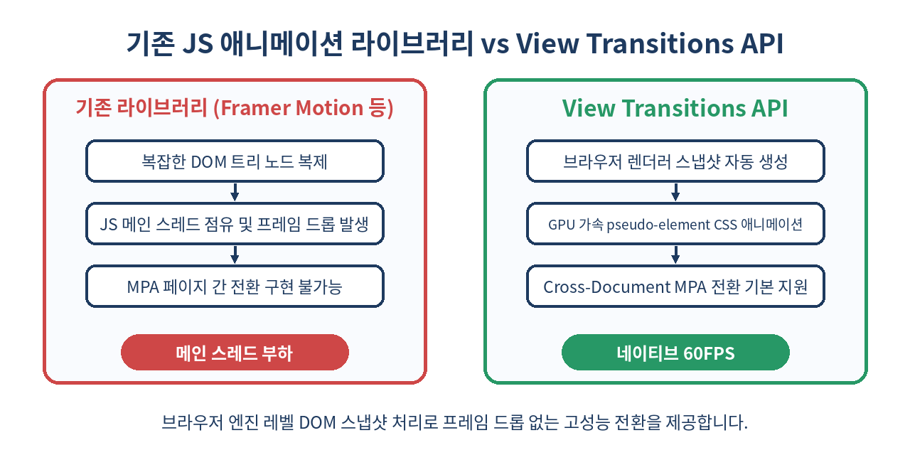
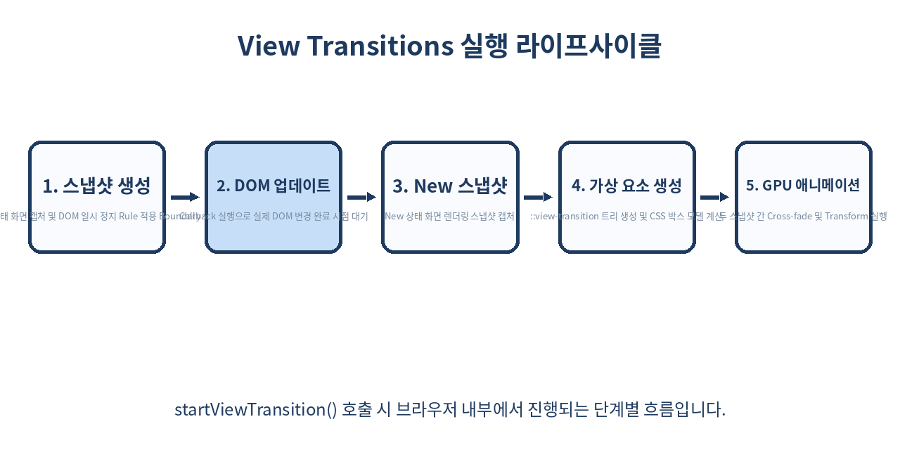

# 🎬 View Transitions API: SPA와 MPA를 아우르는 차세대 브라우저 애니메이션 혁명

> 복잡한 JS 라이브러리 없이 브라우저 네이티브 엔진만으로 부드러운 화면 전환을 구현하다.
> SPA 내부 상태 변화부터 MPA 페이지 이동까지 완벽하게 처리하는 View Transitions API의 모든 것.

---

## 📌 목차
1. 🧭 View Transitions API란 무엇인가?
2. ⚙️ 동작 원리: 브라우저 가상 요소(Pseudo-elements)의 비밀
3. 🚀 SPA에서 View Transitions 적용하기 (`document.startViewTransition`)
4. 🌐 MPA(Multi-Page Application) 간 Cross-Document View Transitions
5. 🎨 `view-transition-name`을 활용한 요소 단위 전환 (Hero Animation)
6. 📊 기존 애니메이션 솔루션과의 비교
7. 🛠️ 프레임워크(React / Next.js) 통합 및 커스텀 CSS 커스스터마이징
8. ⚠️ 실무 함정 1: 레이아웃 스태킹 및 z-index context 꼬임 현상
9. ⚠️ 실무 함정 2: 비동기 데이터 패칭 및 DOM 업데이트 타이밍 미스
10. 🚫 사용을 피해야 하는 상황과 성능 안티 패턴
11. 🧭 접근성(a11y)과 `prefers-reduced-motion` 대책
12. 🧾 정리

---

## 🧭 1. View Transitions API란 무엇인가?

과거 웹 애플리케이션에서 페이지를 전환하거나 상태를 변경할 때 네이티브 앱과 같은 부드러운 애니메이션을 구현하는 것은 대단히 까다로운 작업이었습니다. `Framer Motion`, `GSAP`, `React Transition Group` 같은 외부 라이브러리를 사용하여 구 상태와 신 상태의 DOM 노드를 한 번에 유지하고, 절대 좌표(`position: absolute`)를 계산하여 트랜지션을 부여해야 했습니다.

`View Transitions API`는 이러한 복잡성을 브라우저 렌더링 엔진 자체로 가져왔습니다. 개발자는 DOM 업데이트 로직만 전달하고, 브라우저가 변경 전후의 렌더링 스냅샷을 캡처하여 GPU 가속 기반의 가상 요소(Pseudo-elements) 트리를 생성합니다.



---

## ⚙️ 2. 동작 원리: 브라우저 가상 요소(Pseudo-elements)의 비밀

`document.startViewTransition()`이 호출되면 브라우저는 다음과 같은 단계로 가상 렌더링 트리를 구축합니다.

1. 현재 상태의 화면을 **Old 스냅샷 이미지**로 캡처합니다.
2. 전달된 콜백 함수를 실행하여 실제 DOM을 변경합니다.
3. 변경 완료 후 새로운 상태의 화면을 **New 스냅샷 이미지**로 캡처합니다.
4. 브라우저 루트 최상위에 `::view-transition` 가상 요소 트리를 생성합니다.

```text
::view-transition
└─ ::view-transition-group(root)
   └─ ::view-transition-image-pair(root)
      ├─ ::view-transition-old(root)   <-- 이전 상태 캡처
      └─ ::view-transition-new(root)   <-- 이후 상태 캡처
```

기본적으로 `::view-transition-old`는 opacity 1에서 0으로, `::view-transition-new`는 opacity 0에서 1로 변하는 Cross-fade 애니메이션이 적용됩니다.



---

## 🚀 3. SPA에서 View Transitions 적용하기 (`document.startViewTransition`)

단일 페이지 애플리케이션(SPA)에서는 DOM 변경 코드를 `document.startViewTransition` 콜백으로 감싸는 것만으로 즉시 동작합니다.

```js
// View Transitions API 지원 여부 확인 분기
function updateDOM() {
  document.getElementById('content').textContent = '새로운 페이지 콘텐츠입니다!';
}

function navigate() {
  if (!document.startViewTransition) {
    // 미지원 브라우저는 폴백 처리
    updateDOM();
    return;
  }

  // 브라우저가 화면을 캡처하고 애니메이션 트리거
  const transition = document.startViewTransition(() => {
    updateDOM();
  });

  transition.ready.then(() => {
    console.log('가상 애니메이션 요소를 사용할 준비가 되었습니다.');
  });

  transition.finished.then(() => {
    console.log('트랜지션이 완전히 끝났습니다.');
  });
}
```

---

## 🌐 4. MPA(Multi-Page Application) 간 Cross-Document View Transitions

Chrome 126부터는 SPA뿐만 아니라 동일 출처(Same-Origin)의 MPA 간 페이지 이동 시에도 CSS 설정만으로 브라우저 수준 트랜지션을 지원합니다.

```css
/* origin 및 target 문서 양쪽 모두의 CSS에 선언해야 동작합니다 */
@view-transition {
  navigation: auto;
}
```

별도의 JavaScript 코딩 없이 `<a>` 태그 클릭을 통한 페이지 전환 시에도 자연스러운 배너 공유, 이미지 트랜지션 등이 이루어집니다.

---

## 🎨 5. `view-transition-name`을 활용한 요소 단위 전환 (Hero Animation)

전체 화면 교체 외에 특정 개별 요소를 매칭하여 부드럽게 위치와 크기를 변환(Shared Element Transition)할 수 있습니다.

```css
/* 목록 페이지의 이미지 카테고리 */
.card-image {
  view-transition-name: product-hero;
}

/* 상세 페이지의 메인 헤더 이미지 */
.detail-hero-image {
  view-transition-name: product-hero;
}
```

두 페이지 혹은 두 상태에서 동일한 `view-transition-name`을 가진 요소가 존재하면, 브라우저는 해당 요소의 Rect(위치, 크기) 차이를 자동 계산하여 무결점 Transform 애니메이션을 연출합니다.

---

## 📊 6. 기존 애니메이션 솔루션과의 비교

| 구분 | 기존 JS 라이브러리 (Framer/GSAP) | View Transitions API |
| :--- | :--- | :--- |
| **렌더링 방식** | 실제 DOM 노드 복제 및 JS 좌표 계산 | 브라우저 렌더러 수준 스냅샷 이미지 처리 |
| **메인 스레드 부하** | 높음 (스크립트 실행 및 Reflow 지속 발생) | 매우 낮음 (GPU Compositor 스레드 활용) |
| **MPA 지원** | 불가능 | `@view-transition`으로 완전 지원 |
| **번들 사이즈** | 30KB ~ 100KB+ 가중 | **0 KB** (웹 표준 API) |
| **복잡도** | AnimatePresence 등 리액트 트리 관리 필요 | 단순 CSS `view-transition-name` 명시 |

---

## 🛠️ 7. 프레임워크(React / Next.js) 통합 및 커스텀 CSS 커스텀

React 19 및 Next.js App Router 환경에서는 `flushSync`와 함께 사용하거나 커스텀 훅으로 추상화할 수 있습니다.

```jsx
import { flushSync } from 'react-dom';
import { useState } from 'react';

export function useViewTransition() {
  const [isPending, setIsPending] = useState(false);

  const startTransition = (callback) => {
    if (!document.startViewTransition) {
      callback();
      return;
    }

    setIsPending(true);
    const transition = document.startViewTransition(() => {
      flushSync(() => {
        callback();
      });
    });

    transition.finished.finally(() => setIsPending(false));
  };

  return { startTransition, isPending };
}
```

CSS를 이용해 기본 애니메이션 속도와 이징(easing)도 손쉽게 제어할 수 있습니다.

```css
/* 슬라이드 좌우 이동 커스텀 트랜지션 */
::view-transition-old(slide-card) {
  animation: 300ms ease-out cubic-bezier(0.4, 0, 0.2, 1) slide-to-left;
}
::view-transition-new(slide-card) {
  animation: 300ms ease-out cubic-bezier(0.4, 0, 0.2, 1) slide-from-right;
}

@keyframes slide-to-left {
  to { transform: translateX(-100%); }
}
@keyframes slide-from-right {
  from { transform: translateX(100%); }
}
```

---

## ⚠️ 8. 실무 함정 1: 레이아웃 스태킹 및 z-index context 꼬임 현상

가장 흔히 겪는 문제는 `view-transition-name`이 고유해야 한다는 점입니다. 한 화면 내에서 두 개 이상의 요소에 동일한 `view-transition-name`을 지정하면 트랜지션 전체가 무시되고 콘솔 에러가 발생합니다.

```javascript
// ❌ 잘못된 예시: 반복문 안에서 동일한 name 지정
items.map(item => (
  <div style={{ viewTransitionName: 'card-item' }}>{item.title}</div>
));

// ✅ 올바른 예시: 동적 고유 ID 부여
items.map(item => (
  <div style={{ viewTransitionName: `card-item-${item.id}` }}>{item.title}</div>
));
```

또한 트랜지션 가상 요소 트리는 항상 Document 최상단 레이어에 오버레이 되므로, `overflow: hidden`이나 부모의 `z-index` 규칙을 무시할 수 있어 시각적 잘림 현상을 확인해야 합니다.

---

## ⚠️ 9. 실무 함정 2: 비동기 데이터 패칭 및 DOM 업데이트 타이밍 미스

`startViewTransition`의 콜백 함수에서 Promise를 처리할 때, 비동기 로직이 완전히 종료될 때까지 브라우저는 화면을 스냅샷 캡처 대기 상태로 고정시킵니다.

```js
// ❌ 안쁜 예시: 너무 긴 비동기 대기로 화면 Freeze 발생
document.startViewTransition(async () => {
  const data = await fetchLargeData(); // 2초 소요 시 2초간 화면 완전 먹통
  renderUI(data);
});

// ✅ 올바른 예시: 데이터를 먼저 받아온 후 DOM 업데이트만 콜백으로 전달
const data = await fetchLargeData();
document.startViewTransition(() => {
  renderUI(data);
});
```

---

## 🚫 10. 사용을 피해야 하는 상황과 성능 안티 패턴

1. **수백 개의 리스트 항목 전체에 `view-transition-name` 부여**: 개별 캡처 스냅샷 레이어가 수백 개 생겨 GPU 메모리 폭증 및 프레임 드롭을 유발합니다.
2. **실시간 데이터 스트리밍(Chart, Canvas)**: 초당 수십 번 바뀌는 데이터 표시에 View Transition을 걸면 비동기 스냅샷이 꼬이게 됩니다.
3. **인풋 키보드 입력 타이밍**: 텍스트 입력 시마다 트랜지션을 실행하면 입력 딜레이(INP 저하)가 발생합니다.

---

## 🧭 11. 접근성(a11y)과 `prefers-reduced-motion` 대책

모션 시각 장애나 어지럼증을 느끼는 사용자를 위해 반드시 `prefers-reduced-motion` 미디어 쿼리를 적용해야 합니다.

```css
@media (prefers-reduced-motion: reduce) {
  ::view-transition-group(*),
  ::view-transition-old(*),
  ::view-transition-new(*) {
    animation: none !important;
  }
}
```

---

## 🧾 12. 정리

- View Transitions API는 브라우저 네이티브 수준의 스냅샷 애니메이션 메커니즘을 제공합니다.
- `document.startViewTransition` 하나로 SPA의 DOM 변경을 부드럽게 이을 수 있습니다.
- `view-transition-name`을 통해 서로 다른 페이지 간의 Hero 애니메이션을 무설정 수준으로 선언할 수 있습니다.
- 고유한 name 관리, 비동기 데이터 처리 순서, `prefers-reduced-motion` 대응이 실무 적용의 핵심 키포인트입니다.

> ✨ **한 줄 요약**
> 무거운 JS 애니메이션 라이브러리를 내려놓고, 브라우저 가상 요소 스냅샷 기반의 View Transitions API로 부드러운 웹 경험을 구축하자!

---

## 📚 참고 자료
- [W3C Draft: CSS View Transitions Module Level 1](https://www.w3.org/TR/css-view-transitions-1/)
- [MDN Web Docs: View Transitions API](https://developer.mozilla.org/en-US/docs/Web/API/View_Transitions_API)
- [Chrome Dev: Smooth transitions with the View Transitions API](https://developer.chrome.com/docs/web-platform/view-transitions/)
