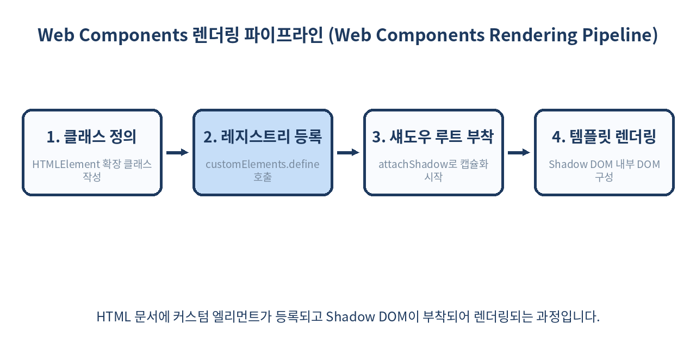
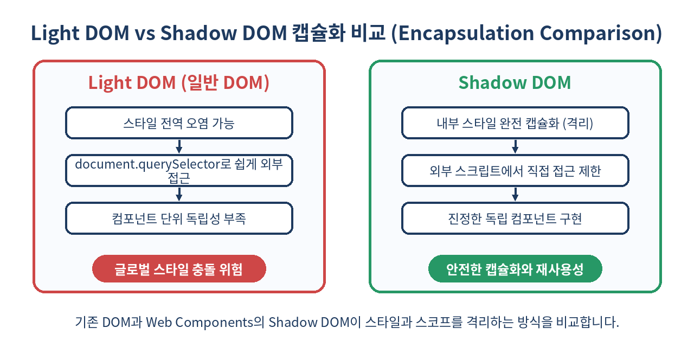

# 🧩 Web Components와 Shadow DOM 완벽 가이드

> 브라우저가 직접 지원하는 네이티브 컴포넌트 아키텍처
> 외부 프레임워크 의존성을 완전히 제거하는 웹 표준 기술을 알아봅니다.

---

## 📌 목차
1. 🌐 Web Components란 무엇인가?
2. 🏗️ Custom Elements 정의하기
3. 🛡️ Shadow DOM과 스타일 캡슐화
4. 📄 HTML Templates과 Slot 활용
5. 🔄 라이프사이클 콜백 메서드 이해하기
6. 📦 외부 라이브러리 없는 상태 관리 패턴
7. ⚡ 성능 및 메모리 최적화 전략
8. ⚠️ 실무 함정과 주의해야 할 안티패턴
9. 🚫 쓰면 안 되는 경우와 대안
10. 🧾 정리 및 한 줄 요약
11. 📚 참고 자료

---

## 🌐 1. Web Components란 무엇인가?

현대 웹 개발은 React, Vue, Svelte 같은 거대한 프레임워크를 중심으로 이루어지고 있습니다. 하지만 이러한 도구들은 버전 업그레이드, 빌드 시스템의 복잡성, 그리고 런타임 오버헤드를 동반합니다. **Web Components**는 브라우저 엔진 레벨에서 재사용 가능한 커스텀 요소를 만들 수 있도록 W3C에서 제정한 표준 기술 모음입니다. 프레임워크 생태계가 급변하더라도 Web Components로 작성된 컴포넌트는 수 년간 소스 코드 수정 없이 브라우저에서 네이티브하게 작동한다는 강력한 장점이 있습니다.

Web Components는 다음 세 가지 핵심 기술로 구성됩니다.
- **Custom Elements**: 브라우저가 인식하는 새로운 HTML 태그를 정의하는 스크립트 API (`window.customElements`)
- **Shadow DOM**: 마크업 구조, 스타일, 행동을 외부 DOM으로부터 격리하는 캡슐화 기술 (`attachShadow()`)
- **HTML Templates**: 렌더링되지 않은 채로 보관되다 필요할 때 복제되는 `<template>`과 `<slot>`

아래 표는 주요 프레임워크 컴포넌트 방식과 Web Components의 아키텍처 차이를 비교한 것입니다.

| 비교 항목 | React 컴포넌트 | Vue 컴포넌트 (.vue) | Web Components (네이티브) |
| :--- | :--- | :--- | :--- |
| **런타임 의존성** | React 렌더링 엔진 필요 | Vue 런타임 필요 | 없음 (브라우저 자체 지원) |
| **스타일 격리** | CSS Modules / Styled-components | Scoped CSS | Shadow DOM (완벽한 네이티브 격리) |
| **번들 크기** | 대형 (프레임워크 라이브러리 포함) | 중간 (Vue 코어 포함) | 매우 작음 (순수 자바스크립트/HTML) |
| **표준 호환성** | 라이브러리 종속적 | 프레임워크 종속적 | W3C / WHATWG 웹 표준 |



---

## 🏗️ 2. Custom Elements 정의하기

Custom Elements를 생성하려면 `HTMLElement`를 상속받는 자바스크립트 클래스를 작성하고, `customElements.define` 메서드를 통해 브라우저에 등록해야 합니다. 태그 이름에는 반드시 하이픈(-)이 포함되어야 HTML 표준 엘리먼트와 충돌하지 않습니다. (예: `<user-card>`는 유효하지만 `<user>`는 예약된 표준 태그명과 충돌하여 오류가 발생합니다.)

실무에서 자주 사용되는 자율형 커스텀 엘리먼트(Autonomous Custom Element)의 완성된 구현 예시는 다음과 같습니다.

```javascript
class UserCard extends HTMLElement {
  constructor() {
    super();
    // 캡슐화를 위해 Open 모드로 Shadow DOM 부착
    this.attachShadow({ mode: 'open' });
    this.shadowRoot.innerHTML = `
      <style>
        :host {
          display: block;
          font-family: 'Segoe UI', Tahoma, Geneva, Verdana, sans-serif;
          max-width: 320px;
          border: 1px solid #E2E8F0;
          border-radius: 12px;
          padding: 20px;
          background: #FFFFFF;
          box-shadow: 0 4px 6px -1px rgba(0, 0, 0, 0.1);
        }
        p {
          color: #1E3A5F;
          font-weight: 600;
          font-size: 1.1rem;
          margin: 0 0 12px 0;
        }
        .badge {
          display: inline-block;
          background: #EBF8FF;
          color: #3182CE;
          padding: 4px 8px;
          border-radius: 4px;
          font-size: 0.85rem;
        }
      </style>
      <p>사용자 카드 컴포넌트</p>
      <span class="badge">Active Member</span>
    `;
  }
}

// 브라우저 레지스트리에 컴포넌트 등록
customElements.define('user-card', UserCard);
```

HTML 문서에서는 아래와 같이 일반 태그처럼 즉시 사용할 수 있으며, 브라우저 파서가 태그를 인식하는 즉시 인스턴스화됩니다.

```html
<user-card></user-card>
```

---

## 🛡️ 3. Shadow DOM과 스타일 캡슐화

Shadow DOM은 Web Components의 핵심입니다. 일반적인 DOM 트리의 하위에 별도의 닫힌 DOM 트리를 부착하여, 외부의 CSS 스타일이 내부로 침투하지 못하도록 막고 내부 스타일이 외부로 새어나가지 않도록 보호합니다. 

여기서 `mode: 'open'`으로 설정하면 외부 자바스크립트에서 `element.shadowRoot`를 통해 내부 DOM에 접근할 수 있지만, `mode: 'closed'`로 설정하면 외부에서 내부 Shadow DOM 접근이 완전히 차단되어 보안상 더 엄격한 캡슐화를 제공합니다.



다만 외부 스타일이 완전히 차단되면 디자인 시스템의 일관성을 유지하기 어렵기 때문에, **CSS Custom Properties (CSS 변수)**를 활용해 외부에서 내부 스타일의 특정 값을 제어할 수 있는 통로를 열어둘 수 있습니다.

```javascript
class StyledBox extends HTMLElement {
  constructor() {
    super();
    const shadow = this.attachShadow({ mode: 'open' });
    shadow.innerHTML = `
      <style>
        div {
          /* 외부에서 전달된 CSS 변수가 없으면 기본값 #D6E8FB 사용 */
          background: var(--box-bg, #D6E8FB);
          border: 1px solid var(--box-border, #5B8FD4);
          color: var(--box-color, #1A365D);
          padding: 16px;
          border-radius: 8px;
          font-family: inherit;
        }
      </style>
      <div>격리된 스타일 영역입니다. (외부 CSS 변수 연동 가능)</div>
    `;
  }
}

customElements.define('styled-box', StyledBox);
```

외부 HTML 문서에서는 다음과 같이 CSS 변수를 주입하여 내부 스타일을 안전하게 커스텀할 수 있습니다.

```html
<style>
  styled-box {
    --box-bg: #FEFCBF;
    --box-border: #D69E2E;
    --box-color: #744210;
  }
</style>
<styled-box></styled-box>
```

---

## 📄 4. HTML Templates과 Slot 활용

매번 자바스크립트 문자열 내부에 HTML을 작성하는 것은 복잡한 UI에서 유지보수성을 떨어뜨립니다. `<template>` 태그를 사용하면 브라우저가 파싱하지만 렌더링하지 않는 정적 마크업 조각을 선언할 수 있으며, `<slot>`을 통해 컴포넌트 내부로 외부 콘텐츠를 동적으로 주입(Content Projection)할 수 있습니다.

이름이 있는 슬롯(Named Slot)을 활용하면 복잡한 레이아웃 컴포넌트도 깔끔하게 설계할 수 있습니다.

```html
<template id="app-modal-template">
  <style>
    .modal-backdrop {
      position: fixed;
      top: 0; left: 0; width: 100%; height: 100%;
      background: rgba(0, 0, 0, 0.5);
      display: flex;
      justify-content: center;
      align-items: center;
      z-index: 1000;
    }
    .modal-container {
      background: white;
      padding: 24px;
      border-radius: 12px;
      width: 400px;
      box-shadow: 0 10px 25px rgba(0,0,0,0.2);
    }
    .modal-header { font-size: 1.25rem; font-weight: bold; margin-bottom: 12px; }
    .modal-footer { margin-top: 20px; display: flex; justify-content: flex-end; gap: 8px; }
  </style>
  <div class="modal-backdrop">
    <div class="modal-container">
      <div class="modal-header">
        <slot name="header">기본 제목</slot>
      </div>
      <div class="modal-body">
        <slot name="body">기본 본문 내용</slot>
      </div>
      <div class="modal-footer">
        <slot name="footer">
          <button id="close-btn">닫기</button>
        </slot>
      </div>
    </div>
  </div>
</template>

<script>
  class AppModal extends HTMLElement {
    constructor() {
      super();
      const template = document.getElementById('app-modal-template');
      this.attachShadow({ mode: 'open' }).appendChild(template.content.cloneNode(true));
    }
  }
  customElements.define('app-modal', AppModal);
</script>
```

사용 시에는 아래와 같이 슬롯 이름을 지정하여 콘텐츠를 채워 넣습니다.

```html
<app-modal>
  <span slot="header">시스템 경고</span>
  <p slot="body">작업을 계속 진행하시겠습니까? 데이터가 유실될 수 있습니다.</p>
  <div slot="footer">
    <button onclick="alert('취소됨')">취소</button>
    <button style="background: red; color: white;" onclick="alert('확인됨')">확인</button>
  </div>
</app-modal>
```

---

## 🔄 5. 라이프사이클 콜백 메서드 이해하기

Custom Elements는 리액트 등의 컴포넌트 생명주기와 유사하게, 브라우저가 상태를 변경할 때 호출하는 고유한 라이프사이클 콜백 메서드를 제공합니다.

- `constructor()`: 엘리먼트가 생성될 때 호출 (초기 상태 설정 및 Shadow DOM 생성 용도)
- `connectedCallback()`: 엘리먼트가 문서의 DOM에 처음 추가(마운트)될 때 호출
- `disconnectedCallback()`: 엘리먼트가 문서의 DOM에서 제거(언마운트)될 때 호출 (이벤트 리스너 해제 및 타이머 정리 용도)
- `adoptedCallback()`: 엘리먼트가 다른 문서(document)로 이동될 때 호출
- `attributeChangedCallback(name, oldValue, newValue)`: 관찰 중인 어트리뷰트가 추가, 제거, 수정될 때 호출

```javascript
class LifeCycleElement extends HTMLElement {
  constructor() {
    super();
    this.attachShadow({ mode: 'open' });
    console.log('[1] constructor 호출됨');
  }

  // 감시할 어트리뷰트 지정
  static get observedAttributes() {
    return ['status', 'theme'];
  }

  connectedCallback() {
    console.log('[2] connectedCallback 호출됨: DOM 마운트 완료');
    this.render();
  }

  disconnectedCallback() {
    console.log('[3] disconnectedCallback 호출됨: DOM 언마운트 완료');
    // 메모리 누수 방지를 위한 이벤트 리스너 제거 등 정리 작업 수행
  }

  attributeChangedCallback(name, oldValue, newValue) {
    if (oldValue !== newValue) {
      console.log(`[4] attributeChangedCallback: ${name} 속성이 [${oldValue}] -> [${newValue}]로 변경됨`);
      this.render();
    }
  }

  render() {
    const status = this.getAttribute('status') || 'idle';
    const theme = this.getAttribute('theme') || 'light';
    this.shadowRoot.innerHTML = `
      <style>
        div { padding: 12px; border-radius: 6px; }
        .light { background: #F7FAFC; color: #2D3748; }
        .dark { background: #1A202C; color: #EDF2F7; }
      </style>
      <div class="${theme}">
        현재 컴포넌트 상태: <strong>${status}</strong> (테마: ${theme})
      </div>
    `;
  }
}

customElements.define('lifecycle-element', LifeCycleElement);
```

---

## 📦 6. 외부 라이브러리 없는 상태 관리 패턴

순수 Web Components에서 상태 관리는 주로 프로퍼티(`properties`)와 커스텀 이벤트(`CustomEvent`)를 조합하여 구현합니다. 부모 컴포넌트는 자식에게 속성(Attribute)이나 프로퍼티로 데이터를 전달하고, 자식은 이벤트로 부모에게 상태 변화를 알립니다.

복잡한 폼 컨트롤이나 위젯을 만들 때 표준 `FormData` 및 `ElementInternals` API를 활용하면 네이티브 `<form>` 태그와 완벽하게 연동되는 컴포넌트를 작성할 수 있습니다.

```javascript
class CounterComponent extends HTMLElement {
  // Form 연동을 위한 설정
  static formAssociated = true;

  constructor() {
    super();
    this._count = 0;
    this.attachShadow({ mode: 'open' });
    this.internals = this.attachInternals();
    this.render();
  }

  get count() {
    return this._count;
  }

  set count(val) {
    this._count = val;
    this.render();
    // 폼 내부에서 값으로 인식되도록 내부 상태 설정
    this.internals.setFormValue(String(this._count));
  }

  increment() {
    this.count++;
    // 외부로 커스텀 이벤트 디스패치 (bubbles와 composed를 true로 설정해야 Shadow DOM을 뚫고 올라감)
    this.dispatchEvent(new CustomEvent('count-changed', {
      detail: { count: this.count },
      bubbles: true,
      composed: true
    }));
  }

  render() {
    this.shadowRoot.innerHTML = `
      <style>
        button {
          background-color: #3182CE;
          color: white;
          padding: 8px 16px;
          border: none;
          border-radius: 6px;
          font-weight: 600;
          cursor: pointer;
        }
        button:hover { background-color: #2B6CB0; }
      </style>
      <button id="btn">카운트: ${this._count}</button>
    `;
    this.shadowRoot.getElementById('btn').addEventListener('click', () => this.increment());
  }
}

customElements.define('counter-component', CounterComponent);
```

---

## ⚡ 7. 성능 및 메모리 최적화 전략

Web Components를 대규모 엔터프라이즈 서비스에 도입할 때 고려해야 할 핵심 성능 최적화 기법과 권장 수치는 다음과 같습니다.

- **Lazy Definition (지연 정의)**: 전체 컴포넌트를 초기 페이지 로딩 시점에 일괄 정의하지 않고, 사용자가 뷰포트에 진입하거나 특정 액션을 수행할 때 동적으로 로드 및 정의합니다. `customElements.whenDefined('tag-name')`을 활용해 정의 완료 시점을 안전하게 보장할 수 있습니다.
- **Shadow Root 템플릿 클론 최적화**: 동일한 구조의 컴포넌트가 수백 개 반복될 때 매번 `innerHTML`을 파싱하는 것은 메인 스레드에 큰 부하를 줍니다. `<template>`의 `cloneNode(true)`를 사용하여 메모리 및 파싱 비용을 최대 70% 이상 절감할 수 있습니다.
- **Event Delegation (이벤트 위임)**: 수백 개의 리스트 아이템 컴포넌트마다 개별 `click` 리스너를 붙이지 않고, Shadow Root 최상단 루트 노드에 단일 이벤트 리스너를 배치하여 메모리 사용량을 최소화합니다.

아래는 성능 최적화가 적용된 템플릿 복제 패턴의 예시입니다.

```javascript
// 전역 템플릿 캐싱 활용
const cachedTemplate = document.createElement('template');
cachedTemplate.innerHTML = `
  <style>
    .item { padding: 8px; border-bottom: 1px solid #EDF2F7; }
  </style>
  <div class="item"><slot>아이템</slot></div>
`;

class OptimizedItem extends HTMLElement {
  constructor() {
    super();
    const shadow = this.attachShadow({ mode: 'open' });
    // 이미 파싱된 템플릿 노드를 클론하여 DOM 삽입 속도 극대화
    shadow.appendChild(cachedTemplate.content.cloneNode(true));
  }
}

customElements.define('optimized-item', OptimizedItem);
```

---

## ⚠️ 8. 실무 함정과 주의해야 할 안티패턴

1. **전역 스타일 유출과 변수 활용의 오해**: Shadow DOM 내부에서는 부모 문서의 일반 CSS 선택자(`div`, `.class`, `#id`)가 전혀 적용되지 않습니다. 디자인 시스템의 일관성을 맞추기 위해 일반 CSS를 상속받으려 하지 말고, 반드시 **CSS Custom Properties (`--*`)**를 통해 값을 주입해야 합니다.
2. **초기화 시점의 속성 접근 오류**: 컴포넌트의 `constructor()` 내부에서 아직 DOM에 완전히 마운트되지 않은 상태의 어트리뷰트나 속성에 접근하면 `null` 또는 빈 값이 반환됩니다. 속성 값 초기화 및 읽기는 반드시 `connectedCallback()` 내부에서 수행해야 안전합니다.
3. **과도한 캡슐화와 DOM 트리 깊이 증가**: 모든 작은 텍스트 조각이나 레이아웃 박스까지 컴포넌트화하면 DOM 트리가 지나치게 깊어지고(Deep DOM Tree), 브라우저의 레이아웃(Reflow) 계산 비용이 급증하여 성능 저하를 유발합니다. 재사용성이 검증된 UI 단위에만 컴포넌트를 적용해야 합니다.

---

## 🚫 9. 쓰면 안 되는 경우와 대안

- **복잡한 상태 관리와 대규모 SPA 구조**: Redux, Zustand, Pinia 같은 전역 상태 관리 아키텍처나 복잡한 중첩 라우팅 구조가 필수적인 대형 단일 페이지 애플리케이션(SPA)에서는 순수 Web Components만으로 관리하기에 보일러플레이트 코드가 너무 많아지고 개발 생산성이 급격히 저하됩니다.
- **서버 사이드 렌더링(SSR)과 SEO가 극도로 중요한 서비스**: 표준 순수 Web Components는 기본적으로 브라우저 런타임(Client-side) 환경 기반에서 작동하므로, 검색엔진 최적화(SEO)를 위한 서버 사이드 렌더링 및 하이드레이션 처리를 직접 구현하려면 상당한 기술 부채가 발생합니다. (이 경우 **Lit**, **Stencil** 같은 컴파일러 기반 보조 라이브러리나 Astro 프레임워크 활용 필수)
- **적절한 대안**: 복잡한 비즈니스 로직, 잦은 상태 변경, 빠른 프로덕트 출시가 필요한 웹 서비스라면 React, Next.js, Svelte, Vue 등의 모던 프레임워크를 선택하는 것이 훨씬 유리합니다. Web Components는 **디자인 시스템 구축, 크로스 프레임워크 공통 위젯 라이브러리 개발** 영역에서 가장 큰 빛을 발합니다.

---

## 🧾 10. 정리 및 한 줄 요약

- Web Components는 외부 라이브러리나 프레임워크 종속성 없이 브라우저 표준 기술만으로 컴포넌트를 구축하는 아키텍처입니다.
- Custom Elements를 통해 커스텀 HTML 태그를 정의하고, Shadow DOM으로 스타일과 마크업을 완벽하게 캡슐화합니다.
- HTML Templates와 Slot을 이용해 유연한 마크업 주입과 재사용성이 높은 UI 구조를 설계할 수 있습니다.
- 생명주기 콜백 메서드를 활용하여 컴포넌트의 마운트, 언마운트, 속성 변경을 정교하게 제어할 수 있습니다.
- 지나친 컴포넌트 분리를 피하고, 디자인 시스템 및 프레임워크 간 공통 UI 컴포넌트 표준화 영역에 도입하는 것이 가장 이상적입니다.

> ✨ **한 줄 요약**
> 프레임워크 종속성을 끊어내는 가장 확실한 웹 표준 아키텍처, Web Components와 Shadow DOM

---

## 📚 참고 자료
- [MDN Web Docs - Web Components](https://developer.mozilla.org/en-US/docs/Web/Web_Components)
- [W3C Custom Elements Specification](https://html.spec.whatwg.org/multipage/custom-elements.html)
- [Web Components.org](https://www.webcomponents.org/)
