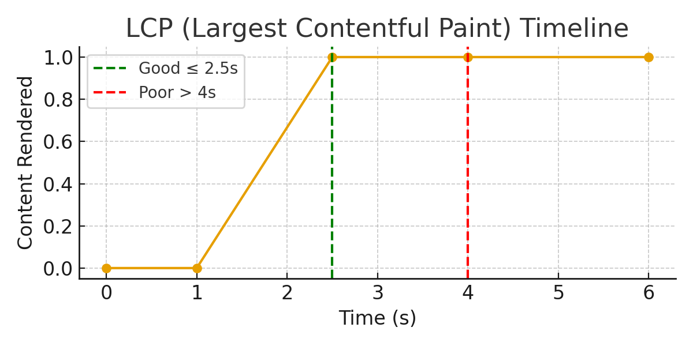
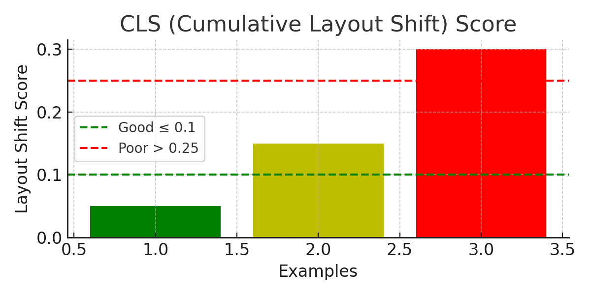

# 🌐 웹 성능 최적화 (Web Vitals) 완벽 가이드 

> 본 문서는 기본 개념부터 실전 코드, 심화 이론까지 한 번에 정리한 확장판입니다.  
> 아래에는 LCP·CLS 시각화 그림과 즉시 적용 가능한 최적화 코드 예제가 포함되어 있습니다.

## 1. Core Web Vitals 핵심 요약
- **LCP (Largest Contentful Paint)**: 가장 큰 콘텐츠가 화면에 나타나기까지 걸린 시간. 목표 ≤ **2.5s**  
- **INP (Interaction to Next Paint)**: 상호작용 후 다음 페인트까지 지연. 목표 ≤ **200ms**  
- **CLS (Cumulative Layout Shift)**: 예기치 않은 레이아웃 이동의 누적. 목표 ≤ **0.1**

---

## 2. 시각화: LCP, CLS 이해하기

### 2.1 LCP 타임라인 예시
아래 타임라인은 탐색 시작 → FCP → LCP 이벤트의 상대적 시점을 보여줍니다.



**개선 포인트**
- 이미지/히어로 미디어의 파일 포맷(WebP/AVIF), 사이즈, 압축
- 서버 응답 지연 감소(CDN, 캐시, TTFB 개선)
- 크리티컬 CSS 인라인, JS 지연 로딩

### 2.2 CLS 레이아웃 시프트 예시
점선 박스는 **레이아웃이 이동된 최종 위치**를 의미합니다.



**개선 포인트**
- 이미지/광고/임베드에 **고정 크기** 또는 `aspect-ratio` 지정
- 웹폰트 로딩 전략(font-display, FOIT/FOUT 방지)
- 레이아웃을 바꾸는 애니메이션 대신 `transform`/`opacity` 사용

---

## 3. 실전 코드 최적화 예제

### 3.1 이미지 & 미디어 (LCP, CLS 모두 개선)
**HTML: 고정 크기와 지연 로딩**
```html
<!-- 히어로 이미지: width/height 또는 aspect-ratio 지정 + lazy는 fold 아래에서만 -->

/>

<!-- 아래 영역 이미지 -->

```

**CSS: 비율 기반 자리 확보**
```css
.card-media {
  aspect-ratio: 4 / 3; /* 고정 크기가 어려울 때 CLS 방지 */
  object-fit: cover;
}
```

**Video: 포스터 + 미리 연결**
```html
<link rel="preconnect" href="https://cdn.example.com">
<video src="https://cdn.example.com/intro.webm" preload="metadata" poster="/images/intro-poster.jpg" playsinline muted></video>
```

---

### 3.2 폰트 최적화 (CLS, LCP)
**CSS: font-display로 FOIT/FOUT 제어**
```css
@font-face {
  font-family: "InterVar";
  src: url("/fonts/Inter-Variable.woff2") format("woff2");
  font-weight: 100 900;
  font-style: normal;
  font-display: swap; /* 빠른 텍스트 표시 */
}
```

**Metrics Override (CLS 감소: 폰트 교체 시 reflow 축소)**
```css
@font-face {
  font-family: "Brand Sans";
  src: url("/fonts/BrandSans.woff2") format("woff2");
  ascent-override: 90%;
  descent-override: 22%;
  line-gap-override: 0%;
  size-adjust: 102%;
  font-display: optional;
}
```

---

### 3.3 JavaScript 실행 최적화 (INP, TBT, TTI)
**스크립트 로딩 전략**
```html
<!-- 크리티컬하지 않은 스크립트는 defer/async -->
<script src="/js/vendor.js" defer></script>
<script src="/js/app.js" type="module"></script> <!-- 모듈은 기본 defer와 유사 -->
```

**긴 태스크 분할 (메인 스레드 점유 단축)**
```js
function chunkedWork(items, process, chunk = 100) {
  let i = 0;
  function step(deadline) {
    while (i < items.length && (deadline.timeRemaining() > 0 || deadline.didTimeout)) {
      for (let c = 0; c < chunk && i < items.length; c++, i++) {
        process(items[i]);
      }
    }
    if (i < items.length) requestIdleCallback(step, { timeout: 200 });
  }
  requestIdleCallback(step);
}
// 사용
chunkedWork(bigArray, heavyCompute);
```

**이벤트 핸들러 최적화 (INP 개선)**
```js
// 가벼운 핸들러에서 상태만 큐잉하고, 실제 무거운 작업은 idle/timeout으로 미룸
button.addEventListener('click', () => {
  queueMicrotask(() => {
    startTransition(); // React 18이라면 사용자 입력 우선권 보장
  });
});
```

---

### 3.4 Preload/Prefetch/Preconnect (LCP 단축)
```html
<!-- LCP에 필요한 히어로 이미지, 핵심 폰트 등을 preload -->
<link rel="preload" as="image" href="/images/hero.webp" imagesrcset="/images/hero@2x.webp 2x" fetchpriority="high">
<link rel="preload" as="font" href="/fonts/Inter-Variable.woff2" type="font/woff2" crossorigin>

<!-- 다음 페이지 리소스는 prefetch로 힌트 -->
<link rel="prefetch" href="/next/chunk-abc123.js" as="script">
<link rel="preconnect" href="https://cdn.example.com" crossorigin>
```

---

### 3.5 Next.js/React 실전 팁 (LCP/INP/CLS)
```tsx
// Next.js 13+
// 1) dynamic import로 코드 스플리팅
import dynamic from 'next/dynamic'
const HeavyChart = dynamic(() => import('./HeavyChart'), { ssr: false })

// 2) 이미지 최적화
import Image from 'next/image'
export default function Hero() { 
  return (
    <>
      <Image
        src="/images/hero.webp"
        alt="Hero"
        priority  // LCP 후보일 때
        width={1200}
        height={630}
      />
      <HeavyChart />
    </>
  )
}
```

```tsx
// React 18 concurrent 특성 활용 (INP 개선)
import { startTransition } from 'react'
function onFilterChange(next) {
  startTransition(() => {
    // 무거운 상태 변경은 낮은 우선순위로
    setFilter(next)
  })
}
```

---

### 3.6 측정과 모니터링 (RUM)
```html
<script type="module">
  import { onCLS, onINP, onLCP } from 'https://unpkg.com/web-vitals@4/dist/web-vitals.attribution.js'
  function sendToAnalytics(metric) {
    // fetch/beacon 등으로 서버에 전송
    console.log(metric.name, metric.value, metric.attribution)
  }
  onCLS(sendToAnalytics)
  onINP(sendToAnalytics)
  onLCP(sendToAnalytics)
</script>
```

---

## 4. 체크리스트
- [ ] LCP ≤ 2.5s, INP ≤ 200ms, CLS ≤ 0.1
- [ ] 히어로 미디어: preload + priority, 고정 크기 지정
- [ ] 비동기 스크립트 로딩, 긴 태스크 분할
- [ ] 폰트: font-display + metrics override
- [ ] 이미지/광고/임베드: width/height or aspect-ratio
- [ ] RUM 기반 상시 모니터링(Web Vitals API)

---

## 5. 부록: 문제 해결 트러블슈팅 힌트
- **LCP가 높음**: TTFB 확인 → 이미지 포맷/크기/압축 → preload → 크리티컬 CSS 인라인
- **INP가 높음**: 이벤트 핸들러 무거움 → 긴 태스크 분할 → 메모리 누수/리스너 중복 확인
- **CLS가 높음**: 사이즈 미지정 요소 탐지 → 폰트 교체 시 reflow → 애니메이션 속성 점검
