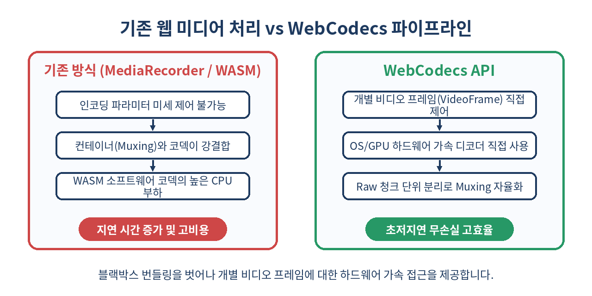
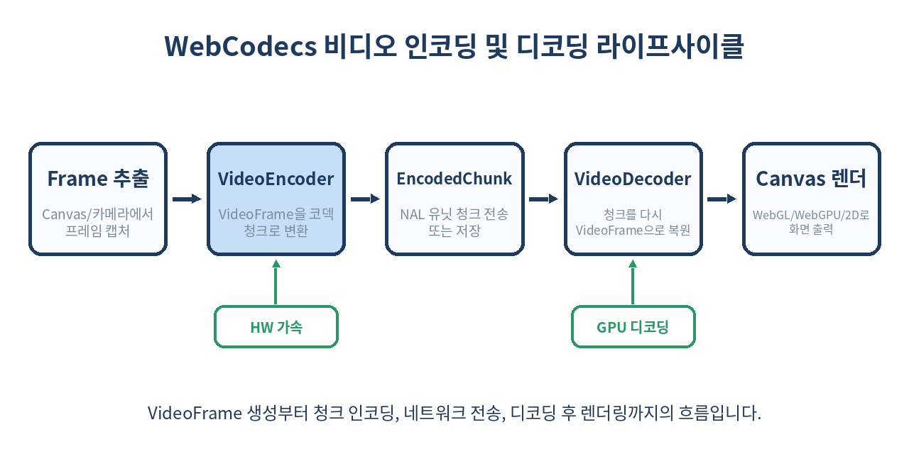

# 🎬 WebCodecs API 완벽 가이드: 브라우저 초저지연 미디어 인코딩과 디코딩

> "브라우저는 항상 미디어를 블랙박스 안에서만 다뤄왔습니다."
> HTML5 `<video>`와 `MediaRecorder`의 닫힌 문을 부수고, 내부 하드웨어 인코더와 디코더를 날것(Raw) 그대로 제어하는 **WebCodecs API**의 핵심 아키텍처와 실무 구현 패턴을 정리합니다.

---

## 📌 목차
1. 🧭 웹 미디어 파이프라인의 오랜 한계와 블랙박스 문제
2. 💡 WebCodecs API란 무엇인가?
3. ⚖️ 기존 솔루션 vs WebCodecs 비교 분석
4. 🧱 핵심 구성요소: VideoFrame과 EncodedVideoChunk
5. ⚙️ VideoEncoder로 캔버스 영상을 실시간 H.264/AV1으로 압축하기
6. 🖥️ VideoDecoder로 인코딩 청크를 받아 캔버스에 렌더링하기
7. 🎧 오디오 처리: AudioData, AudioEncoder, AudioDecoder
8. 📦 래퍼와 Muxing의 분리: MP4Box.js 연동 아키텍처
9. 🚀 Web Workers + OffscreenCanvas를 통한 60fps 무중단 파이프라인
10. ⚠️ 실무 현장 함정: 메모리 누수와 Garbage Collection의 배신
11. 🚫 WebCodecs를 쓰면 안 되는 상황과 대안
12. 🧾 정리: 웹 프론트엔드 미디어 엔지니어링의 미래
13. 📚 참고 자료

---

## 🧭 1. 웹 미디어 파이프라인의 오랜 한계와 블랙박스 문제

웹 브라우저에서 동영상을 다룰 때 개발자들은 오랜 시간 동안 극단적인 두 가지 선택지 중 하나를 강요받았습니다.

1. **고수준 브라우저 내장 API (`<video>`, `MediaRecorder`, `WebRTC`)**
   - 브라우저가 제공하는 표준 기능이지만 내부 구현이 철저히 **블랙박스**입니다.
   - `MediaRecorder`는 컨테이너 포맷(WebM, MP4)과 코덱 설정이 강하게 결합되어 있어, 압축률·비트레이트·키프레임(GOP) 간격을 프레임 단위로 미세 조작할 수 없습니다.
   - 실시간 방송 송출이나 캔버스 기반 비디오 편집기를 만들 때 원하는 수준의 지연 시간(Latency)과 압축 품질을 통제하기 불가능에 가까웠습니다.
2. **소프트웨어 코덱 기반 WASM (FFmpeg.wasm 등)**
   - C/C++로 작성된 FFmpeg를 WebAssembly로 컴파일하여 프레임 단위의 모든 통제권을 얻는 방식입니다.
   - 하지만 CPU 소프트웨어 디코딩/인코딩에 의존하므로 연산량이 엄청나며, 1080p 60fps 영상을 실시간으로 처리할 때 CPU 점유율이 100%를 치솟고 브라우저 탭이 멈추거나 배터리를 급격히 소모합니다.

웹 기반 클라우드 게이밍(GeForce Now, Xbox Cloud), 웹 기반 영상 편집기(Canva, Descript, Runaway), 초저지연 화상 원격 솔루션은 **"브라우저가 이미 내장하고 있는 GPU/하드웨어 가속 코덱에 직접 접근하게 해달라"**고 요구하기 시작했습니다. 그 해답으로 등장한 W3C 표준이 바로 **WebCodecs API**입니다.

---

## 💡 2. WebCodecs API란 무엇인가?

WebCodecs는 브라우저 엔진 밑단(Chromium, WebKit 등)이 OS의 하드웨어 가속 미디어 파이프라인(Windows의 Media Foundation, macOS의 VideoToolbox, Linux의 VA-API, Android의 MediaCodec)과 맺고 있는 네이티브 코덱 제어 인터페이스를 웹 JavaScript에 직접 노출하는 저수준(Low-Level) API입니다.

WebCodecs의 철학은 명확합니다.
- **컨테이너(Muxing/Demuxing)와 코덱(Codec)의 철저한 분리**
- **렌더링 레이어와 디코딩 레이어의 분리**
- **프레임 단위의 메모리 수명 주기 직접 제어**



이제 개발자는 비트스트림에서 NAL 유닛이나 압축 패킷을 추출해 `VideoDecoder`에 밀어 넣고, 디코딩되어 나온 `VideoFrame`을 WebGL이나 WebGPU 텍스처로 즉시 업로드하거나 캔버스에 직접 그릴 수 있습니다. 반대로 캔버스나 카메라에서 얻은 Raw 픽셀 프레임을 원하는 비트레이트와 GOP(Group of Pictures) 규칙에 따라 하드웨어 `VideoEncoder`로 인코딩할 수 있습니다.

---

## ⚖️ 3. 기존 솔루션 vs WebCodecs 비교 분석

웹에서 영상을 다루는 방식들을 요구 사항에 맞춰 객관적으로 비교해 보겠습니다.

| 비교 항목 | HTML5 MediaRecorder | FFmpeg.wasm (WASM 코덱) | WebCodecs API |
| :--- | :--- | :--- | :--- |
| **하드웨어 가속 (GPU)** | 지원 (내부 자동 할당) | 미지원 (순수 CPU 소프트웨어) | **완전 지원 (OS HW 코덱 직결)** |
| **프레임 단위 제어** | 불가 (타임슬라이스 청크 단위) | 완벽 제어 가능 | **완벽 제어 (VideoFrame 단위)** |
| **지연 시간 (Latency)** | 500ms ~ 수 초 (버퍼링 의존) | 코덱 연산 지연 심각 | **극초저지연 (수십 ms 미만 가능)** |
| **컨테이너 종속성** | 강결합 (WebM / Matroska 등) | 소프트웨어 구현에 따름 | **독립적 (Raw Encoded Chunk만 반환)** |
| **CPU 및 배터리 소모** | 보통 | 매우 높음 (팬 소음 및 스로틀링) | **매우 낮음 (전용 하드웨어 가속)** |
| **구현 복잡도** | 매우 낮음 (10줄 내외) | 높음 (WASM 메모리 관리 필요) | **높음 (Demuxing/동기화 직접 구현)** |

WebCodecs는 구현 난이도가 높은 대신, 성능과 통제력 측면에서 비교 대상이 없을 만큼 압도적인 이점을 제공합니다.

---

## 🧱 4. 핵심 구성요소: VideoFrame과 EncodedVideoChunk

WebCodecs 아키텍처를 이해하기 위한 두 가지 핵심 기둥이 있습니다.

### 1) VideoFrame (비압축 비디오 프레임)
- 압축되지 않은 단일 이미지 프레임을 나타냅니다.
- 소스로 `HTMLVideoElement`, `HTMLCanvasElement`, `OffscreenCanvas`, `ImageBitmap`, `ArrayBufferView`(YUV420, NV12, RGBA 등)를 모두 지원합니다.
- **중요**: GPU VRAM 또는 고속 시스템 공유 메모리를 점유하므로, 사용이 끝났을 때 반드시 `.close()`를 호출해 C++ 네이티브 레퍼런스를 해제해야 합니다.

### 2) EncodedVideoChunk (압축된 비디오 청크)
- H.264(AVC), H.265(HEVC), VP8, VP9, AV1 등으로 압축된 단일 프레임 바이트 데이터입니다.
- `type`: `'key'`(I-Frame, 독립 복원 가능) 또는 `'delta'`(P-Frame/B-Frame, 이전 프레임 참조 필요)
- `timestamp`: 프레임의 프레젠테이션 타임스탬프 (마이크로초, $\mu s$ 단위)
- `duration`: 해당 프레임의 재생 지속 시간 (마이크로초)



---

## ⚙️ 5. VideoEncoder로 캔버스 영상을 실시간 H.264/AV1으로 압축하기

실제로 캔버스에 그려진 애니메이션을 60fps H.264 비디오 청크로 인코딩하는 표준 파이프라인을 작성해 보겠습니다.

```javascript
// 1. 인코더 초기화
const initEncoder = () => {
  const encoder = new VideoEncoder({
    output: (chunk, metadata) => {
      // 인코딩된 청크가 발생할 때마다 비동기로 호출
      console.log(`청크 생성: 타입=${chunk.type}, 크기=${chunk.byteLength}B, 시간=${chunk.timestamp}µs`);
      
      if (metadata.decoderConfig) {
        // SPS / PPS 같은 디코더 설정 정보가 포함된 첫 키프레임 메타데이터
        console.log('Decoder Config 메타데이터 감지:', metadata.decoderConfig);
      }
      
      // WebTransport, WebSocket 또는 파일 Muxer로 청크를 전달
      transmitOrSaveChunk(chunk);
    },
    error: (e) => {
      console.error('VideoEncoder 내부 에러 발생:', e.message);
    }
  });

  // 2. 인코더 파라미터 구성 (H.264 Baseline/Main Profile)
  encoder.configure({
    codec: 'avc1.42001f', // H.264 Constrained Baseline Profile Level 3.1
    width: 1280,
    height: 720,
    bitrate: 2_000_000, // 2 Mbps
    framerate: 60,
    latencyMode: 'realtime', // 저지연 실시간 송출 모드
    hardwareAcceleration: 'prefer-hardware' // 하드웨어 가속 우선 사용
  });

  return encoder;
};

// 3. 캔버스 프레임을 인코더에 밀어넣는 렌더 루프
let frameIndex = 0;
const processCanvasFrame = (canvas, encoder) => {
  const timestamp = (frameIndex * 1_000_000) / 60; // 60fps 기준 마이크로초 환산
  
  // Canvas로부터 VideoFrame 인스턴스 생성
  const frame = new VideoFrame(canvas, { timestamp });
  
  // 60프레임마다(1초마다) 강제로 키프레임(IDR) 생성 요청
  const isKeyFrame = frameIndex % 60 === 0;
  encoder.encode(frame, { keyFrame: isKeyFrame });
  
  // 인코더로 전달한 직후 즉시 원본 프레임 자원 반환 필수!
  frame.close();
  frameIndex++;
};
```

`encoder.configure()` 호출 시 브라우저가 지원하지 않는 코덱이거나 해상도 제한을 벗어날 경우 동기 예외를 던집니다. 사전에 `VideoEncoder.isConfigSupported(config)` 정적 메서드를 호출하여 지원 여부를 확인하는 것이 권장됩니다.

---

## 🖥️ 6. VideoDecoder로 인코딩 청크를 받아 캔버스에 렌더링하기

네트워크나 파일로부터 전달받은 `EncodedVideoChunk`를 하드웨어 가속으로 풀어내어 화면에 렌더링하는 과정입니다.

```javascript
const canvas = document.getElementById('outputCanvas');
const ctx = canvas.getContext('2d');

const initDecoder = () => {
  const decoder = new VideoDecoder({
    output: (videoFrame) => {
      // 디코딩 완료된 비압축 프레임 획득
      // 2D 캔버스, WebGL, WebGPU 어디로든 즉시 복사 또는 드로잉 가능
      ctx.drawImage(videoFrame, 0, 0, canvas.width, canvas.height);
      
      // 화면에 그린 후 즉시 close() 호출로 GPU/VRAM 메모리 누수 방지
      videoFrame.close();
    },
    error: (e) => {
      console.error('VideoDecoder 디코딩 실패:', e);
    }
  });

  decoder.configure({
    codec: 'avc1.42001f',
    codedWidth: 1280,
    codedHeight: 720,
    hardwareAcceleration: 'prefer-hardware'
  });

  return decoder;
};

// 수신된 바이너리 패킷을 EncodedVideoChunk로 감싸 디코더에 투입
const handleIncomingPacket = (decoder, packetBuffer, isKey, timestampMicros) => {
  const chunk = new EncodedVideoChunk({
    type: isKey ? 'key' : 'delta',
    timestamp: timestampMicros,
    data: packetBuffer
  });

  decoder.decode(chunk);
};
```

`decoder.decode(chunk)`를 호출할 때, **첫 번째 프레임은 반드시 `type: 'key'`(키프레임)이어야 합니다.** 델타 프레임부터 디코더에 집어넣으면 디코더 에러 콜백이 트리거되어 파이프라인이 파괴됩니다.

---

## 🎧 7. 오디오 처리: AudioData, AudioEncoder, AudioDecoder

비디오뿐만 아니라 고품질 오디오 스트림 역시 완벽히 동일한 메커니즘으로 처리할 수 있습니다.

- **AudioData**: PCM 형식의 압축되지 않은 오디오 샘플 버퍼 (`f32`, `s16` 등 다양한 샘플 포맷, 다중 채널 지원)
- **AudioEncoder / AudioDecoder**: Opus, AAC, FLAC 등의 코덱 지원

```javascript
const audioEncoder = new AudioEncoder({
  output: (chunk, metadata) => {
    // 압축된 Opus 오디오 청크 수신
  },
  error: (e) => console.error(e)
});

audioEncoder.configure({
  codec: 'opus',
  sampleRate: 48000,
  numberOfChannels: 2,
  bitrate: 128000 // 128 kbps
});
```

Web Audio API의 `AudioWorkletNode`와 조합하면, 마이크 입력을 받아 즉시 Opus 청크로 압축한 뒤 WebTransport 데이터그램으로 전송하는 초저지연 실시간 음성 통신 시스템을 구현할 수 있습니다.

---

## 📦 8. 래퍼와 Muxing의 분리: MP4Box.js 연동 아키텍처

WebCodecs를 처음 접하는 개발자들이 가장 당황하는 지점은 **"인코딩된 청크들을 파일로 저장했는데 `.mp4` 플레이어에서 열리지 않는다"**는 사실입니다.

WebCodecs는 **순수한 압축 비트스트림(Elementary Stream)**만 다룹니다. 우리가 흔히 알고 있는 `.mp4`, `.mkv`, `.webm` 파일은 비디오 청크와 오디오 청크를 시간 순서대로 엮고 인덱스 테이블(moov/stbl)을 덧붙인 **컨테이너(Container)**입니다.

따라서 WebCodecs로 영상을 녹화하여 다운로드 가능한 MP4 파일로 만들려면 **Muxer(멀티플렉서)** 라이브러리와 협업해야 합니다. 가장 대표적인 조합은 `mp4box.js` 또는 가벼운 순수 JS 라이브러리인 `mp4-muxer`입니다.

```text
[ Canvas / Camera ]
        │ (Raw Frame)
        ▼
[ VideoEncoder (WebCodecs) ]  <-- OS 하드웨어 가속 압축
        │ (EncodedVideoChunk)
        ▼
[ mp4-muxer / MP4Box.js ]      <-- JavaScript 컨테이너 패키징
        │ (ArrayBuffer / Blob)
        ▼
[ 완결된 .mp4 파일 저장 / 재생 ]
```

반대로 로컬 MP4 파일을 읽어 프레임별로 가공하려면 `Demuxer`로 컨테이너를 파싱해 NAL 청크를 뽑아낸 뒤 `VideoDecoder`에 공급해야 합니다.

---

## 🚀 9. Web Workers + OffscreenCanvas를 통한 60fps 무중단 파이프라인

WebCodecs의 인코딩/디코딩 콜백은 비동기이지만, 캔버스 캡처와 프레임 처리를 메인 스레드에서 수행하면 DOM 조작이나 UI 리렌더링으로 인해 프레임 드랍(Jank)이 발생합니다.

가장 이상적인 프로덕션 아키텍처는 **Worker 스레드 격리**입니다.

```javascript
// 메인 스레드: 캔버스 제어권을 워커로 위임
const canvas = document.getElementById('renderCanvas');
const offscreen = canvas.transferControlToOffscreen();

const worker = new Worker('media-worker.js');
worker.postMessage({ type: 'INIT', canvas: offscreen }, [offscreen]);
```

```javascript
// media-worker.js (전용 워커 스레드)
let encoder, offscreenCanvas, gl;

self.onmessage = (e) => {
  if (e.data.type === 'INIT') {
    offscreenCanvas = e.data.canvas;
    gl = offscreenCanvas.getContext('webgl2');
    
    encoder = new VideoEncoder({
      output: handleEncodedChunk,
      error: console.error
    });
    
    encoder.configure({
      codec: 'vp09.00.10.08', // VP9 Profile 0
      width: offscreenCanvas.width,
      height: offscreenCanvas.height,
      bitrate: 3_000_000
    });
    
    startRenderAndEncodeLoop();
  }
};

function startRenderAndEncodeLoop() {
  let frameCount = 0;
  
  function tick() {
    // 1. WebGL을 통한 오프스크린 렌더링
    drawScene(gl);
    
    // 2. VideoFrame 생성 및 인코딩 투입
    const frame = new VideoFrame(offscreenCanvas, { 
      timestamp: (frameCount * 1000000) / 60 
    });
    encoder.encode(frame);
    frame.close(); // 메모리 즉시 해제
    
    frameCount++;
    requestAnimationFrame(tick);
  }
  
  requestAnimationFrame(tick);
}
```

이 구조를 적용하면 메인 스레드가 무거운 React 상태 갱신이나 대규모 DOM 연산으로 멈추더라도, 백그라운드 Worker 스레드는 안정적으로 60fps 인코딩 스트림을 유지합니다.

---

## ⚠️ 10. 실무 현장 함정: 메모리 누수와 Garbage Collection의 배신

WebCodecs를 실무에서 도입할 때 가장 흔히 겪는 3대 장애 요소를 분석합니다.

### 1) `frame.close()` 미호출로 인한 OOM (Out Of Memory) 크래시
JavaScript의 일반 객체는 메모리를 해제하지 않아도 V8 가비지 컬렉터(GC)가 주기적으로 수거합니다.
하지만 `VideoFrame`의 실제 페이로드는 **GPU 텍스처나 네이티브 힙(Heap)**에 존재합니다. JS 엔진 입장에서는 작은 래퍼 객체 몇 개만 있는 것으로 인식하여 GC를 바로 실행하지 않습니다.

그 결과 4K 영상 디코딩 루프에서 `frame.close()`를 빠뜨리면 수 초 만에 브라우저 프로세스 전체가 메모리 초과로 강제 종료(OOM Crash)됩니다.

```javascript
// ❌ 위험: GC에 메모리 회수를 맡김 -> 탭 크래시
const decoder = new VideoDecoder({
  output: (frame) => {
    ctx.drawImage(frame, 0, 0);
    // close() 누락!
  }
});

//  안전: 작업 완료 후 동기적으로 즉시 해제
const decoder = new VideoDecoder({
  output: (frame) => {
    try {
      ctx.drawImage(frame, 0, 0);
    } finally {
      frame.close();
    }
  }
});
```

### 2) `encoder.encodeQueueSize` 폭주와 백프레셔(Backpressure) 부재
입력 프레임 생성 속도가 GPU 하드웨어의 인코딩 처리 한도를 초과하면 `VideoEncoder` 내부 대기 큐가 끝없이 쌓입니다.

```javascript
// 백프레셔 제어 패턴
if (encoder.encodeQueueSize > 5) {
  // 인코더가 밀리고 있으므로 프레임을 드랍하거나 다음 렌더링을 늦춤
  console.warn('인코더 부하 감지: 프레임 스킵');
  frame.close();
  return;
}
encoder.encode(frame);
frame.close();
```

### 3) 델타 프레임 누락 시 디코더 영구 정지
네트워크 통신 중 패킷 손실로 키프레임 이전의 델타 청크가 유실된 채로 `VideoDecoder`에 들어오면, 디코더는 복원할 기준 영상이 없어 에러를 발생시키고 정지합니다. 네트워크 수신단에서는 패킷 손실 시 즉시 송신측에 `keyFrame: true` 인코딩을 재요청하는 PLI(Picture Loss Indication) 복구 로직을 구현해야 합니다.

---

## 🚫 11. WebCodecs를 쓰면 안 되는 상황과 대안

WebCodecs가 아무리 강력하더라도 모든 상황의 정답은 아닙니다.

1. **단순한 동영상 녹화 다운로드 기능만 필요한 경우**
   - 화면 녹화 후 `.webm` 파일 하나만 떨어뜨리면 되는 기능이라면 표준 `MediaRecorder`가 훨씬 안전하고 구현 비용이 적습니다.
2. **브라우저 전반의 범용 호환성이 최우선인 공공/엔터프라이즈 웹**
   - WebCodecs는 Chromium 계열과 최신 Safari/Firefox에서 점진 지원되고 있으나, 구형 브라우저 및 임베디드 웹뷰 환경에서는 지원 파편화가 존재합니다.
3. **HLS/DASH 비디오 스트리밍 재생**
   - 단순 비디오 스트리밍 수신이라면 `Media Source Extensions(MSE)` 또는 네이티브 HLS 플레이어가 브라우저 내부 버퍼링 최적화를 완벽하게 수행해주므로 WebCodecs를 직접 짤 이유가 없습니다.

---

## 🧾 12. 정리: 웹 프론트엔드 미디어 엔지니어링의 미래

- **저수준 하드웨어 제어**: WebCodecs는 웹 브라우저 안에서 OS 네이티브 GPU 인코더/디코더를 직접 호출할 수 있는 유일한 표준 통로입니다.
- **구성의 자유도**: 컨테이너 Muxing과 코덱 디코딩이 분리되어 초저지연 전송, 프레임 편집, 실시간 비디오 필터링이 가능해집니다.
- **엄격한 리소스 라이프사이클**: `VideoFrame`은 C++ 네이티브 메모리와 직결되므로 반드시 수동으로 `.close()`를 호출해 관리해야 합니다.
- **워커 기반 파이프라인**: `OffscreenCanvas` 및 Web Workers와 결합할 때 메인 스레드 블로킹 없는 견고한 60fps 프로덕션 시스템을 완성할 수 있습니다.

> ✨ **한 줄 요약**
> WebCodecs는 브라우저의 닫혀 있던 하드웨어 가속 코덱을 해방하여 초저지연 웹 미디어 엔지니어링의 시대를 연 핵심 표준입니다.

---

## 📚 참고 자료
- [W3C WebCodecs Specification](https://www.w3.org/TR/webcodecs/)
- [MDN Web Docs: WebCodecs API](https://developer.mozilla.org/en-US/docs/Web/API/WebCodecs_API)
- [Chrome Developers: Video processing with WebCodecs](https://developer.chrome.com/articles/webcodecs/)
- [mp4-muxer GitHub Repository](https://github.com/Vanilagy/mp4-muxer)
