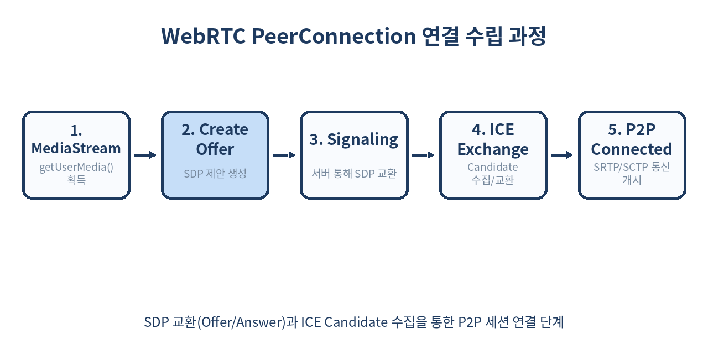
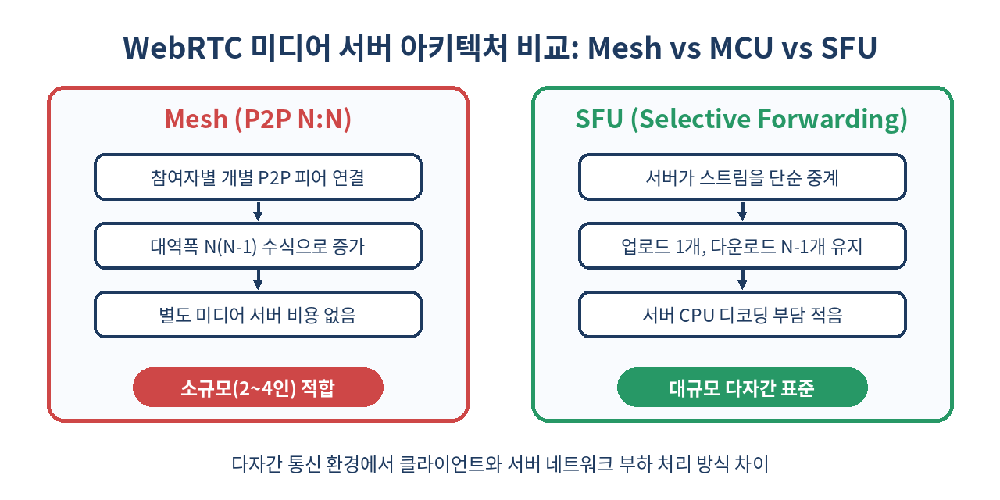

# 📹 WebRTC 실시간 미디어 통신 완벽 가이드: SDP, ICE부터 SFU 아키텍처까지

> 별도의 플러그인이나 프로그램 설치 없이, 웹 브라우저만으로 밀리초(ms) 단위의 초저지연 비디오·오디오·데이터 통신을 구현하는 WebRTC 기술의 심층 가이드입니다.
> 시그널링 메커니즘, SDP, STUN/TURN 서버, SFU 미디어 아키텍처, 실무에서 겪는 네트워크 트랩까지 완벽하게 파헤칩니다.

---

## 📌 목차
1. [WebRTC란 무엇인가: 초저지연 통신의 혁명](#-1-webrtc란-무엇인가-초저지연-통신의-혁명)
2. [WebRTC의 3대 핵심 API](#-2-webrtc의-3대-핵심-api)
3. [시그널링(Signaling)의 역할과 흐름](#-3-시그널링signaling의-역할과-흐름)
4. [SDP(Session Description Protocol) 심층 분석](#-4-sdpsession-description-protocol-심층-분석)
5. [NAT 트래버설과 ICE 프레임워크 (STUN / TURN)](#-5-nat-트래버설과-ice-프레임워크-stun--turn)
6. [WebRTC 연결 수립 흐름도](#-6-webrtc-연결-수립-흐름도)
7. [다자간 통신을 위한 미디어 서버 아키텍처 (Mesh vs MCU vs SFU)](#-7-다자간-통신을-위한-미디어-서버-아키텍처-mesh-vs-mcu-vs-sfu)
8. [미디어 서버 아키텍처 비교](#-8-미디어-서버-아키텍처-비교)
9. [실전 코드: RTCPeerConnection 피어 통신 구축](#-9-실전-코드-rtcpeerconnection-피어-통신-구축)
10. [화면 공유와 트랙 관리 (getDisplayMedia)](#-10-화면-공유와-트랙-관리-getdisplaymedia)
11. [실무에서 마주치는 함정 및 장애 케이스](#-11-실무에서-마주치는-함정-및-장애-케이스)
12. [WebRTC를 쓰면 안 되는 경우와 대안](#-12-webrtc를-쓰면-안-되는-경우와-대안)
13. [정리](#-13-정리)
14. [참고 자료](#-14-참고-자료)

---

## 🧭 1. WebRTC란 무엇인가: 초저지연 통신의 혁명

**WebRTC(Web Real-Time Communication)**는 웹 브라우저 간에 중간 서버를 거치지 않고(또는 최소한으로만 거치고) **Peer-to-Peer(P2P)** 방식으로 음성, 영상, 임의의 binary 데이터를 실시간으로 송수신할 수 있게 해주는 오픈소스 웹 표준 사양입니다.

기존의 HTTP 기반 HLS(HTTP Live Streaming)나 DASH 스트리밍은 2~10초 정도의 지연 시간(Latency)이 발생하지만, WebRTC는 **200ms 미만의 초저지연(Sub-second Latency)**을 보장합니다.

| 프로토콜 | 전송 계층 | 주요 지연 시간 | 대표적인 용도 |
|---|---|---|---|
| HLS / DASH | HTTP (TCP) | 2초 ~ 10초 | VOD, 대규모 단방향 라이브 방송 |
| WebSockets | TCP | 100ms ~ 500ms | 채팅, 알림, 실시간 데이터 업데이트 |
| WebRTC | UDP (SRTP / SCTP) | **50ms ~ 200ms** | 화상회의(Zoom, Google Meet), P2P 파일 전송, 실시간 게임 |

---

## 🎙️ 2. WebRTC의 3대 핵심 API

WebRTC는 브라우저 자바스크립트 환경에서 크게 3가지 주요 API로 구성됩니다.

1. **`MediaDevices.getUserMedia()`**: 사용자의 마이크와 카메라에 접근하여 비디오/오디오 스트림(`MediaStream`)을 획득합니다.
2. **`RTCPeerConnection`**: 두 피어 간의 연결을 설정하고, 암호화 및 대역폭을 관리하며, 비디오/오디오 미디어를 송수신하는 핵심 객체입니다.
3. **`RTCDataChannel`**: 피어 간에 미디어 스트림 외에 임의의 텍스트 및 이진 데이터(Binary Data)를 저지연으로 직접 송수신할 수 있는 양방향 데이터 통로입니다.

```js
// 1. 미디어 스트림 획득 및 제약 조건 설정 예시
async function getLocalStream() {
  try {
    const constraints = {
      video: {
        width: { ideal: 1280, max: 1920 },
        height: { ideal: 720, max: 1080 },
        frameRate: { ideal: 30, max: 60 }
      },
      audio: {
        echoCancellation: true,
        noiseSuppression: true,
        autoGainControl: true
      }
    };
    
    const stream = await navigator.mediaDevices.getUserMedia(constraints);
    const videoElement = document.getElementById('myVideo');
    if (videoElement) {
      videoElement.srcObject = stream;
    }
    return stream;
  } catch (err) {
    console.error('카메라/마이크 접근 실패 (NotAllowedError 또는 NotFoundError):', err);
    throw err;
  }
}
```

---

## 📡 3. 시그널링(Signaling)의 역할과 흐름

WebRTC는 P2P 통신을 지향하지만, **최초 연결 설정 시 두 피어가 서로의 존재와 네트워크 정보, 미디어 포맷을 알기 위해서는 중앙 서버(시그널링 서버)**가 필요합니다.

WebRTC 표준 사양은 시그널링의 구현 방식(WebSocket, Socket.io, SSE, HTTP POST 등)을 지정하지 않으므로 개발자가 자유롭게 선택할 수 있습니다.

### 시그널링 시 교환되는 핵심 정보
- **Session Description (SDP)**: 코덱 정보, 해상도, 미디어 속성
- **ICE Candidate**: IP 주소, 포트 번호, 네트워크 경로 후보군
- **제어 메시지**: 방 접속/퇴장, 에러 처리

---

## 📄 4. SDP(Session Description Protocol) 심층 분석

SDP는 피어 간에 통신할 미디어의 기능과 설정을 협상하기 위한 텍스트 메타데이터 포맷입니다.

Offer-Answer 모델을 사용하여 한 피어가 **Offer SDP**를 보내면 상대 피어가 **Answer SDP**로 응답합니다.

```text
v=0
o=- 42039201948290 2 IN IP4 127.0.0.1
s=-
t=0 0
a=group:BUNDLE 0 1
m=audio 9 UDP/TLS/RTP/SAVPF 111 103 104
a=rtpmap:111 opus/48000/2
m=video 9 UDP/TLS/RTP/SAVPF 96 97 98
a=rtpmap:96 VP8/90000
```

### SDP에서 주요하게 확인할 항목
- `m=audio`, `m=video`: 지원되는 미디어 유형과 연동 포트
- `a=rtpmap`: 지원하는 비디오/오디오 코덱 (Opus, VP8, VP9, H.264, AV1)
- `a=fingerprint`: 보안 암호화(DTLS) 인증서 핑거프린트

---

## 🌐 5. NAT 트래버설과 ICE 프레임워크 (STUN / TURN)

대부분의 브라우저는 공유기(NAT)나 방화벽 뒤에 존재하므로 사설 IP(Private IP)를 가지고 있어 상대방과 직접 P2P 통신이 불가능할 수 있습니다. 이를 해결하는 기술이 **ICE(Interactive Connectivity Establishment)**입니다.

### STUN vs TURN 비교
- **STUN (Session Traversal Utilities for NAT)**: 피어의 공인 IP(Public IP)와 포트 번호를 알려주는 원격 경량 서버입니다. 연결 후 실제 미디어 데이터는 서버를 거치지 않습니다. (성공률 약 80%)
- **TURN (Traversal Using Relays around NAT)**: 대칭형 NAT(Symmetric NAT)나 엄격한 기업 방화벽으로 P2P 연결이 완전히 차단될 때, 미디어 스트림 전체를 중간에서 중계(Relay)해 주는 서버입니다.

```js
// RTCPeerConnection 생성 시 ICE 서버 구성 및 설정 예시
const configuration = {
  iceServers: [
    { urls: 'stun:stun.l.google.com:19302' },
    {
      urls: 'turn:my-turn-server.example.com:3478',
      username: 'user123',
      credential: 'password_secret'
    }
  ],
  iceTransportPolicy: 'all', // 'relay' 지정 시 TURN만 강제 사용 가능
  bundlePolicy: 'max-bundle'
};
const peerConnection = new RTCPeerConnection(configuration);
```

---

## 🔄 6. WebRTC 연결 수립 흐름도

다음은 연결 설정부터 P2P 세션 개시까지의 전체 흐름입니다.



---

## 🏗️ 7. 다자간 통신을 위한 미디어 서버 아키텍처 (Mesh vs MCU vs SFU)

1:1 통신을 넘어 N:N 다자간 화상 회의 시스템을 구축할 때는 클라이언트 단독 P2P 방식만으로는 한계가 발생합니다.

### 1) Mesh (P2P Mesh)
- **방식**: 모든 참여자가 서로 1:1로 피어 커넥션을 맺음.
- **장점**: 별도의 미디어 서버가 필요 없어 비용이 0원에 가까움.
- **단점**: 참여자가 $N$명일 때 업로드/다운로드 트래픽이 $O(N^2)$으로 폭증. (4~5명 이상 시 브라우저 렉 발생)

### 2) MCU (Multipoint Control Unit)
- **방식**: 미디어 서버가 모든 참여자의 영상/음성을 받아 하나로 디코딩 후 비디오를 타일 형태로 인코딩하여 다시 클라이언트에 전송.
- **장점**: 클라이언트는 1개의 스트림만 다운로드하므로 대역폭 부담이 극히 적음.
- **단점**: 서버 CPU/GPU에 심각한 인코딩 부하 발생, 서버 비용 급증.

### 3) SFU (Selective Forwarding Unit) - Modern Standard
- **방식**: 서버가 디코딩/인코딩을 거치지 않고, 들어온 미디어 패킷을 원하는 수신자들에게 선택적으로 다시 전달(Forwarding)만 수행.
- **장점**: 서버 CPU 소모가 대폭 낮고, 클라이언트는 업로드 1개와 다운로드 $N-1$개로 대역폭 절감. 화면 레이아웃 조작이 자유로움.

---

## 📊 8. 미디어 서버 아키텍처 비교

각 아키텍처의 구체적인 특징과 장단점을 비교한 내용입니다.



---

## 💻 9. 실전 코드: RTCPeerConnection 피어 통신 구축

아래 코드는 WebSocket 시그널링 서버와 연동되는 PeerConnection 수립의 전체적인 핵심 로직 구조입니다.

```js
// peer.js - 피어 연결 관리 클래스
class WebRTCClient {
  constructor(socket) {
    this.socket = socket;
    this.pc = new RTCPeerConnection({
      iceServers: [{ urls: 'stun:stun.l.google.com:19302' }]
    });
    this.candidateQueue = [];
    this.isRemoteDescriptionSet = false;
    this.initListeners();
  }

  initListeners() {
    // 1. ICE Candidate 수집 시 상대방에게 전달
    this.pc.onicecandidate = (event) => {
      if (event.candidate) {
        this.socket.emit('ice-candidate', event.candidate);
      }
    };

    // 2. 상대방의 미디어 트랙 수신 시
    this.pc.ontrack = (event) => {
      const remoteVideo = document.getElementById('remoteVideo');
      if (remoteVideo && event.streams[0]) {
        remoteVideo.srcObject = event.streams[0];
      }
    };
  }

  // Offer 생성 및 송신
  async makeOffer() {
    try {
      const offer = await this.pc.createOffer();
      await this.pc.setLocalDescription(offer);
      this.socket.emit('offer', offer);
    } catch (err) {
      console.error('Offer 생성 오류:', err);
    }
  }

  // Offer 수신 처리 및 Answer 생성
  async handleOffer(offer) {
    try {
      await this.pc.setRemoteDescription(new RTCSessionDescription(offer));
      this.isRemoteDescriptionSet = true;
      this.processCandidateQueue();

      const answer = await this.pc.createAnswer();
      await this.pc.setLocalDescription(answer);
      this.socket.emit('answer', answer);
    } catch (err) {
      console.error('Offer 핸들링 오류:', err);
    }
  }

  // Answer 수신 처리
  async handleAnswer(answer) {
    try {
      await this.pc.setRemoteDescription(new RTCSessionDescription(answer));
      this.isRemoteDescriptionSet = true;
      this.processCandidateQueue();
    } catch (err) {
      console.error('Answer 핸들링 오류:', err);
    }
  }

  // ICE Candidate 추가 (Race Condition 방지 큐 적용)
  async handleCandidate(candidate) {
    const iceCandidate = new RTCIceCandidate(candidate);
    if (!this.isRemoteDescriptionSet) {
      this.candidateQueue.push(iceCandidate);
      return;
    }
    try {
      await this.pc.addIceCandidate(iceCandidate);
    } catch (e) {
      console.error('ICE Candidate 추가 오류:', e);
    }
  }

  // 큐에 대기 중인 Candidate 일괄 처리
  async processCandidateQueue() {
    while (this.candidateQueue.length > 0) {
      const candidate = this.candidateQueue.shift();
      try {
        await this.pc.addIceCandidate(candidate);
      } catch (e) {
        console.error('큐 내 ICE Candidate 추가 오류:', e);
      }
    }
  }
}
```

---

## 🖥️ 10. 화면 공유와 트랙 관리 (getDisplayMedia)

화면 공유 기능은 `navigator.mediaDevices.getDisplayMedia()`를 사용하며, 기존 비디오 트랙을 화면 공유 트랙으로 즉시 교체(`replaceTrack`)할 수 있습니다.

```js
async function startScreenShare(peerConnection) {
  try {
    const screenStream = await navigator.mediaDevices.getDisplayMedia({
      video: { 
        cursor: "always",
        displaySurface: "monitor"
      },
      audio: false
    });
    const screenTrack = screenStream.getVideoTracks()[0];

    // RTCRtpSender를 통해 피어 커넥션 재연결 없이 비디오 트랙만 교체
    const senders = peerConnection.getSenders();
    const videoSender = senders.find(s => s.track && s.track.kind === 'video');
    
    if (videoSender) {
      await videoSender.replaceTrack(screenTrack);
    }

    // 사용자가 브라우저 기본 UI의 '공유 중단' 버튼을 누른 경우 처리
    screenTrack.onended = async () => {
      console.log('사용자에 의해 화면 공유 종료됨');
      // 원래 카메라 스트림 복구 로직 연동 가능
    };
  } catch (err) {
    console.error('화면 공유 실패:', err);
  }
}
```

---

## ⚠️ 11. 실무에서 마주치는 함정 및 장애 케이스

WebRTC를 프로덕션 환경에 배포할 때 가장 자주 겪는 4가지 실무 함정입니다.

### 1. ICE Candidate 타이밍 이슈 (Remote Description 미설정 상태)
- **문제**: `setRemoteDescription`이 완료되기 전에 시그널링을 통해 들어온 `ICE Candidate`를 `addIceCandidate` 하면 `InvalidStateError` 예외가 발생합니다.
- **해결책**: Queue(큐) 배열을 하나 만들어 Remote Description이 수립되기 전 들어온 Candidate를 임시 보관해 두었다가, `setRemoteDescription` 이행 완료 후 순차 처리합니다.

### 2. HTTPS 미적용 시 `getUserMedia` 거부
- **문제**: Chrome/Safari 등 주요 브라우저는 보안 정책상 `localhost`를 제외한 `http://` 환경에서 카메라와 마이크 권한 접근을 엄격히 차단합니다.
- **해결책**: 개발 환경에서도 SSL Certificate를 적용(`https://`)하여 테스트해야 합니다.

### 3. 모바일 브라우저의 오토플레이 제한
- **문제**: 모바일 Safari/Chrome은 사용자의 직접적인 터치/클릭 액션 없이 dynamic하게 생성된 `<video>` 태그의 `autoplay` 재생을 차단합니다.
- **해결책**: `<video autoplay playsinline muted>` 속성을 반드시 지정하고, 오디오 재생 시 사용자의 '소리 켜기' 버튼 클릭 이벤트를 유도해야 합니다.

### 4. 대칭형 NAT(Symmetric NAT)에서의 P2P 실패
- **문제**: 엄격한 기업 네트워크 환경에서는 STUN만으로 연결할 수 없습니다.
- **해결책**: 반드시 자체 TURN 서버(예: Coturn)를 상시 운영하고 대역폭 상한을 모니터링해야 합니다.

---

## 🚫 12. WebRTC를 쓰면 안 되는 경우와 대안

WebRTC가 만능은 아닙니다. 아래와 같은 사용 사례에서는 다른 기술을 고려하는 것이 훨씬 합리적입니다.

| 유스케이스 | WebRTC 사용 비추천 이유 | 권장 대안 기술 |
|---|---|---|
| **1:N 대규모 인원 대상 방송 (10,000명+)** | P2P 기반 스트림 중계 비용 및 대역폭 감당 불가 | **HLS**, **Low-Latency HLS**, **LL-DASH** |
| **단방향 텍스트/숫자 데이터 수신** | UDP 기반 시그널링 패킷 손실 및 오버헤드 | **WebSocket**, **SSE (Server-Sent Events)** |
| **단순 파일 다운로드 및 서버 저장** | P2P 세션 유지 복잡성 및 브라우저 메모리 제약 | **HTTP/2, HTTP/3 Direct Download** |

---

## 🧾 13. 정리

- WebRTC는 브라우저 간 200ms 미만의 **초저지연 실시간 미디어 통신**을 가능하게 하는 표준 API 세트입니다.
- P2P 연결 수립을 위해 **시그널링 서버**, **SDP 제안/응답**, **ICE/STUN/TURN** 프레임워크가 필수적입니다.
- 다자간 모임 구축 시 단순 Mesh 방식은 한계가 존재하므로, 서버 중계 방식인 **SFU(Selective Forwarding Unit)** 아키텍처가 실무 표준으로 사용됩니다.
- 비동기 race condition 방지를 위한 Candidate 큐잉 및 HTTPS 적용 등 **실무 모범 사례**를 준수해야 장애 없는 서비스를 운영할 수 있습니다.

> ✨ **한 줄 요약**  
> 웹에서 초저지연 실시간 경험을 선사하는 WebRTC, 시그널링과 SFU 아키텍처의 단단한 이해가 성공적인 라이브 미디어 서비스 구축의 핵심입니다.

---

## 📚 참고 자료
- [MDN WebRTC API 공식 문서](https://developer.mozilla.org/en-US/docs/Web/API/WebRTC_API)
- [W3C WebRTC 1.0 Real-time Communication Between Browsers](https://www.w3.org/TR/webrtc/)
- [WebRTC samples 공식 깃허브](https://webrtc.github.io/samples/)
