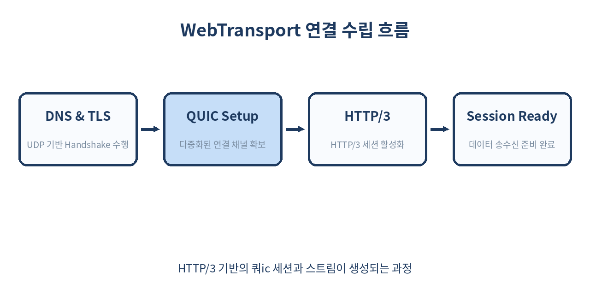
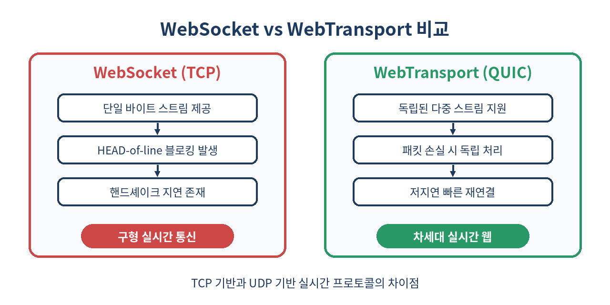

# 🚀 WebTransport와 HTTP/3 스트리밍 완벽 가이드

> 웹에서 구현하는 초저지연 양방향 통신의 새로운 표준
> HTTP/3와 QUIC 기반으로 WebSocket의 한계를 극복하는 방법을 알아봅니다.

---

## 📌 목차
1. 🌐 WebTransport란 무엇인가?
2. ⚡ QUIC 프로토콜과의 관계
3. 🔄 WebSocket과의 핵심 차이점
4. 🏗️ 개발 환경 세팅과 기본 개념
5. 🔌 세션 연결 및 초기화 코드
6. 📦 데이터 스트림(Streams) 활용법
7. 📡 데이터그램(Datagrams) 활용법
8. 🎨 실제 실시간 데이터 전송 예시
9. 🛡️ 보안 및 인증 전략
10. ⚠️ 실무 함정과 주의할 점
11. ❌ 이런 경우에는 사용하지 마세요
12. 🧾 정리 및 핵심 요약
13. 📚 참고 자료

---

## 🌐 1. WebTransport란 무엇인가?

Web`Transport`는 웹 클라이언트와 서버 간에 저지연, 양방향, 다중화된 통신을 제공하는 최신 Web API입니다. 기존의 HTTP/1.1이나 HTTP/2 기반의 WebSocket이 가졌던 TCP 전송 계층의 제약을 극복하기 위해 W3C와 IETF 표준화 그룹에 의해 설계되었습니다.

HTTP/3 프로토콜 위에서 동작하며, QUIC의 강력한 기능들을 브라우저 환경에서 직접 활용할 수 있도록 돕습니다. 단일 연결 내에서 완전히 독립된 여러 스트림을 생성할 수 있어, 네트워크 자원을 효율적으로 분배하고 HOL(Head-of-Line) 블로킹 문제를 원천적으로 차단합니다.



---

## ⚡ 2. QUIC 프로토콜과의 관계

QUIC은 UDP를 기반으로 구축된 전송 계층 프로토콜입니다. TCP가 가진 HOL(Head-of-Line) 블로킹 문제를 해결하여, 하나의 패킷이 유실되더라도 다른 스트림의 데이터 전달에는 영향을 주지 않습니다.

WebTransport는 이 QUIC의 특성을 그대로 이어받아 신뢰성 있는 스트림과 신뢰성 없는 데이터그램을 모두 지원합니다. TCP 3-way handshake와 TLS 협상을 결합하여 단 1-RTT(또는 0-RTT)만에 연결을 수립할 수 있으므로, 초기 연결 지연 시간이 획기적으로 줄어듭니다.

---

## 🔄 3. WebSocket과의 핵심 차이점

두 기술 모두 실시간 통신에 사용되지만, 내부 전송 계층과 구조에서 극단적인 차이를 보입니다.

| 특징 | WebSocket | WebTransport |
| :--- | :--- | :--- |
| **전송 계층** | TCP (단일 스트림) | QUIC / UDP (다중 스트림) |
| **HOL 블로킹** | 발생함 (패킷 손실 시 전체 대기) | 발생하지 않음 (스트림별 독립 처리) |
| **통신 방식** | 신뢰성 있는 바이트 스트림 | 신뢰성 스트림 + 비신뢰성 데이터그램 |
| **연결 수립 지연** | TCP + TLS (최소 2~3 RTT) | QUIC + TLS 1.3 (1 RTT 또는 0 RTT) |
| **다중화 지원** | 단일 연결 내 단일 스트림 | 단일 연결 내 무제한 독립 스트림 |



WebSocket은 단일 TCP 연결 안에서 바이트 스트림을 처리하므로 중간에 패킷 손실이 발생하면 전체 흐름이 멈춥니다. 반면 WebTransport는 독립적인 여러 스트림을 동시에 열 수 있습니다.

---

## 🏗️ 4. 개발 환경 세팅과 기본 개념

WebTransport를 사용하려면 브라우저와 서버 모두 HTTP/3와 QUIC을 지원해야 합니다. 현재 최신 크롬(Chrome), 엣지(Edge), 파이어폭스(Firefox) 등에서 기본 지원하며, 로컬 개발 시에는 자체 서명 인증서와 적절한 브라우저 플래그 설정이 필수적입니다.

로컬 테스트 시 크롬 보안 제어를 우회하기 위해 다음 플래그를 활용할 수 있습니다.
```bash
chrome.exe --origin-to-force-quic-allowed=localhost:4433
```

---

## 🔌 5. 세션 연결 및 초기화 코드

클라이언트 측에서 WebTransport 객체를 생성하고 서버와 연결을 맺는 기본 코드입니다. 타임아웃 처리와 연결 상태 모니터링 로직을 포함합니다.

```javascript
async function connectWebTransport() {
  const url = 'https://localhost:4433/transport';
  const transport = new WebTransport(url, {
    // 필요 시 사용자 지정 인증서 해시 설정 가능
    // serverCertificateHashes: [...]
  });

  try {
    // 연결 확립 대기
    await transport.ready;
    console.log('WebTransport 연결 성공!');

    // 연결 종료 Promise 처리
    transport.closed.then(() => {
      console.log('WebTransport 연결이 정상적으로 종료되었습니다.');
    }).catch((err) => {
      console.error('WebTransport 연결이 비정상적으로 종료되었습니다:', err);
    });

  } catch (e) {
    console.error('연결 초기화 실패:', e);
  }

  return transport;
}
```

---

## 📦 6. 데이터 스트림(Streams) 활용법

Web`Transport`는 신뢰성 있는 양방향 스트림을 생성할 수 있습니다. TCP처럼 순서가 보장되며 유실 없이 전달됩니다. 송수신부 모두 `WritableStream`과 `ReadableStream`을 표준 Web Streams API 형태로 제공합니다.

```javascript
async function sendStreamData(transport, message) {
  try {
    // 양방향 스트림 생성
    const stream = await transport.createBidirectionalStream();
    const writer = stream.writable.getWriter();
    const encoder = new TextEncoder();
    
    await writer.write(encoder.encode(message));
    await writer.close();
    console.log('데이터 스트림 전송 완료');
  } catch (err) {
    console.error('스트림 전송 중 오류 발생:', err);
  }
}
```

---

## 📡 7. 데이터그램(Datagrams) 활용법

지연 시간이 극도로 중요한 게임 상태 동기화나 오디오/비디오 스트리밍에는 데이터그램 API를 사용합니다. 유실되어도 무방한 최신 데이터를 빠르게 전송하며, 최대 페이로드 크기(MSS) 제한을 준수해야 합니다.

```javascript
function sendDatagram(transport, data) {
  const writer = transport.datagrams.writable.getWriter();
  const encoder = new TextEncoder();
  
  const payload = encoder.encode(data);
  
  // 데이터그램 최대 크기 확인 (일반적으로 MTU 고려하여 1200바이트 미만 권장)
  if (payload.byteLength > transport.datagrams.maxDatagramSize) {
    console.error('데이터그램 크기가 너무 큽니다.');
    return;
  }

  writer.write(payload).catch((err) => {
    console.error('데이터그램 전송 실패:', err);
  });
}
```

---

## 🎨 8. 실제 실시간 데이터 전송 예시

대규모 센서 데이터나 실시간 대시보드 업데이트를 위해 스트림을 읽고 쓰는 전체적인 흐름을 구성할 수 있습니다. 수신 측 스트림을 루프 형태로 처리하는 예제입니다.

```javascript
async function readIncomingStreams(transport) {
  const reader = transport.incomingBidirectionalStreams.getReader();
  
  try {
    while (true) {
      const { value: stream, done } = await reader.read();
      if (done) break;
      
      // 개별 스트림 처리 비동기 실행
      handleIncomingStream(stream);
    }
  } catch (err) {
    console.error('스트림 리더 에러:', err);
  }
}

async function handleIncomingStream(stream) {
  const reader = stream.readable.getReader();
  const decoder = new TextDecoder();
  let data = '';

  try {
    while (true) {
      const { value, done } = await reader.read();
      if (done) break;
      data += decoder.decode(value, { stream: true });
    }
    console.log('수신된 데이터:', data);
  } catch (err) {
    console.error('스트림 읽기 실패:', err);
  }
}
```

---

## 🛡️ 9. 보안 및 인증 전략

WebTransport는 HTTPS와 동일한 수준의 강력한 보안 모델을 따릅니다. 쿠키, 인증서 검증, CORS 정책 등이 모두 적용되며 안전한 통로를 보장합니다.

- **인증(Authentication)**: 초기 연결 시 URL 쿼리 파라미터, 헤더, 혹은 초기 핸드셰이크 토큰을 통해 인증 정보를 전달합니다.
- **동일 출처 정책(SOP)**: 서버는 적절한 CORS 헤더(`Access-Control-Allow-Origin`)를 응답하여 악의적인 크로스 사이트 접근을 방어해야 합니다.

---

## ⚠️ 10. 실무 함정과 주의할 점

- **네트워크 환경 제약**: 방화벽이나 기업 네트워크 환경에서 UDP 트래픽(포트 4433 등)을 차단하는 경우가 많습니다. 폴백(Fall-back) 전략으로 WebSocket이나 HTTP/2를 반드시 준비해야 합니다.
- **서버 인프라 구축의 복잡성**: Node.js 기본 모듈만으로는 완벽한 HTTP/3 & QUIC 서버 구성이 까다로울 수 있으며, C++ 기반 라이브러리(`quiche`, `ngtcp2`)나 Go 언어의 `quic-go` 같은 별도 백엔드 연동이 필수적입니다.
- **메모리 및 버퍼 관리**: 스트림을 무분별하게 생성하고 닫지 않으면 메모리 누수나 브라우저 탭 크래시로 이어질 수 있습니다.

---

## ❌ 11. 이런 경우에는 사용하지 마세요

- 구형 브라우저 및 레거시 시스템(예: Internet Explorer, 구형 모바일 웹뷰) 지원이 필수적인 기업용 웹 애플리케이션
- 단순한 CRUD 요청이나 주기적인 폴링 형태의 데이터 통신 (프로토콜 오버헤드가 불필요하게 큼)
- UDP 트래픽이 완전히 차단되거나 신뢰할 수 없는 엄격한 사내 보안망/폐쇄망 환경

---

## 🧾 12. 정리 및 핵심 요약

- WebTransport는 HTTP/3와 QUIC을 기반으로 하는 차세대 웹 실시간 통신 표준입니다.
- WebSocket의 HOL 블로킹 문제를 해결하며 다중 스트림과 데이터그램을 동시에 지원합니다.
- 고성능 실시간 게임, 미디어 스트리밍, 대규모 센서 데이터 전송에 적합합니다.
- 네트워크 환경에 따른 폴백 메커니즘과 복잡한 인프라 요구사항을 철저히 검토해야 합니다.

> ✨ **한 줄 요약**
> 웹에서 초저지연 실시간 통신이 필요하다면 WebSocket을 넘어 WebTransport를 검토하자.

---

## 📚 참고 자료
- [MDN Web Docs: WebTransport API](https://developer.mozilla.org/en-US/docs/Web/API/WebTransport_API)
- [W3C WebTransport Specification](https://w3c.github.io/webtransport/)
